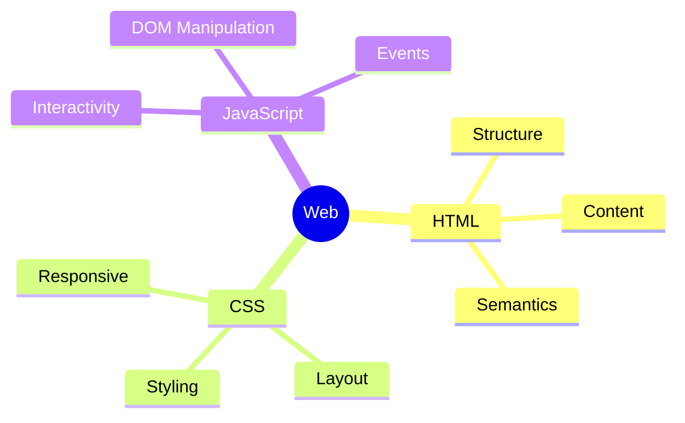
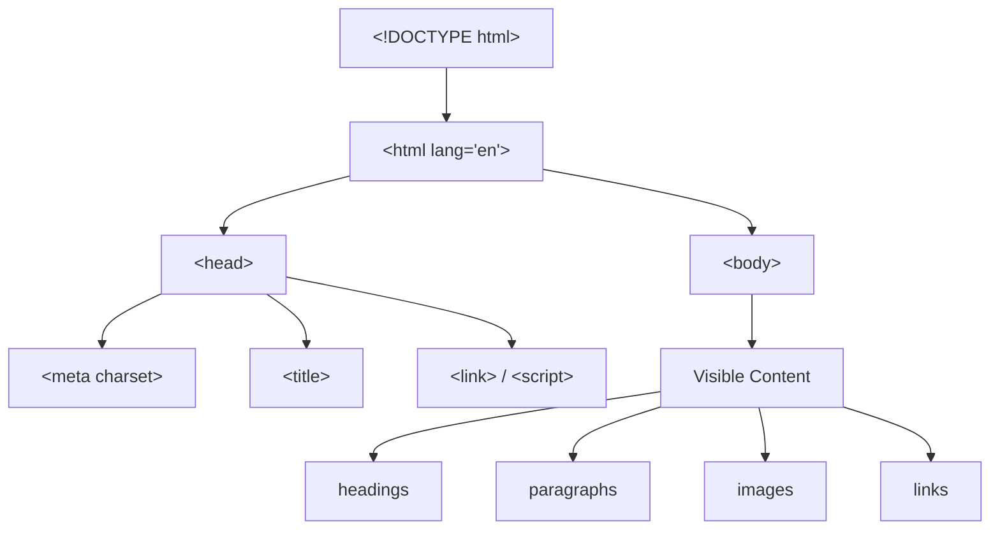

## Introduction to HTML document structure

> This is the first lesson of the course — today we lay the foundation without which no web page can exist.

---

## What you will learn by the end of the lesson

- Understand what HTML, a tag, an attribute, and an element are — and how they differ from each other.
- Install and set up tools for work: VS Code and browser DevTools.
- Understand the structure of any HTML document: `<!DOCTYPE html>`, `<html>`, `<head>`, `<body>`.
- Create, save, and open your first HTML page in a browser.
- Use the element inspector to peek "under the hood" of any website.

---

## Lesson timeline

| Block                                  | Content                                         |
| -------------------------------------- | ----------------------------------------------- |
| 1. What is HTML and why do we need it  | Analogy with a house skeleton, HTML's role on the web |
| 2. Installing tools                    | VS Code, Live Server extension, DevTools overview |
| 3. Tag, attribute, element             | Breaking down terms with examples               |
| 4. HTML document structure             | DOCTYPE, html, head, body — line-by-line breakdown |
| 5. Mini-assignment                     | Build the document skeleton on your own          |
| 6. The first page complete             | Writing and opening in a browser                 |
| 7. Summary and practical assignment    | Reinforcement, homework assignment               |

---

## Block 1. What is HTML and why do we need it

**In simple terms:** imagine you are building a house. First you erect the framework — walls, floors, stairs. Without the framework, the house simply won't stand, even if you have the most beautiful furniture and paint.

**HTML (HyperText Markup Language) is the framework of a web page.** It is not responsible for beauty (that's CSS's job) and not responsible for behavior — clicks, animations (that's JavaScript's job). HTML is responsible for only one thing: **what is where and what is what** — this is a heading, this is a paragraph of text, this is a list, this is an image.

The analogy continues: if HTML is the house framework, then:

- **CSS** is the interior designer: paints the walls, arranges furniture, picks curtains.
- **JavaScript** is the electrical and automation: lights turn on with a clap, doors open by themselves.

We start with the framework because without it, neither design nor automation makes sense — there's nothing to "hang" them on.



**Important to understand right away:** HTML is a **markup language**, not a programming language. It has no "if" conditions, no loops, no calculations. It simply describes the structure of the document using tags.

---

## Block 2. Tools: VS Code and DevTools

For working with HTML we need two tools.

### VS Code (Visual Studio Code)

This is a free code editor from Microsoft. You can download it from the official website [code.visualstudio.com](https://code.visualstudio.com) — the version for Windows, macOS, or Linux will be detected automatically.

After installation, install one extension — it will make life much easier:

1. Open VS Code.
2. On the left panel, find the "Extensions" icon (squares).
3. In the search, type **Live Server**.
4. Click "Install" on the extension by author Ritwick Dey.

**Why Live Server is needed:** without it, to see changes in the browser, you'd have to manually refresh the page each time (F5). Live Server does this automatically every time you save a file — and opens the page on a local address like `http://127.0.0.1:5500`.

### DevTools (browser developer tools)

This is a panel built into every browser (Chrome, Firefox, Edge) that shows the HTML code of any open page.

**How to open:** right-click anywhere on the page → "Inspect". Or the keyboard shortcut **F12**.

Try opening DevTools on any website right now and find the **Elements** tab (Chrome/Edge) or **Inspector** (Firefox) — there you'll see the HTML structure of the page in real time.

**Mini-assignment (2 minutes):** open DevTools on your favorite website, find the `<h1>` tag in the Elements panel (usually the article heading) and click on it — you'll see that exact element highlighted on the page.

---

## Block 3. Tag, attribute, element — what's the difference

These are three terms that beginners almost always confuse. Let's break them down using a parcel analogy.

Imagine you are sending a parcel:

- **Tag** — this is the type of box: "fragile box", "document box". In HTML, tags are written in angle brackets: `<p>`, `<h1>`, ``.
- **Attribute** — this is a sticker on the box with additional information: "fragile", "top", "recipient's address". In HTML, an attribute is written inside the opening tag: `<p class="intro">`.
- **Element** — this is the entire box as a whole: the box (tag) + stickers (attributes) + content inside.

### Tag syntax

Most tags are **paired**: there is an opening tag and a closing tag, with content in between.

```html
<p>This is a paragraph of text.</p>
```

Here:

- `<p>` — opening tag
- `This is a paragraph of text.` — content
- `</p>` — closing tag (note the slash `/`)

There are also **unpaired (self-closing) tags** — they have no content and no closing tag, they simply "insert" something into the document:

```html
<br>
<hr>

```

We'll talk about `br`, `hr`, and `img` in detail in later lessons — for now it's important to just see the difference in syntax.

### Attribute syntax

An attribute is always written **inside the opening tag**, in the format `name="value"`:

```html
<p class="intro">Paragraph text</p>
```

Here `class` is the attribute name, `"intro"` is its value. The value is always in quotes (double quotes, by convention in this course).

A single tag can have multiple attributes — they are separated by spaces:

```html

```

### The complete element

An element is a tag + attributes + content + closing tag:

```html
<p class="intro">Welcome to my website!</p>
```

This entire chunk of code is one HTML element.

---

###  Common beginner mistakes

| Mistake                                                                           | How to fix                                                                                                        |
| --------------------------------------------------------------------------------- | ----------------------------------------------------------------------------------------------------------------- |
| Forgot to close the tag: `<p>Text` without `</p>`                                | Always close paired tags — otherwise the browser may misunderstand where the content ends                          |
| Attribute value without quotes: `<p class=intro>`                                 | Always use quotes: `<p class="intro">`                                                                            |
| Confusing opening and closing tags: `<p>Text<p/>`                                 | The closing tag is written with a slash BEFORE the name: `</p>`, not `<p/>`                                       |
| Writing the tag with a capital letter: `<P>Text</P>`                              | By modern standards, HTML tags are written in lowercase: `<p>`                                                    |
| Closing nested tags in the wrong order: `<p><strong>Text</p></strong>`            | Close in reverse order of opening — "last opened, first closed": `<p><strong>Text</strong></p>`                   |

---

## Block 4. HTML document structure

Every HTML page, regardless of its content, starts with the same "skeleton". Let's break it down line by line.

```html
<!DOCTYPE html>
<html lang="ru">
<head>
    <meta charset="UTF-8">
    <title>My first page</title>
</head>
<body>
    <h1>Hello, world!</h1>
</body>
</html>
```

Let's break down each line, continuing the house skeleton analogy.

### `<!DOCTYPE html>`

This is not a tag, but a **document type declaration**. It tells the browser: "before you is a document in the modern HTML5 standard, read it according to current rules." Without this line, older browsers could switch to an outdated compatibility mode and display the page strangely.

**Analogy:** it's a sign at the entrance to the house saying "Built to 2024 standards" — the browser immediately knows what construction standards to expect.

It is **always written the same way**, once, at the very beginning of the file.

### `<html lang="ru">`

The root (main) tag, inside which all page content resides. All other tags are its "children" and "grandchildren".

The `lang="ru"` attribute specifies the page language — Russian. This helps:

- screen readers (programs for visually impaired users) pronounce text correctly;
- the browser offer correct translations;
- search engines understand the content language.

**Analogy:** `<html>` is the house itself, and `lang="ru"` is a sign saying "People inside speak Russian."

### `<head>` — the document's "head"

This is where service information **about the page** is located, which is not displayed directly on the screen: the browser tab title, encoding, linked style and script files (covered in lesson 9), metadata for search engines.

**Analogy:** `<head>` is the house's technical passport: address, year of construction, materials. We don't see the technical passport while walking around the house, but it determines important characteristics.

Inside `<head>` in this lesson we use two tags:

**`<meta charset="UTF-8">`** — specifies the document encoding. UTF-8 supports virtually all languages of the world, including Cyrillic. Without this line, Russian text may display as gibberish (for example, `привет` instead of "privet").

**`<title>My first page</title>`** — the heading displayed on the browser tab and in Google/Yandex search results. This is the only tag from `<head>` whose text the user can see directly — but not on the page itself, on the tab.

### `<body>` — the document's "body"

This is where **everything the user sees** is located: text, images, buttons, links, tables. All course content starting from the second lesson will be added here.

**Analogy:** if `<head>` is the house's technical passport, then `<body>` is all the rooms where people actually live: living room, kitchen, bedroom. All tags we'll study later (headings, paragraphs, images, forms) are placed inside `<body>`.



---

###  Common beginner mistakes

| Mistake                                                    | How to fix                                                                                                       |
| ---------------------------------------------------------- | ---------------------------------------------------------------------------------------------------------------- |
| Forgot `<!DOCTYPE html>`                                   | Always write it as the first line of the file — no spaces or text before it                                      |
| Putting text directly in `<html>`, bypassing `<head>`/`<body>` | All visible content goes inside `<body>` only, service information goes inside `<head>` only                     |
| Forgetting `<meta charset="UTF-8">`                        | Add this line in `<head>` in every project — otherwise Cyrillic may display incorrectly                           |
| Confusing `<title>` with the `<h1>` heading on the page    | `<title>` is only visible on the browser tab, `<h1>` is the visible heading on the page itself (covered in lesson 2) |
| Not closing `<head>` or `<body>`                           | Each of these tags is paired — don't forget `</head>` and `</body>`                                              |

---

## Mini-assignment

Build the HTML document "skeleton" on your own, without peeking at the example above:

1. Document type declaration.
2. Root tag with the Russian language specified.
3. Service section with UTF-8 encoding and the tab title "Lesson 1".
4. The visible part of the page — empty for now.

**Solution:**

```html
<!DOCTYPE html>
<html lang="ru">
<head>
    <meta charset="UTF-8">
    <title>Lesson 1</title>
</head>
<body>

</body>
</html>
```

---

## Block 6. Building the first page completely

Now let's supplement the skeleton with real content (a heading and a paragraph of text — we'll talk about these tags in detail in lesson 2, for now we'll just use them so the page isn't empty).

**Step 1.** Open VS Code, create a new folder for the project, for example `html-course`.

**Step 2.** Inside the folder, create a file `index.html` (this exact name is the standard for a website's main page).

**Step 3.** Paste the following code:

```html
<!DOCTYPE html>
<html lang="ru">
<head>
    <meta charset="UTF-8">
    <title>My first page</title>
</head>
<body>
    <h1>Hello, world!</h1>
    <p>This is my first HTML page. I'm learning web development in the "HTML: from A to Z" course.</p>
</body>
</html>
```

**Step 4.** Save the file (Ctrl+S / Cmd+S).

**Step 5.** Open the page using one of two methods:

- Via Live Server: right-click the file in VS Code → "Open with Live Server".
- Manually: find the `index.html` file in the file explorer/finder and double-click it — it will open in the default browser.

**Step 6.** Open DevTools (F12) on your page and find the same code you wrote in the Elements panel — make sure the browser sees it exactly as you intended.

---

## Lesson summary

Today you learned:

- **HTML** is a markup language, the "framework" of a web page that describes the structure and meaning of content.
- **Tag** is an element type (`<p>`, `<h1>`), **attribute** is additional information inside a tag (`class="intro"`), **element** is a tag with attributes and content as a whole.
- Every HTML document starts with `<!DOCTYPE html>` and consists of `<html>`, inside which are `<head>` (service information) and `<body>` (visible content).
- You set up VS Code with Live Server and learned to use browser DevTools.
- You created and opened your first HTML page.

➡ **Next lesson:** [Text and semantics](../../Lesson-2/en/Text%20and%20semantics.md)
