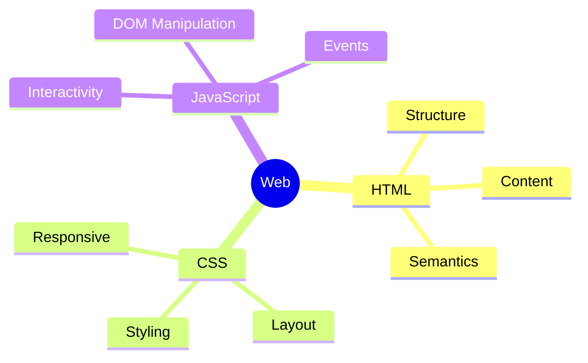
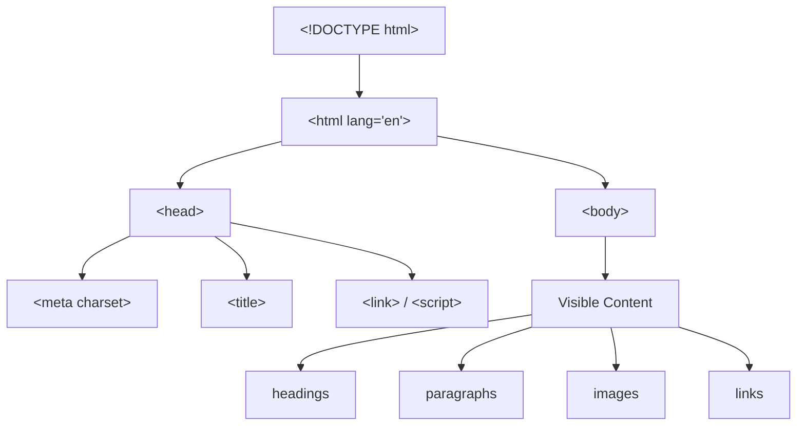

## Введение в HTML структура документа

> это первый урок курса - сегодня мы закладываем фундамент, без которого не получится ни одна веб-страница.

---

## Чему вы научитесь к концу урока

- Понимать, что такое HTML, тег, атрибут и элемент — и чем они отличаются друг от друга.
- Устанавливать и настраивать инструменты для работы: VS Code и DevTools браузера.
- Понимать структуру любого HTML-документа: `<!DOCTYPE html>`, `<html>`, `<head>`, `<body>`.
- Создавать, сохранять и открывать в браузере свою первую HTML-страницу.
- Пользоваться инспектором элементов, чтобы заглянуть «под капот» любого сайта.

---

## Хронометраж урока

| Блок                               | Содержание                                      |
| ---------------------------------- | ----------------------------------------------- |
| 1. Что такое HTML и зачем он нужен | Аналогия со скелетом дома, роль HTML в вебе     |
| 2. Установка инструментов          | VS Code, расширение Live Server, обзор DevTools |
| 3. Тег, атрибут, элемент           | Разбор терминов на примерах                     |
| 4. Структура HTML-документа        | DOCTYPE, html, head, body - построчный разбор   |
| 5. Мини-задание                    | Собрать скелет документа самостоятельно         |
| 6. Первая страница целиком         | Пишем и открываем в браузере                    |
| 7. Итоги и практическое задание    | Закрепление, задание на занятии                 |

---

## Блок 1. Что такое HTML и зачем он нужен

**Простыми словами:** представьте, что вы строите дом. Сначала возводят каркас — стены, перекрытия, лестницы. Без каркаса дом просто не будет стоять, даже если у вас есть самая красивая мебель и покраска.

**HTML (HyperText Markup Language) - это и есть каркас веб-страницы.** Он не отвечает за красоту (это работа CSS) и не отвечает за поведение - клики, анимации (это работа JavaScript). HTML отвечает только за одно: **что где находится и что чем является** - вот это заголовок, вот это абзац текста, вот это список, вот это картинка.

Аналогия дальше: если HTML - это каркас дома, то:

- **CSS** - это дизайнер интерьера: красит стены, расставляет мебель, подбирает шторы.
- **JavaScript** - это электрика и автоматика: свет включается по хлопку, двери открываются сами.

Мы начинаем с каркаса, потому что без него не имеет смысла ни дизайн, ни автоматика - их просто не на что будет "вешать".



**Важно понять сразу:** HTML — это **язык разметки**, а не язык программирования. В нём нет условий "если", нет циклов, нет вычислений. Он просто описывает структуру документа с помощью тегов.

---

## Блок 2. Инструменты: VS Code и DevTools

Для работы с HTML нам понадобятся два инструмента.

### VS Code (Visual Studio Code)

Это бесплатный редактор кода от Microsoft. Скачать можно на официальном сайте [code.visualstudio.com](https://code.visualstudio.com) - версия для Windows, macOS или Linux определится автоматически.

После установки поставьте одно расширение — оно сильно облегчит жизнь:

1. Откройте VS Code.
2. Слева на панели найдите иконку "Extensions" (квадратики).
3. В поиске введите **Live Server**.
4. Нажмите "Install" у расширения от автора Ritwick Dey.

**Зачем нужен Live Server:** без него, чтобы посмотреть изменения в браузере, вам придётся каждый раз вручную обновлять страницу (F5). Live Server делает это автоматически при каждом сохранении файла — и открывает страницу на локальном адресе вроде `http://127.0.0.1:5500`.

### DevTools (инструменты разработчика в браузере)

Это встроенная в каждый браузер (Chrome, Firefox, Edge) панель, которая показывает HTML-код любой открытой страницы.

**Как открыть:** нажмите правой кнопкой мыши на любом месте страницы → "Просмотреть код" (Inspect). Или горячая клавиша **F12**.

Попробуйте прямо сейчас открыть DevTools на любом сайте и найти вкладку **Elements** (Chrome/Edge) или **Инспектор** (Firefox) - там вы увидите HTML-структуру страницы в реальном времени.

**Мини-задание (2 минуты):** откройте DevTools на любимом сайте, найдите в панели Elements тег `<h1>` (обычно это заголовок статьи) и кликните по нему — вы увидите, как на странице подсветится именно этот элемент.

---

## Блок 3. Тег, атрибут, элемент - в чём разница

Это три термина, которые новички почти всегда путают. Разберём на аналогии с посылкой.

Представьте, что вы отправляете посылку:

- **Тег** - это тип коробки: "коробка для хрупкого", "коробка для документов". В HTML теги пишутся в угловых скобках: `<p>`, `<h1>`, ``.
- **Атрибут** - это наклейка на коробке с дополнительной информацией: "хрупкое", "верх", "адрес получателя". В HTML атрибут пишется внутри открывающего тега: `<p class="intro">`.
- **Элемент** - это уже вся коробка целиком: коробка (тег) + наклейки (атрибуты) + содержимое внутри.

### Синтаксис тега

Большинство тегов - **парные**: есть открывающий и закрывающий, а между ними — содержимое.

```html
<p>Это абзац текста.</p>
```

Здесь:

- `<p>` - открывающий тег
- `Это абзац текста.` - содержимое
- `</p>` - закрывающий тег (обратите внимание на слэш `/`)

Есть и **непарные (одиночные) теги** - у них нет содержимого и закрывающего тега, они просто "вставляют" что-то в документ:

```html
<br>
<hr>

```

Про `br`, `hr` и `img` подробно поговорим в следующих уроках - сейчас важно просто увидеть разницу в синтаксисе.

### Синтаксис атрибута

Атрибут всегда пишется **внутри открывающего тега**, в формате `имя="значение"`:

```html
<p class="intro">Текст абзаца</p>
```

Здесь `class` - имя атрибута, `"intro"` - его значение. Значение всегда в кавычках (двойных, по договорённости в этом курсе).

У одного тега может быть несколько атрибутов — они пишутся через пробел:

```html

```

### Элемент целиком

Элемент - это тег + атрибуты + содержимое + закрывающий тег:

```html
<p class="intro">Добро пожаловать на мой сайт!</p>
```

Весь этот кусок кода - один HTML-элемент.

---

###  Частые ошибки новичков

| Ошибка                                                                           | Как исправить                                                                                                    |
| -------------------------------------------------------------------------------- | ---------------------------------------------------------------------------------------------------------------- |
| Забыли закрыть тег: `<p>Текст` без `</p>`                                        | Всегда закрывайте парные теги - иначе браузер может неправильно понять, где заканчивается содержимое             |
| Значение атрибута без кавычек: `<p class=intro>`                                 | Всегда используйте кавычки: `<p class="intro">`                                                                  |
| Путают открывающий и закрывающий тег: `<p>Текст<p/>`                             | Закрывающий тег пишется со слэшем ПЕРЕД именем: `</p>`, а не `<p/>`                                              |
| Пишут тег с заглавной буквы: `<P>Текст</P>`                                      | По современным стандартам HTML-теги пишут строчными буквами: `<p>`                                               |
| Вложенные теги закрывают в неправильном порядке: `<p><strong>Текст</p></strong>` | Закрывать нужно в обратном порядке открытия — «последним открыл, первым закрыл»: `<p><strong>Текст</strong></p>` |

---

## Блок 4. Структура HTML-документа

Каждая HTML-страница, независимо от её содержимого, начинается с одинакового "скелета". Разберём его построчно.

```html
<!DOCTYPE html>
<html lang="ru">
<head>
    <meta charset="UTF-8">
    <title>Моя первая страница</title>
</head>
<body>
    <h1>Привет, мир!</h1>
</body>
</html>
```

Разберём каждую строку, продолжая аналогию со скелетом дома.

### `<!DOCTYPE html>`

Это не тег, а **декларация типа документа**. Она сообщает браузеру: "перед тобой документ в современном стандарте HTML5, читай его по актуальным правилам". Без этой строки старые браузеры могли переключаться в устаревший режим совместимости и странно отображать страницу.

**Аналогия:** это табличка на входе в дом "Построено по нормам 2024 года" — браузер сразу понимает, каких строительных стандартов ждать.

Пишется **всегда одинаково**, один раз, в самом начале файла.

### `<html lang="ru">`

Корневой (главный) тег, внутри которого находится вообще всё содержимое страницы. Все остальные теги — его "дети" и "внуки".

Атрибут `lang="ru"` указывает язык страницы — русский. Это помогает:

- скринридерам (программам для незрячих пользователей) правильно произносить текст;
- браузеру предлагать корректный перевод;
- поисковикам понимать язык контента.

**Аналогия:** `<html>` - это сам дом целиком, а `lang="ru"` - табличка "Внутри говорят по-русски".

### `<head>` - "голова" документа

Здесь находится служебная информация **о странице**, которая не отображается напрямую на экране: заголовок вкладки браузера, кодировка, подключаемые файлы стилей и скриптов (об этом — в уроке 9), метаданные для поисковиков.

**Аналогия:** `<head>` - это техпаспорт дома: адрес, год постройки, материалы. Мы не видим техпаспорт, гуляя по дому, но он определяет важные характеристики.

Внутри `<head>` в этом уроке мы используем два тега:

**`<meta charset="UTF-8">`** - указывает кодировку документа. UTF-8 поддерживает практически все языки мира, включая кириллицу. Без этой строки русский текст может отображаться как "кракозябры" (например, `привет` вместо "привет").

**`<title>Моя первая страница</title>`** - заголовок, который отображается на вкладке браузера и в результатах поиска Google/Яндекс. Это единственный тег из `<head>`, чей текст пользователь может увидеть напрямую — но не на самой странице, а на вкладке.

### `<body>` - "тело" документа

Здесь находится **всё, что видит пользователь**: текст, изображения, кнопки, ссылки, таблицы. Всё содержимое курса начиная со второго урока будет добавляться именно сюда.

**Аналогия:** если `<head>` — техпаспорт дома, то `<body>` — это все комнаты, в которых реально живут: гостиная, кухня, спальня. Все теги, которые мы изучим дальше (заголовки, абзацы, картинки, формы) размещаются внутри `<body>`.



---

###  Частые ошибки новичков

| Ошибка                                                   | Как исправить                                                                                                     |
| -------------------------------------------------------- | ----------------------------------------------------------------------------------------------------------------- |
| Забыли `<!DOCTYPE html>`                                 | Всегда пишите её первой строкой файла - без пробелов и текста перед ней                                           |
| Текст помещают прямо в `<html>`, минуя `<head>`/`<body>` | Весь видимый контент - только внутри `<body>`, служебная информация - только внутри `<head>`                      |
| Забывают `<meta charset="UTF-8">`                        | Добавляйте эту строку в `<head>` в каждом проекте — иначе кириллица может отображаться некорректно                |
| Путают `<title>` с заголовком `<h1>` на странице         | `<title>` виден только на вкладке браузера, `<h1>` - это видимый заголовок на самой странице (разберём в уроке 2) |
| Не закрывают `<head>` или `<body>`                       | Каждый из этих тегов парный - не забывайте `</head>` и `</body>`                                                  |

---

## Мини-задание

Соберите "скелет" HTML-документа самостоятельно, без подглядывания в пример выше:

1. Декларация типа документа.
2. Корневой тег с указанием русского языка.
3. Служебная часть с кодировкой UTF-8 и заголовком вкладки "Урок 1".
4. Видимая часть страницы — пока пустая.

**Решение:**

```html
<!DOCTYPE html>
<html lang="ru">
<head>
    <meta charset="UTF-8">
    <title>Урок 1</title>
</head>
<body>

</body>
</html>
```

---

## Блок 6. Собираем первую страницу целиком

Теперь дополним скелет реальным содержимым (заголовок и абзац текста - подробно про эти теги поговорим в уроке 2, а пока просто используем их, чтобы страница не была пустой).

**Шаг 1.** Откройте VS Code, создайте новую папку для проекта, например `html-course`.

**Шаг 2.** Внутри папки создайте файл `index.html` (именно это имя - стандарт для главной страницы сайта).

**Шаг 3.** Вставьте следующий код:

```html
<!DOCTYPE html>
<html lang="ru">
<head>
    <meta charset="UTF-8">
    <title>Моя первая страница</title>
</head>
<body>
    <h1>Привет, мир!</h1>
    <p>Это моя первая HTML-страница. Я изучаю вёрстку на курсе «HTML: от А до Я».</p>
</body>
</html>
```

**Шаг 4.** Сохраните файл (Ctrl+S / Cmd+S).

**Шаг 5.** Откройте страницу одним из двух способов:

- Через Live Server: правый клик по файлу в VS Code → "Open with Live Server".
- Вручную: найдите файл `index.html` в проводнике/finder и дважды кликните - он откроется в браузере по умолчанию.

**Шаг 6.** Откройте DevTools (F12) на своей странице и найдите в панели Elements тот же код, который вы написали - убедитесь, что браузер видит его именно так, как вы задумали.

---

## Итоги урока

Сегодня вы узнали:

- **HTML** - это язык разметки, "каркас" веб-страницы, который описывает структуру и смысл содержимого.
- **Тег** - это тип элемента (`<p>`, `<h1>`), **атрибут** - дополнительная информация внутри тега (`class="intro"`), **элемент** — тег с атрибутами и содержимым целиком.
- Каждый HTML-документ начинается с `<!DOCTYPE html>` и состоит из `<html>`, внутри которого - `<head>` (служебная информация) и `<body>` (видимое содержимое).
- Вы настроили VS Code с Live Server и научились пользоваться DevTools браузера.
- Вы создали и открыли свою первую HTML-страницу.

➡ **Следующий урок:** [Текст и семантика](../../Lesson-2/ru/Текст%20и%20семантика.md)

