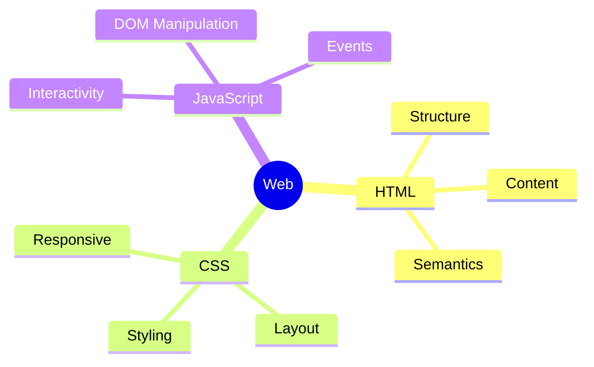
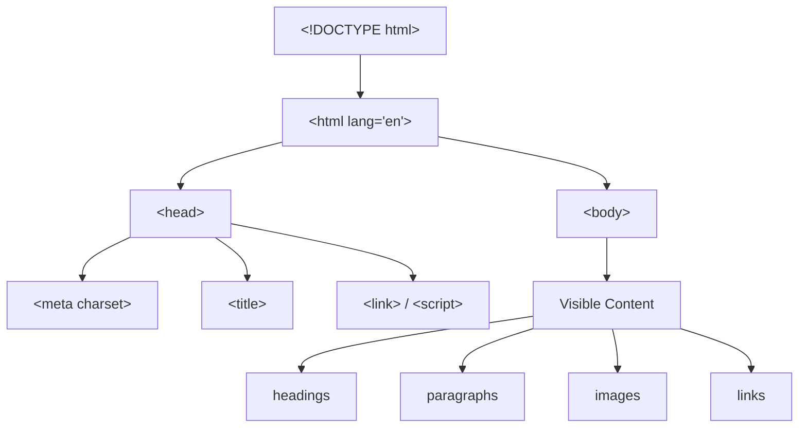

## HTML ga kirish: hujjat tuzilishi

> bu kursning birinchi darsi - bugun biz asos qo'yamiz, bu asossiz hech qanday veb-sahifa yaratib bo'lmaydi.

---

## Dars oxirida nimani o'rganasiz

- HTML, teg, atribut va element nima ekanligini va ular qanday farq qilishini tushunish.
- Ish vositalarini o'rnatish va sozlash: VS Code va brauzer DevTools.
- Har qanday HTML-hujjatning tuzilishini tushunish: `<!DOCTYPE html>`, `<html>`, `<head>`, `<body>`.
- Birinchi HTML-sahifangizni yaratish, saqlash va brauzerda ochish.
- Elementlar inspektoridan foydalanib, har qanday saytning "ichki qismini" ko'rish.

---

## Dars vaqti

| Blok                                       | Mazmun                                        |
| ------------------------------------------ | --------------------------------------------- |
| 1. HTML nima va u nima uchun kerak         | Uy skeleti bilan taqqoslash, HTMLning vebdagi roli |
| 2. Vositalarni o'rnatish                   | VS Code, Live Server kengaytmasi, DevTools ko'rib chiqish |
| 3. Teg, atribut, element                   | Misollarda atamalarni tahlil qilish           |
| 4. HTML-hujjatning tuzilishi               | DOCTYPE, html, head, body - satrma-satr tahlil |
| 5. Mini-vazifa                              | Hujjat skeletini mustaqil yig'ish            |
| 6. Birinchi sahifa to'liq                  | Yozib brauzerda ochamiz                       |
| 7. Xulosalar va amaliy vazifa              | Mustahkamlash, uy vazifasi                    |

---

## 1-blok. HTML nima va u nima uchun kerak

**Oddiy qilib aytganda:** tasavvur qiling, siz uy quryapsiz. Avval karqas quriladi - devorlar, pol, zinapoyalar. Karqasiz uy turib qolmaydi, hatto eng chiroyli mebel va bo'yoq bo'lsa ham.

**HTML (HyperText Markup Language) - bu veb-sahifaning karqasidir.** U go'zallikka javob bermaydi (bu CSS vazifasi) va xatti-harakatlarga - bosishlarga, animatsiyalarga - javob bermaydi (bu JavaScript vazifasi). HTML faqat bitta narsaga javob beradi: **nima qaerda joylashgan va nima nimadan iborat** - mana bu sarlavha, mana bu matn abzatsi, mana bu ro'yxat, mana bu rasm.

Davomiy taqqoslash: agar HTML - uy karqasi bo'lsa, demak:

- **CSS** - bu ichki dizayner: devorlarni bo'yaydi, mebelni joylashtiradi, parda tanlaydi.
- **JavaScript** - bu elektr va avtomatika: chiroq qarsak bilan yonadi, eshiklar o'z-o'zidan ochiladi.

Biz karqasdan boshlaymiz, chunki karqasiz na dizayn, na avtomatikaning ma'nosi bor - ularni osib qo'yadigan joy yo'q.



**Darhol tushunish kerak:** HTML - bu **belgilash tili**, dasturlash tili emas. Unda "agar" shartlari, sikllar, hisob-kitoblar yo'q. U faqat teglar yordamida hujjatning tuzilishini tasvirlaydi.

---

## 2-blok. Vositalar: VS Code va DevTools

HTML bilan ishlash uchun bizga ikki vosita kerak bo'ladi.

### VS Code (Visual Studio Code)

Bu Microsoft tomonidan taqdim etilgan bepul kod muharriri. Uni rasmiy saytdan yuklab olish mumkin [code.visualstudio.com](https://code.visualstudio.com) - Windows, macOS yoki Linux versiyasi avtomatik aniqlanadi.

O'rnatgandan so'ng, bitta kengaytmani o'rnating - bu hayotni sezilarli darajada osonlashtiradi:

1. VS Code oching.
2. Chap tomondagi panelda "Extensions" (kvadratchalar) ikonasini toping.
3. Qidiruvga **Live Server** kiriting.
4. Ritwick Dey tomonidan yaratilgan kengaytma uchun "Install" tugmasini bosing.

**Live Server nima uchun kerak:** unisiz, o'zgarishlarni brauzerda ko'rish uchun har safar sahifani qo'lda yangilashingiz kerak bo'ladi (F5). Live Server har saqlashda avtomatik ravishda buni amalga oshiradi - va sahifani `http://127.0.0.1:5500` kabi mahalliy manzilda ochadi.

### DevTools (brauzerdagi ishlab chiqaruvchi vositalari)

Bu har bir brauzerga (Chrome, Firefox, Edge) o'rnatilgan panel bo'lib, ochilgan har qanday sahifaning HTML-kodini ko'rsatadi.

**Qanday ochish:** sahifaning istalgan joyida sichqonchaning o'ng tugmasini bosing → "Inspect" (Kodni ko'rish). Yoki qisqartma tugma **F12**.

Hozir har qanday saytda DevTools oching va **Elements** (Chrome/Edge) yoki **Инспектор** (Firefox) yorlig'ini toping - u yerda sahifaning HTML-tuzilishini haqiqiy vaqtda ko'rasiz.

**Mini-vazifa (2 daqiqa):** sevimli saytingizda DevTools oching, Elements panelida `<h1>` tegini toping (odatda bu maqolaning sarlavhasi) va uning ustiga bosing - sahifada aynan shu element yoritilganini ko'rasiz.

---

## 3-blok. Teg, atribut, element - farq nima

Bu uchta atama yangi boshlovchilar deyarli har doim aralashtirib yuboradi. Pochta orqali yuborilgan posilkaga o'xshatib tushunamiz.

Tasavvur qiling, siz posilka yuboryapsiz:

- **Teg** - bu qutining turi: "mo'rt narsa uchun quti", "hujjatlar uchun quti". HTML'da teglar burchakli qavslarda yoziladi: `<p>`, `<h1>`, ``.
- **Atribut** - bu qutiga yopishtirilgan qo'shimcha ma'lumot bilan yorliq: "mo'rt", "tepa", "qabul qiluvchi manzili". HTML'da atribut ochuvchi teg ichida yoziladi: `<p class="intro">`.
- **Element** - bu allaqachon butun quti: quti (teg) + yorliqlar (atributlar) + ichidagi mazmun.

### Teg sintaksisi

Ko'pchilik teglar **juft**: ochuvchi va yopuvchi teg bor, ularning orasida esa mazmun mavjud.

```html
<p>Bu matn abzatsi.</p>
```

Bu yerda:

- `<p>` - ochuvchi teg
- `Bu matn abzatsi.` - mazmun
- `</p>` - yopuvchi teg (teskari chiziq `/` ga e'tibor bering)

**Juft bo'lmagan (yolg'iz) teglar** ham mavjud - ularning mazmuni va yopuvchisi yo'q, ular oddiygina hujjatga biror narsa "qo'shadi":

```html
<br>
<hr>

```

`br`, `hr` va `img` haqida keyingi darslarda batafsil gaplashamiz - hozir faqat sintaksis farqini ko'rish muhim.

### Atribut sintaksisi

Atribut doimo **ochuvchi teg ichida** yoziladi, `nomi="qiymati"` formatida:

```html
<p class="intro">Matn abzatsi</p>
```

Bu yerda `class` - atribut nomi, `"intro"` - uning qiymati. Qiymat doimo qo'shtirnoq ichida yoziladi (ikki tirnoq, kurs bo'yicha shunday qabul qilingan).

Bir tegda bir nechta atribut bo'lishi mumkin - ular bo'sh joy bilan ajratiladi:

```html

```

### Element to'liq

Element - bu teg + atributlar + mazmun + yopuvchi teg:

```html
<p class="intro">Mening saytimga xush kelibsiz!</p>
```

Bu butun kod parchasi - bitta HTML-elementi.

---

###  Yangi boshlovchilarning ko'p uchraydigan xatolari

| Xato                                                                              | Qanday tuzatish                                                                                                   |
| --------------------------------------------------------------------------------- | ----------------------------------------------------------------------------------------------------------------- |
| Tegni yopishni unutdilar: `<p>Matn` `</p>` holds                                 | Har doim juft teglarni yoping - aks holda brauzer mazmun qayerda tugashini noto'g'ri tushunishi mumkin             |
| Atribut qiymatini qo'shtirnoqsiz yozish: `<p class=intro>`                       | Har doim qo'shtirnoq ishlating: `<p class="intro">`                                                                |
| Ochuvchi va yopuvchi tegni aralashtirish: `<p>Matn<p/>`                           | Yopuvchi teg teskari chiziq bilan nomdan oldin yoziladi: `</p>`, `<p/>` emas                                       |
| Tegni katta harf bilan yozish: `<P>Matn</P>`                                     | Zamonaviy standartlarga ko'ra HTML-teglari kichik harflar bilan yoziladi: `<p>`                                     |
| Ichki teglarni noto'g'ri tartibda yopish: `<p><strong>Matn</p></strong>`          | Teshishni ochilish tartibidan teskari qilib yopish kerak - "oxirgisi ochilgan, birinchisi yopiladi": `<p><strong>Matn</strong></p>` |

---

## 4-blok. HTML-hujjatning tuzilishi

Har bir HTML-sahifa, mazmunidan qat'i nazar, bir xil "skelet"dan boshlanadi. Uni satrma-satr tahlil qilamiz.

```html
<!DOCTYPE html>
<html lang="ru">
<head>
    <meta charset="UTF-8">
    <title>Mening birinchi sahifam</title>
</head>
<body>
    <h1>Salom, dunyo!</h1>
</body>
</html>
```

Har bir satrni uy skeleti bilan taqqoslab tahlil qilamiz.

### `<!DOCTYPE html>`

Bu teg emas, bu **hujjat turini e'lon qilish**. U brauzerga xabar beradi: "oldingizda HTML5 zamonaviy standartidagi hujjat bor, uni dolzarb qoidalar bo'yicha o'qing". Bu satr bo'lmasa, eski brauzerlar eskirgan muvofiqlik rejimiga o'tib, sahifani g'alati ko'rsatishi mumkin.

**Taqqoslash:** bu uyning kirishidagi "2024-yil me'yorlari bo'yicha qurilgan" degan yorliq - brauzer darhol qanday qurilish standartlarini kutishini tushunadi.

**Har doim bir xil** yoziladi, bir marta, faylning eng boshida.

### `<html lang="ru">`

Asosiy (bosh) teg, uning ichida sahifaning butun mazmuni joylashgan. Boshqa barcha teglar uning "farzandlari" va "nevaralari".

`lang="ru"` atributi sahifaning tilini ko'rsatadi - rus tili. Bu quyidagilarga yordam beradi:

- ekran o'quvchilari (ko'zi ojizlar uchun dasturlar) matnni to'g'ri o'qishiga;
- brauzer to'g'ri tarjimani taklif qilishiga;
- qidiruv tizimlari kontent tilingi tushunishiga.

**Taqqoslash:** `<html>` - bu butun uy, `lang="ru"` esa "Ichida rus tilida gaplashiladi" degan yorliq.

### `<head>` - hujjatning "boshi"

Bu yerda sahifa haqida **xizmat ma'lumotlari** joylashgan, ular to'g'ridan-to'g'ri ekranda ko'rsatilmaydi: brauzer yorlig'ining sarlavhasi, kodlash, ulanayotgan stil va skript fayllari (bu 9-darsda), qidiruv tizimlari uchun metama'lumotlar.

**Taqqoslash:** `<head>` - bu uyning texnik pasporti: manzil, qurilgan yili, materiallar. Biz uyda yurganda texnik pasportni ko'rmaymiz, lekin u muhim xususiyatlarni belgilaydi.

`<head>` ichida bu darsda biz ikta teg ishlatamiz:

**`<meta charset="UTF-8">`** - hujjat kodlashini ko'rsatadi. UTF-8 deyarli barcha dunyo tillarini, shu jumladan kirillitsani qo'llab-quvvatlaydi. Bu satr bo'lmasa, rus matni "karakuzabry" ko'rinishida ko'rsatilishi mumkin (masalan, "salom" o'rniga `привет`).

**`<title>Mening birinchi sahifam</title>`** - bu sarlavha brauzer yorlig'ida va Google/Yandex qidiruv natijalarida ko'rsatiladi. `<head>` dan faqat shu tegning matnini foydalanuvchi to'g'ridan-to'g'ri ko'rishi mumkin - lekin sahifada emas, yorliqda.

### `<body>` - hujjatning "tanası"

Bu yerda **foydalanuvchi ko'radigan hamma narsa** joylashgan: matn, rasmlar, tugmalar, havolalar, jadvallar. Ikkinchi darsdan boshlangan kursning butun mazmuni shu yerga qo'shiladi.

**Taqqoslash:** agar `<head>` - uyning texnik pasporti bo'lsa, `<body>` - bu haqiqatda yashaydigan barcha xonalar: mehmonxona, oshxona, yotoq xonasi. Keyinchalik o'rganadigan barcha teglar (sarlavhalar, abzatslar, rasmlar, shakllar) `<body>` ichiga joylashtiriladi.



---

###  Yangi boshlovchilarning ko'p uchraydigan xatolari

| Xato                                                        | Qanday tuzatish                                                                                                    |
| ----------------------------------------------------------- | ------------------------------------------------------------------------------------------------------------------ |
| `<!DOCTYPE html>` ni unutdilar                               | Har doim faylning birinchi satrida yozing - oldidan bo'sh joy yoki matn yo'q                                       |
| Matnni to'g'ridan-to'g'rix `<html>` ga joylashtirish, `<head>`/`<body>` ni chetlab o'tish | Barcha ko'rinadigan kontent faqat `<body>` ichida, xizmat ma'lumotlari faqat `<head>` ichida                      |
| `<meta charset="UTF-8">` ni unutish                          | Har loyihada `<head>` ga shu satrni qo'shing - aks holda kirillitsa noto'g'ri ko'rinishi mumkin                    |
| `<title>` ni sahifadagi `<h1>` sarlavhasi bilan aralashtirish | `<title>` faqat brauzer yorlig'ida ko'rinadi, `<h1>` - sahifaning o'zidagi ko'rinadigan sarlavha (2-darsda tahlil qilamiz) |
| `<head>` yoki `<body>` ni yopishni unutish                   | Har ikkala teg ham juft - `</head>` va `</body>` ni unutmang                                                       |

---

## Mini-vazifa

HTML-hujjatning "skeletini" yuqoridagi misolga qaramasdan mustaqil yig'ing:

1. Hujjat turini e'lon qilish.
2. Rus tilini ko'rsatgan asosiy teg.
3. UTF-8 kodlash va "1-dars" yorlig'i sarlavhasi bilan xizmat qismi.
4. Sahifaning ko'rinadigan qismi - hozircha bo'sh.

**Yechim:**

```html
<!DOCTYPE html>
<html lang="ru">
<head>
    <meta charset="UTF-8">
    <title>1-dars</title>
</head>
<body>

</body>
</html>
```

---

## 6-blok. Birinchi sahifani to'liq yig'amiz

Endi skeletni haqiqiy mazmun bilan to'ldiramiz (sarlavha va matn abzatsi - bu teglar haqida 2-darsda batafsil gaplashamiz, hozir esa sahifaning bo'sh bo'lmaganligi uchun shunchaki ishlatamiz).

**1-qadam.** VS Code oching, loyiha uchun yangi papka yarating, masalan `html-course`.

**2-qadam.** Papka ichida `index.html` faylini yarating (aynan shu nom - saytning bosh sahifasi uchun standart nom).

**3-qadam.** Quyidagi kodni kiriting:

```html
<!DOCTYPE html>
<html lang="ru">
<head>
    <meta charset="UTF-8">
    <title>Mening birinchi sahifam</title>
</head>
<body>
    <h1>Salom, dunyo!</h1>
    <p>Bu mening birinchi HTML-sahifam. Men «HTML: A dan Z gacha» kursida veb-dizayn o'rganyapman.</p>
</body>
</html>
```

**4-qadam.** Faylni saqlang (Ctrl+S / Cmd+S).

**5-qadam.** Sahifani ikki usuldan biri bilan oching:

- Live Server orqali: VS Code'da fayl ustiga o'ng tugmani bosing → "Open with Live Server".
- Qo'lda: `index.html` faylini fayl menejerida/finder'da toping va ikki marta bosing - u standart brauzerda ochiladi.

**6-qadam.** Sahifangizda DevTools (F12) oching va Elements panelida yozgan kodning o'zini toping - brauzer uni aynan siz o'ylagandek ko'rishiga ishonch hosil qiling.

---

## Dars xulosalari

Bugun siz quyidagilarni o'rgandingiz:

- **HTML** - bu belgilash tili, veb-sahifaning "karqasi", u tuzilishni va mazmun ma'nosini tasvirlaydi.
- **Teg** - bu element turi (`<p>`, `<h1>`), **atribut** - teg ichidagi qo'shimcha ma'lumot (`class="intro"`), **element** - teg, atributlar va mazmun birgalikda.
- Har bir HTML-hujjat `<!DOCTYPE html>` dan boshlanadi va `<html>` dan iborat, uning ichida `<head>` (xizmat ma'lumotlari) va `<body>` (ko'rinadigan mazmun) joylashgan.
- Siz VS Code va Live Server ni sozlashni va brauzer DevToolsidan foydalanishni o'rgandingiz.
- Siz o'z birinchi HTML-sahifangizni yaratdiz va ochdiz.

➡ **Keyingi dars:** [Matn va semantika](../../Lesson-2/uz/Matn%20va%20semantika.md)
