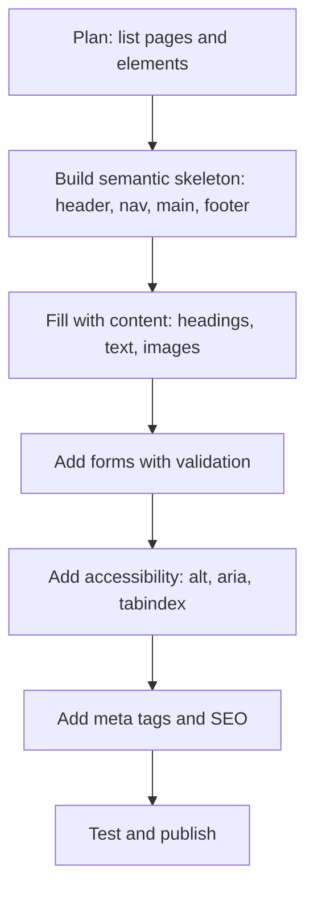
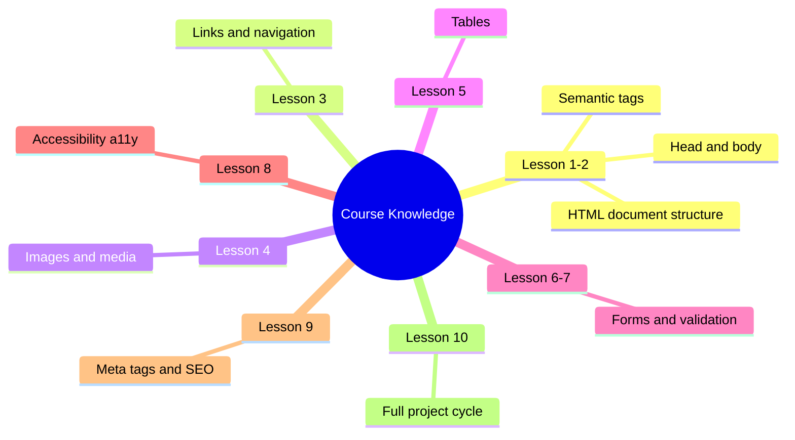

## Final project from planning to publication

> **Connection to the previous lesson:** we've come a long way from the first `<!DOCTYPE html>` to meta tags and project structure. Today is not a new topic, but rather **applying the entire course in practice**: we'll plan, build, and publish a real portfolio website from scratch to completion.

---

## What you will learn by the end of the lesson

- How to plan a website structure before writing the first line of code.
- How to build a complete page in the correct order: semantics → content → media → table → form → meta tags → accessibility.
- How to go through the final quality checklist and find weak spots in your own code.
- How to publish a finished site to the public via GitHub Pages.

---

## Lesson timeline

| Block                             | Content                                  |
| -------------------------------- | ------------------------------------------- |
| 1. Project planning          | What kind of site, how many pages, what goes on each |
| 2. Step-by-step build: semantics   | Page skeleton, header/nav/main/footer     |
| 3. Step-by-step build: content     | Headings, text, lists                    |
| 4. Step-by-step build: media       | Images, figure                         |
| 5. Step-by-step build: table     | If applicable to the project                    |
| 6. Step-by-step build: form       | Contact form                        |
| 7. Step-by-step build: meta tags   | head in full                                |
| 8. Step-by-step build: accessibility | Final aria/alt/scope check           |
| 9. Final quality checklist   | Full self-review                         |
| 10. Publishing to GitHub Pages   | Step-by-step instructions                        |


---

## Block 1. Planning before writing code

**In simple terms:** before building a house, an architect draws a plan on paper — how many rooms, what goes where, how to move between them. It's the same with websites: if you sit down to write code without a plan, you'll very likely end up constantly redoing everything on the fly.

### Step 1. Choose your project topic

The final project is a simple multi-page portfolio website. Examples of good topics for a learning project:

- Personal portfolio (about yourself, projects, contacts).
- A small local business website (cafe, tutoring, workshop).
- A course or hobby club showcase website.

**Important:** choose a topic you actually have something to say about — it'll be much easier to fill the pages with meaningful content, not just "filler" text.

### Step 2. Define the page structure (sitemap)

Write down on paper or in a text file the list of pages and what each one will contain:

**Example sitemap for a personal portfolio:**

|Page|File|Content|
|---|---|---|
|Home|`index.html`|Greeting, brief "about me", links to other sections|
|About|`about.html`|Detailed bio, photo, skills list|
|Projects|`projects.html`|List of works with preview images|
|Contacts|`contact.html`|Contact form, table with contact methods|

### Step 3. Draft a content plan for each page

For each page, briefly list which HTML tools from the course you'll be using. For example, for `contact.html`:

- `<header>` with a persistent `<nav>` menu
- `<main>` with a heading `<h1>Contacts</h1>`
- `<table>` with `scope` — contact methods and working hours
- `<form>` with `fieldset`/`legend` — contact form
- `<footer>` with social media links using `aria-label`

**This planning is not a formality.** This is usually where you notice inconsistencies — for example, that your home page has no link to a page you just created. It's much easier to fix this on paper than after you've already written code for four pages.



---

## Block 2. Step-by-step build: semantics (the skeleton of every page)

We start building with the semantic skeleton — what we covered in lesson 2. This is done **before** filling in real content — structure first, then content goes inside it.

```html
<!DOCTYPE html>
<html lang="ru">
<head>
    <meta charset="UTF-8">
    <title><!-- we'll fill this in block 7 --></title>
</head>
<body>
    <header>
        <nav>
            <!-- persistent menu -->
        </nav>
    </header>

    <main>
        <!-- main page content -->
    </main>

    <footer>
        <!-- footer -->
    </footer>
</body>
</html>
```

**Do this the same way for every page in your project** — a single skeleton with the same `<header>`/`<nav>`/`<footer>` on all pages, with only the `<main>` content differing — exactly as we built a multi-page site in lesson 3.

---

## Block 3. Step-by-step build: content (text, headings, lists)

Now we fill `<main>` with real text, using proper heading hierarchy (lesson 2) — a single `<h1>` per page, with no skipped levels.

**Example for `about.html`:**

```html
<main>
    <h1>About Me</h1>

    <p>My name is Aziz and I've been <strong>passionate about web development</strong> for over a year now. I started with HTML — and now I'm taking this course to organize my knowledge.</p>

    <h2>My Skills</h2>
    <ul>
        <li>HTML5 — semantic markup</li>
        <li>CSS fundamentals</li>
        <li>Learning JavaScript</li>
    </ul>

    <h2>My Journey</h2>
    <ol>
        <li>Started learning web development on my own</li>
        <li>Completed the "HTML: A to Z" course</li>
        <li>Planning to continue — CSS and JavaScript next</li>
    </ol>
</main>
```

Use `<strong>`/`<em>` only where the text genuinely requires semantic emphasis — not for decoration, but for meaning (as we covered in lesson 2).

---

## Block 4. Step-by-step build: media (images)

Add images where they're appropriate — profile photo, project previews, illustrations. Don't forget about `alt` (lesson 4) and `figure`/`figcaption` when an image needs a caption.

```html
<figure>
    
    <figcaption>My workspace</figcaption>
</figure>
```

**If you don't have your own photos for the project** — use free placeholder images (it's still important to write meaningful `alt` text that describes what's actually shown in the image, not made-up text).

---

## Block 5. Step-by-step build: table

Add a table where your project actually has tabular data (lesson 5) — remember the rule: tables are only for data, not for layout.

**Example for `contact.html` — contact methods table:**

```html
<table>
    <caption>Contact Methods</caption>
    <thead>
        <tr>
            <th scope="col">Method</th>
            <th scope="col">Contact</th>
            <th scope="col">Response Time</th>
        </tr>
    </thead>
    <tbody>
        <tr>
            <th scope="row">Email</th>
            <td><a href="mailto:info@saydullayev.fun">info@saydullayev.fun</a></td>
            <td>Within 24 hours</td>
        </tr>
        <tr>
            <th scope="row">Telegram</th>
            <td><a href="https://t.me/example" target="_blank" rel="noopener noreferrer">@example</a></td>
            <td>A few hours</td>
        </tr>
    </tbody>
</table>
```

**If a table doesn't fit your project topic** (for example, a purely visual portfolio with no comparative data) — that's fine, don't artificially add a table just to use the tag. Use your engineering judgment: the tag should appear where it solves a real problem.

---

## Block 6. Step-by-step build: form

Add a contact form (lessons 6-7), with proper `label`/`for`/`id` linkage, grouping via `fieldset`/`legend`, and at least minimal validation.

```html
<form action="#" method="post">
    <fieldset>
        <legend>Get in Touch</legend>

        <label for="name">Name:</label>
        <input type="text" id="name" name="name" required maxlength="50"><br>

        <label for="email">Email:</label>
        <input type="email" id="email" name="email" required><br>

        <label for="message">Message:</label><br>
        <textarea id="message" name="message" rows="5" cols="40" placeholder="Write your message..." required></textarea>
    </fieldset>

    <button type="submit">Send</button>
</form>
```

**Reminder from lesson 6:** `action="#"` is a placeholder since we don't have server-side processing in this course; what matters is the correct structure and accessibility of the form itself.

---

## Block 7. Step-by-step build: meta tags

Fill out the `<head>` of each page (lesson 9) — now that the content is ready, it's easy to write a meaningful `description`.

```html
<head>
    <meta charset="UTF-8">
    <meta name="viewport" content="width=device-width, initial-scale=1.0">
    <meta name="description" content="About me — Aziz, an aspiring web developer learning HTML, CSS, and JavaScript.">
    <title>About Me — Aziz's Portfolio</title>
    <link rel="icon" type="image/png" href="favicon.png">
    <link rel="stylesheet" href="css/style.css">
</head>
```

**Check each page for:** a unique `<title>` (not the same across all pages!), a unique `description` that reflects the specific content of that page.

---

## Block 8. Step-by-step build: accessibility

Final check of each page using the tools from lesson 8:

- All `` tags have a meaningful `alt` (or empty `alt=""` for decorative images).
- Icon links without text have `aria-label`.
- Heading hierarchy has no gaps and a single `<h1>` per page.
- Test Tab navigation — reach every interactive element without a mouse.

---

## Block 9. Final quality checklist

Go through this list for **every** page of your project — mark them right on paper or in your notes:

- [ ] Single `<h1>` on the page
- [ ] Semantics instead of div soup (`header`/`nav`/`main`/`footer` used for their intended purpose)
- [ ] `alt` on all `` tags
- [ ] `label` on all form fields
- [ ] Meaningful link text (not "click here", but a clear description — e.g., "Read more about the project")
- [ ] `meta charset` and `meta viewport` in place
- [ ] Code passes W3C validation without errors
- [ ] Page is readable on a mobile screen (you can check via DevTools — device mode, phone/tablet icon in the top panel)

**Go through this checklist right now with one of your completed pages** — chances are, you'll find at least one item worth improving. This is normal and useful — this is exactly what a real quality check before publication looks like.

---

## Block 10. Publishing to GitHub Pages

The final step of the course — making your site accessible to the entire world via a real URL, not just on your computer.

### What is GitHub Pages

GitHub is a service for storing code (we mentioned it as a platform for portfolios in previous lessons). **GitHub Pages** is a free GitHub feature that lets you publish a static HTML/CSS/JS website directly from your repository at a URL like `username.github.io/repository-name`.

### Step-by-step instructions

**Step 1.** If you don't have a GitHub account yet — sign up at github.com.

**Step 2.** Create a new repository:

- Click "New repository".
- Give it a name, e.g. `my-portfolio`.
- Select "Public" (the repository must be public for free GitHub Pages).
- Click "Create repository".

**Step 3.** Upload project files using one of two methods:

_Method A — via the web interface (easier for beginners):_

- On the repository page, click "uploading an existing file".
- Drag and drop all your project files and folders (`index.html`, `css/`, `js/`, `images/`, etc.).
- At the bottom, click "Commit changes".

_Method B — via Git from the terminal (if you're already familiar with Git):_

```bash
git init
git add .
git commit -m "First site publication"
git branch -M main
git remote add origin https://github.com/your-username/my-portfolio.git
git push -u origin main
```

**Step 4.** Enable GitHub Pages:

- Open the "Settings" tab in your repository.
- In the sidebar menu, find the "Pages" section.
- Under "Source", select the `main` branch and the `/ (root)` folder.
- Click "Save".

**Step 5.** Wait 1-2 minutes — GitHub will build and publish your site. Refresh the "Pages" settings page — a link will appear like:

```
https://ваш-username.github.io/my-portfolio/
```

**Step 6.** Open that link in your browser — your site is now accessible to anyone on the internet.

### Important practical note: the main file name

GitHub Pages automatically opens the `index.html` file when visiting the repository's root address — so it's important that your home page is named `index.html` (not `home.html` or `main.html`), otherwise it won't open automatically via the short URL.

### Updating the site in the future

If you want to make changes later — just upload the updated files the same way (via the web interface "Add file" → "Upload files", or `git push` if you're using the terminal) — GitHub Pages will automatically rebuild and update the published version of your site within a couple of minutes.

---

###  Common publishing mistakes

|Error|How to fix|
|---|---|
|Repository created as Private|For free GitHub Pages, the repository must be public|
|Home page not named `index.html`|Rename the home page file to `index.html`|
|CSS/image paths break after publishing|Make sure you use relative paths (lesson 3), not absolute paths like `C:\Users\...` that only work on your computer|
|Pages feature not enabled in settings|Don't forget to go to Settings → Pages and explicitly select the publishing branch|

---

## Course summary

Congratulations — you've traveled the path from the first `<!DOCTYPE html>` to a fully published multi-page website! Over 10 lessons, you've mastered:

- HTML document structure and basic tools (lessons 1-2).
- Links and navigation between pages (lesson 3).
- Working with images and media (lesson 4).
- Tables for tabular data (lesson 5).
- Forms — both levels of complexity, from simple fields to validation (lessons 6-7).
- Accessibility as a principle, not a separate "feature" (lesson 8).
- Meta tags, SEO basics, and integration with CSS/JS (lesson 9).
- The full cycle: from project planning to public publication (lesson 10).

**What's next:** HTML is just the "skeleton" (as we said from the very first lesson). The logical continuation is **CSS** (styling, colors, spacing, responsive layout for different screens) and then **JavaScript** (interactivity, truly working with forms, dynamic page behavior). The site you published today will become an excellent "playground" for practicing these new skills in the future.


