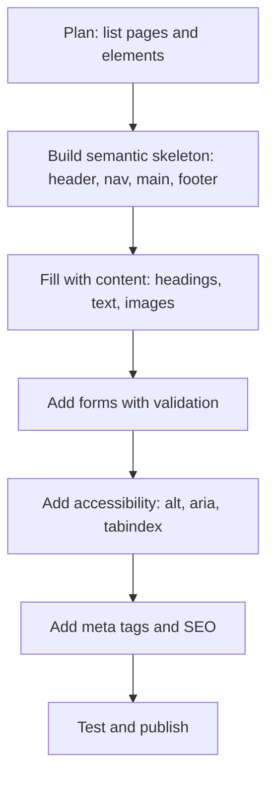
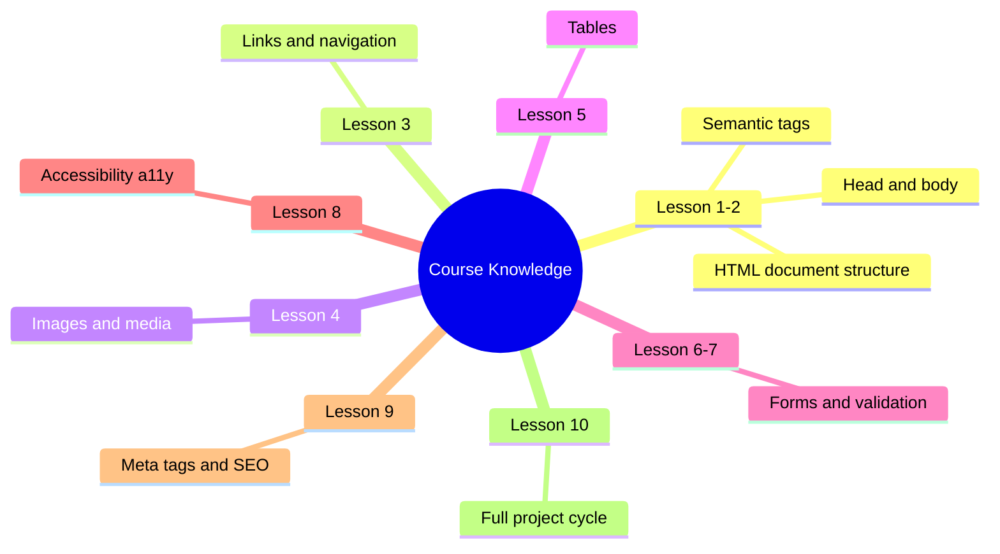

## Yakuniy loyiha: rejalashtirishdan nashr etishgacha

> **Oldingi dars bilan bog'lanish:** biz birinchi `<!DOCTYPE html>` dan meta-teglar va loyiha tuzilmasigacha bo'lgan yo'lni bosib o'tdik. Bugun — yangi emas, balki **butun kursni amalda qo'llash**: noldan boshlab haqiqiy sayt-vizitkani rejalashtiramiz, yig'amiz va nashr etamiz.

---

## Dars oxiriga qadar nimani o'rganasiz

- Birinchi kod yozilmasidan oldin sayt tuzilmasini rejalashtirish.
- To'g'ri tartibda to'liq sahifani yig'ish: semantika → kontent → media → jadval → forma → meta-teglar → mavjudlik.
- Yakuniy sifat tekshiruv ro'yxatidan o'tish va o'z kodingizdagi zaif tomonlarni topish.
- Tayyor saytni GitHub Pages orqali ochiq foydalanishga nashr etish.

---

## Dars vaqti

| Blok                             | Kontent                                  |
| -------------------------------- | ------------------------------------------- |
| 1. Loyiha rejalashtirish          | Qanday sayt, nechta sahifa, har birida nima |
| 2. Bosqichma-bosqich yig'ish: semantika   | Sahifa skeleti, header/nav/main/footer     |
| 3. Bosqichma-bosqich yig'ish: kontent     | Sarlavhalar, matn, ro'yxatlar                    |
| 4. Bosqichma-bosqich yig'ish: media       | Rasmlar, figure                         |
| 5. Bosqichma-bosqich yig'ish: jadval     | Agar loyihaga mos bo'lsa                    |
| 6. Bosqichma-bosqich yig'ish: forma       | Fikr-mulohaza forması                        |
| 7. Bosqichma-bosqich yig'ish: meta-teglar   | head to'liq                                |
| 8. Bosqichma-bosqich yig'ish: mavjudlik | Yakuniy aria/alt/scope tekshiruvi           |
| 9. Yakuniy sifat tekshiruv ro'yxati   | To'liq o'z-o'zini tekshirish                         |
| 10. GitHub Pages'da nashr etish   | Bosqichma-bosqich ko'rsatma                        |


---

## Blok 1. Kod yozishdan oldin rejalashtirish

**Oddiy qilib aytganda:** uy qurishdan oldin arxitektor qog'ozga rejani chizadi — nechta xona, qayerda nima joylashgan, ular orqasida qanday harakat qilish kerak. Sayt bilan ham xuddi shunday: agar plansiz kod yozishga o'tirsangiz, hamma narsani doimiy qayta ishlash xavfi juda katta.

### 1-qadam. Loyiha mavzusini tanlang

Yakuniy loyiha — bu oddiy ko'p sahifali sayt-vizitka. O'quv loyihasi uchun yaxshi mavzular misollari:

- Shaxsiy portfolioning (o'zingiz haqida, loyihalar, kontaktlar).
- Kichik mahalliy biznes sayti (kafetereya, repetitorlik, ustaxona).
- O'quv kursi yoki qiziqishlar klubi sayt-vizitkasi.

**Muhim:** o'zingiz haqida haqiqatan aytadigan narsangiz bor mavzuni tanlang — bu sahifalarni mazmunli kontent bilan to'ldirish osonroq bo'ladi, "ko'z uchun" yozilgan matn emas.

### 2-qadam. Sahifalar tuzilmasini aniqlang (sayt xaritasi)

Qog'ozda yoki matn faylida sahifalar ro'yxatini va har birida nima bo'lishini yozing:

**Shaxsiy portfolio uchun sayt xaritasi misoli:**

|Sahifa|Fayl|Mazmuni|
|---|---|---|
|Bosh sahifa|`index.html`|Salomlashish, qisqacha "o'zim haqimda", qolgan bo'limlarga havolalar|
|O'zim haqimda|`about.html`|Batafsil hikoya, foto, ko'nikmalar ro'yxati|
|Loyihalar|`projects.html`|Ishlar ro'yxati oldindan ko'rish rasmlari bilan|
|Kontaktlar|`contact.html`|Fikr-mulohaza forması, bog'lanish usullari jadvali|

### 3-qadam. Har bir sahifa uchun kontent rejasini tuzing

Har bir sahifa uchuni qisqacha, kursdagi qaysi HTML vositalarini ishlatishingizni yozing. Masalan, `contact.html` uchun:

- `<header>` umumiy menyu `<nav>` bilan
- `<main>` sarlavha `<h1>Kontaktlar</h1>`
- `<table>` `scope` bilan — bog'lanish usullari va ish vaqti
- `<form>` `fieldset`/`legend` bilan — fikr-mulohaza forması
- `<footer>` `aria-label` orqali ijtimoiy tarmoqlarga havolalar

**Bu rejalashtirish shunchaki rasmiy emas.** Aynan shu qadamda odatda nomuvofiqliklarni sezasiz: masalan, bosh sahifada siz yangi gaplashgan sahifaga havola yo'q ekanligini — buni qog'ozda tuzish kod to'rt sahifa yozilgandan keyin tuzishdan ancha oson.



---

## Blok 2. Bosqichma-bosqich yig'ish: semantika (har bir sahifaning skeleti)

Yig'ishni semantik skeletdan boshlaymiz — bu 2-darsda muhokama qilgan narsa. Buni haqiqiy kontent bilan to'ldirishdan **oldin** qilinadi — avval tuzilma, keyin ichiga kontent.

```html
<!DOCTYPE html>
<html lang="ru">
<head>
    <meta charset="UTF-8">
    <title><!-- 7-bloqda to'ldiramiz --></title>
</head>
<body>
    <header>
        <nav>
            <!-- umumiy menyu -->
        </nav>
    </header>

    <main>
        <!-- sahifaning asosiy kontenti -->
    </main>

    <footer>
        <!-- pastki qism -->
    </footer>
</body>
</html>
```

**Buni loyihangizning har bir sahifasi uchun bir xil qiling** — barcha sahifalarda bir xil `<header>`/`<nav>`/`<footer>` bilan yagona skelet, faqat `<main>` kontenti farq qiladi — aynan shunday biz 3-darsda ko'p sahifali sayt qilganmiz.

---

## Blok 3. Bosqichma-bosqich yig'ish: kontent (matn, sarlavhalar, ro'yxatlar)

Endi `<main>` ni haqiqiy matn bilan to'ldiramiz, to'g'ri sarlavhalar ierarxiyasidan foydalanib (2-dars) — sahifada yagona `<h1>`, darajalarni o'tkazib yubormasdan.

**`about.html` uchun misol:**

```html
<main>
    <h1>Men haqimda</h1>

    <p>Mening ismim Aziz, men bir yildan ortiq vaqtdan beri <strong>veb-dasturlashga qiziqaman</strong>. HTMLdan boshladim — va endi bilimlarimni tartibga solish uchun shu kursdan o'tmoqdaman.</p>

    <h2>Mening ko'nikmalarim</h2>
    <ul>
        <li>HTML5 — semantik kodlash</li>
        <li>CSSning asoslari</li>
        <li>JavaScriptni o'rganmoqdaman</li>
    </ul>

    <h2>Mening yo'lim</h2>
    <ol>
        <li>Veb-dasturlashni mustaqil o'rganishni boshladim</li>
        <li>"HTML: A dan Ya gacha" kursidan o'tdim</li>
        <li>Davom etishni rejalashtiraman — CSS va JavaScriptga</li>
    </ol>
</main>
```

`<strong>`/`<em>` ni faqat matn haqiqatan ma'noviy urg'u talab qilgan joyda ishlating — bezak uchun emas, mazmun uchun (2-darsda muhokama qilganimizdek).

---

## Blok 4. Bosqichma-bosqich yig'ish: media (rasmlar)

Rasmlarni o'rinli joylarga qo'shing — profil fotosurati, loyihalarning oldindan ko'rish rasmlari, illustratsiyalar. `alt` (4-dars) va rasmga podpis kerak bo'lsa `figure`/`figcaption` ni unutmang.

```html
<figure>
    
    <figcaption>Mening ish joyim</figcaption>
</figure>
```

**Agar loyiha uchun o'z rasmlaringiz bo'lmasa** — erkin foydalanish mumkin bo'lgan zaxira rasmlardan foydalaning (muhim: har doim rasmda haqiqatan nima tasvirlanganiga mos mazmunli `text` yozing, ixtiro qilingan matn emas).

---

## Blok 5. Bosqichma-bosqich yig'ish: jadval

Jadvalni loyihada haqiqatan jadval ma'lumotlari bo'lgan joylarga qo'shing (5-dars) — qoidani unutmang: jadval faqat ma'lumotlar uchun, maket kodlash uchun emas.

**`contact.html` uchun misol — bog'lanish usullari jadvali:**

```html
<table>
    <caption>Bog'lanish usullari</caption>
    <thead>
        <tr>
            <th scope="col">Usul</th>
            <th scope="col">Kontakt</th>
            <th scope="col">Javob vaqti</th>
        </tr>
    </thead>
    <tbody>
        <tr>
            <th scope="row">Email</th>
            <td><a href="mailto:info@saydullayev.fun">info@saydullayev.fun</a></td>
            <td>Kun ichida</td>
        </tr>
        <tr>
            <th scope="row">Telegram</th>
            <td><a href="https://t.me/example" target="_blank" rel="noopener noreferrer">@example</a></td>
            <td>Bir necha soat</td>
        </tr>
    </tbody>
</table>
```

**Agar loyiha mavzuingiz uchun jadval mos kelmasa** (masalan, faqat vizual portfolio, taqqoslash ma'lumotlari bilan) — bu normal, tegni sun'iy ravishda ishlatish uchun qo'shmang. O'z muhandislik bahongizni ishlating: teg haqiqiy vazifani hal qiladigan joyda paydo bo'lishi kerak.

---

## Blok 6. Bosqichma-bosqich yig'ish: forma

Fikr-mulohaza formasini qo'shing (6-7-dars), to'g'ri `label`/`for`/`id` bog'lanishi, `fieldset`/`legend` orqali guruhlash va kamida minimal tekshirish bilan.

```html
<form action="#" method="post">
    <fieldset>
        <legend>Menga murojaat qiling</legend>

        <label for="name">Ism:</label>
        <input type="text" id="name" name="name" required maxlength="50"><br>

        <label for="email">Email:</label>
        <input type="email" id="email" name="email" required><br>

        <label for="message">Xabar:</label><br>
        <textarea id="message" name="message" rows="5" cols="40" placeholder="Savolingizni yozing..." required></textarea>
    </fieldset>

    <button type="submit">Yuborish</button>
</form>
```

**6-darsdan eslatma:** `action="#"` — bu zaxira, chunki bizda bu kursda server qayta ishlash yo'q; asosiysa — to'g'ri tuzilma va formaning o'zining mavjudligi.

---

## Blok 7. Bosqichma-bosqich yig'ish: meta-teglar

Har bir sahifaning `<head>` qismini to'ldiring (9-dars) — endi kontent tayyor bo'lgach, mazmunli `description` yozish oson.

```html
<head>
    <meta charset="UTF-8">
    <meta name="viewport" content="width=device-width, initial-scale=1.0">
    <meta name="description" content="Men haqimda — Aziz, yangi boshlagan veb-dasturchi, HTML, CSS va JavaScriptni o'rganmoqda.">
    <title>Men haqimda — Azizning portfoliosi</title>
    <link rel="icon" type="image/png" href="favicon.png">
    <link rel="stylesheet" href="css/style.css">
</head>
```

**Har bir sahifada tekshiring:** yagona `<title>` (barcha sahifalarda bir xil emas!), ma'lum sahifaning kontentini aks ettiruvchi yagona `description`.

---

## Blok 8. Bosqichma-bosqich yig'ish: mavjudlik

8-dars vositalari bo'yicha har bir sahifaning yakuniy tekshiruvi:

- Barcha `` ma'noli `alt` ga ega (yoki bezak rasmlar uchun bo'sh `alt=""`).
- Matnsiz havola belgilari `aria-label` ga ega.
- Sarlavhalar ierarxiyasida bo'sh joylar yo'q va sahifada yagona `<h1>` mavjud.
- Tab-navigatsiyani tekshiring — har bir interaktiv elementga sichqonchadan foydalanmasdan yeting.

---

## Blok 9. Yakuniy sifat tekshiruv ro'yxati

Loyihangizning **har bir** sahifasi uchun ushbu ro'yxatdan o'ting — qog'ozda yoki eslatmalarda belgilang:

- [ ] Sahifada yagona `<h1>`
- [ ] Semantika div-shorbasining o'rniga (`header`/`nav`/`main`/`footer` o'z maqsadida ishlatilgan)
- [ ] Barcha `` da `alt`
- [ ] Barcha forma maydonlarida `label`
- [ ] Havolalarning ma'noli matni ("bosing" emas, aniq tavsif — masalan, "Loyiha haqida batafsil o'qing")
- [ ] `meta charset` va `meta viewport` o'rnida
- [ ] Kod W3C-tekshiruvidan xatosiz o'tadi
- [ ] Sahifa mobil ekranda o'qilishi mumkin (DevTools orqali tekshirishingiz mumkin — qurilma rejimi, yuqori paneldagi telefon/planshet belgisi)

**Hozir tayyor sahifalarinizdan biri bo'yicha shu tekshiruv ro'yxatidan o'ting** — ehtimol, tuzatish kerak bo'lgan kamida bitta band topiladi. Bu normal va foydali — aynan shunday nashr etishdan oldin haqiqiy sifat tekshiruvi ko'rinishadi.

---

## Blok 10. GitHub Pages'da nashr etish

Kursning yakuniy qadami — saytingizni real havola orqali butun dunyoga ochiq qilish, faqat o'z kompyuteringizda emas.

### GitHub Pages nima

GitHub — kod saqlash xizmati (biz oldingi darslarda uni portfolio uchun maydon sifatida eslatganmiz). **GitHub Pages** — GitHubning bepul funksiyasi, bu sizning statik HTML/CSS/JS saytingizni to'g'ridan-to'g'ri repozitoriyangizdan `username.github.io/repository-name` ko'rinishidagi manzilda nashr etishga imkon beradi.

### Bosqichma-bosqich ko'rsatma

**1-qadam.** Agar hali GitHub'da akkauntingiz bo'lmasa — github.com'da ro'yxatdan o'ting.

**2-qadam.** Yangi repozitoriya yarating:

- "New repository" tugmasini bosing.
- Nom bering, masalan `my-portfolio`.
- "Public" ni tanlang (repozitoriya bepul GitHub Pages uchun ochiq bo'lishi kerak).
- "Create repository" tugmasini bosing.

**3-qadam.** Fayllarni ikki usuldan biri bilan yuklang:

_A usuli — veb-interfeys orqali (yangi boshlaganlar uchun osonroq):_

- Repozitoriya sahifasida "uploading an existing file" tugmasini bosing.
- Loyihangizning barcha fayllari va papkalarini tortib tashlang (`index.html`, `css/`, `js/`, `images/` va boshqalar).
- Pastda "Commit changes" tugmasini bosing.

_B usuli — terminal orqali Git bilan (agar Git bilan tanish bo'lsangiz):_

```bash
git init
git add .
git commit -m "Первая публикация сайта"
git branch -M main
git remote add origin https://github.com/ваш-username/my-portfolio.git
git push -u origin main
```

**4-qadam.** GitHub Pages'ni yoqing:

- Repozitoriyangizdagi "Settings" varaqlarini oching.
- Yon menyuda "Pages" bo'limini toping.
- "Source" bo'limida `main` branchni va `/ (root)` papkasini tanlang.
- "Save" tugmasini bosing.

**5-qadam.** 1-2 daqiqa kuting — GitHub saytingizni yig'adi va nashr etadi. "Pages" sozlamalar sahifasini yangilang — havola paydo bo'ladi:

```
https://ваш-username.github.io/my-portfolio/
```

**6-qadam.** Shu havolani brauzerda oching — saytingiz endi internetdagi har qanday odam uchun mavjud.

### Muhim amaliy nuqta: asosiy fayl nomi

GitHub Pages repozitoriyaning ildiz manziliga kirilganda avtomatik ravishda `index.html` faylini ochadi — shuning uchun bosh sahifangiz aynan `index.html` deb atalishi muhim (masalan, `home.html` yoki `main.html` emas), aks holda qisqa havola orqali avtomatik ochilmaydi.

### Saytni kelajakda yangilash

Agar keyinchalik nimadir o'zgartirishni istasangiz — yangilangan fayllarni shu usul bilan yuklang (veb-interfeysda "Add file" → "Upload files" yoki terminal orqalag ishlasangiz `git push`) — GitHub Pages bir necha daqiqa ichida nashr etilgan sayt versiyasini qayta yig'adi va yangilaydi.

---

###  Nashr etishda tez-tez uchraydigan xatolar

|Xato|Qanday tuzatish|
|---|---|
|Repozitoriya maxfiy (Private) yaratilgan|Bepul GitHub Pages uchun repozitoriya ochiq bo'lishi kerak|
|Bosh sahifa `index.html` deb nomlanmagan|Bosh sahifa faylini aynan `index.html` deb qayta nomlang|
|CSS/JS/rasmlarga yo'llar nashr etishdan keyin sinadi|Nisbiy yo'llardan foydalaning (3-dars), faqat o'z kompyuteringizda ishlaydigan `C:\Users\...` ko'rinishidagi mutlaq yo'llar emas|
|Pages funksiyasi sozlamalarda yoqilmagan|Settings → Pages ga kirib, nashr branchni aniq tanlashni unutmang|

---

## Kurs yakunlari

Tabriklaymiz — siz birinchi `<!DOCTYPE html>` dan to'liq nashr etilgan ko'p sahifali saytgacha bo'lgan yo'lni bosib o'tdingiz! 10 ta dars davomida siz o'zlashtirdingiz:

- HTML hujjatining tuzilmasi va asosiy vositalar (1-2-darslar).
- Havolalar va sahifalar orasidagi navigatsiya (3-dars).
- Rasmlar va media bilan ishlash (4-dars).
- Jadval ma'lumotlari uchun jadvallar (5-dars).
- Formalar — oddiy maydonlardan tekshirishgacha, ikki qiyinlik darajasi (6-7-darslar).
- Mavjudlik tamoyili sifatida, alohida "ficha" emas (8-dars).
- Meta-teglar, SEO asoslari va CSS/JS bilan bog'lanish (9-dars).
- To'liq tsikl: loyiha rejalashtirishdan ochiq nashr etishgacha (10-dars).

**Keyingisi nima:** HTML — bu faqat "skelet" (birinchi dursdan beri aytganimizdek). Yo'ningizning mantiqiy davomi — **CSS** (dizayn, ranglar, bo'sh joylar, turli ekranlar uchun moslashuvchan kodlash) va keyin **JavaScript** (interaktivlik, formalar bilan haqiqatan ishlash, sahifaning dinamik xulq-atvori). Bugun nashr etilgan saytingiz kelajakda yangi bilimlaringizni amalda qo'llash uchun ajoyib "ish maydoni" bo'ladi.


