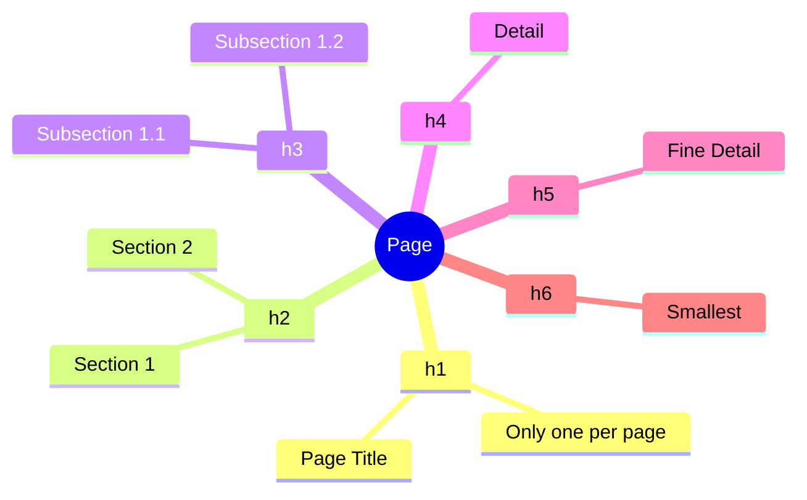
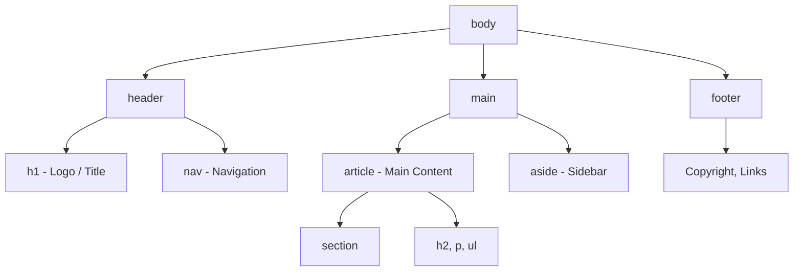

## Text and semantics

> **Connection with the previous lesson:** in the last lesson we assembled the HTML document "skeleton" (`<!DOCTYPE>`, `<html>`, `<head>`, `<body>`) and even briefly used `<h1>` and `<p>`. Today we fill `<body>` with real text content and learn to give the document a semantic structure.

---

## What you will learn by the end of the lesson

- Properly structure text with headings `h1`–`h6` and paragraphs `p`.
- Highlight text with semantic emphasis (`strong`, `em`) and understand how this differs from simple visual highlighting (`b`, `i`).
- Build unordered, ordered, and description lists (`ul`, `ol`, `dl`).
- Understand what semantic markup is and use `header`, `nav`, `main`, `section`, `article`, `aside`, `footer` tags instead of a "soup" of `<div>`s.
- Assemble a meaningful structure for an entire page from these blocks.

---

## Lesson timeline

| Block                                        | Content                                      |
| -------------------------------------------- | -------------------------------------------- |
| 1. Headings h1–h6                            | Hierarchy, analogy with a book's table of contents |
| 2. Paragraphs and line breaks: p, br, hr     | Difference between a paragraph and a break   |
| 3. Text accents: strong/em/mark/small        | Meaning vs visuals, outdated b/i             |
| 4. Lists: ul, ol, dl                         | Three types of lists and their usage         |
| 5. Mini-assignment                           | Build a list on your own                     |
| 6. Semantic tags                             | header/nav/main/section/article/aside/footer |
| 7. Summary and practical assignment          | Building an entire page's structure          |

---

## Block 1. Headings h1-h6

**In simple terms:** imagine you are writing a book. The book has a title (the biggest and most important - there's only one), then chapters, then sections within chapters, then subsections. Headings in HTML work exactly the same way - they're not just "large bold text," but a **hierarchy of meaning**.

In HTML there are six heading levels: from `<h1>` (most important, "book title") to `<h6>` (smallest, "subsection of a subsection").

```html
<h1>Page title (usually only one per page)</h1>
<h2>Major section</h2>
<h3>Subsection within h2</h3>
<h4>Even smaller subsection</h4>
<h5>Very small heading</h6>
<h6>Smallest heading</h6>
```

**Important rule:** there must be **only one** `<h1>` on a page - it is the main heading, analogous to the book title. The other levels (`h2`–`h6`) can be used as many times as needed, but **you cannot skip levels** - for example, going from `<h2>` directly to `<h4>` without `<h3>`. It's like in a book's table of contents: "Chapter 2" can't suddenly be followed by "Section 2.1.1" without an intermediate "Section 2.1."

**Why this matters, and isn't just "for looks":** headings are not just about visual text size. Screen readers (programs for visually impaired users - more on this in lesson 8 about accessibility) build a "map" of the page from headings and let the user jump between sections immediately. If you use `<h3>` just because "smaller text is needed," not because it's actually a subsection - you'll break this map for someone who relies on it.



---

## Block 2. Paragraphs and line breaks: p, br, hr

### `<p>` - paragraph

The `<p>` (paragraph) tag wraps a single block of meaningful text - the same as a paragraph in a book.

```html
<p>This is the first paragraph of text. It can contain as many sentences as needed.</p>
<p>And this is the second, separate paragraph - the browser will automatically add vertical spacing between them.</p>
```

### `<br>` - line break

An unpaired tag (as we covered in lesson 1 - no closing tag) that simply moves text to a new line **within a single block of content**, without creating a new paragraph.

```html
<p>
    10 Lenin Street<br>
    Almaty City<br>
    Uzbekistan
</p>
```

**When to use:** only in cases where a line break is meaningful - postal addresses, poetry, song lyrics. **Do not use `<br>` to create spacing between paragraphs** - for that, `<p>` exists, and spacing between elements is CSS's job (lesson 9 and beyond).

### `<hr>` - horizontal rule

Also an unpaired tag. Indicates a thematic break - a change of topic within text (for example, transitioning to a new topic in an article).

```html
<p>The first part of an article about the history of HTML.</p>
<hr>
<p>The second part of the article - about modern standards.</p>
```

---

### Common beginner mistakes

| Mistake                                                                                          | How to fix                                                                                      |
| ------------------------------------------------------------------------------------------------ | ----------------------------------------------------------------------------------------------- |
| Using several `<br>` in a row to simulate paragraph spacing: `Text<br><br><br>Text`               | Separate paragraphs with `<p>` tags, adjust spacing via CSS later                               |
| Wrapping all page text in a single `<p>` and using `<br>` for line breaks                        | Each meaningful paragraph is a separate `<p>` tag                                               |
| Using `<h1>` multiple times on a page as "just large text"                                       | There is only one `<h1>` on a page - use `<h2>` and below for other large headings              |
| Skipping heading levels (`h2` -> `h4`)                                                           | Follow the sequence: `h2` -> `h3` -> `h4`, no "skipping"                                       |

---

## Block 3. Text accents: strong, em, mark, small

The key principle to understand here is: **HTML describes meaning, not how text should look visually.** This is what distinguishes the modern approach from the old one.

### `<strong>` - importance (not just "bold")

```html
<p><strong>Attention:</strong> save the file before starting work.</p>
```

The browser will display text inside `<strong>` as bold by default - but the tag's meaning is not "make it bold," but "this is important, don't miss it." A screen reader may even pronounce this text with special emphasis.

### `<em>` - semantic emphasis (not just "italic")

```html
<p>I <em>really</em> need to finish this project today.</p>
```

Displays as italic by default, but the meaning is "this word receives logical emphasis," as if you were saying the sentence aloud and stressing that word with your voice.

###  Outdated tags: `<b>` and `<i>`

Previously, `<b>` (bold - just bold font with no meaning) and `<i>` (italic - just italic with no meaning) were used. **They still "work" in browsers, but are not recommended**, because:

- they describe only appearance, not meaning;
- screen readers don't treat them as something important - just regular text;
- if you later decide to change the visual styling via CSS, `<strong>` and `<em>` can be styled meaningfully, while `<b>`/`<i>` are a dead end that communicates nothing about the content.

**The rule is simple:** if text is semantically important - use `<strong>`. If you just need to visually make text bold without semantic importance (which is rare) - that's a job for CSS, not an HTML tag.

### `<mark>` - highlight marker

```html
<p>The report found <mark>three critical errors</mark> that need to be fixed.</p>
```

Analogy: as if you took a yellow marker and highlighted a line in a paper text - not because it's "important on its own," but because it's currently relevant (for example, a search result on the page).

### `<small>` - small text (notes, disclaimers)

```html
<p>Course price - 500,000 sum.</p>
<p><small>Price is valid at the time of publication and may change.</small></p>
```

Used for footnotes, copyright notices, legal disclaimers - things that are less important than the main text, but still need to be shown.

---

###  Common beginner mistakes

| Mistake                                                                | How to fix                                                                                              |
| ---------------------------------------------------------------------- | ------------------------------------------------------------------------------------------------------- |
| Using `<b>`/`<i>` instead of `<strong>`/`<em>`                         | Switch to `<strong>` (importance) and `<em>` (emphasis) - they carry meaning, not just appearance        |
| Wrapping an entire paragraph in `<strong>`                             | Only highlight genuinely important words/phrases, not all the text                                       |
| Using `<mark>` instead of `<strong>` for general importance highlighting | `<mark>` is "relevance highlighting" (e.g., a search match), not general text importance               |

---

## Block 4. Lists: ul, ol, dl

### `<ul>` - unordered list

Used when the order of elements doesn't matter.

```html
<ul>
    <li>HTML - structure</li>
    <li>CSS - styling</li>
    <li>JavaScript - behavior</li>
</ul>
```

Each list item is wrapped in an `<li>` (list item) tag - and `<li>` can only appear inside `<ul>` or `<ol>`, it cannot be used on its own.

### `<ol>` - ordered list

Used when order matters - for example, step-by-step instructions.

```html
<ol>
    <li>Open VS Code</li>
    <li>Create the file index.html</li>
    <li>Write the document structure</li>
    <li>Save and open in the browser</li>
</ol>
```

**Analogy:** `<ul>` is a shopping list (it doesn't matter which order you put milk and bread in the cart), while `<ol>` is a recipe (you can't "mix the ingredients" before "chopping them" if the recipe requires a different order).

### `<dl>` - description list

Used for "term - definition" pairs, for example, a glossary.

```html
<dl>
    <dt>HTML</dt>
    <dd>A markup language for creating the structure of web pages</dd>

    <dt>CSS</dt>
    <dd>A style language for styling the appearance of pages</dd>
</dl>
```

Here `<dt>` (definition term) is the term, and `<dd>` (definition description) is its definition. A single `<dt>` can have multiple `<dd>`s.

### Nested lists

Lists can be nested inside each other - for example, sub-items within an item:

```html
<ul>
    <li>Frontend
        <ul>
            <li>HTML</li>
            <li>CSS</li>
            <li>JavaScript</li>
        </ul>
    </li>
    <li>Backend
        <ul>
            <li>PHP</li>
            <li>MySQL</li>
        </ul>
    </li>
</ul>
```

Notice: the nested `<ul>` is **inside** the parent list's `<li>` tag, not after it.

---

###  Common beginner mistakes

| Mistake                                                                 | How to fix                                                                    |
| ----------------------------------------------------------------------- | ----------------------------------------------------------------------------- |
| Using `<li>` without a `<ul>`/`<ol>` wrapper                            | `<li>` must always be inside `<ul>` or `<ol>`                                 |
| Using `<ol>` where order doesn't matter (e.g., a shopping list)         | Use `<ol>` for ordered, `<ul>` for arbitrary sets                             |
| Placing a list after `<li>` instead of inside it                        | Nested lists must be inside the `<li>` tag, before its `</li>` closing        |
| Forgetting to close each `<li>`                                         | Each list item is a paired tag, don't forget `</li>`                          |

---

## Mini-assignment

Build a three-step ordered list for "How to make tea" on your own, without peeking at the examples above.

**Solution:**

```html
<ol>
    <li>Boil water</li>
    <li>Put a tea bag in the cup</li>
    <li>Pour boiling water and wait 3 minutes</li>
</ol>
```

---

## Block 6. Semantic tags: header, nav, main, section, article, aside, footer

**In simple terms:** so far we've talked about text inside a page. Now let's talk about how to break the **page itself** into meaningful major blocks - like rooms in a house have different purposes (kitchen, bedroom, living room) rather than being one large shapeless space.

Previously (and still in many old projects), web pages were built with endless `<div>` tags with no semantic meaning - this is called **"<div> soup"**: `<div class="header"><div class="nav">...`. The problem is that `<div>` is a "faceless box" - the browser and screen reader don't understand what's inside: whether it's navigation, or the site footer, or the main content.

**Semantic tags solve this problem** - they are named so that the tag's name makes the block's purpose clear.

### `<header>` - page or section header

```html
<header>
    <h1>My travel blog</h1>
    <p>Notes from around the world</p>
</header>
```

Usually contains a logo, site name, sometimes navigation.

### `<nav>` - navigation

```html
<nav>
    <ul>
        <li><a href="/">Home</a></li>
        <li><a href="/about">About</a></li>
        <li><a href="/contact">Contact</a></li>
    </ul>
</nav>
```

_(We'll discuss the `<a>` tag and links in detail in lesson 3 - for now we're just using it as an illustrative menu example.)_

### `<main>` - main page content

```html
<main>
    <h2>Recent posts</h2>
    <p>This is the main content of the page...</p>
</main>
```

**Important rule:** there must be **only one** `<main>` on a page - it is the content the user came to the page for (without the header, menu, and footer).

### `<section>` - thematic section

```html
<section>
    <h2>About the course</h2>
    <p>This course will help you learn web design from scratch...</p>
</section>
```

Used to group content united by a single topic - usually `<section>` has its own heading.

### `<article>` - standalone, independent content

```html
<article>
    <h2>How I learned to code</h2>
    <p>Three years ago I decided to try...</p>
</article>
```

**How to distinguish `<article>` from `<section>`:** "can this block make sense on its own, outside the context of the rest of the page, for example, if you extracted it and published it separately?" A blog post, a news item, a user comment - that's `<article>`. An "About us" on the homepage that doesn't make sense without the rest of the site - that's `<section>`.

### `<aside>` - additional, secondary information

```html
<aside>
    <h3>Related articles</h3>
    <ul>
        <li><a href="#">CSS Basics</a></li>
        <li><a href="#">Introduction to JavaScript</a></li>
    </ul>
</aside>
```

Analogy: like a sidebar in a newspaper with "also read" - interesting, but not the main content of the article.

### `<footer>` - page or section footer

```html
<footer>
    <p><small>&copy; 2026 My blog. All rights reserved.</small></p>
</footer>
```

Usually contains copyright, contact information, social media links.

### Putting it all together

```html
<body>
    <header>
        <h1>My travel blog</h1>
        <nav>
            <ul>
                <li><a href="/">Home</a></li>
                <li><a href="/about">About</a></li>
            </ul>
        </nav>
    </header>

    <main>
        <article>
            <h2>Trip to Samarkand</h2>
            <p>Last month I visited Samarkand...</p>
        </article>

        <aside>
            <h3>Related posts</h3>
            <ul>
                <li><a href="#">Trip to Bukhara</a></li>
            </ul>
        </aside>
    </main>

    <footer>
        <p><small>&copy; 2026 My blog.</small></p>
    </footer>
</body>
```

Notice the structure: `<header>` and `<footer>` are on the outside, `<main>` is the only one on the page and contains the main content, `<article>` and `<aside>` are inside `<main>`.

**Important:** semantic tags are **not a complete replacement** for `<div>`. `<div>` is still used when no semantic value fits the block (for example, just a wrapper for CSS styling). But if a block has a clear semantic purpose - prefer the semantic tag.



---

###  Common beginner mistakes

| Mistake                                                                 | How to fix                                                                                                                                           |
| ----------------------------------------------------------------------- | ---------------------------------------------------------------------------------------------------------------------------------------------------- |
| Using multiple `<main>` on a single page                                | `<main>` - only one per page                                                                                                                         |
| Wrapping clearly header/footer/navigation content in `<div>`            | Use `<header>`, `<footer>`, `<nav>` - they carry meaning for browsers and screen readers                                                             |
| Confusing `<section>` and `<article>`                                   | Ask yourself: "does this block make sense apart from the rest of the page?" If yes - `<article>`, if no - `<section>`                                |
| Putting `<nav>` inside every small list of links                        | `<nav>` is intended for the site's **main** navigation, not for any set of links (for example, links within an article don't need to be wrapped in `<nav>`) |

---

## Lesson summary

Today you learned:

- Headings `<h1>`–`<h6>` build the page's meaning hierarchy - like a book's table of contents, with a single `<h1>` and no level "skipping."
- `<p>` is a paragraph, `<br>` is a line break within a paragraph, `<hr>` is a thematic break.
- `<strong>` and `<em>` convey semantic importance and emphasis - unlike the outdated `<b>`/`<i>`, which only change appearance without meaning.
- Three types of lists: `<ul>` (order doesn't matter), `<ol>` (order matters), `<dl>` (term - definition).
- Semantic tags (`header`, `nav`, `main`, `section`, `article`, `aside`, `footer`) replace "<div> soup" and make the page structure understandable to browsers, search engines, and screen readers.

➡ **Next lesson:** [Links and navigation](../../Lesson-3/en/Links%20and%20navigation.md)
