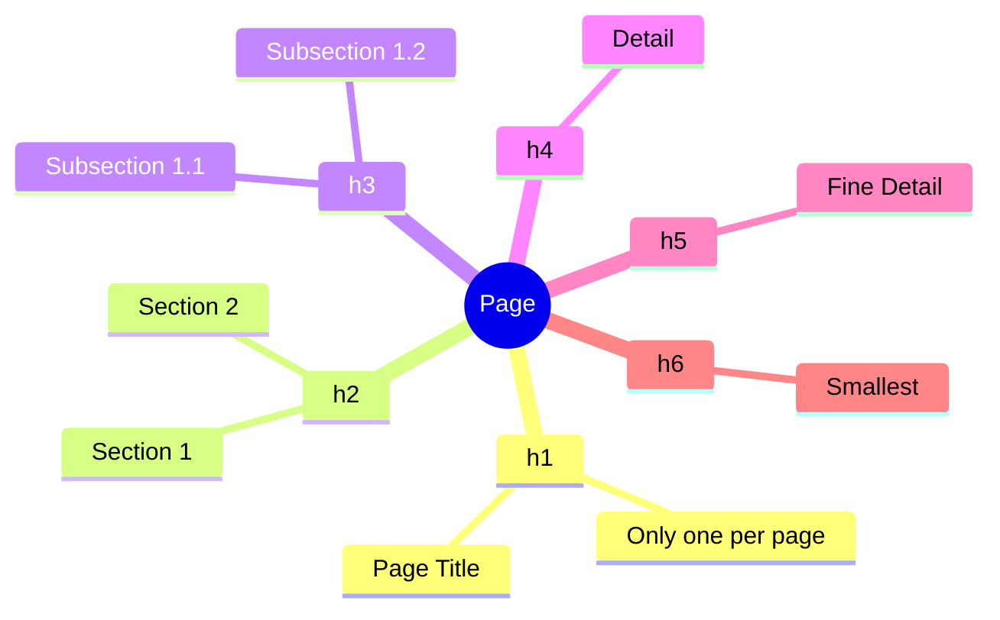
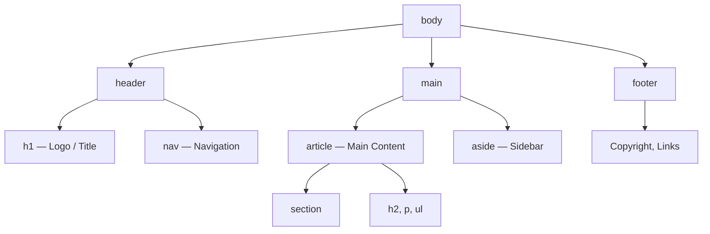

## Текст и семантика

> **Связь с предыдущим уроком:** на прошлом уроке мы собрали "скелет" HTML-документа (`<!DOCTYPE>`, `<html>`, `<head>`, `<body>`) и уже мельком использовали `<h1>` и `<p>`. Сегодня наполняем `<body>` настоящим текстовым содержимым и учимся придавать документу смысловую структуру.

---

## Чему вы научитесь к концу урока

- Правильно структурировать текст заголовками `h1`–`h6` и абзацами `p`.
- Выделять текст смысловым акцентом (`strong`, `em`) и понимать, чем это отличается от простого визуального выделения (`b`, `i`).
- Строить маркированные, нумерованные и списки-определения (`ul`, `ol`, `dl`).
- Понимать, что такое семантическая вёрстка, и использовать теги `header`, `nav`, `main`, `section`, `article`, `aside`, `footer` вместо "супа" из `<div>`.
- Собирать из этих блоков осмысленную структуру целой страницы.

---

## Хронометраж урока

| Блок                                       | Содержание                                   |
| ------------------------------------------ | -------------------------------------------- |
| 1. Заголовки h1–h6                         | Иерархия, аналогия с оглавлением книги       |
| 2. Абзацы и перенос строк: p, br, hr       | Разница между абзацем и переносом            |
| 3. Текстовые акценты: strong/em/mark/small | Смысл vs визуал, устаревшие b/i              |
| 4. Списки: ul, ol, dl                      | Три типа списков и их применение             |
| 5. Мини-задание                            | Собрать список самостоятельно                |
| 6. Семантические теги                      | header/nav/main/section/article/aside/footer |
| 7. Итоги и практическое задание            | Собираем структуру целой страницы            |

---

## Блок 1. Заголовки h1-h6

**Простыми словами:** представьте, что вы пишете книгу. У книги есть название (самое крупное и важное — оно одно), потом главы, потом разделы внутри глав, потом подразделы. Заголовки в HTML работают точно так же — это не просто "крупный жирный текст", а **иерархия смысла**.

В HTML шесть уровней заголовков: от `<h1>` (самый важный, "название книги") до `<h6>` (самый мелкий, "подраздел подраздела").

```html
<h1>Название страницы (обычно только один на странице)</h1>
<h2>Крупный раздел</h2>
<h3>Подраздел внутри h2</h3>
<h4>Ещё более мелкий подраздел</h4>
<h5>Совсем мелкий заголовок</h5>
<h6>Самый мелкий заголовок</h6>
```

**Важное правило:** на странице должен быть **только один** `<h1>`  это её главный заголовок, аналог названия книги. Остальные уровни (`h2`–`h6`) можно использовать сколько угодно раз, но **нельзя перепрыгивать уровни** - например, идти от `<h2>` сразу к `<h4>`, минуя `<h3>`. Это как в оглавлении книги: не может "Глава 2" внезапно смениться "Разделом 2.1.1" без промежуточного "Раздела 2.1".

**Почему это важно, а не просто "для красоты":** заголовки - это не только визуальный размер текста. Скринридеры (программы для незрячих пользователей - подробнее в уроке 8 про доступность) строят по заголовкам "карту" страницы и позволяют пользователю сразу перепрыгивать между разделами. Если использовать `<h3>` только потому, что "нужен текст поменьше", а не потому что это действительно подраздел - вы сломаете эту карту для человека, который ею пользуется.



---

## Блок 2. Абзацы и переносы: p, br, hr

### `<p>` - абзац

Тег `<p>` (paragraph) оборачивает один смысловой блок текста - то же самое, что абзац в книге.

```html
<p>Это первый абзац текста. Здесь может быть сколько угодно предложений.</p>
<p>А это уже второй, отдельный абзац — между ними браузер автоматически добавит вертикальный отступ.</p>
```

### `<br>` - перенос строки

Непарный тег (как мы разобрали в уроке 1 - без закрывающего тега), который просто переносит текст на новую строку **внутри одного смыслового блока**, без создания нового абзаца.

```html
<p>
    ул. Ленина, д. 10<br>
    г. Алмалык<br>
    Узбекистан
</p>
```

**Когда использовать:** только для случаев, где перенос строки важен по смыслу - почтовый адрес, стихотворение, строки песни. **Не используйте `<br>` для создания отступов между абзацами** - для этого существует `<p>`, а расстояния между элементами - задача CSS (урок 9 и далее).

### `<hr>` - горизонтальная линия

Тоже непарный тег. Обозначает тематический разрыв - смену темы внутри текста (например, переход к новой теме статьи).

```html
<p>Первая часть статьи про историю HTML.</p>
<hr>
<p>Вторая часть статьи — уже про современные стандарты.</p>
```

---

### Частые ошибки новичков

| Ошибка                                                                                           | Как исправить                                                                               |
| ------------------------------------------------------------------------------------------------ | ------------------------------------------------------------------------------------------- |
| Используют несколько `<br>` подряд для имитации отступа между абзацами: `Текст<br><br><br>Текст` | Разделяйте абзацы тегами `<p>`, а расстояние настраивайте через CSS позже                   |
| Оборачивают весь текст страницы в один `<p>`, а переносы делают через `<br>`                     | Каждый смысловой абзац — отдельный тег `<p>`                                                |
| Используют `<h1>` несколько раз на странице как "просто крупный текст"                           | На странице только один `<h1>` - для остальных крупных заголовков используйте `<h2>` и ниже |
| Пропускают уровни заголовков (`h2` -> `h4`)                                                      | Соблюдайте последовательность: `h2` -> `h3` -> `h4`, без "перепрыгиваний"                   |

---

## Блок 3. Текстовые акценты: strong, em, mark, small

Здесь важно понять главный принцип этого блока: **HTML описывает смысл, а не то, как текст должен выглядеть визуально.** Это отличает современный подход от старого.

### `<strong>` - важность (а не просто "жирный")

```html
<p><strong>Внимание:</strong> перед началом работы сохраните файл.</p>
```

Браузер по умолчанию отобразит текст внутри `<strong>` жирным — но смысл этого тега не "сделай жирным", а "это важно, не пропусти". Скринридер может даже произнести этот текст с особой интонацией.

### `<em>` - смысловое ударение (а не просто "курсив")

```html
<p>Я <em>действительно</em> должен закончить этот проект сегодня.</p>
```

По умолчанию отображается курсивом, но смысл — "на это слово падает логическое ударение", как если бы вы произносили фразу вслух и выделили это слово голосом.

###  Устаревшие теги: `<b>` и `<i>`

Раньше использовались теги `<b>` (bold - просто жирный шрифт без смысла) и `<i>` (italic - просто курсив без смысла). **Они всё ещё "работают" в браузерах, но не рекомендуются**, потому что:

- они описывают только внешний вид, а не смысл;
- скринридеры не воспринимают их как что-то важное - просто как обычный текст;
- если позже вы решите изменить визуальное оформление через CSS, `<strong>` и `<em>` можно стилизовать осмысленно, а `<b>`/`<i>` - это тупик, который ничего не сообщает о содержимом.

**Правило простое:** если текст важен по смыслу - используйте `<strong>`. Если нужно просто визуально сделать текст жирным без смысловой важности (что случается редко) - это задача для CSS, а не для HTML-тега.

### `<mark>` - выделение маркером

```html
<p>В отчёте нашли <mark>три критические ошибки</mark>, которые нужно исправить.</p>
```

Аналогия: как если бы вы взяли жёлтый маркер и подсветили строку в бумажном тексте — не потому что она "важная сама по себе", а потому что сейчас она релевантна (например, результат поиска на странице).

### `<small>` - мелкий текст (примечания, дисклеймеры)

```html
<p>Стоимость курса - 500 000 сум.</p>
<p><small>Цена актуальна на момент публикации и может измениться.</small></p>
```

Используется для сносок, копирайта, юридических примечаний - то, что менее важно, чем основной текст, но всё ещё нужно показать.

---

###  Частые ошибки новичков

| Ошибка                                                                | Как исправить                                                                                          |
| --------------------------------------------------------------------- | ------------------------------------------------------------------------------------------------------ |
| Используют `<b>`/`<i>` вместо `<strong>`/`<em>`                       | Переходите на `<strong>` (важность) и `<em>` (ударение) - они несут смысл, а не только внешний вид     |
| Оборачивают в `<strong>` весь абзац целиком                           | Выделяйте только действительно важные слова/фразы, а не весь текст                                     |
| Используют `<mark>` вместо `<strong>` для обычного выделения важности | `<mark>` - это "подсветка релевантности" (например, совпадение при поиске), а не общая важность текста |

---

## Блок 4. Списки: ul, ol, dl

### `<ul>` - маркированный список (unordered list)

Используется, когда порядок элементов не важен.

```html
<ul>
    <li>HTML — структура</li>
    <li>CSS — оформление</li>
    <li>JavaScript — поведение</li>
</ul>
```

Каждый пункт списка оборачивается в тег `<li>` (list item) - и `<li>` может находиться **только** внутри `<ul>` или `<ol>`, сам по себе он не используется.

### `<ol>` - нумерованный список (ordered list)

Используется, когда порядок важен - например, пошаговая инструкция.

```html
<ol>
    <li>Открыть VS Code</li>
    <li>Создать файл index.html</li>
    <li>Написать структуру документа</li>
    <li>Сохранить и открыть в браузере</li>
</ol>
```

**Аналогия:** `<ul>` - это список покупок (неважно, в каком порядке вы положите молоко и хлеб в корзину), а `<ol>` - это рецепт (нельзя "смешать ингредиенты" раньше, чем их "нарезать", если рецепт требует обратного порядка).

### `<dl>` - список определений (description list)

Используется для пар "термин - описание", например, глоссария.

```html
<dl>
    <dt>HTML</dt>
    <dd>Язык разметки для создания структуры веб-страниц</dd>

    <dt>CSS</dt>
    <dd>Язык стилей для оформления внешнего вида страниц</dd>
</dl>
```

Здесь `<dt>` (definition term) - это термин, а `<dd>` (definition description) - его описание. У одного `<dt>` может быть несколько `<dd>`.

### Вложенные списки

Списки можно вкладывать друг в друга - например, подпункты внутри пункта:

```html
<ul>
    <li>Frontend
        <ul>
            <li>HTML</li>
            <li>CSS</li>
            <li>JavaScript</li>
        </ul>
    </li>
    <li>Backend
        <ul>
            <li>PHP</li>
            <li>MySQL</li>
        </ul>
    </li>
</ul>
```

Обратите внимание: вложенный `<ul>` находится **внутри** `<li>` родительского списка, а не после него.

---

###  Частые ошибки новичков

| Ошибка                                                                 | Как исправить                                                            |
| ---------------------------------------------------------------------- | ------------------------------------------------------------------------ |
| Используют `<li>` без обёртки `<ul>`/`<ol>`                            | `<li>` всегда должен быть внутри `<ul>` или `<ol>`                       |
| Используют `<ol>` там, где порядок не важен (например, список покупок) | Для порядка используйте `<ol>`, для произвольного набора `<ul>`          |
| Вкладывают список после `<li>`, а не внутри него                       | Вложенный список должен быть внутри тега `<li>`, до его закрытия `</li>` |
| Забывают закрывать каждый `<li>`                                       | Каждый пункт списка - парный тег, не забывайте `</li>`                   |

---

## Мини-задание

Соберите нумерованный список из трёх шагов "Как заварить чай" самостоятельно, без подглядывания в примеры выше.

**Решение:**

```html
<ol>
    <li>Вскипятить воду</li>
    <li>Положить чайный пакетик в чашку</li>
    <li>Залить кипятком и подождать 3 минуты</li>
</ol>
```

---

## Блок 6. Семантические теги: header, nav, main, section, article, aside, footer

**Простыми словами:** до сих пор мы говорили про текст внутри страницы. Теперь поговорим про то, как разбить **саму страницу** на осмысленные крупные блоки - как комнаты в доме имеют разное назначение (кухня, спальня, гостиная), а не являются одним большим бесформенным пространством.

Раньше (и до сих пор во многих старых проектах) веб-страницы верстали через бесконечные `<div>` без всякого смысла - это называют **"div-супом"**: `<div class="header"><div class="nav">...`. Проблема в том, что `<div>` - это "безликая коробка", браузер и скринридер не понимают, что внутри - навигация это, или подвал сайта, или главный контент.

**Семантические теги решают эту проблему** - они называются так, что из самого имени тега понятно назначение блока.

### `<header>` - шапка страницы или раздела

```html
<header>
    <h1>Мой блог о путешествиях</h1>
    <p>Заметки из разных уголков мира</p>
</header>
```

Обычно содержит логотип, название сайта, иногда — навигацию.

### `<nav>` - навигация

```html
<nav>
    <ul>
        <li><a href="/">Главная</a></li>
        <li><a href="/about">О сайте</a></li>
        <li><a href="/contact">Контакты</a></li>
    </ul>
</nav>
```

_(Про тег `<a>` и ссылки подробно поговорим на уроке 3 — сейчас просто используем его для наглядного примера меню.)_

### `<main>` - основное содержимое страницы

```html
<main>
    <h2>Последние заметки</h2>
    <p>Здесь основной контент страницы...</p>
</main>
```

**Важное правило:** `<main>` должен быть **только один** на странице — это тот контент, ради которого пользователь пришёл на страницу (без шапки, меню и подвала).

### `<section>` - тематический раздел

```html
<section>
    <h2>О курсе</h2>
    <p>Этот курс поможет вам с нуля освоить вёрстку...</p>
</section>
```

Используется для группировки контента, объединённого одной темой - обычно у `<section>` есть свой заголовок.

### `<article>` - самостоятельный, независимый контент

```html
<article>
    <h2>Как я научился программировать</h2>
    <p>Три года назад я решил попробовать...</p>
</article>
```

**Как отличить `<article>` от `<section>`:**  "может ли этот блок иметь смысл сам по себе, вне контекста остальной страницы, например, если его вытащить и опубликовать отдельно?" Пост в блоге, новость, комментарий пользователя — это `<article>`. А "О нас" на главной странице сайта, которая не имеет смысла без остального сайта — это `<section>`.

### `<aside>` - дополнительная, второстепенная информация

```html
<aside>
    <h3>Похожие статьи</h3>
    <ul>
        <li><a href="#">Основы CSS</a></li>
        <li><a href="#">Введение в JavaScript</a></li>
    </ul>
</aside>
```

Аналогия: как боковая колонка в газете с "также читайте" - интересно, но не является основным содержанием статьи.

### `<footer>` - подвал страницы или раздела

```html
<footer>
    <p><small>&copy; 2026 Мой блог. Все права защищены.</small></p>
</footer>
```

Обычно содержит копирайт, контакты, ссылки на соцсети.

### Собираем всё вместе

```html
<body>
    <header>
        <h1>Мой блог о путешествиях</h1>
        <nav>
            <ul>
                <li><a href="/">Главная</a></li>
                <li><a href="/about">О сайте</a></li>
            </ul>
        </nav>
    </header>

    <main>
        <article>
            <h2>Поездка в Самарканд</h2>
            <p>В прошлом месяце я побывал в Самарканде...</p>
        </article>

        <aside>
            <h3>Похожие записи</h3>
            <ul>
                <li><a href="#">Поездка в Бухару</a></li>
            </ul>
        </aside>
    </main>

    <footer>
        <p><small>&copy; 2026 Мой блог.</small></p>
    </footer>
</body>
```

Обратите внимание на структуру: `<header>` и `<footer>` - снаружи, `<main>` - единственный на странице и содержит основной контент, `<article>` и `<aside>` - уже внутри `<main>`.

**Важно:** семантические теги - это **не замена** `<div>` полностью. `<div>` по-прежнему используется, когда блоку не подходит ни одно из семантических значений (например, просто обёртка для стилизации через CSS). Но если у блока есть явное смысловое назначение - предпочитайте семантический тег.



---

###  Частые ошибки новичков

| Ошибка                                                                 | Как исправить                                                                                                                                      |
| ---------------------------------------------------------------------- | -------------------------------------------------------------------------------------------------------------------------------------------------- |
| Используют несколько `<main>` на одной странице                        | `<main>` - только один на странице                                                                                                                 |
| Оборачивают в `<div>` то, что явно является шапкой/подвалом/навигацией | Используйте `<header>`, `<footer>`, `<nav>` - они несут смысл для браузера и скринридеров                                                          |
| Путают `<section>` и `<article>`                                       | Спросите себя: "имеет ли смысл этот блок отдельно от остальной страницы?" Если да - `<article>`, если нет  `<section>`                             |
| Кладут `<nav>` внутрь каждого мелкого списка ссылок                    | `<nav>` предназначен для **основной** навигации сайта, не для любого набора ссылок (например, ссылки внутри статьи не нужно оборачивать в `<nav>`) |

---

## Итоги урока

Сегодня вы узнали:

- Заголовки `<h1>`–`<h6>` строят иерархию смысла страницы - как оглавление книги, с единственным `<h1>` и без "перепрыгивания" уровней.
- `<p>`  абзац, `<br>`  перенос строки внутри абзаца, `<hr>`  тематический разрыв.
- `<strong>` и `<em>` передают смысловую важность и ударение — в отличие от устаревших `<b>`/`<i>`, которые только меняют внешний вид без смысла.
- Три вида списков: `<ul>` (порядок неважен), `<ol>` (порядок важен), `<dl>` (термин - описание).
- Семантические теги (`header`, `nav`, `main`, `section`, `article`, `aside`, `footer`) заменяют "div-суп" и делают структуру страницы понятной браузеру, поисковикам и скринридерам.

➡ **Следующий урок:** [Ссылки и навигация](../../Lesson-3/ru/Ссылки%20и%20навигация.md)
