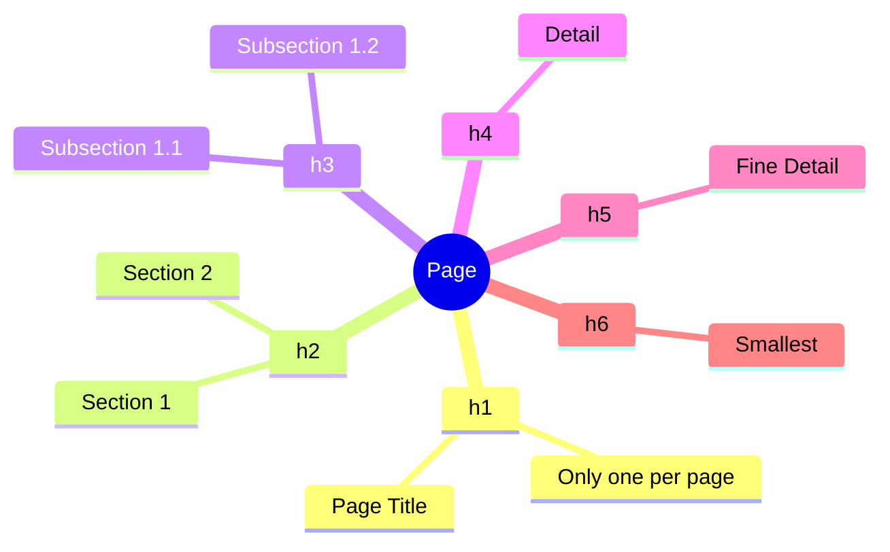
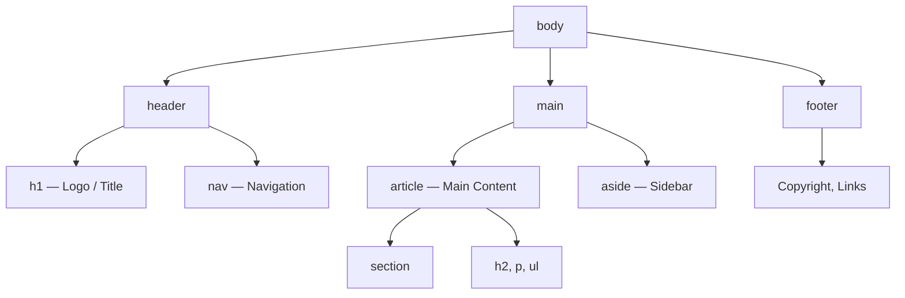

## Matn va semantika

> **Oldingi dars bilan bog'lanish:** o'tgan darsda biz HTML-hujjatning "skeletini" yig'dik (`<!DOCTYPE>`, `<html>`, `<head>`, `<body>`) va allaqachon qisqacha `<h1>` va `<p>` ishlatdik. Bugun `<body>` ni haqiqiy matn mazmuni bilan to'ldiramiz va hujjatga mazmun tuzilishini berishni o'rganamiz.

---

## Dars oxirida nimani o'rganasiz

- Matnni `h1`–`h6` sarlavhalar va `p` abzatslari bilan to'g'ri tizimlashtirish.
- Matnga mazmun aksentini (`strong`, `em`) qo'yish va bu oddiy vizual ajratishdan (`b`, `i`) qanday farq qilishini tushunish.
- Belgilangan, raqamlangan va ta'riflar ro'yxatlarini (`ul`, `ol`, `dl`) tuzish.
- Semantik veb-dizayn nima ekanligini tushunish va `<div>` "shorbasi" o'rniga `header`, `nav`, `main`, `section`, `article`, `aside`, `footer` teglarini ishlatish.
- Shu bloklardan butun sahifaning mazmunli tuzilishini yig'ish.

---

## Dars vaqti

| Blok                                          | Mazmun                                       |
| --------------------------------------------- | -------------------------------------------- |
| 1. Sarlavhalar h1–h6                          | Ierarxiya, kitob mundarjasiga o'xshatish     |
| 2. Abzatslar va satr o'tkazish: p, br, hr     | Abzats va satr o'tkazish orasidagi farq       |
| 3. Matn aksentlari: strong/em/mark/small      | Mazmun vs vizual, eski b/i                   |
| 4. Ro'yxatlar: ul, ol, dl                     | Uch xil ro'yxat va ularning qo'llanilishi     |
| 5. Mini-vazifa                                | Ro'yxatni mustaqil yig'ish                   |
| 6. Semantik teglar                            | header/nav/main/section/article/aside/footer |
| 7. Xulosalar va amaliy vazifa                 | Butun sahifaning tuzilishini yig'amiz        |

---

## 1-blok. Sarlavhalar h1-h6

**Oddiy qilib aytganda:** tasavvur qiling, siz kitob yozayapsiz. Kitobning nomi bor (eng katta va muhimi — u bitta), keyin boblar, keyin boblar ichidagi bo'limlar, keyin bo'limlardagi pastki bo'limlar. HTML'dagi sarlavhalar aynan shunday ishlaydi — bu oddiy "katta qalin matn" emas, bu **mazmun ierarxiyasi**.

HTML'da bitta sarlavha darajasi bor: `<h1>` (eng muhim, "kitob nomi") dan `<h6>` (eng kichik, "pastki bo'limning pastki bo'limi") gacha.

```html
<h1>Sahifa nomi (odatda sahifada faqat bitta)</h1>
<h2>Katta bo'lim</h2>
<h3>h2 ichidagi pastki bo'lim</h3>
<h4>Yana kichikroq pastki bo'lim</h4>
<h5>Juda kichik sarlavha</h5>
<h6>Eng kichik sarlavha</h6>
```

**Muhim qoida:** sahifada **faqat bitta** `<h1>` bo'lishi kerak — bu uning asosiy sarlavhasi, kitob nomining o'rnini bosadi. Qolgan darajalarni (`h2`–`h6`) istalgancha ishlatish mumkin, lekin **darajalar o'tib ketish mumkin emas** — masalan, `<h2>` dan darhol `<h4>` ga o'tish, `<h3>` ni chetlab o'tish. Bu kitob mundarjasidagidek: "2-bob" to'satda "2.1.1-bo'lim" ga aylanib ketolmaydi, orada "2.1-bo'lim" bo'lmasdan.

**Nima uchun bu muhim, "chiroy uchun" emas:** sarlavhalar faqat matnning vizual o'lchami emas. Ekran o'quvchilari (ko'zi ojizlar uchun dasturlar — bu haqida 8-darda batafsil) sarlavhalar bo'yicha sahifaning "xaritasini" quradi va foydalanuvchiga darhol bo'limlar orasida o'tish imkonini beradi. Agar `<h3>` ni faqat "kichikroq matn kerak" degan sababga ko'ra ishlatsangiz, haqiqatan ham pastki bo'lim bo'lmagan holda — bu xaritani foydalanuvchi uchun buzasiz.



---

## 2-blok. Abzatslar va satr o'tkazishlar: p, br, hr

### `<p>` — abzats

`<p>` (paragraph) tegi bitta mazmun matn blokini o'rab oladi — kitobdagi abzats bilan bir xil.

```html
<p>Bu matnning birinchi abzatsi. Bu yerda istalgancha gap bo'lishi mumkin.</p>
<p>Bu esa ikkinchi, alohida abzats — ularning orasida brauzer avtomatik ravishda vertikal bo'shliq qo'shadi.</p>
```

### `<br>` — satr o'tkazish

Juft bo'lmagan teg (1-darsda tahlil qilgandek — yopuvchisi yo'q), u oddiygina matnni yangi satrga o'tkazadi **bitta mazmun bloki ichida**, yangi abzats yaratmasdan.

```html
<p>
    Lenina ko'chasi, 10-uy<br>
    Almati shahri<br>
    O'zbekiston
</p>
```

**Qachon ishlatish:** faqat satr o'tkazish mazmunan muhim bo'lgan hollarda — pochta manzili, she'riyat, qo'shiq satrlari. **Abzatslar orasidagi bo'shliq yaratish uchun `<br>` ishlatmang** — buning uchun `<p>` mavjud, elementlar orasidagi masofa esa CSS vazifasi (9-dars va keyin).

### `<hr>` — gorizontal chiziq

Shuningdek juft bo'lmagan teg. Tematik ajratishni bildiradi — matn ichida mavzuning o'zgarishini (masalan, maqolaning yangi mavzusiga o'tish).

```html
<p>HTML tarixi haqida maqolaning birinchi qismi.</p>
<hr>
<p>Maqolaning ikkinchi qismi — allaqachon zamonaviy standartlar haqida.</p>
```

---

### Yangi boshlovchilarning ko'p uchraydigan xatolari

| Xato                                                                                           | Qanday tuzatish                                                                              |
| ------------------------------------------------------------------------------------------------ | --------------------------------------------------------------------------------------------- |
| Abzatslar orasidagi bo'shliqni taqlid qilish uchun bir nechta `<br>` ni ketma-ket ishlatish: `Matn<br><br><br>Matn` | Abzatslarni `<p>` teglari bilan ajrating, masofani keyin CSS orqali sozlang                  |
| Sahifaning barcha matnini bitta `<p>` ga o'rab olish va `<br>` orqali satr o'tkazish              | Har bir mazmun abzatsi — alohida `<p>` tegi                                                  |
| `<h1>` ni sahifada bir necha marta "faqat katta matn" sifatida ishlatish                         | Sahifada faqat bitta `<h1>` — qolgan katta sarlavhalar uchun `<h2>` va undan pastrog'ini ishlating |
| Sarlavha darajalarini o'tkazib yuborish (`h2` -> `h4`)                                           | Ketma-ketlikni saqlang: `h2` -> `h3` -> `h4`, "o'tib ketishlarsiz"                             |

---

## 3-blok. Matn aksentlari: strong, em, mark, small

Bu yerda asosiy tamoyilni tushunish muhim: **HTML mazmunni tasvirlaydi, matn vizual ko'rinishini emas.** Bu zamonaviy yondashuvni eskidan ajratadi.

### `<strong>` — muhimlik (faqat "qalin" emas)

```html
<p><strong>E'tibor:</strong> ishni boshlashdan oldin faylni saqlang.</p>
```

Brauzer `<strong>` ichidagi matnni standart ravishda qalin ko'rsatadi — lekin bu tegning ma'nosi "qil qalin" emas, "bu muhim, o'tkazib yuborma". Ekran o'quvchisi bu matnni hatto alohida ohangda o'qishi mumkin.

### `<em>` — mazmun aksenti (faqat " kursiv" emas)

```html
<p>Men bu loyihani bugun <em>haqiqatan ham</em> tugatishim kerak.</p>
```

Standart ravishda kursiv ko'rsatiladi, lekin ma'no — "shu so'zga mantiqiy aksent tushadi", siz jumlani ovoz chiqarib aytganingizda shu so'zni ovoz bilan ajratgandek.

###  Eskirgan teglar: `<b>` va `<i>

Oldin `<b>` (bold — oddiy qalin shrift, ma'nosiz) va `<i>` (italic — oddiy kursiv, ma'nosiz) teglari ishlatilgan. **Ular brauzerlarda hali "ishlaydi", lekin tavsiya etilmaydi**, chunki:

- ular faqat tashqi ko'rinishni, ma'noni emas tasvirlaydi;
- ekran o'quvchilari ularni muhim narsa sifatida qabul qilmaydi — oddiy matn sifatida;
- keyin vizual ko'rinishni CSS orqali o'zgartirishga qaror qilsangiz, `<strong>` va `<em>` ma'noni saqlagan holda stilizatsiya qilinishi mumkin, `<b>`/`<i>` esa hech narsa aytmaydigan yo'q yo'l.

**Qoida oddiy:** agar matn mazmunan muhim bo'lsa — `<strong>` ishlating. Agar oddiy vizual qilish kerak bo'lsa, ma'nomuhimlik holda (bu kamdan-kam hokiz) — bu CSS vazifasi, HTML-teg emas.

### `<mark>` — marker bilan belgilash

```html
<p>Hisobotda <uchta jiddiy xato</mark> topildi, ular tuzatilishi kerak.</p>
```

Taqqoslash: siz sariq marker olib, qog'oz matndagi satrni yoritgandek — u "o'zi o'zi muhim" uchun emas, hozir tegishli bo'lgani uchun (masalan, sahifadagi qidiruv natijasi).

### `<small>` — kichik matn (eslatmalar, ogohlantirishlar)

```html
<p>Kurs narxi — 500 000 so'm.</p>
<p><small>Narx nashr etilgan paytda dolzarb va o'zgarishi mumkin.</small></p>
```

Izohlar, mualliflik huquqi, huquqiy eslatmalar uchun ishlatiladi — asosiy matndan kamroq muhim, lekin ko'rsatilishi kerak bo'lgan narsa.

---

###  Yangi boshlovchilarning ko'p uchraydigan xatolari

| Xato                                                                 | Qanday tuzatish                                                                                         |
| -------------------------------------------------------------------- | ------------------------------------------------------------------------------------------------------- |
| `<strong>`/`<em>` o'rniga `<b>`/`<i>` ishlatish                      | `<strong>` (muhimlik) va `<em>` (aksent) ga o'ting — ular ma'noni olib yuradi, faqat tashqi ko'rinishni emas |
| Butun abzatsni `<strong>` ga o'rab olish                             | Faqat haqiqatan muhim so'zlarni/iboralarni ajrating, butun matnni emas                                  |
| Oddiy muhimlik belgilash uchun `<strong>` o'rniga `<mark>` ishlatish | `<mark>` — "tegishlilikni yoritish" (masalan, qidiruvda moslik), umumiy matn muhimligi emas              |

---

## 4-blok. Ro'yxatlar: ul, ol, dl

### `<ul>` — belgilangan ro'yxat (unordered list)

Elementlar tartibi muhim bo'lmagan hollarda ishlatiladi.

```html
<ul>
    <li>HTML — tuzilish</li>
    <li>CSS — bezatish</li>
    <li>JavaScript — xatti-harakat</li>
</ul>
```

Har bir ro'yxat elementi `<li>` (list item) tegiga o'raladi — va `<li>` faqat `<ul>` yoki `<ol>` ichida bo'lishi mumkin, o'zi mustaqil ishlatilmaydi.

### `<ol>` — raqamlangan ro'yxat (ordered list)

Tartibi muhim bo'lgan hollarda ishlatiladi — masalan, bosqichma-bosqich ko'rsatma.

```html
<ol>
    <li>VS Code ochish</li>
    <li>index.html faylini yaratish</li>
    <li>Hujjat tuzilishini yozish</li>
    <li>Saqlash va brauzerda ochish</li>
</ol>
```

**Taqqoslash:** `<ul>` — bu xaridorlik ro'yxati (siz sut va noni qaysi tartibda savatga qo'ysangiz ham farqi yo'q), `<ol>` esa retsept (retsept teskari tartibni talab qilmagan holda, "ingredientlarni aralashtirish" ularni "to'g'rab olish" dan oldin bo'lishi mumkin emas).

### `<dl>` — ta'riflar ro'yxati (description list)

"Atama — ta'rif" juftliklari uchun ishlatiladi, masalan, lu'zariy.

```html
<dl>
    <dt>HTML</dt>
    <dd>Veb-sahifalar tuzilishini yaratish uchun belgilash tili</dd>

    <dt>CSS</dt>
    <dd>Sahifalar tashqi ko'rinishini bezatish uchun uslublar tili</dd>
</dl>
```

Bu yerda `<dt>` (definition term) — bu atama, `<dd>` (definition description) esa uning ta'rifi. Bitta `<dt>` ning bir nechta `<dd>` si bo'lishi mumkin.

### Ichki ro'yxatlar

Ro'yxatlarni bir-biriga ichki qilib joylashtirish mumkin — masalan, biror element ichidagi pastki elementlar:

```html
<ul>
    <li>Frontend
        <ul>
            <li>HTML</li>
            <li>CSS</li>
            <li>JavaScript</li>
        </ul>
    </li>
    <li>Backend
        <ul>
            <li>PHP</li>
            <li>MySQL</li>
        </ul>
    </li>
</ul>
```

E'tibor bering: ichki `<ul>` ota-ona ro'yxatining `<li>` tegi **ichida** joylashgan, uning ortida emas.

---

###  Yangi boshlovchilarning ko'p uchraydigan xatolari

| Xato                                                                  | Qanday tuzatish                                                           |
| --------------------------------------------------------------------- | ------------------------------------------------------------------------- |
| `<ul>`/`<ol>` ga o'ramasdan `<li>` ishlatish                          | `<li>` doimo `<ul>` yoki `<ol>` ichida bo'lishi kerak                     |
| Tartibi muhim bo'lmagan hollarda `<ol>` ishlatish (masalan, xaridorlik ro'yxati) | Tartib uchun `<ol>`, ixtiyoriy to'plam uchun `<ul>` ishlating             |
| Ro'yxatni `<li>` dan keyin, uning ichida emas, joylashtirish           | Ichki ro'yxat `<li>` tegi ichida, uni yopishdan `</li>` oldin bo'lishi kerak |
| Har bir `<li>` ni yopishni unutish                                    | Har bir ro'yxat elementi juft teg, `</li>` ni unutmang                     |

---

## Mini-vazifa

"Qanday qilib choy damlash" bo'yicha uch qadamdan iborat raqamlangan ro'yxatni yuqoridagi misollarga qaramasdan mustaqil yarating.

**Yechim:**

```html
<ol>
    <li>Suvni qaynatish</li>
    <li>Choy paketini stakanga solish</li>
    <li>Qaynagan suv quyib 3 daqiqa kutish</li>
</ol>
```

---

## 6-blok. Semantik teglar: header, nav, main, section, article, aside, footer

**Oddiy qilib aytganda:** biz haligacha sahifa ichidagi matn haqida gaplashdik. Endi **o'z sahifani** ma'noni ifodalovchi katta bloklarga qanday bo'lishishini gaplashamiz — xonadagi xonalar turli maqsadga ega (oshxona, yotoq xonasi, mehmonxona) va katta shaklsiz makon emas.

Oldin (va hali ham ko'p eski loyihalarda) veb-sahifalar mazmunsiz cheksiz `<div>` lar orqali dizayn qilingan — bu **"<div> shorbasi"** deb ataladi: `<div class="header"><div class="nav">...`. Muammo shundaki, `<div>` — bu "nomsiz quti", brauzer va ekran o'quvchisi uning ichidagini tushunmaydi — navigatsiya mi, sayt pastqami, yoki asosiy kontentmi.

**Semantik teglar shu muammoni hal qiladi** — ular o'z nomi blokning maqsadini tushunarli qiladigan tarzda nomlangan.

### `<header>` — sahifa yoki bo'limning tepa qismi

```html
<header>
    <h1>Mening sayohatlar blogim</h1>
    <p>Dunyoning turli burchaklaridan eslatmalar</p>
</header>
```

Odatda logo, sayt nomi, ba'zan — navigatsiyani o'z ichiga oladi.

### `<nav>` — navigatsiya

```html
<nav>
    <ul>
        <li><a href="/">Bosh sahifa</a></li>
        <li><a href="/about">Sayt haqida</a></li>
        <li><a href="/contact">Aloqa</a></li>
    </ul>
</nav>
```

_(`<a>` tegi va havolalar haqida 3-darsda batafsil gaplashamiz — hozir faqat menyuning vizual misoli sifatida ishlatamiz.)_

### `<main>` — sahifaning asosiy mazmuni

```html
<main>
    <h2>So'nggi eslatmalar</h2>
    <p>Bu yerda sahifaning asosiy kontenti...</p>
</main>
```

**Muhim qoida:** `<main>` sahifada **faqat bitta** bo'lishi kerak — bu foydalanuvchi sahifaga kelgan kontent (tepa qismi, menyu va pastqasiz).

### `<section>` — tematik bo'lim

```html
<section>
    <h2>Kurs haqida</h2>
    <p>Bu kurs sizga noldan veb-dizaynni o'rganishga yordam beradi...</p>
</section>
```

Bitta tema birlashtirilgan kontentni guruhlash uchun ishlatiladi — odatda `<section>` ning o'z sarlavhasi bo'ladi.

### `<article>` — mustaqil, mustaqil kontent

```html
<article>
    <h2>Men qanday qilib dasturlashni o'rgandim</h2>
    <p>Uch yil oldin men sinab ko'rishga qaror qildim...</p>
</article>
```

**`<article>` ni `<section>` dan qanday ajratish mumkin:** "bu blok qolgan sahifa kontekstisiz, o'zi o'zi ma'nolimi, masalan, uni ajratib alohida nashr qilsa?" Blogdagi post, yangilik, foydalanuvchi izohi — bu `<article>`. Bosh sahifadagi "Biz haqimizda" sahifaning qolgan qismisiz ma'nosiz bo'lsa — bu `<section>`.

### `<aside>` — qo'shimcha, ikkinchi darajali ma'lumot

```html
<aside>
    <h3>O'xshash maqolalar</h3>
    <ul>
        <li><a href="#">CSS asoslari</a></li>
        <li><a href="#">JavaScript ga kirish</a></li>
    </ul>
</aside>
```

Taqqoslash: gazetaning yon ustunidagi "shuningdek o'qing" — qiziq, lekin maqolaning asosiy mazmuni emas.

### `<footer>` — sahifa yoki bo'limning pastki qismi

```html
<footer>
    <p><small>&copy; 2026 Mening blogim. Barcha huquqlar himoyalangan.</small></p>
</footer>
```

Odatda mualliflik huquqini, aloqa ma'lumotlarini, ijtimoiy tarmoqlarga havolalarni o'z ichiga oladi.

### Hammasini birga yig'amiz

```html
<body>
    <header>
        <h1>Mening sayohatlar blogim</h1>
        <nav>
            <ul>
                <li><a href="/">Bosh sahifa</a></li>
                <li><a href="/about">Sayt haqida</a></li>
            </ul>
        </nav>
    </header>

    <main>
        <article>
            <h2>Samarqandga sayohat</h2>
            <p>O'tgan oy men Samarqandda bo'ldim...</p>
        </article>

        <aside>
            <h3>O'xshash yozuvlar</h3>
            <ul>
                <li><a href="#">Buxoroga sayohat</a></li>
            </ul>
        </aside>
    </main>

    <footer>
        <p><small>&copy; 2026 Mening blogim.</small></p>
    </footer>
</body>
```

Tuzilishga e'tibor bering: `<header>` va `<footer>` tashqarida, `<main>` sahifada bitta va asosiy kontentni o'z ichiga oladi, `<article>` va `<aside>` allaqachon `<main>` ichida.

**Muhim:** semantik teglar `<div>` ning to'liq o'rnini bosmaydi. `<div>` hali ham qo'llaniladi, blokqa hech qanday semantik ma'no mos kelmasa (masalan, oddiy CSS stilizatsiya uchun o'ram). Lekin blokning aniq mazmunli maqsadi bo'lsa — semantik tegni afzal ko'ring.



---

###  Yangi boshlovchilarning ko'p uchraydigan xatolari

| Xato                                                                  | Qanday tuzatish                                                                                                                                     |
| --------------------------------------------------------------------- | --------------------------------------------------------------------------------------------------------------------------------------------------- |
| Bitta sahifada bir nechta `<main>` ishlatish                          | `<main>` — sahifada faqat bitta                                                                                                                     |
| Tepa qismi/pastqasi/navigatsiya ekanligi aniq bo'lgan narsani `<div>` ga o'rab olish | `<header>`, `<footer>`, `<nav>` ishlating — ular brauzer va ekran o'quvchilari uchun ma'noni olib yuradi                                              |
| `<section>` va `<article>` ni aralashtirish                            | O'zingizdan so'rang: "bu blok qolgan sahifasiz alohida ma'nolimi?" Ha bo'lsa — `<article>`, yo'q bo'lsa — `<section>`                                |
| Har bir kichik havolalar ro'yxatiga `<nav>` qo'yish                   | `<nav>` saytning **asosiy** navigatsiyasi uchun mo'ljallangan, har qanday havolalar to'plami uchun emas (masalan, maqola ichidagi havolalarni `<nav>` ga o'ramaslik kerak) |

---

## Dars xulosalari

Bugun siz quyidagilarni o'rgandingiz:

- Sarlavhalar `<h1>`–`<h6>` sahifaning mazmun ierarxiyasini quradi — kitob mundarjasidek, bitta `<h1>` bilan va darajalar "o'tib ketishlarsiz".
- `<p>` — abzats, `<br>` — abzats ichidagi satr o'tkazish, `<hr>` — tematik ajratish.
- `<strong>` va `<em>` mazmun muhimligini va aksentni ifodalaydi — eskirgan `<b>`/`<i>` dan farqli o'laroq, ular faqat tashqi ko'rinishni o'zgartiradi, ma'noni emas.
- Uch xil ro'yxat: `<ul>` (tartib muhim emas), `<ol>` (tartib muhim), `<dl>` (atama — ta'rif).
- Semantik teglar (`header`, `nav`, `main`, `section`, `article`, `aside`, `footer`) "<div> shorbasini" almashtiradi va sahifa tuzilishini brauzer, qidiruv tizimlari va ekran o'quvchilari uchun tushunarli qiladi.

➡ **Keyingi dars:** [Havolalar va navigatsiya](../../Lesson-3/uz/Havolalar%20va%20navigatsiya.md)
