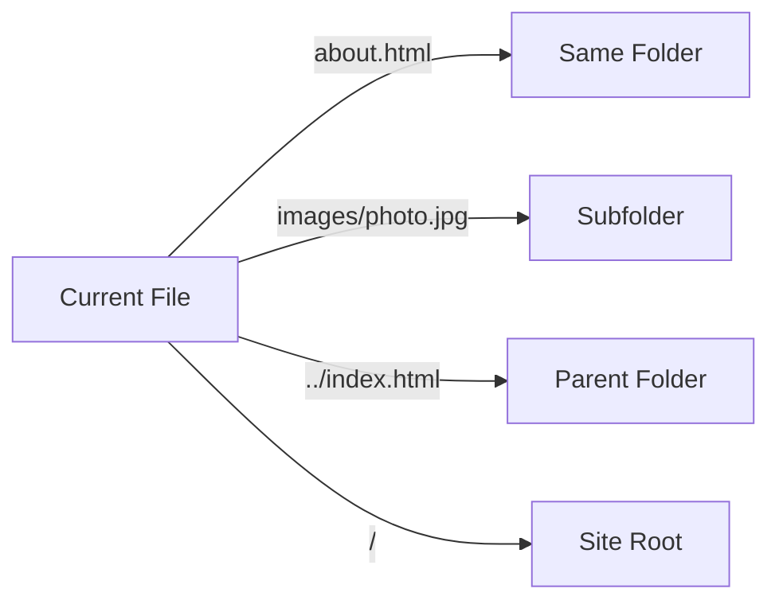
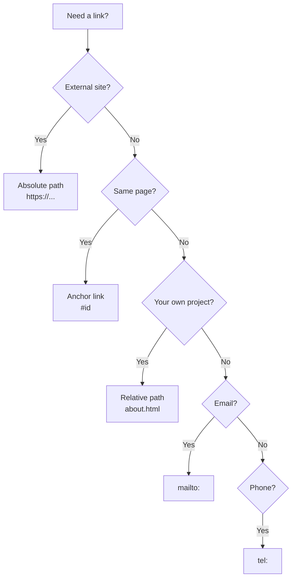

## Links and navigation

> **Connection with the previous lesson:** in the last lesson we learned to structure text and used the `<nav>` tag with placeholder links `href="#"`. Today we understand how links actually work — and connect several HTML pages into a single website.

---

## What you will learn by the end of the lesson

- Create links with the `<a>` tag and understand the `href` attribute.
- Distinguish between absolute and relative paths and know when to use which.
- Open links in a new tab using `target="_blank"`.
- Create anchor links — jumps to a specific place on the page.
- Make links for email and phone (`mailto:`, `tel:`).
- Build a multi-page website with consistent navigation from several HTML pages.

---

## Lesson timeline

| Block                                | Content                                        |
| ------------------------------------ | ---------------------------------------------- |
| 1. The `<a>` tag and `href` attribute | Basic link syntax                              |
| 2. Absolute and relative paths       | The difference, when to use which, folder structure |
| 3. target="_blank"                   | Opening in a new tab, security                 |
| 4. Anchor links                      | Jumping to a page section, id                  |
| 5. mailto and tel                    | Links for email and phone                      |
| 6. Mini-assignment                   | Build a link on your own                       |
| 7. Multi-page website                | Building 3 pages with consistent navigation    |
| 8. Summary and practical assignment  | Reinforcement                                  |

---

## Block 1. The `<a>` tag and `href` attribute

**In simple terms:** imagine a book that says "for more about this, see page 42." A link in HTML is the same thing, except instead of "page 42" you specify the address of another web page (or another place on the same page), and the transition happens with a single click.

The `<a>` tag (anchor) is a paired tag that wraps text (or an image — covered in lesson 4), turning it into a clickable link.

```html
<a href="https://www.google.com">Go to Google</a>
```

Here:

- `<a>` — the link tag
- `href` (hypertext reference) — an attribute indicating where the link leads — a **required** attribute, without it `<a>` won't function as a link
- `Go to Google` — the visible link text the user clicks on

**Analogy:** `<a>` is a door, and `href` is the address that door leads to. Without an address, the door is just painted on the wall and doesn't open anywhere.

---

## Block 2. Absolute and relative paths

This is the key topic of the lesson — many beginners get confused right here.

### Absolute path

**Absolute path** is the full address, including the protocol (`https://`) and domain. Used for links to **external** websites — meaning not to pages of your own project.

```html
<a href="https://www.wikipedia.org">Wikipedia</a>
<a href="https://github.com/Saydullayev017">My GitHub</a>
```

**Analogy:** an absolute path is a full postal address with city and country: "Uzbekistan, Tashkent, Amir Temur Street, 10." It's unambiguously understandable from any point in the world.

### Relative path

**Relative path** is an address specified **relative to the current file**. Used for links to **your own** pages within a single project.

**Analogy:** a relative path is like telling a neighbor "go two houses down" — only understandable if you're already standing near the starting point. If you're in another city, this instruction loses meaning — but a full address works from anywhere.

Let's break it down using a project structure example:

```
html-course/
├── index.html
├── about.html
├── contact.html
└── images/
    └── photo.jpg
```

**Link to a file in the same folder:**

```html
<a href="about.html">About</a>
```

Just the file name — the browser looks for it next to the current file.

**Link to a file in a nested folder:**

```html
<a href="images/photo.jpg">View photo</a>
```

**Link to a file in a folder one level up** (if you're inside `images/` and want to link to `index.html`):

```html
<a href="../index.html">Home</a>
```

`../` means "go up one level" — like stepping out of a room into a hallway.

**Link to the site root/main page:**

```html
<a href="/">Home</a>
```

A leading slash means "site root" — if you have a site like `mysite.uz`, the `/` link will go to `mysite.uz`, not to an adjacent file.



### When to use which

| Situation                                                 | Which path |
| --------------------------------------------------------- | ---------- |
| Link to another page of your own project                  | Relative   |
| Link to an external site (social media, Wikipedia, another site) | Absolute   |
| Link to an image within your project                      | Relative   |

**Why this matters:** if you use absolute paths for your own pages (for example, `href="https://mysite.ru/about.html"` instead of `href="about.html"`) — the site will stop working correctly during local development (before it's published online under that domain) and will complicate migrating the project to another domain or hosting.



---

### Common beginner mistakes

| Mistake                                                                                | How to fix                                                                                                            |
| -------------------------------------------------------------------------------------- | --------------------------------------------------------------------------------------------------------------------- |
| Using absolute paths for your own pages: `href="https://mysite.ru/about.html"`         | Use relative paths for pages within your project: `href="about.html"`                                                  |
| Confusing `/about.html` (from site root) and `about.html` (from current folder)        | Remember: a leading slash means "from site root," without a slash means "from current file"                            |
| Forgetting the `.html` extension in the link: `href="about"`                           | Specify the full file name with the extension: `href="about.html"`                                                     |
| Getting the file name case wrong: `href="About.html"` instead of `about.html`          | On most servers (especially Linux/GitHub Pages), case matters — the link name must exactly match the file name         |

---

## Block 3. `target="_blank"` — opening in a new tab

By default, a link opens in the same window/tab, replacing the current page. If you want the page to open in a **new** tab (for example, when navigating to an external site, so the user doesn't lose your site) — use the `target="_blank"` attribute.

```html
<a href="https://github.com/Saydullayev017" target="_blank">My GitHub</a>
```

**Important security note:** when you use `target="_blank"`, it's recommended to also add the `rel="noopener noreferrer"` attribute. Without it, the newly opened tab technically gains access to your original page's `window` object — this is a rare but known vulnerability.

```html
<a href="https://github.com/Saydullayev017" target="_blank" rel="noopener noreferrer">My GitHub</a>
```

**Usage rule:** use `target="_blank"` **only for external websites**. Don't open new tabs for links within your own site — it's unexpected for the user and clutters their browser with extra tabs.

---

## Block 4. Anchor links — jumping to a page section

Sometimes you don't need to navigate to another page, but rather move to a specific **place on the same (or different) page** — for example, to a particular section of a long article.

This is done in two steps.

**Step 1.** Give the element you want to jump to a unique identifier using the `id` attribute:

```html
<h2 id="section2">Section 2. Forms</h2>
```

**Step 2.** Create a link to that `id` by placing a hash symbol `#` before the name:

```html
<a href="#section2">Go to section 2</a>
```

When clicked, the browser will smoothly (or instantly, depending on settings) scroll the page to the element with `id="section2"`.

### Example: table of contents for a long article

```html
<nav>
    <h3>Contents</h3>
    <ul>
        <li><a href="#intro">Introduction</a></li>
        <li><a href="#history">History</a></li>
        <li><a href="#conclusion">Conclusion</a></li>
    </ul>
</nav>

<article>
    <h2 id="intro">Introduction</h2>
    <p>Introduction text...</p>

    <h2 id="history">History</h2>
    <p>History text...</p>

    <h2 id="conclusion">Conclusion</h2>
    <p>Concluding text...</p>
</article>
```

### Anchor link to a section on another page

Same principle, just specify the file first, then `#` and `id`:

```html
<a href="about.html#history">Company history</a>
```

This will open `about.html` and immediately scroll to the element with `id="history"`.

### Returning to the top of the page

A common pattern — a "back to top" link at the end of a long page:

```html
<a href="#top">Back to top ↑</a>
```

(Provided that somewhere at the top of the page there's an element with `id="top"`, for example `<body id="top">` or the first heading.)

**Important rule about `id`:** the `id` value must be **unique across the entire page** — there cannot be two elements with the same `id`. This distinguishes `id` from `class` (we'll discuss `class` in detail starting with the CSS lesson).

---

### Common beginner mistakes

| Mistake                                                                               | How to fix                                                                                                          |
| ------------------------------------------------------------------------------------- | ------------------------------------------------------------------------------------------------------------------- |
| Forgetting the `#` symbol before the name in the link: `href="section2"`             | For an anchor link on the same page, always write `href="#section2"`                                                |
| Using the same `id` for multiple elements                                            | Each `id` on the page must be unique                                                                                |
| Using spaces in the `id` value: `id="section 2"`                                     | The `id` value is written without spaces, typically `camelCase` or with a hyphen: `id="section2"` or `id="section-2"` |
| Confusing `id` (unique, for a single element) and `class` (for a group of elements, covered later) | Anchor links use `id`, not `class`                                                                                  |

---

## Block 5. Links for email and phone

### `mailto:` — open email client with a pre-filled recipient

```html
<a href="mailto:info@saydullayev.fun">Write us an email</a>
```

When clicked, the browser will open the default email application on the device (e.g., Outlook, Gmail) with the "To" field already filled in.

You can set the email subject right away:

```html
<a href="mailto:info@saydullayev.fun?subject=Question about the course">Write us an email</a>
```

### `tel:` — open the phone/calling app

```html
<a href="tel:+998901234567">+998 90 123-45-67</a>
```

Especially useful on mobile devices — when clicked, the phone will immediately offer to make a call to this number. It's recommended to provide the number in international format (with `+` and country code), without spaces or parentheses inside the `href` attribute itself — you can format it however you like in the visible link text.

---

### Common beginner mistakes

| Mistake                                                                            | How to fix                                                                                                       |
| ---------------------------------------------------------------------------------- | ---------------------------------------------------------------------------------------------------------------- |
| Forgetting `mailto:` and `tel:` before the address: `href="info@site.uz"`          | Always include the protocol: `href="mailto:info@site.uz"`                                                        |
| Including spaces in the phone number inside `href`: `href="tel:+998 90 123 45 67"` | Inside the attribute, write the number without spaces: `href="tel:+998901234567"` — format only in the visible text |

---

## Mini-assignment

On your own, without looking at the examples, create:

1. A link to the file `contact.html` in the same folder.
2. A link to the external site `https://developer.mozilla.org`, opening in a new tab, with security protection.
3. A call link for the number +998901112233.

**Solution:**

```html
<a href="contact.html">Contact</a>

<a href="https://developer.mozilla.org" target="_blank" rel="noopener noreferrer">MDN</a>

<a href="tel:+998901112233">+998 90 111-22-33</a>
```

---

## Block 7. Building a multi-page website with consistent navigation

Now let's apply all the link tags for what they were made for — connecting several pages into a single website. We'll create three pages: `index.html`, `about.html`, `contact.html` — with the same navigation menu on each.

Folder structure:

```
html-course/
├── index.html
├── about.html
└── contact.html
```

**The `index.html` file:**

```html
<!DOCTYPE html>
<html lang="ru">
<head>
    <meta charset="UTF-8">
    <title>Home — My Site</title>
</head>
<body>
    <header>
        <h1>My Learning Site</h1>
        <nav>
            <ul>
                <li><a href="index.html">Home</a></li>
                <li><a href="about.html">About</a></li>
                <li><a href="contact.html">Contact</a></li>
            </ul>
        </nav>
    </header>

    <main>
        <h2>Welcome!</h2>
        <p>This is the home page of my learning project, which I'm building in the "HTML: from A to Z" course.</p>
        <p>Want to learn more? Go to the <a href="about.html">"About"</a> section.</p>
    </main>

    <footer>
        <p><small>&copy; 2026 My Learning Site.</small></p>
    </footer>
</body>
</html>
```

**The `about.html` file:**

```html
<!DOCTYPE html>
<html lang="ru">
<head>
    <meta charset="UTF-8">
    <title>About — My Site</title>
</head>
<body>
    <header>
        <h1>My Learning Site</h1>
        <nav>
            <ul>
                <li><a href="index.html">Home</a></li>
                <li><a href="about.html">About</a></li>
                <li><a href="contact.html">Contact</a></li>
            </ul>
        </nav>
    </header>

    <main>
        <h2>About</h2>
        <p>I'm building this site as part of an HTML course to practically reinforce all the topics I've learned.</p>
        <p>You can view the project's source code on <a href="https://github.com" target="_blank" rel="noopener noreferrer">GitHub</a>.</p>
    </main>

    <footer>
        <p><small>&copy; 2026 My Learning Site.</small></p>
    </footer>
</body>
</html>
```

**The `contact.html` file:**

```html
<!DOCTYPE html>
<html lang="ru">
<head>
    <meta charset="UTF-8">
    <title>Contact — My Site</title>
</head>
<body>
    <header>
        <h1>My Learning Site</h1>
        <nav>
            <ul>
                <li><a href="index.html">Home</a></li>
                <li><a href="about.html">About</a></li>
                <li><a href="contact.html">Contact</a></li>
            </ul>
        </nav>
    </header>

    <main>
        <h2>Contact</h2>
        <p>Reach me using any convenient method:</p>
        <ul>
            <li>Email: <a href="mailto:info@saydullayev.fun">info@saydullayev.fun</a></li>
            <li>Phone: <a href="tel:+998901234567">+998 90 123-45-67</a></li>
        </ul>
    </main>

    <footer>
        <p><small>&copy; 2026 My Learning Site.</small></p>
    </footer>
</body>
</html>
```

**Try it yourself:** create all three files, open `index.html` via Live Server, and click through all the menu links — make sure the navigation works between all three pages in both directions.

Notice: the `<nav>` menu is **exactly the same** on all three pages — this is standard practice (in the future, when you learn more advanced technologies, repeating blocks can be extracted into a single file, but at the pure HTML level we just copy this block to each page for now).

---

## Lesson summary

Today you learned:

- The `<a>` tag with the required `href` attribute creates a link.
- Absolute path (with `https://`) — for external websites, relative path — for pages within your own project.
- `target="_blank"` (with `rel="noopener noreferrer"`) opens a link in a new tab — used only for external links.
- Anchor links (`href="#id"`) navigate to a specific place on the page via the `id` on the target element.
- `mailto:` and `tel:` create links for quickly sending an email or making a call.
- You built your first multi-page website with a unified navigation menu.
