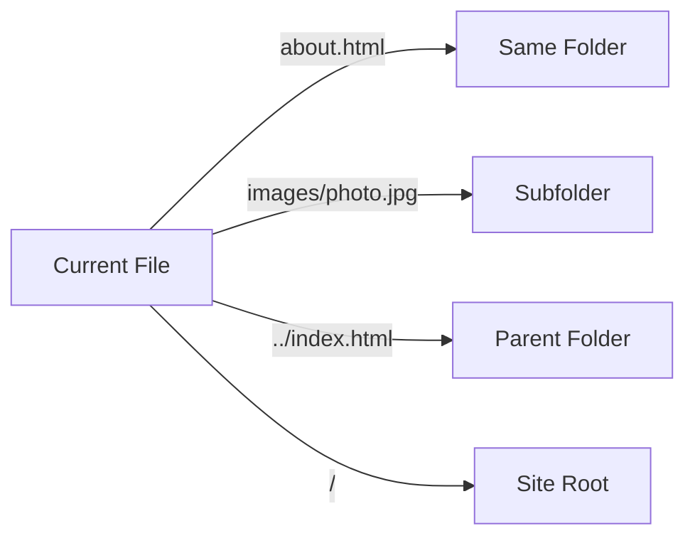
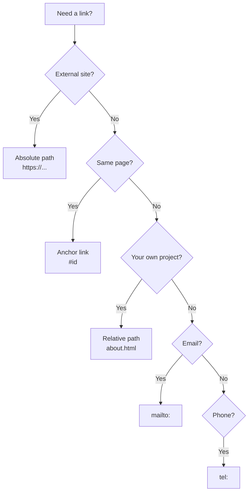

## Havolalar va navigatsiya

> **Oldingi dars bilan bog'lanish:** o'tgan darsda biz matnni tizimlashtirishni o'rgandik va `<nav>` tegini "qaltis" havolalar `href="#"` bilan ishlatdik. Bugun havolalar qanday haqiqatan ishlashini tushunamiz — va bir nechta HTML-sahifalarni bitta saytga bog'laymiz.

---

## Dars oxirida nimani o'rganasiz

- `<a>` tegi va `href` atributi bilan havolalar yaratish.
- Absolyut va nisbiy yo'llarni farqlash va qaysi holatda qaysini ishlatishni bilish.
- `target="_blank"` orqali havolalarni yangi yorliqda ochish.
- Ankor havolalarni yaratish — sahifaning ma'lum joyiga o'tish.
- Email va telefon uchun havolalar yaratish (`mailto:`, `tel:`).
- Bir nechta HTML-sahifalardan uzluksiz navigatsiyali sayt yig'ish.

---

## Dars vaqti

| Blok                                       | Mazmun                                        |
| ------------------------------------------ | --------------------------------------------- |
| 1. a tegi va href atributi                 | Havolaning asosiy sintaksisi                  |
| 2. Absolyut va nisbiy yo'llar              | Farq, qachon qaysini ishlatish, papka tuzilishi |
| 3. target="_blank"                         | Yangi yorliqda ochish, xavfsizlik             |
| 4. Ankor havolalar                          | Sahifaning bir qismiga o'tish, id             |
| 5. mailto va tel                            | Email va telefon uchun havolalar               |
| 6. Mini-vazifa                              | Havolani mustaqil yaratish                    |
| 7. Ko'p sahifali sayt                       | Uzluksiz menyu bilan 3 sahifani yig'amiz      |
| 8. Xulosalar va amaliy vazifa               | Mustahkamlash                                 |

---

## 1-blok. `<a>` tegi va `href` atributi

**Oddiy qilib aytganda:** tasavvur qiling, kitobda "batafsil bu haqida 42-sahifada o'qing" deb yozilgan. HTML'dagi havola — bu xuddi shu narsa, faqat "42-sahifa" o'rniga boshqa veb-sahifaning manzilini (yoki shu sahifaning boshqa joyini) ko'rsatasiz va o'tish bitta bosish bilan amalga oshadi.

`<a>` tegi (anchor — "yakor") — juft teg bo'lib, matnni (yoki rasmini — bu 4-darsda) o'rab, uni bosiladigan havolaga aylantiradi.

```html
<a href="https://www.google.com">Google ga o'tish</a>
```

Bu yerda:

- `<a>` — havola tegi
- `href` (hypertext reference) — havola qayerga borishini ko'rsatadigan atribut — **majburiy** atribut, usiz `<a>` havola sifatida ishlamaydi
- `Google ga o'tish` — foydalanuvchi bosadigan ko'rinadigan havola matni

**Taqqoslash:** `<a>` — bu eshik, `href` esa manzil, bu eshik qayerga borishini ko'rsatadi. Manzilsiz eshik shunchaki devorga chizilgan va hech qayerga ochilmaydi.

---

## 2-blok. Absolyut va nisbiy yo'llar

Bu darsning asosiy mavzusi — ko'pchilik yangi boshlovchilar aynan shu yerda adashadi.

### Absolyut yo'l

**Absolyut yo'l** — bu to'liq manzil, protokol (`https://`) va domen bilan birga. **Tashqi** saytlarga havolalar uchun ishlatiladi — ya'ni shaxsiy loyihangizning sahifalariga emas.

```html
<a href="https://www.wikipedia.org">Vikipediya</a>
<a href="https://github.com/Saydullayev017">Mening GitHub</a>
```

**Taqqoslash:** absolyut yo'l — bu shahar va mamlakat bilan to'liq pochta manzili: "O'zbekiston, Toshkent shahri, Amir Temur ko'chasi, 10-uy". U dunyoning istalgan nuqtasidan aniq tushunarli.

### Nisbiy yo'l

**Nisbiy yo'l** — bu **joriy faylga nisbatan** ko'rsatilgan manzil. Bitta loyiha ichidagi **o'z** sahifalaringizga havolalar uchun ishlatiladi.

**Taqqoslash:** nisbiy yo'l — bu qo'shniga "ikkita uy nariga boring" deb aytishga o'xshaydi — bu faqat boshlang'ich nuqtada turgan bo'lsangiz tushunarli. Agar boshqa shaharda bo'lsangiz, bu ko'rsatma ma'nosini yo'qotadi — lekin to'liq manzil istalgan joydan ishlaydi.

Loyiha tuzilishi misolida tushunamiz:

```
html-course/
├── index.html
├── about.html
├── contact.html
└── images/
    └── photo.jpg
```

**Bitta papkadagi faylga havola:**

```html
<a href="about.html">Sayt haqida</a>
```

Faylning oddiy nomi — brauzer uni joriy fayl yonida qidiradi.

**Ichki papkadagi faylga havola:**

```html
<a href="images/photo.jpg">Rasmini ko'rish</a>
```

**Yuqoridagi papkadagi faylga havola** (agar siz masalan `images/` ichida bo'lsangiz va `index.html` ga havola qo'ymoqchi bo'lsangiz):

```html
<a href="../index.html">Bosh sahifaga</a>
```

`../` "bir daraja yuqoriga ko'tarilish" degan ma'noni anglatadi — xonadan koridorga chiqishdek.

**Saytning o'z papkasiga/bosh sahifasiga havola:**

```html
<a href="/">Bosh sahifaga</a>
```

Boshidagi slesh "sayt ildizi" degan ma'noni anglatadi — agar sizda masalan `mysite.uz` sayti bo'lsa, `/` havolasi `mysite.uz` ga olib boradi, yonidagi faylga emas.



### Qachon qaysini ishlatish

|Holat|Qaysi yo'l|
|---|---|
|O'z loyihangizdagi boshqa sahifaga havola|Nisbiy|
|Tashqi saytga havola (ijtimoiy tarmoq, Vikipediya, boshqa sayt)|Absolyut|
|Loyihangizdagi rasmga havola|Nisbiy|

**Nima uchun bu muhim:** agar o'z sahifalaringiz uchun absolyut yo'ldan foydalansangiz (masalan, `href="https://mysite.ru/about.html"` o'rniga `href="about.html"`) — sayt lokal ravishda ishlab chiqish paytida to'g'ri ishlashni to'xtatadi (u hali internetda shu domen ostida nashr etilmagan) va loyihani boshqa domen yoki hostingga ko'chirishni qiyinlashtiradi.



---

### Yangi boshlovchilarning ko'p uchraydigan xatolari

| Xato                                                                                  | Qanday tuzatish                                                                                                            |
| ------------------------------------------------------------------------------------- | -------------------------------------------------------------------------------------------------------------------------- |
| O'z sahifalari uchun absolyut yo'ldan foydalanish: `href="https://mysite.ru/about.html"` | Loyiha ichidagi sahifalar uchun nisbiy yo'ldan foydalaning: `href="about.html"`                                              |
| `/about.html` (sayt ildizidan) va `about.html` (joriy papkadani) ni aralashtirish       | Eslab qoling: boshidagi slesh "sayt ildizidan" degan ma'noni anglatadi, sleshsiz — "joriy fayldan"                           |
| Havolada `.html` kengaytmasini unutish: `href="about"`                                | To'liq fayl nomini kengaytma bilan ko'rsating: `href="about.html"`                                                         |
| Fayl nomidagi registrni noto'g'ri yozish: `href="About.html"` o'rniga `about.html`     | Ko'pchilik serverlarda (ayniqsa Linux/GitHub Pages) registr muhim — havola nomi fayl nomi bilan aniq mos kelishi kerak       |

---

## 3-blok. `target="_blank"` — yangi yorliqda ochish

Standart ravishda havola bir xil oynada/yorliqda ochiladi, joriy sahifani almashtiradi. Agar sahifa **yangi** yorliqda ochilishini xohlasangiz (masalan, tashqi saytga o'tishda, foydalanuvchi sizning saytingizni yo'qotmasligi uchun) — `target="_blank"` atributini ishlating.

```html
<a href="https://github.com/Saydullayev017" target="_blank">Mening GitHub</a>
```

**Xavfsizlik haqida muhim:** `target="_blank"` ishlatganingizda, qo'shimcha ravishda `rel="noopener noreferrer"` atributini qo'shish tavsiya etiladi. Usiz yangi ochilgan yorliq texnik jihatdan sizning asosiy sahifangizning `window` ob'ektiga kirish huquqiga ega bo'ladi — bu kamdan-kam, lekin ma'lum zaiflik.

```html
<a href="https://github.com/Saydullayev017" target="_blank" rel="noopener noreferrer">Mening GitHub</a>
```

**Qo'llanish qoidasi:** `target="_blank"` ni **faqat tashqi saytlar uchun** ishlating. O'z saytingizdagi havolalar uchun yangi yorliq ochmang — bu foydalanuvchi uchun kutilmagan va uning brauzerini ortiqcha yorliqlar bilan to'ldiradi.

---

## 4-blok. Ankor havolalar — sahifaning bir qismiga o'tish

Ba'zan boshqa sahifaga emas, balki shu (yoki boshqa) sahifaning ma'lum **joyiga** o'tish kerak — masalan, uzun maqolaning aniq bo'limiga.

Bu ikki qadamda amalga oshiriladi.

**1-qadam.** O'tmoqchi bo'lgan elementga `id` atributi orqali noyob identifikator berish:

```html
<h2 id="section2">2-bo'im. Shakllar</h2>
```

**2-qadam.** Shu `id` ga havola yaratish, nomdan oldin `#` belgisini qo'yish:

```html
<a href="#section2">2-bo'imga o'tish</a>
```

Bosganingizda brauzer silliq (yoki darhol, sozlamalarga qarab) sahifani `id="section2"` ga ega elementga buradi.

### Misol: uzun maqolaning mundarjasi

```html
<nav>
    <h3>Mundarija</h3>
    <ul>
        <li><a href="#intro">Kirish</a></li>
        <li><a href="#history">Tarix</a></li>
        <li><a href="#conclusion">Xulosa</a></li>
    </ul>
</nav>

<article>
    <h2 id="intro">Kirish</h2>
    <p>Kirish matni...</p>

    <h2 id="history">Tarix</h2>
    <p>Tarix haqida matn...</p>

    <h2 id="conclusion">Xulosa</h2>
    <p>Xulosa matni...</p>
</article>
```

### Boshqa sahifaning bo'limiga ankor havola

Xuddi shu tamoyil, faqat avval fayl ko'rsatiladi, keyin `#` va `id`:

```html
<a href="about.html#history">Kompaniya tarixi</a>
```

Bu `about.html` faylini ochadi va darhol `id="history"` ga ega elementga buradi.

### Sahifaning yuqorisiga qaytish

Ko'p ishlatiladigan usul — uzun sahifaning oxiridagi "yuqoriga" havola:

```html
<a href="#top">Yuqoriga ↑</a>
```

(Sahifaning boshida biror joyda `id="top"` ga ega element bor shartida, masalan `<body id="top">` yoki birinchi sarlavha.)

**`id` haqida muhim qoida:** `id` qiymati butun sahifada **noyob** bo'lishi kerak — bir xil `id` ga ega ikki element bo'lishi mumkin emas. Bu `id` ni `class` dan ajratadi (`class` haqida CSS darsidan batafsil gaplashamiz).

---

### Yangi boshlovchilarning ko'p uchraydigan xatolari

|Xato|Qanday tuzatish|
|---|---|
|Havolada nomdan oldin `#` belgisini unutish: `href="section2"`|Shu sahadagi ankor havolada har doim `href="#section2"` deb yozing|
|Bir nechta element uchun bir xil `id` ishlatish|Sahifadagi har bir `id` noyob bo'lishi kerak|
|`id` qiymatida bo'sh joy ishlatish: `id="section 2"`|`id` qiymati bo'sh joysiz yoziladi, odatda `camelCase` yoki defis bilan: `id="section2"` yoki `id="section-2"`|
|`id` (noyob, bitta element uchun) va `class` (elementlar guruhi uchun, keyinroq tahlil qilamiz) ni aralashtirish|Ankor havolalar uchun aynan `id` ishlatiladi, `class` emas|

---

## 5-blok. Email va telefon uchun havolalar

### `mailto:` — pochta dasturini to'ldirilgan manzil bilan ochish

```html
<a href="mailto:info@saydullayev.fun">Bizga xat yozish</a>
```

Bosganingizda brauzer qurilmaga o'rnatilgan pochta ilovasini (masalan, Outlook, Gmail) oldindan to'ldirilgan "Kimga" maydoni bilan ochadi.

Xat mavzusini darhol belgilash mumkin:

```html
<a href="mailto:info@saydullayev.fun?subject=Kurs haqida savol">Bizga xat yozish</a>
```

### `tel:` — qo'ng'iroq ilovasini ochish

```html
<a href="tel:+998901234567">+998 90 123-45-67</a>
```

Ayniqsa mobil qurilmalarda foydali — bosganingizda telefon darhol shu raqamga qo'ng'iroq qilishni taklif qiladi. Raqamni xalqaro formatda (va `+` va mamlakat kodi bilan) ko'rsatish tavsiya etiladi, `href` atributi ichida bo'sh joy va qavslarsiz — ko'rinadigan matnda esa istalgandek formatlash mumkin.

---

### Yangi boshlovchilarning ko'p uchraydigan xatolari

| Xato                                                                              | Qanday tuzatish                                                                                                    |
| --------------------------------------------------------------------------------- | ----------------------------------------------------------------------------------------------------------------- |
| Manzildan oldin `mailto:` va `tel:` ni unutish: `href="info@site.uz"`             | Har doim protokolni ko'rsating: `href="mailto:info@site.uz"`                                                      |
| `href` ichida bo'sh joy bilan telefon raqamini ko'rsatish: `href="tel:+998 90 123 45 67"` | Atribut ichida raqamni yig'ish shaklida yozing: `href="tel:+998901234567"` — formatlashni faqat ko'rinadigan matnda bajaring |

---

## Mini-vazifa

Mustaqil ravishda, misollarga qaramasdan yarating:

1. Bitta papkadagi `contact.html` fayliga havola.
2. `https://developer.mozilla.org` tashqi saytiga havola, yangi yorliqda ochilishi va xavfsizlik himoyasi bilan.
3. +998901112233 raqamiga qo'ng'iroq havolasi.

**Yechim:**

```html
<a href="contact.html">Aloqa</a>

<a href="https://developer.mozilla.org" target="_blank" rel="noopener noreferrer">MDN</a>

<a href="tel:+998901112233">+998 90 111-22-33</a>
```

---

## 7-blok. Uzluksiz navigatsiyali ko'p sahifali saytni yig'amiz

Endi barcha havola teglarini ular mavjud bo'lgan narsa uchun qo'llaymiz — bir nechta sahifani bitta saytga bog'laymiz. Uchta sahifa yaratamiz: `index.html`, `about.html`, `contact.html` — har birida bir xil navigatsiya menyusi.

Papka tuzilishi:

```
html-course/
├── index.html
├── about.html
└── contact.html
```

**`index.html` fayli:**

```html
<!DOCTYPE html>
<html lang="ru">
<head>
    <meta charset="UTF-8">
    <title>Bosh sahifa — Mening saytim</title>
</head>
<body>
    <header>
        <h1>Mening o'quv saytim</h1>
        <nav>
            <ul>
                <li><a href="index.html">Bosh sahifa</a></li>
                <li><a href="about.html">Sayt haqida</a></li>
                <li><a href="contact.html">Aloqa</a></li>
            </ul>
        </nav>
    </header>

    <main>
        <h2>Xush kelibsiz!</h2>
        <p>Bu mening o'quv loyihamning bosh sahifasi, men uni «HTML: A dan Z gacha» kursida yaratyapman.</p>
        <p>Ko'proq bilmoqchimisiz? <a href="about.html">«Sayt haqida»</a> bo'limiga o'ting.</p>
    </main>

    <footer>
        <p><small>&copy; 2026 Mening o'quv saytim.</small></p>
    </footer>
</body>
</html>
```

**`about.html` fayli:**

```html
<!DOCTYPE html>
<html lang="ru">
<head>
    <meta charset="UTF-8">
    <title>Sayt haqida — Mening saytim</title>
</head>
<body>
    <header>
        <h1>Mening o'quv saytim</h1>
        <nav>
            <ul>
                <li><a href="index.html">Bosh sahifa</a></li>
                <li><a href="about.html">Sayt haqida</a></li>
                <li><a href="contact.html">Aloqa</a></li>
            </ul>
        </nav>
    </header>

    <main>
        <h2>Sayt haqida</h2>
        <p>Bu saytni men HTML kursi doirasida amaliyotda barcha o'rganilgan mavzularni mustahkamlash uchun yaratyapman.</p>
        <p>Loyihaning manba kodini <a href="https://github.com" target="_blank" rel="noopener noreferrer">GitHub</a> da ko'rishingiz mumkin.</p>
    </main>

    <footer>
        <p><small>&copy; 2026 Mening o'quv saytim.</small></p>
    </footer>
</body>
</html>
```

**`contact.html` fayli:**

```html
<!DOCTYPE html>
<html lang="ru">
<head>
    <meta charset="UTF-8">
    <title>Aloqa — Mening saytim</title>
</head>
<body>
    <header>
        <h1>Mening o'quv saytim</h1>
        <nav>
            <ul>
                <li><a href="index.html">Bosh sahifa</a></li>
                <li><a href="about.html">Sayt haqida</a></li>
                <li><a href="contact.html">Aloqa</a></li>
            </ul>
        </nav>
    </header>

    <main>
        <h2>Aloqa</h2>
        <p>Menga qulay usulda bog'laning:</p>
        <ul>
            <li>Email: <a href="mailto:info@saydullayev.fun">info@saydullayev.fun</a></li>
            <li>Telefon: <a href="tel:+998901234567">+998 90 123-45-67</a></li>
        </ul>
    </main>

    <footer>
        <p><small>&copy; 2026 Mening o'quv saytim.</small></p>
    </footer>
</body>
</html>
```

**O'zingiz sinab ko'ring:** uchta faylni yarating, `index.html` ni Live Server orqali oching va menyudagi barcha havolalarni bosing — o'tishlar uchta sahifa orasida ikki tomonlama ishlashiga ishonch hosil qiling.

E'tibor bering: `<nav>` menyusi uchta sahifada **so'zma-so'z bir xil** — bu standart amaliyot (kelajakda ilg'or texnologiyalarni o'rganganingizda, takrorlanadigan bloklarni bitta faylga chiqarish mumkin bo'ladi, lekin toza HTML darajasida hozircha shu blokni har sahifaga nusxalaymiz).

---

## Dars xulosalari

Bugun siz quyidagilarni o'rgandingiz:

- `<a>` tegi majburiy `href` atributi bilan havolani yaratadi.
- Absolyut yo'l (`https://` bilan) — tashqi saytlar uchun, nisbiy yo'l — loyiha ichidagi sahifalar uchun.
- `target="_blank"` (`rel="noopener noreferrer"` bilan) havolani yangi yorliqda ochadi — faqat tashqi havolalar uchun ishlatiladi.
- Ankor havolalar (`href="#id"`) maqsad elementining `id`si orqali sahifaning ma'lum joyiga o'tkazadi.
- `mailto:` va `tel:` tez xat yuborish yoki qo'ng'iroq qilish uchun havolalar yaratadi.
- Siz birinchi navigatsiya menyusiga ega ko'p sahifali saytingizni yig'diz.
