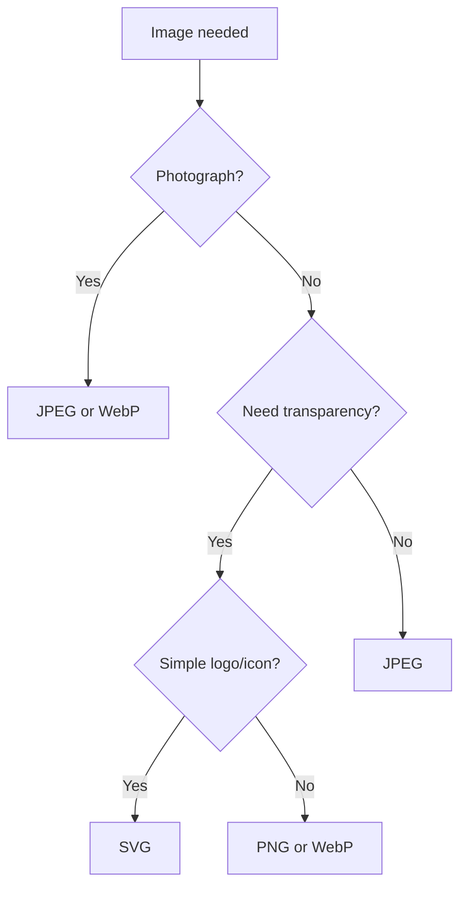
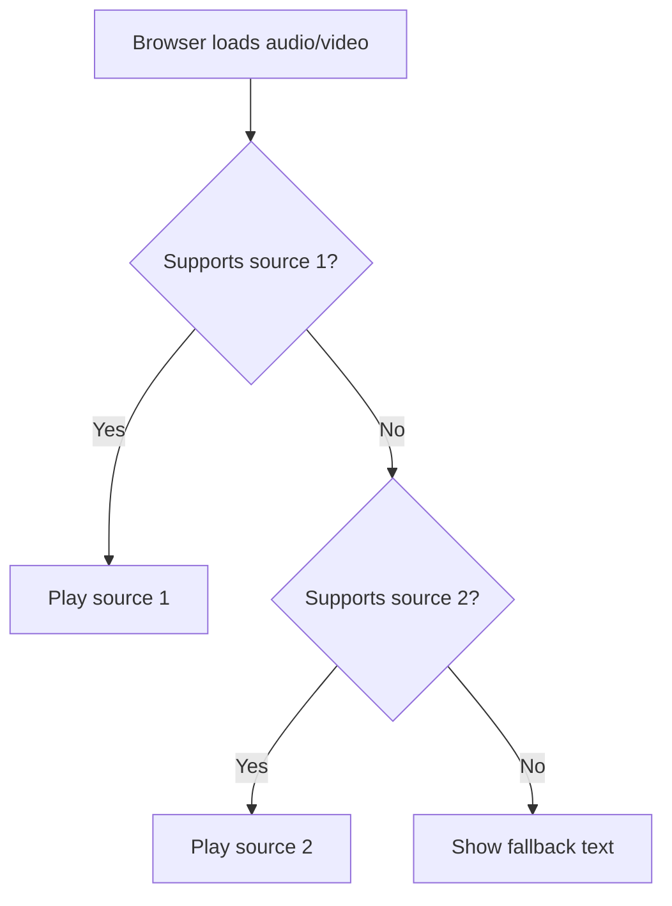

## Images and media

> **Connection with the previous lesson:** in the last lesson we learned to link pages together and built a multi-page site from plain text. Today we add images, sound, and video to pages — the site stops being "text-only."

---

## What you will learn by the end of the lesson

- Insert images with the `` tag and correctly use the `src`, `alt`, `width`, `height` attributes.
- Distinguish between image formats JPEG, PNG, SVG, WebP and understand when to use which.
- Caption images using `figure`/`figcaption`.
- Insert audio and video with `audio`/`video` tags using multiple sources via `source`.
- Add a favicon — the site icon on the browser tab.

---

## Lesson timeline

| Block                               | Content                                 |
| ----------------------------------- | --------------------------------------- |
| 1. img tag: src, alt, width, height | Basic syntax, importance of alt         |
| 2. Image formats                    | JPEG/PNG/SVG/WebP — when to use which   |
| 3. figure and figcaption            | Image captions                          |
| 4. Mini-task                        | Insert an image independently           |
| 5. audio and video                  | Embedding media, multiple sources       |
| 6. Favicon                          | Site icon                               |
| 7. Summary and practical task       | Reinforcement                           |

---

## Block 1. The `` tag: src, alt, width, height

**In simple terms:** if the `<a>` link is a door to another page, then `` is a window through which an image is "inserted" into your page — the image is physically stored as a separate file.

The `` tag is **void (self-closing)**, like `<br>` and `<hr>` from lesson 2. It has no content and no closing tag — all information is conveyed through attributes.

```html

```

Let's go through the attributes one by one.

### `src` (source) — where to get the image

**Required** attribute — the path to the image file. It follows the same path rules we covered in lesson 3: relative paths for your own files, absolute paths for images from external sites.

```html

```

```html

```

### `alt` (alternative text) — alternative text

**Required** attribute, even though the browser technically won't refuse to work without it. This is a textual description of the image that is displayed:

- If the image failed to load (broken link, internet issues);
- By a screen reader — a visually impaired user will hear this text instead of the image;
- By search engines — Google and other search engines use `alt` to understand what's in the picture (they can't "see" images in the usual sense).

```html

```

**How to write good `alt`:** describe what is depicted briefly and to the point — as if explaining the picture to someone over the phone. Don't just write "image" or "img1" — that's useless.

**Special case — decorative images:** if the image is purely decorative and carries no meaningful information (e.g., an ornamental divider), `alt` is left **empty** but not removed entirely:

```html

```

An empty `alt=""` tells the screen reader "this image can be skipped, it carries no information" — this is a deliberate decision, not a forgotten attribute.

### `width` and `height` — image dimensions

Set the width and height in pixels.

```html

```

**Why specify dimensions if the image can be resized via CSS anyway:** while the image is still loading, the browser reserves space on the page of the correct size in advance. Without this, the text around the image will "jump" when the image finally loads and takes its place — this effect is called CLS (Cumulative Layout Shift), and it degrades the site experience.

**Important note on proportions:** if you specify `width` and `height` that don't match the image's actual aspect ratio, the image will be distorted (unnaturally stretched or compressed). Specify both values in the correct proportion, or just one — then the browser will calculate the second while preserving proportions.

```html

```

---

### Common beginner mistakes

| Mistake                                                                                | How to fix                                                                                         |
| -------------------------------------------------------------------------------------- | -------------------------------------------------------------------------------------------------- |
| Forgetting `alt` entirely                                                              | Always include `alt` — with a description, or `alt=""` for decorative images                       |
| Writing useless text in `alt`: `alt="image"`, `alt="img1"`                             | Describe the image content concisely: `alt="A ginger cat on the windowsill"`                       |
| Specifying `width`/`height` in wrong proportions — image gets distorted                 | Preserve the actual aspect ratio, or specify only one dimension                                   |
| Using `` as a replacement for `<a>` to navigate to another page (writing `onclick`) | If the image should be clickable as a link — wrap `` in an `<a>` tag (see example below)     |

**Image as a link:**

```html
<a href="about.html">
    
</a>
```

---

## Block 2. Image formats: JPEG, PNG, SVG, WebP

It's important to understand that different file formats are suited for different types of images — using the "wrong" format leads to either bloated file size or loss of quality.

### JPEG (.jpg, .jpeg)

Best suited for **photographs** — complex images with smooth color transitions (sunsets, portraits, landscapes). Uses lossy compression — the more compressed the file, the smaller it is, but the more visible the artifacts become.

```html

```

**Not suitable for:** text, logos with sharp lines and solid areas — JPEG compression produces "dirty" artifact spots on sharp edges.

### PNG (.png)

Best suited for **images with transparent backgrounds** and **graphics with crisp edges** — logos, icons, interface screenshots. Lossless compression, but the file weighs more than a JPEG of the same photograph.

```html

```

### SVG (.svg)

**Vector** format — unlike JPEG/PNG (which store images as a grid of pixels), SVG stores mathematical descriptions of shapes. This allows SVG to **scale without quality loss** to any size — ideal for logos and icons that may appear both tiny and full-screen.

```html

```

**Key feature:** an SVG file is essentially a text-based XML file that you can open and view the source code of. This makes SVG files very lightweight for simple graphics.

### WebP (.webp)

A modern format from Google that combines the advantages of JPEG and PNG — good photo compression **and** transparency support, while usually weighing less than an equivalent JPEG or PNG. Supported by all modern browsers.

```html

```

### Comparison table

| Format | Best for                                    | Transparency | File size                              |
| ------ | ------------------------------------------- | ------------ | -------------------------------------- |
| JPEG   | Photographs                                 | No           | Medium/small (lossy compression)       |
| PNG    | Logos, screenshots, transparent graphics    | Yes          | Larger than JPEG                       |
| SVG    | Icons, logos (vector graphics)              | Yes          | Very small for simple graphics         |
| WebP   | Universal — photos and graphics             | Yes          | Usually smaller than JPEG/PNG          |



---

### Common beginner mistakes

| Mistake                                                          | How to fix                                                                                    |
| ---------------------------------------------------------------- | -------------------------------------------------------------------------------------------- |
| Using PNG for photographs                                        | Use JPEG or WebP for photos — the file will be significantly smaller                         |
| Using JPEG for a logo with a transparent background              | JPEG doesn't support transparency — use PNG or SVG                                           |
| Inserting huge camera photos "as is" (several MB)                | Compress images before using them on a site — large file sizes slow down page loading        |

---

## Block 3. `figure` and `figcaption` — image captions

When an image needs a caption (like in a book or magazine — "Fig. 1. Device diagram"), the tag pair `<figure>` and `<figcaption>` is used.

```html
<figure>
    
    <figcaption>Fig. 1. Company sales growth in 2025</figcaption>
</figure>
```

`<figure>` is a semantic wrapper meaning "this is a self-contained block of illustrative content" (image, diagram, code, etc.), and `<figcaption>` is its caption, which can be placed before or after the content of `<figure>`.

**Why not just `` + `<p>` side by side:** `<figure>`/`<figcaption>` semantically binds the image and caption together as a single unit — this is important for screen readers and for the structural clarity of the document, as opposed to two independent elements that happen to stand next to each other visually.

---

## Mini-task

Independently insert an image of the `logo.png` logo located in the `images` folder, with a width of 200px and appropriate `alt` text, along with a `figcaption` caption reading "Our site logo."

**Solution:**

```html
<figure>
    
    <figcaption>Our site logo</figcaption>
</figure>
```

---

## Block 5. `<audio>` and `<video>` — embedding media

### `<audio>` — audio on the page

```html
<audio controls>
    <source src="music.mp3" type="audio/mpeg">
    <source src="music.ogg" type="audio/ogg">
    Your browser does not support audio playback.
</audio>
```

Let's break it down:

- `controls` — an attribute (without a value) that enables a visible control panel (play/pause, volume, seeking). Without it, the audio will load, but the user won't have visible playback controls.
- `<source>` — a void tag inside `<audio>` pointing to a file. You can specify **multiple** `<source>` elements with different formats — the browser will pick the first supported format. This is necessary because not all browsers support all audio formats equally.
- The text `Your browser does not support...` is a **fallback** that will only appear in very old browsers that don't understand the `<audio>` tag at all.



### `<video>` — video on the page

```html
<video controls width="640" height="360">
    <source src="lesson.mp4" type="video/mp4">
    <source src="lesson.webm" type="video/webm">
    Your browser does not support video playback.
</video>
```

The principle is fully analogous to `<audio>`, plus there are additional useful attributes:

```html
<video controls width="640" height="360" poster="preview.jpg" muted loop>
    <source src="lesson.mp4" type="video/mp4">
</video>
```

- `poster` — a placeholder image shown **before** playback begins (similar to a YouTube video thumbnail).
- `muted` — video starts without sound.
- `loop` — video loops after finishing.
- `autoplay` — automatic start when the page loads (use **with caution**: most browsers block autoplay with sound without explicit user interaction — this is intentional to prevent sites from "yelling" at users unexpectedly).

**Important accessibility rule:** if the video contains important speech/dialogue, it's best to provide subtitles (the `<track>` tag, which goes beyond the scope of this introductory lesson, but it's useful to know this option exists).

---

### Common beginner mistakes

| Mistake                                                    | How to fix                                                                                                                                                               |
| ---------------------------------------------------------- | ------------------------------------------------------------------------------------------------------------------------------------------------------------------------ |
| Forgetting the `controls` attribute                        | Without it, the user will have no visible playback control panel                                                                                                         |
| Specifying only one `<source>`                             | Add at least two formats (e.g., mp4 + webm) for compatibility across different browsers                                                                                  |
| Using `autoplay` with sound without a strong need          | Most browsers will block it anyway — use `autoplay` together with `muted` if you truly need autoplay                                                                    |
| Inserting huge video files directly on the site            | For real projects, it's better to use services like YouTube with `<iframe>` embedding (this topic goes beyond the current lesson — we'll cover it separately if needed)  |

---

## Block 6. Favicon — site icon

A favicon is a small icon displayed on the browser tab next to `<title>`, as well as in bookmarks and browsing history.

It's connected via the `<link>` tag inside `<head>` (we'll examine the `<link>` tag itself in more detail in lesson 9 — for now we just use it for the favicon):

```html
<head>
    <meta charset="UTF-8">
    <title>My site</title>
    <link rel="icon" type="image/png" href="favicon.png">
</head>
```

- `rel="icon"` — tells the browser this is the site icon.
- `type="image/png"` — file format (can also be `.ico`, `.svg`).
- `href` — path to the icon file (usually a small square image — 32×32 or 16×16 pixels).

**Classic approach:** a `favicon.ico` file in the site root — many browsers find it automatically even without an explicit `<link>` tag, but explicit declaration is a more reliable and modern practice.

---

## Lesson summary

Today you learned:

- `` — a void tag for inserting images, with required `src` and `alt` attributes, and optional `width`/`height` for reserving space on the page.
- Four image formats: JPEG (photos), PNG (graphics with transparency), SVG (vector graphics, icons/logos), WebP (universal modern format).
- `<figure>`/`<figcaption>` — a semantic pair that binds an image to its caption.
- `<audio>` and `<video>` embed media through one or more `<source>` elements, with the `controls` attribute for the playback control panel.
- A favicon is connected via `<link rel="icon">` inside `<head>` and appears on the browser tab.
