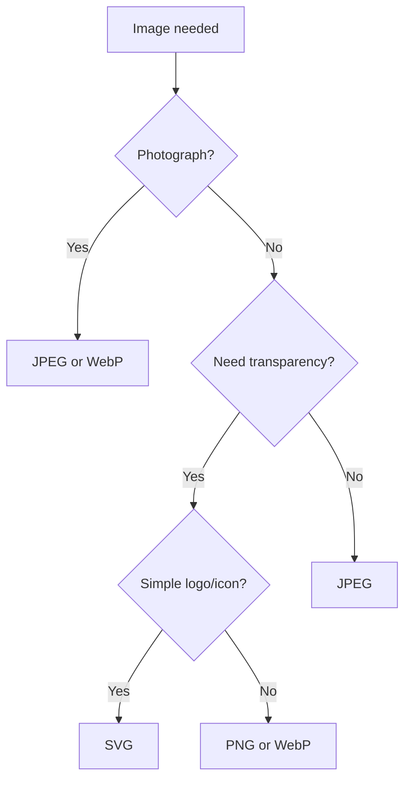
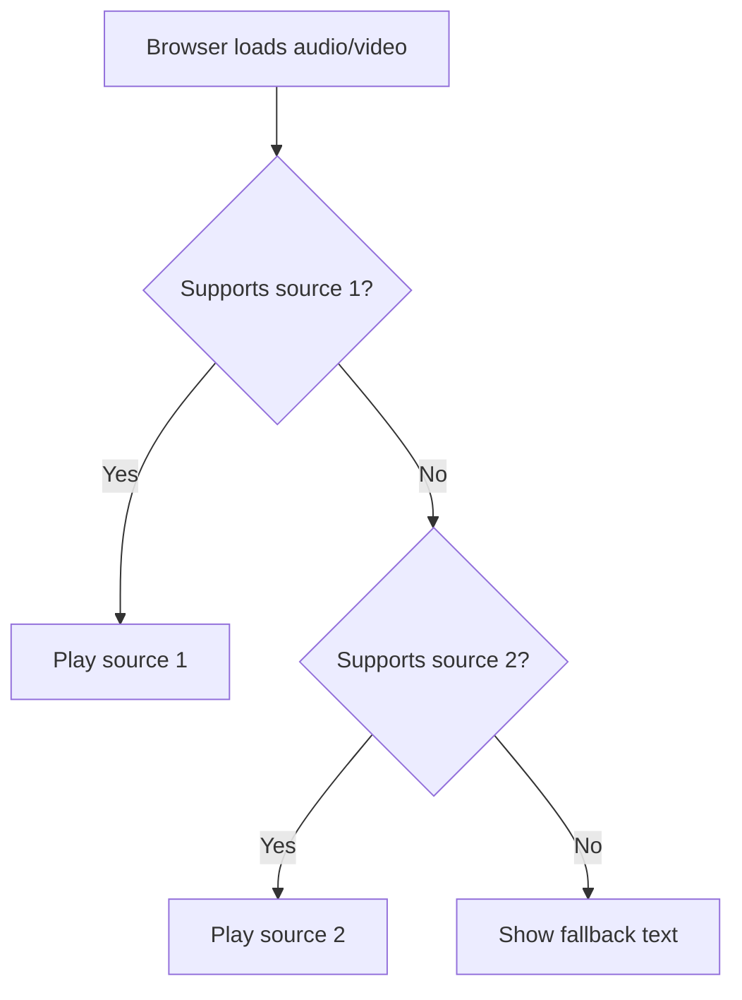

## Rasmlar va media

> **Oldingi dars bilan bog'lanish:** o'tgan darsda biz sahifalarni havolalar bilan bog'lashni o'rgandik va ko'p sahifali saytni oddiy matndan yig'dik. Bugun sahifalarga rasmlar, tovush va video qo'shamiz - sayt "faqat matn" bo'lishdan to'xtaydi.

---

## Dars oxiriga qadar nimani o'rganasiz

- `` tegini orqali rasmlarni joylashtirish va `src`, `alt`, `width`, `height` attributlarini to'g'ri ishlatish.
- JPEG, PNG, SVG, WebP rasm formatlarini farqlash va qaysi holatda qaysi formatni qo'llashni tushunish.
- Rasmlarni `figure`/`figcaption` yordamiga yozish.
- `audio`/`video` teglari orqali bir yoki bir nechta `source` manbalar bilan audio va video joylashtirish.
- Favicon - brauzer tabidagi sayt belgasi qo'shish.

---

## Dars davomiyligi

| Blok                                | Mazmuni                                 |
| ----------------------------------- | --------------------------------------- |
| 1. img tegi: src, alt, width, height | Asosiy sintaksis, alt ning muhimligi   |
| 2. Rasm formatlari                  | JPEG/PNG/SVG/WebP - qachon qaysi ishlatiladi |
| 3. figure va figcaption             | Rasmlar yorliqlari                      |
| 4. Kichik topshiriq                 | Rasmni mustaqil joylashtirish           |
| 5. audio va video                   | Media joylashtirish, bir nechta source  |
| 6. Favicon                          | Sayt belgasi                            |
| 7. Xulosalar va amaliy topshiriq    | Mustahkamlash                           |

---

## Blok 1. `` tegi: src, alt, width, height

**Oddiy qilib aytganda:** agar `<a>` havolasi bu boshqa sahifaga eshik bo'lsa, `` - bu sizning sahifangizga "kiritiladigan" rasm uchun oyna, rasm fizik jihatdan alohida faylda saqlanadi.

`` tegi - **juftlikka kirmaydigan**, 2-darsdagi `<br>` va `<hr>` kabi. Unda tarkibiy qism va yopuvchi teg yo'q - barcha ma'lumotlar attributlar orqali uzatiladi.

```html

```

Attributlarni ketma-ket ko'rib chiqamiz.

### `src` (source) - rasm qayerdan olinadi

**Majburiy** attribut - rasm faylining yo'li. Uchlik 3-darsda ko'rgan yo'l qoidalari bo'yicha ishlaydi: o'z fayllaringiz uchun nisbiy yo'l, tashqi saytlardagi rasmlar uchun mutlaqo yo'l.

```html

```

```html

```

### `alt` (alternative text) - muqobil matn

**Majburiy** attribut, garchi rasmiy jihatdan brauzer beshiz ishlashdan bosh tortmasa ham. Bu rasmning matnli tavsifi bo'lib, quyidagilarda ko'rsatiladi:

- Agar rasm yuklanmagan bo'lsa (buzilgan havola, internet muammolari);
- Ekran o'quvchisi - ko'zi ojiz foydalanuvchi rasm o'rniga ana shu matnni eshitadi;
- Qidiruv tizimlari - Google va boshqa qidiruv tizimlari rasm nima ekanini tushunish uchun `alt` dan foydalanadi (ular rasmlarni odatdagi ma'noda "ko'ra" olmaydi).

```html

```

**Yaxshi `alt` qanday yoziladi:** tasvirlangan narsani qisqacha va mazmunli tavsiflang - go'yo telefonda rasmini kimga tushuntiryotgandek. Faqat "rasm" yoki "rasm1" deb yozmang - bu foydasiz.

**Maxsus holat - bezak rasmlari:** agar rasm faqat bezak maqsadida bo'lsa va ma'noli axborot o'tkazmasa (masalan, ajratuvchi naqsh), `alt` **bo'sh** qoldiriladi, lekin butunlay olib tashlanmaydi:

```html

```

Bo'sh `alt=""` ekran o'quvchisiga "bu rasmni o'tkazib yuborish mumkin, u axborot o'tkazmaydi" degan signal beradi - bu ongli qaror, unutilgan attribut emas.

### `width` va `height` - rasm o'lchamlari

Eni va bo'yi piksellarda belgilanadi.

```html

```

**Agar rasmni CSS orqali cho'zish mumkin bo'lsa, o'lchamlarni nima uchun ko'rsatish kerak:** brauzer rasm hali yuklanayotganda, sahifada to'g'ri o'lchovda joy ajratadi. Buning uchun atrofdagi matn rasm yuklanib o'z o'rnini egallagan paytda "sakrab tushadi" - bu hodisa CLS (sahifa joylashuvining siljishi) deb ataladi va saytning qabul qilinishini yomonlashtiradi.

**Proportsiya haqida muhim:** agar siz rasmning haqiqiy en-boyiga mos kelmaydigan `width` va `height` ko'rsatsangiz, rasm buziladi (g'ayritabiiy cho'ziladi yoki siqiladi). Ikkala qiymatni to'g'ri proporsiyada ko'rsating yoki faqat bittasini - brauzer ikkinchisini proporsiyani saqlab hisoblaydi.

```html

```

---

### Yangi boshlovchilarning ko'p uchraydigan xatolari

| Xatolik                                                                                | Qanday tuzatish                                                                                     |
| -------------------------------------------------------------------------------------- | --------------------------------------------------------------------------------------------------- |
| `alt` ni butunlay unutish                                                             | Har doim `alt` ko'rsating - tavsif bilan yoki bezak rasmlari uchun bo'sh `alt=""`                   |
| `alt` da foydasiz matn yozish: `alt="rasm"`, `alt="img1"`                             | Rasm tarkibini mazmunli tavsiflang: `alt="Derazada o'tirgan sochli mushuk"`                        |
| `width`/`height` noto'g'ri proporsiyada ko'rsatish - rasm buziladi                     | Haqiqiy en-boy nisbatini saqlang yoki faqat bitta o'lchamni ko'rsating                              |
| `` ni `<a>` o'rnida ishlatish (sahifaga o'tish uchun `onclick` yozish)            | Agar rasm havola sifatida bosilishi kerak bo'lsa - `` ni `<a>` tegiga o'rab qo'ying (pastdagi misol) |

**Rasm-havola:**

```html
<a href="about.html">
    
</a>
```

---

## Blok 2. Rasm formatlari: JPEG, PNG, SVG, WebP

Turli fayl formatlari turli xil rasm turlariga mos kelishini tushunish muhim - "noto'g'ri" formatni ishlatish yoki fayl hajmini oshiradi yoki sifatni yo'qotadi.

### JPEG (.jpg, .jpeg)

**Fotografiyalar** uchun mos - silliq rang o'tishlari bor murakkab rasmlar (quyosh botishi, portretlar, manzaralar). Sifat yo'qotilgan siqishdan foydalanadi - fayl qanchalik kuchli siqilsa, shunchalik yengil bo'ladi, lekin kamchiliklar shunchalik ko'rinadi.

```html

```

**Mos kelmaydi:** matnga, aniq chiziqli logotip va yagona rangli hududlarga - JPEG siqilganda keskin chegaralarda "kirlanish" effektlari paydo bo'ladi.

### PNG (.png)

**Shaffof fonli rasmlar** va **aniq chiziqli grafika** uchun mos - logotip, belgilar, interfeys skrinshotlari. Sifat yo'qotilmasdan siqiladi, lekin shu evaziga fayl bir xil fotosurtdan JPEG dan og'irroq bo'ladi.

```html

```

### SVG (.svg)

**Vektorli** format - JPEG/PNG dan farqli o'laroq (ularni piksel tarmog'ida saqlaydi), SVG shakllarning matematik tavsifini saqlaydi. Shu sababli SVG **sifat yo'qotmasdan** istalgan o'lchamga moslashadi - kichik va katta ekranlarda ham ko'rsatiladigan logotip va belgilar uchun ideal.

```html

```

**Xususiyati:** SVG fayli aslida matnli XML fayli bo'lib, uni ochib kodni ko'rish mumkin. Bu oddiy grafika uchun fayllarni juda yengil qiladi.

### WebP (.webp

Google tomonidan yaratilgan zamonaviy format bo'lib, JPEG va PNG ning afzalliklarini birlashtiradi - fotosuratlarni yaxshi siqish **va** shaffoflikni qo'llab-quvvatlash, shu bilan birga odatda JPEG yoki PNG dan yengilroq. Barcha zamonaviy brauzerlar tomonidan qo'llab-quvvatlanadi.

```html

```

### Taqqoslash jadvali

| Format | Eng yaxshi ishlatilishi                        | Shaffoflik | Fayl hajmi                              |
| ------ | --------------------------------------------- | ---------- | --------------------------------------- |
| JPEG   | Fotosuratlar                                  | Yo'q       | O'rtacha/kichik (sifat yo'qotilgan holda) |
| PNG    | Logotip, skrinshotlar, shaffof grafika         | Ha         | JPEG dan kattaroq                        |
| SVG    | Belgilar, logotip (vektorli grafika)           | Ha         | Oddiy grafika uchun juda kichik          |
| WebP   | Universal - foto va grafika                    | Ha         | Odatda JPEG/PNG dan kichikroq            |



---

### Yangi boshlovchilarning ko'p uchraydigan xatolari

| Xatolik                                                           | Qanday tuzatish                                                                                |
| ----------------------------------------------------------------- | ---------------------------------------------------------------------------------------------- |
| Fotosuratlar uchun PNG ishlatish                                  | Foto uchun JPEG yoki WebP ishlating - fayl sezilarli darajada yengil bo'ladi                    |
| Shaffof fonli logotip uchun JPEG ishlatish                        | JPEG shaffoflikni qo'llab-quvvatlamaydi - PNG yoki SVG ishlating                               |
| Kameradan olingan katta fotolarni o'zgartirmasdan joylashtirish (bir nechta MB) | Saytga ishlatishdan oldin rasmlarni siqing - katta hajm sahifaning yuklanishini sekinlashtiradi |

---

## Blok 3. `figure` va `figcaption` - rasmlar yorliqlari

Rasimga yorliq kerak bo'lganda (kitob yoki jurnaldagi kabi - "1-rasm. Uning ishlash sxemasi"), `<figure>` va `<figcaption>` teglari juftligi ishlatiladi.

```html
<figure>
    
    <figcaption>1-rasm. Kompaniya sotishining 2025-yildagi o'sishi</figcaption>
</figure>
```

`<figure>` - bu "mustaqil kontent bloki" (rasm, grafik, kod va h.k.) degan ma'noni anglatuvchi semantik o'roq, `<figcaption>` - uning yorlig'i, `<figure>` tarkibidan oldin yoki keyin joylashishi mumkin.

**Nima uchun oddiy `` + `<p>` emas:** `<figure>`/`<figcaption>` rasmni va yorliqni semantik jihatdan bir butunlik sifatida bog'laydi - bu ekran o'quvchilari va hujjat tuzilishining aniqligi uchun muhim, faqat vizual jihatdan yonma-yon turgan ikki mustaqil elementdan farqli o'laroq.

---

## Kichik topshiriq

Mustaqil ravishda `images` papkasidagi `logo.png` logotip rasmini 200px kenglikda va mos `alt` matni bilan, shuningdek `figcaption` orqali "Bizning sayt logotipi" yorlig'i bilan joylashtiring.

**Yechim:**

```html
<figure>
    
    <figcaption>Bizning sayt logotipi</figcaption>
</figure>
```

---

## Blok 5. `<audio>` va `<video>` - media joylashtirish

### `<audio>` - sahifada audio

```html
<audio controls>
    <source src="music.mp3" type="audio/mpeg">
    <source src="music.ogg" type="audio/ogg">
    Sizning brauzeringiz audio ijrosini qo'llab-quvvatlamaydi.
</audio>
```

Tushuntiramiz:

- `controls` - qiymatsiz attribut bo'lib, ko'rinadigan boshqaruv panelini (play/pause, balandlik, surish) yoqadi. Beksiz audio yuklanadi, lekin foydalanuvchida ko'rinadigan boshqaruv tugmalari bo'lmaydi.
- `<audio>` ichidagi juftlikka kirmaydigan `<source>` tegi faylni ko'rsatadi. Turli formatlarda bir nechta `<source>` ko'rsatish mumkin - brauzer birinchi qo'llab-quvvatlanadigan formatni tanlaydi. Bu shuning uchun zarurki, barcha brauzerlar barcha audio formatlarni bir xil qo'llab-quvvatlamaydi.
- `Sizning brauzeringiz qo'llab-quvvatlamaydi...` matni - bu **zaxira variant (fallback)**, faqat `<audio>` tegini umuman tushunmaydigan juda eski brauzerlarda ko'rsatiladi.



### `<video>` - sahifada video

```html
<video controls width="640" height="360">
    <source src="lesson.mp4" type="video/mp4">
    <source src="lesson.webm" type="video/webm">
    Sizning brauzeringiz video ijrosini qo'llab-quvvatlamaydi.
</video>
```

Printip `<audio>` bilan to'liq bir xil, qo'shimcha foydali attributlar mavjud:

```html
<video controls width="640" height="360" poster="preview.jpg" muted loop>
    <source src="lesson.mp4" type="video/mp4">
</video>
```

- `poster` - ijro boshlanishidan **oldin** ko'rsatiladigan almashtiruvchi rasm (YouTube dagi video muqovalariga o'xshaydi).
- `muted` - video ovozsiz boshlanadi.
- `loop` - video tugagandan keyin qayta boshlanadi.
- `autoplay` - sahifa yuklanganda avtomatik boshlash (**ehtiyotkorlik bilan ishlating**: aksariyat brauzerlar foydalanuvchining aniq harakatisiz ovozli avtomatik ijroni bloklaydi - bu saytlar foydalanuvchini to'satdan "qichqirib" yubormaslik uchun qilingan).

**Muhim qoida:** agar video muhim nutq/suhbatni o'z ichiga olasa, yaxshisi subtitrlarni ko'rish kerak (`<track>` tegi, bu kirish darsining doirasidan tashqari, lekin bunday imkoniyat mavjudligini bilish foydali).

---

### Yangi boshlovchilarning ko'p uchraydigan xatolari

| Xatolik                                                   | Qanday tuzatish                                                                                                                                                               |
| --------------------------------------------------------- | ----------------------------------------------------------------------------------------------------------------------------------------------------------------------------- |
| `controls` attributini unutish                            | Beksiz foydalanuvchida ijro boshqaruv paneli bo'lmaydi                                                                                                                       |
| Faqat bitta `<source>` ko'rsatish                         | Turli brauzerlar bilan moslik uchun kamida ikkita format qo'shing (masalan, mp4 + webm)                                                                                       |
| Kerak bo'lmagan holatda ovozli `autoplay` ishlatish       | Aksariyat brauzerlar buni baribir bloklaydi - haqiqatan kerak bo'lsa `autoplay` ni `mute` bilan birga ishlating                                                                |
| Katta videofayllarni to'g'ridan-to'g'ri saytga joylashtirish | Haqiqiy loyihalar uchun YouTube kabi xizmatlarni `<iframe>` bilan islatgan ma'qul (bu mavzu hozirgi dars doirasidan tashqari - zarurat bo'lganda alohida ko'rib chiqamiz)         |

---

## Blok 6. Favicon - sayt belgasi

Favicon - brauzer tabida `<title>` yonida, shuningdek xatchaflar va tashrif tarixida ko'rsatiladigan kichik belgi.

`<head>` ichidagi `<link>` tegi orqali ulanadi (`<link>` tegining o'zi 9-darsda batafsil ko'rib chiqiladi - hozir faqat favicon uchun ishlatamiz):

```html
<head>
    <meta charset="UTF-8">
    <title>Mening saytim</title>
    <link rel="icon" type="image/png" href="favicon.png">
</head>
```

- `rel="icon"` - brauzerga bu sayt belgisi ekanini bildiradi.
- `type="image/png"` - fayl formati (`.ico`, `.svg` ham bo'lishi mumkin).
- `href` - belgi faylining yo'li (odatiy kichik kvadrat rasm - 32×32 yoki 16×16 piksel).

**An'anaviy variant:** sayt ildizidagi `favicon.ico` fayli - ko'pchilik brauzerlar uni hatto aniq `<link>` tegisiz ham avtomatik topadi, lekin aniq ko'rsatish ishonchliroq va zamonaviyroq amaliyot.

---

## Dars xulosalari

Bugun siz o'rgandingiz:

- `` - rasmlarni joylashtirish uchun juftlikka kirmaydigan teg, `src` va `alt` majburiy atributlar bilan, shuningdek sahifada joy ajratish uchun ixtiyoriy `width`/`height` bilan.
- To'rtta rasm formati: JPEG (foto), PNG (shaffof grafika), SVG (vektorli grafika, belgilar/logotip), WebP (universal zamonaviy format).
- `<figure>`/`figcaption` - rasmni uning yorlig'i bilan bog'laydigan semantik juftlik.
- `<audio>` va `<video>` bir yoki bir nechta `<source>` orqali media joylashtiradi, boshqaruv paneli uchun `controls` atributi bilan.
- Favicon `<head>` ichidagi `<link rel="icon">` orqali ulanadi va brauzer tabida ko'rsatiladi.

➡ **Keyingi dars:** [Jadvallar](../../Lesson-5/uz/Jadvallar.md)
