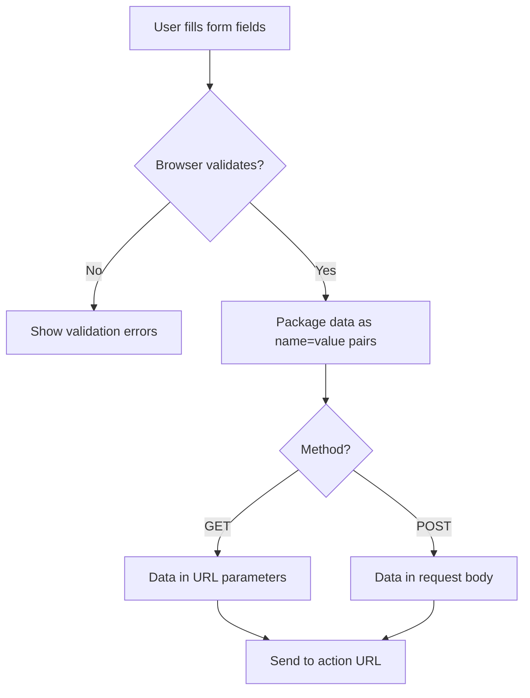
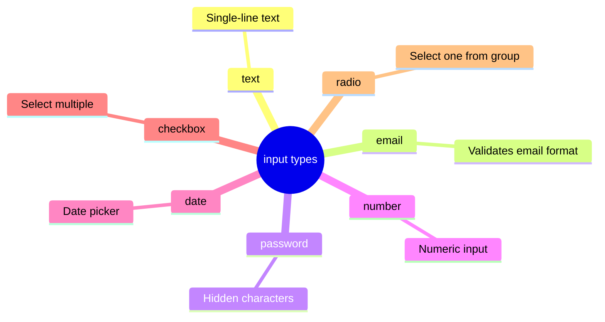

## Forms part 1

> **Connection with the previous lesson:** in the last lesson we learned to present data using tables. Today we move on to forms — the only way in plain HTML to collect information **from** the user (previously the page only displayed information; now it can also receive it).

---

## What you will learn by the end of the lesson

- Create a form with the `<form>` tag and understand the `action` and `method` attributes.
- Use the main `input` types: text, email, password, number, date, checkbox, radio.
- Properly associate a `label` with a field using `for`/`id`.
- Understand the difference between `placeholder` and `value`.
- Make fields required using `required`.

---

## Lesson timeline

| Block                                    | Content                                         |
| ---------------------------------------- | ----------------------------------------------- |
| 1. The form tag: action, method          | Why forms are needed, where data goes           |
| 2. label and for/id                      | Label-field association — the basis of form accessibility |
| 3. Input types pt.1: text, email, password | Text fields                                   |
| 4. Input types pt.2: number, date        | Numbers and dates                              |
| 5. checkbox and radio                    | The difference between "choose several" and "choose one" |
| 6. Mini-task                             | Build a field independently                    |
| 7. placeholder vs value, required        | A common beginner confusion                    |
| 8. Summary and practical task            | Reinforcement — building a feedback form       |

---

## Block 1. The `<form>` tag: action and method

**In simple terms:** imagine a paper form that you fill out and then bring to a specific office. An HTML form works the same way: the user fills in the fields, and upon submission the browser "takes" that data to a specific address (usually a server that processes it further).

```html
<form action="/submit" method="post">
    <!-- form fields will go here -->
</form>
```

- **`action`** — where to send the form data (the handler address — usually a program on the server written, for example, in PHP; we haven't studied server-side programming yet, so in this lesson `action` will be a placeholder).
- **`method`** — how to send the data. Two main values:
    - **`get`** — data is appended directly to the browser's address bar (visible in the URL), suitable for search forms where there's no sensitive data.
    - **`post`** — data is sent "invisibly" in the request body, suitable for forms with personal data (registration, login, message submission) — `post` is what we'll use most often.

**Analogy:** `get` is like writing a question on a postcard that every mail carrier sees along the way. `post` is like sending a letter in a sealed envelope.



**Important for this lesson:** without the server-side part (which we're not studying in this course on plain HTML), the form won't actually send data anywhere in reality — but we still build it correctly so the structure is ready for server integration in the future if you continue learning web development.

---

## Block 2. `<label>` and the `for`/`id` association

This is perhaps the most important topic of today's lesson — many beginners skip it, and that's a mistake.

**In simple terms:** `<label>` is the caption for a form field, like "Name:" next to the name input field. But simply placing text near the field isn't enough. You need to **explicitly associate** the label with the specific field.

```html
<label for="username">Username:</label>
<input type="text" id="username" name="username">
```

Let's break down the association:

- `<label>` has a `for` attribute with the value `"username"`.
- `<input>` has an `id` attribute with the **exact same** value — `"username"`.

It's the matching of these values that binds the label to the field.

**Why this matters even when it's visually clear which field the label belongs to:**

1. **Clicking the label focuses the field.** Try it — if the association is set up correctly, clicking the text "Username:" will place the cursor in the input field itself. This is especially useful for small elements like checkboxes (block 5) — clicking the nearby text is much easier than aiming precisely for a small square.
2. **Screen readers use exactly this association.** Without it, a visually impaired user landing in the input field won't understand what it means — the screen reader will simply say "text field" with no context.

### Alternative approach — wrapping input inside the label

```html
<label>
    Username:
    <input type="text" name="username">
</label>
```

Here `id`/`for` aren't needed — the nesting itself creates the association. Both approaches are correct, but the explicit `for`/`id` approach (the first variant) is considered more common and predictable for complex layouts — in this course we'll primarily use it.

**The `name` attribute on `<input>`:** note that besides `id`, a field also has a `name` attribute — this is **not the same thing** as `id`. `name` is the field's name, under which data is sent to the server when the form is submitted (server-side processing reads data by `name`). `id` is used for association with `<label>` and for styling/scripting. A field should have **both** attributes, and they may (but don't have to) have the same value.

---

### Common beginner mistakes

| Mistake                                                 | How to fix                                                                               |
| ------------------------------------------------------- | ---------------------------------------------------------------------------------------- |
| Writing `<label>` next to `<input>` without `for`/`id`  | Always explicitly associate: `for="name"` on `label` and `id="name"` on `input` with the same value |
| Confusing `id` and `name`, using only one of them        | A field needs both attributes: `id` for association with label, `name` for sending data to the server |
| Using the same `id` for multiple different fields        | As we learned in lesson 3, `id` must be unique across the entire page                    |

---

## Block 3. Input types pt.1: text, email, password

The `<input>` tag is void, like `` from lesson 4. Its behavior changes completely depending on the `type` attribute.

### `type="text"` — a regular single-line text field

```html
<label for="fullname">Full name:</label>
<input type="text" id="fullname" name="fullname">
```

The basic type — simply a rectangular field for entering any text on a single line.

### `type="email"` — an email field

```html
<label for="email">Email:</label>
<input type="email" id="email" name="email">
```

Visually it looks like a regular text field, but the browser **automatically checks** that the entered text resembles an email (contains `@` and address structure) — when trying to submit a form with an invalid email, the browser will show a warning on its own, without a single line of JavaScript. On mobile devices, focusing on this field often brings up a special keyboard with quick access to `@` and `.com`.

### `type="password"` — a password field

```html
<label for="password">Password:</label>
<input type="password" id="password" name="password">
```

The characters the user types are displayed as dots or asterisks (••••••) — the actual password text is hidden from prying eyes looking over your shoulder.

---

## Block 4. Input types pt.2: number, date

### `type="number"` — a number field

```html
<label for="age">Age:</label>
<input type="number" id="age" name="age" min="1" max="120">
```

The browser won't allow letters to be entered, and on desktop small arrows will appear next to the field to increment/decrement the value. The `min` and `max` attributes set the allowed range.

### `type="date"` — a date picker field

```html
<label for="birthday">Date of birth:</label>
<input type="date" id="birthday" name="birthday">
```

The browser displays a convenient visual calendar for choosing a date — without a single line of additional code. The date format sent to the server is always standardized (`YYYY-MM-DD`), even though visually different countries display calendars differently.

---

### Common beginner mistakes

| Mistake | How to fix |
| --- | --- |
| Using `type="text"` for email/numbers instead of specialized types | Use `type="email"`, `type="number"`, `type="date"` — they provide built-in validation and a convenient input interface without extra code |
| Forgetting `min`/`max` for `type="number"` where the range is logically limited | Specify reasonable boundaries where appropriate (age, product quantity, etc.) |
| Expecting `type="email"` to "send" an email by itself | This is just a text format check — submission only happens through form/server logic |

---

## Block 5. `checkbox` and `radio`

These are two similar but fundamentally different field types — confusing them is one of the most common beginner mistakes.

### `type="checkbox"` — choose several (or none)

```html
<p>Select the topics you're interested in:</p>

<input type="checkbox" id="html" name="topics" value="html">
<label for="html">HTML</label><br>

<input type="checkbox" id="css" name="topics" value="css">
<label for="css">CSS</label><br>

<input type="checkbox" id="js" name="topics" value="js">
<label for="js">JavaScript</label>
```

Each checkbox is independent of the others. The user can mark as many options as they like, including none.

**Analogy:** like a shopping list where you tick off items you've already bought — you can check any number of items, they don't interfere with each other.

### `type="radio"` — choose only one option from a group

```html
<p>Select your skill level:</p>

<input type="radio" id="beginner" name="level" value="beginner">
<label for="beginner">Beginner</label><br>

<input type="radio" id="intermediate" name="level" value="intermediate">
<label for="intermediate">Intermediate</label><br>

<input type="radio" id="advanced" name="level" value="advanced">
<label for="advanced">Advanced</label>
```

**The key point that makes radio buttons a group:** all options have **the same `name` attribute** (in this example, `name="level"`). It's the matching `name` that tells the browser "these are options for the same question — selecting one automatically deselects the others." Meanwhile, the `id` for each option is **different** (otherwise the association with `label` would break).

**Analogy:** like channel buttons on an old radio — pressing a new button automatically "releases" the previous one, because a radio can only play one channel at a time.

### The `value` attribute on checkbox/radio

The `value` attribute determines which specific value will be sent to the server if this option is selected. The text visible to the user is set through `<label>`, not through `value` — these are different things.

---

### Common beginner mistakes

| Mistake                                                                               | How to fix                                                                                             |
| ------------------------------------------------------------------------------------ | ----------------------------------------------------------------------------------------------------- |
| Using `radio` instead of `checkbox` for "select all that apply" questions            | For multiple selections use `checkbox`, for a single selection use `radio`                            |
| Giving radio buttons in the same group different `name` values                       | All radio buttons in a group must have the **same** `name` — otherwise they won't work as a group    |
| Giving checkbox fields the same `id`                                                 | Each field must have its own unique `id`, even if `name` matches (as in the `topics` example)         |

---

## Mini-task

On your own, without peeking at the examples, create a group of three radio buttons for the question "Your favorite drink" with options "Tea," "Coffee," "Juice" — with correct `label`/`id` associations and a shared `name`.

**Solution:**

```html
<p>Your favorite drink:</p>

<input type="radio" id="tea" name="drink" value="tea">
<label for="tea">Tea</label><br>

<input type="radio" id="coffee" name="drink" value="coffee">
<label for="coffee">Coffee</label><br>

<input type="radio" id="juice" name="drink" value="juice">
<label for="juice">Juice</label>
```



---

## Block 7. `placeholder` vs `value`, and `required`

This is another common confusion among beginners — two attributes that both show text inside a field but work completely differently.

### `placeholder` — a hint example, disappears when typing

```html
<label for="search">Search:</label>
<input type="text" id="search" name="search" placeholder="e.g., HTML course">
```

The `placeholder` text is displayed **in gray inside an empty field** as a format hint — and **automatically disappears** as soon as the user starts typing. If the user hasn't entered anything, it is **not sent** to the server — the field is considered empty in that case.

### `value` — the actual field value, remains on submission

```html
<label for="city">City:</label>
<input type="text" id="city" name="city" value="Tashkent">
```

The `value` text is the **actual content of the field**, displayed in regular (not gray) text, as if the user had already typed it in themselves. It **will be sent** to the server along with the form, even if the user didn't change anything manually. It's often used to set a default value in advance (e.g., when editing existing user data).

### Practical comparison

```html
<!-- placeholder: format hint, disappears on typing, not sent if field is empty -->
<input type="text" placeholder="Enter your name">

<!-- value: actual pre-filled value, will be sent as-is if not changed -->
<input type="text" value="Guest">
```

**Analogy:** `placeholder` is a faint pencil note on a form saying "write your name here" that isn't considered part of the filled-in document. `value` is text already written in ink that stays in the document even if you don't touch it.

### `required` — mandatory field

```html
<label for="email">Email:</label>
<input type="email" id="email" name="email" required>
```

The `required` attribute (written without a value) makes a field mandatory — when trying to submit a form with an empty required field, the browser will show a warning and won't allow submission, again without a single line of JavaScript.

---

### Common beginner mistakes

| Mistake                                                                                     | How to fix                                                                                               |
| ------------------------------------------------------------------------------------------ | -------------------------------------------------------------------------------------------------------- |
| Using `placeholder` instead of `label` as the sole field caption                          | `placeholder` is a format hint, not a replacement for `label`; a field caption should always use `<label>` |
| Confusing `placeholder` and `value` — expecting placeholder to be sent with the form        | Remember: `placeholder` disappears and is not sent; `value` is the actual content that will be sent       |
| Forgetting `required` for fields that are truly mandatory (e.g., email during registration) | Add `required` where the field logically cannot be empty                                                  |

---

## Lesson summary

Today you learned:

- `<form>` with `action` (where to send) and `method` (`get`/`post`, how to send) attributes — a container for all fields.
- `<label` must be associated with a field via `for`/`id` — this affects both click convenience and screen reader accessibility.
- Specialized `input` types: `text`, `email` (format validation), `password` (hidden text), `number` (numbers only), `date` (visual calendar).
- `checkbox` — multiple options can be selected (independent fields), `radio` — only one from a group (unified by the same `name`).
- `placeholder` — a disappearing hint, not sent with the form; `value` — the actual field content, always sent.
- `required` makes a field mandatory without a single line of JavaScript.
