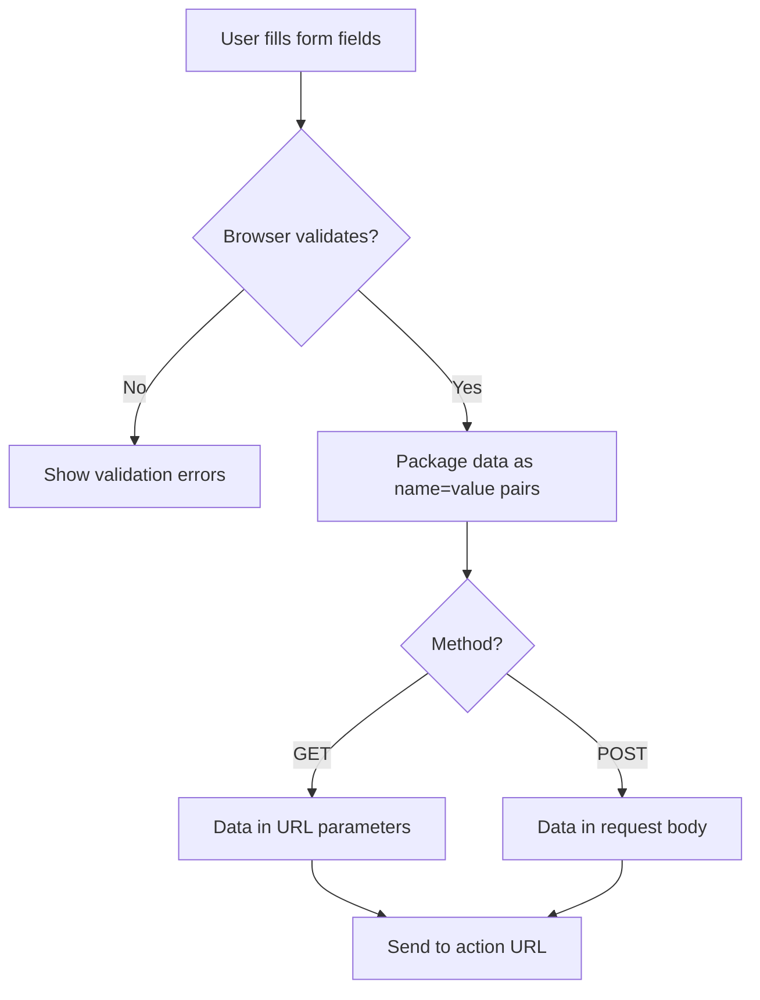
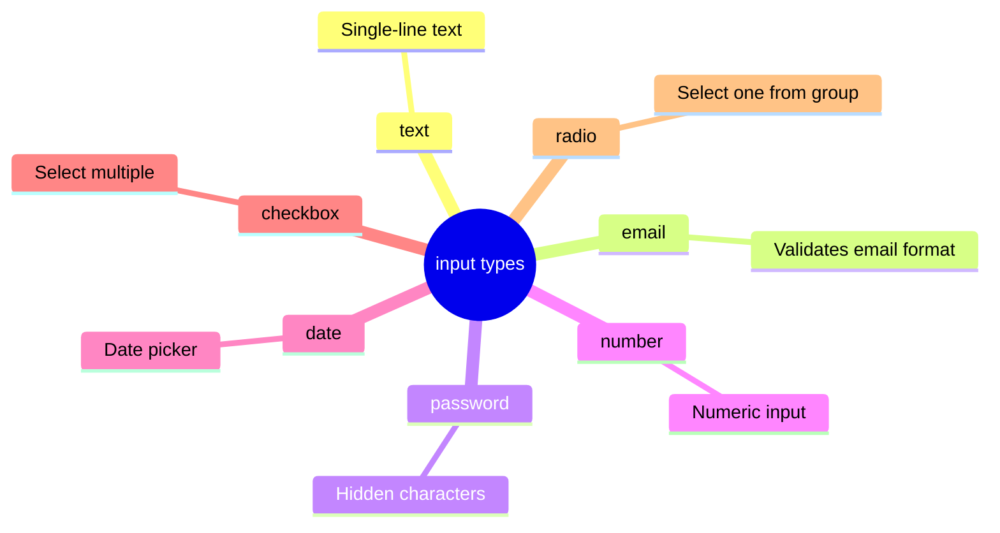

## Формы ч-1

> **Связь с предыдущим уроком:** на прошлом уроке мы научились представлять данные таблицами. Сегодня переходим к формам - единственному способу в чистом HTML собрать информацию **от** пользователя (раньше страница только показывала информацию, теперь она умеет её принимать).

---

## Чему вы научитесь к концу урока

- Создавать форму тегом `<form>` и понимать атрибуты `action` и `method`.
- Использовать основные типы `input`: text, email, password, number, date, checkbox, radio.
- Правильно связывать `label` с полем через `for`/`id`.
- Понимать разницу между `placeholder` и `value`.
- Делать поля обязательными через `required`.

---

## Хронометраж урока

| Блок                                     | Содержание                                         |
| ---------------------------------------- | -------------------------------------------------- |
| 1. Тег form: action, method              | Зачем нужна форма, куда уходят данные              |
| 2. label и for/id                        | Связь подписи с полем - основа доступности форм    |
| 3. Типы input ч.1: text, email, password | Текстовые поля                                     |
| 4. Типы input ч.2: number, date          | Числа и даты                                       |
| 5. checkbox и radio                      | Разница между "выбрать несколько" и "выбрать один" |
| 6. Мини-задание                          | Собрать поле самостоятельно                        |
| 7. placeholder vs value, required        | Частая путаница новичков                           |
| 8. Итоги и практическое задание          | Закрепление - собираем форму обратной связи        |

---

## Блок 1. Тег `<form>`: action и method

**Простыми словами:** представьте бумажную анкету, которую вы заполняете, а потом относите в определённый кабинет. Форма в HTML работает так же: пользователь заполняет поля, а при отправке браузер "относит" эти данные на определённый адрес (обычно на сервер, который дальше их обрабатывает).

```html
<form action="/submit" method="post">
    <!-- поля формы будут здесь -->
</form>
```

- **`action`** - куда отправить данные формы (адрес обработчика - обычно это программа на сервере, написанная, например, на PHP; мы пока не изучали серверное программирование, поэтому в этом уроке `action` будет "заглушкой").
- **`method`** - каким способом отправить данные. Два основных значения:
    - **`get`** - данные добавляются прямо в адресную строку браузера (видны в URL), подходит для форм поиска, где нет чувствительных данных.
    - **`post`** - данные отправляются "невидимо" в теле запроса, подходит для форм с личными данными (регистрация, вход, отправка сообщения) - именно `post` мы будем использовать чаще всего.

**Аналогия:** `get` - это как написать вопрос на почтовой открытке, которую видит каждый почтальон по пути. `post` - это как отправить письмо в запечатанном конверте.



**Важно для этого урока:** без серверной части (которую мы не изучаем в этом курсе про чистый HTML) форма физически никуда данные не "отправит" по-настоящему - но мы всё равно строим её правильно, чтобы структура была готова для подключения к серверу в будущем, если вы продолжите изучать веб-разработку дальше.

---

## Блок 2. `<label>` и связь `for`/`id`

Это, пожалуй, самая важная тема сегодняшнего урока - многие новички её пропускают, а зря.

**Простыми словами:** `<label>` - это подпись к полю формы, например "Имя:" рядом с полем для ввода имени. Но простое расположение текста рядом с полем - недостаточно. Нужно **явно связать** подпись с конкретным полем.

```html
<label for="username">Имя пользователя:</label>
<input type="text" id="username" name="username">
```

Разберём связь:

- У `<label>` есть атрибут `for`, значение которого - `"username"`.
- У `<input>` есть атрибут `id` со **точно таким же** значением - `"username"`.

Именно совпадение этих значений связывает подпись с полем.

**Зачем это нужно, если и так визуально понятно, к какому полю относится подпись:**

1. **Клик по подписи фокусирует поле.** Попробуйте - если связь настроена правильно, клик по тексту "Имя пользователя:" поставит курсор в само поле ввода. Это особенно полезно для маленьких элементов вроде чекбоксов (блок 5) - кликнуть по тексту рядом гораздо удобнее, чем точно попасть в маленький квадратик.
2. **Скринридеры используют именно эту связь.** Без неё незрячий пользователь, попав в поле ввода, не поймёт, что оно означает - скринридер просто скажет "текстовое поле" без контекста.

### Альтернативный способ - обернуть input внутрь label

```html
<label>
    Имя пользователя:
    <input type="text" name="username">
</label>
```

Здесь `id`/`for` не нужны - сама вложенность создаёт связь. Оба способа корректны, но явный способ через `for`/`id` (первый вариант) считается более распространённым и предсказуемым для сложной вёрстки - в этом курсе будем использовать в основном его.

**Атрибут `name` у `<input>`:** обратите внимание, что помимо `id` у поля есть ещё атрибут `name` - это **не то же самое**, что `id`. `name` - это имя поля, под которым данные уйдут на сервер при отправке формы (обработка на сервере считывает данные именно по `name`). `id` - используется для связи с `<label>` и для стилизации/скриптов. У поля должны быть **оба** атрибута, и они могут (но не обязаны) совпадать по значению.

---

### Частые ошибки новичков

| Ошибка                                                 | Как исправить                                                                               |
| ------------------------------------------------------ | ------------------------------------------------------------------------------------------- |
| Пишут `<label>` рядом с `<input>` без `for`/`id`       | Всегда связывайте явно: `for="имя"` у `label` и `id="имя"` у `input` с одинаковым значением |
| Путают `id` и `name`, используют только один из них    | У поля нужны оба атрибута: `id` - для связи с label, `name` - для отправки данных на сервер |
| Используют одинаковый `id` для нескольких разных полей | Как мы помним из урока 3, `id` должен быть уникальным на всей странице                      |

---

## Блок 3. Типы `input` ч.1: text, email, password

Тег `<input>` - непарный, как `` из урока 4. Его поведение полностью меняется в зависимости от атрибута `type`.

### `type="text"` - обычное однострочное текстовое поле

```html
<label for="fullname">Полное имя:</label>
<input type="text" id="fullname" name="fullname">
```

Базовый тип - просто прямоугольное поле для ввода любого текста в одну строку.

### `type="email"` - поле для email

```html
<label for="email">Email:</label>
<input type="email" id="email" name="email">
```

Визуально выглядит как обычное текстовое поле, но браузер **автоматически проверяет**, что введённый текст похож на email (содержит `@` и структуру адреса) - при попытке отправить форму с некорректным email браузер сам покажет предупреждение, без единой строчки JavaScript. На мобильных устройствах при фокусе на таком поле часто появляется специальная клавиатура с быстрым доступом к `@` и `.com`.

### `type="password"` - поле для пароля

```html
<label for="password">Пароль:</label>
<input type="password" id="password" name="password">
```

Символы, которые вводит пользователь, отображаются как точки или звёздочки (••••••) — сам текст пароля скрыт от посторонних глаз, подсматривающих через плечо.

---

## Блок 4. Типы `input` ч.2: number, date

### `type="number"` - поле для чисел

```html
<label for="age">Возраст:</label>
<input type="number" id="age" name="age" min="1" max="120">
```

Браузер не позволит ввести буквы, а на десктопе рядом с полем появятся маленькие стрелочки для увеличения/уменьшения значения. Атрибуты `min` и `max` задают допустимый диапазон.

### `type="date"` - поле для выбора даты

```html
<label for="birthday">Дата рождения:</label>
<input type="date" id="birthday" name="birthday">
```

Браузер сам отобразит удобный визуальный календарь для выбора даты - без единой строчки дополнительного кода. Формат даты, который уйдёт на сервер, всегда стандартизирован (`ГГГГ-ММ-ДД`), даже если визуально в разных странах календарь показывается по-разному.

---

### Частые ошибки новичков

|Ошибка|Как исправить|
|---|---|
|Используют `type="text"` для email/чисел вместо специализированных типов|Используйте `type="email"`, `type="number"`, `type="date"` — они дают встроенную проверку и удобный интерфейс ввода без лишнего кода|
|Забывают `min`/`max` для `type="number"` там, где диапазон логически ограничен|Указывайте разумные границы, где это уместно (возраст, количество товара и т.д.)|
|Ожидают, что `type="email"` "отправит" письмо сам по себе|Это просто проверка формата текста — отправка происходит только через логику формы/сервера|

---

## Блок 5. `checkbox` и `radio`

Это два похожих, но принципиально разных типа полей - путаница между ними одна из самых частых у новичков.

### `type="checkbox"` - можно выбрать несколько (или ни одного)

```html
<p>Выберите интересующие вас темы:</p>

<input type="checkbox" id="html" name="topics" value="html">
<label for="html">HTML</label><br>

<input type="checkbox" id="css" name="topics" value="css">
<label for="css">CSS</label><br>

<input type="checkbox" id="js" name="topics" value="js">
<label for="js">JavaScript</label>
```

Каждый чекбокс - независим от других. Пользователь может отметить сколько угодно вариантов, включая ни одного.

**Аналогия:** как список покупок, где вы галочкой отмечаете уже купленные товары - можно отметить любое количество пунктов, они друг другу не мешают.

### `type="radio"` - можно выбрать только один вариант из группы

```html
<p>Выберите ваш уровень подготовки:</p>

<input type="radio" id="beginner" name="level" value="beginner">
<label for="beginner">Начинающий</label><br>

<input type="radio" id="intermediate" name="level" value="intermediate">
<label for="intermediate">Средний</label><br>

<input type="radio" id="advanced" name="level" value="advanced">
<label for="advanced">Продвинутый</label>
```

**Ключевой момент, который делает radio-кнопки группой:** у всех вариантов **одинаковый атрибут `name`** (в примере - `name="level"`). Именно совпадение `name` говорит браузеру "это варианты одного и того же вопроса - выбор одного автоматически снимает выбор с остальных". При этом `id` у каждого варианта - **разный** (иначе связь с `label` сломается).

**Аналогия:** как кнопки выбора канала на старом радиоприёмнике - нажатие новой кнопки автоматически "отжимает" предыдущую, потому что радио может играть только один канал одновременно.

### Значение `value` у checkbox/radio

Атрибут `value` определяет, какое именно значение уйдёт на сервер, если этот вариант выбран. Видимый пользователю текст задаётся через `<label>`, а не через `value` - это разные вещи.

---

### Частые ошибки новичков

| Ошибка                                                                               | Как исправить                                                                                             |
| ------------------------------------------------------------------------------------ | --------------------------------------------------------------------------------------------------------- |
| Используют `radio` вместо `checkbox` для вопросов "выберите все подходящие варианты" | Для множественного выбора - `checkbox`, для единственного - `radio`                                       |
| Дают radio-кнопкам одной группы разные значения `name`                               | Все radio-кнопки одной группы должны иметь **одинаковый** `name` - иначе они не будут работать как группа |
| Дают checkbox-полям одинаковый `id`                                                  | У каждого поля должен быть свой уникальный `id`, даже если `name` совпадает (как в примере с `topics`)    |

---

## Мини-задание

Самостоятельно, без подглядывания в примеры, создайте группу из трёх radio-кнопок для вопроса "Ваш любимый напиток" с вариантами "Чай", "Кофе", "Сок" - с правильными связями `label`/`id` и общим `name`.

**Решение:**

```html
<p>Ваш любимый напиток:</p>

<input type="radio" id="tea" name="drink" value="tea">
<label for="tea">Чай</label><br>

<input type="radio" id="coffee" name="drink" value="coffee">
<label for="coffee">Кофе</label><br>

<input type="radio" id="juice" name="drink" value="juice">
<label for="juice">Сок</label>
```



---

## Блок 7. `placeholder` vs `value`, и `required`

Это ещё одна частая путаница у новичков - два атрибута, которые оба показывают текст внутри поля, но работают совершенно по-разному.

### `placeholder`  подсказка-пример, исчезает при вводе

```html
<label for="search">Поиск:</label>
<input type="text" id="search" name="search" placeholder="Например: HTML курс">
```

Текст `placeholder` отображается **серым цветом внутри пустого поля** как подсказка формата ввода - и **автоматически исчезает**, как только пользователь начинает печатать. Он **не отправляется** на сервер, если пользователь ничего не ввёл - поле в этом случае считается пустым.

### `value` - реальное значение поля, остаётся при отправке

```html
<label for="city">Город:</label>
<input type="text" id="city" name="city" value="Ташкент">
```

Текст `value` - это **настоящее содержимое поля**, отображается обычным (не серым) текстом, как будто пользователь уже сам его туда ввёл. Он **отправится** на сервер вместе с формой, даже если пользователь ничего не менял вручную. Часто используется для того, чтобы заранее подставить значение по умолчанию (например, при редактировании уже существующих данных пользователя).

### Сравнение на практике

```html
<!-- placeholder: подсказка формата, пропадает при вводе, не отправляется если поле пустое -->
<input type="text" placeholder="Введите ваше имя">

<!-- value: реальное предзаполненное значение, отправится как есть, если не изменить -->
<input type="text" value="Гость">
```

**Аналогия:** `placeholder` - это бледная надпись карандашом на бланке "впишите здесь ваше имя", которая не считается частью заполненного документа. `value` - это уже вписанный чернилами текст, который останется в документе, даже если вы его не тронете.

### `required` - обязательное поле

```html
<label for="email">Email:</label>
<input type="email" id="email" name="email" required>
```

Атрибут `required` (пишется без значения) делает поле обязательным для заполнения - при попытке отправить форму с пустым обязательным полем браузер сам покажет предупреждение и не даст отправить форму, снова без единой строчки JavaScript.

---

### Частые ошибки новичков

| Ошибка                                                                                     | Как исправить                                                                                               |
| ------------------------------------------------------------------------------------------ | ----------------------------------------------------------------------------------------------------------- |
| Используют `placeholder` вместо `label` как единственную подпись поля                      | `placeholder` - это подсказка формата, а не замена `label`; подпись поля всегда должна быть через `<label>` |
| Путают `placeholder` и `value` - ожидают, что placeholder отправится с формой              | Помните: `placeholder` исчезает и не отправляется, `value` - реальное содержимое, которое отправится        |
| Забывают `required` для действительно обязательных полей (например, email при регистрации) | Добавляйте `required` там, где поле логически не может быть пустым                                          |

---

## Итоги урока

Сегодня вы узнали:

- `<form>` с атрибутами `action` (куда отправить) и `method` (`get`/`post`, как отправить) - контейнер для всех полей.
- `<label>` обязательно связывается с полем через `for`/`id` - это влияет и на удобство клика, и на доступность для скринридеров.
- Специализированные типы `input`: `text`, `email` (проверка формата), `password` (скрытый текст), `number` (только цифры), `date` (визуальный календарь).
- `checkbox` - можно выбрать несколько вариантов (независимые поля), `radio` - только один из группы (объединяются одинаковым `name`).
- `placeholder` - исчезающая подсказка, не отправляется с формой; `value` - реальное содержимое поля, отправляется всегда.
- `required` делает поле обязательным без единой строчки JavaScript.

➡ **Следующий урок:** [Формы. Часть 2](../../Lesson-7/ru/Формы%20ч-2.md)
