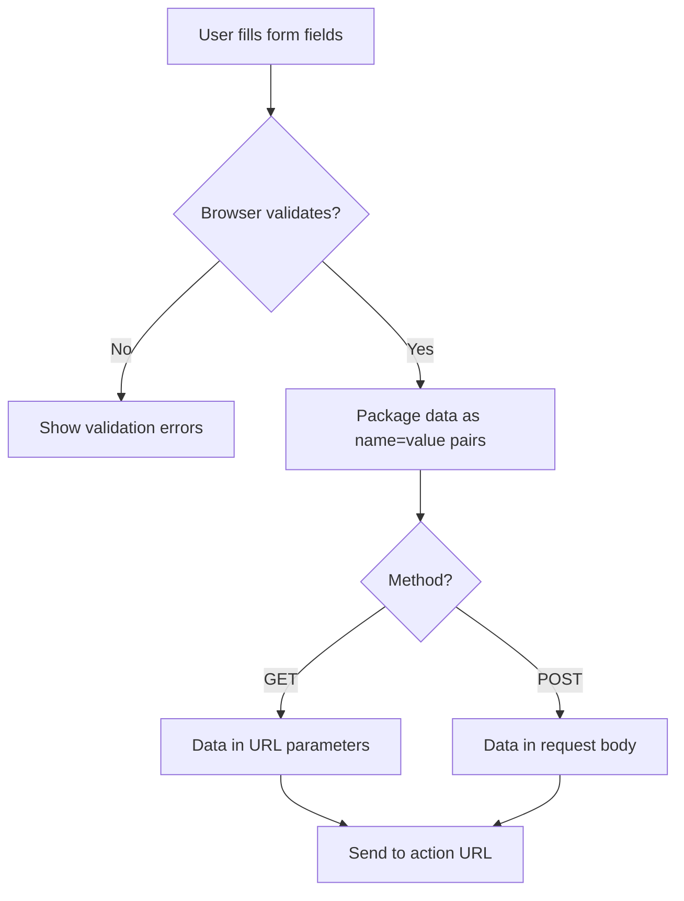
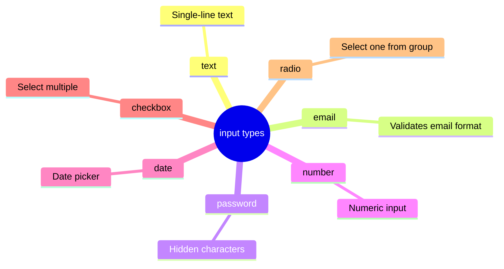

## Formatlar qism-1

> **Oldingi dars bilan bog'lanish:** o'tgan darsda biz ma'lumotlarni jadvallar orqali ko'rsatishni o'rgandik. Bugun formatlarga o'tamiz — foydalanuvchidan ma'lumot yig'ishning yagona usuli, toza HTML da. Oldin sahifalar faqat ma'lumot ko'rsatardi, endi uni qabul qilishni ham o'rganadi.

---

## Dars oxiriga qadar nimani o'rganasiz

- `<form>` tegi bilan forma yaratish va `action` hamda `method` atributlarini tushunish.
- Asosiy `input` turlarini ishlatish: text, email, password, number, date, checkbox, radio.
- `label` ni `for`/`id` orqali maydon bilan to'g'ri bog'lash.
- `placeholder` va `value` farqini tushunish.
- `required` orqali maydonlarni majburiy qilish.

---

## Dars davomiyligi

| Blok                                     | Mazmuni                                         |
| ---------------------------------------- | ----------------------------------------------- |
| 1. form tegi: action, method             | Nima uchun forma kerak, ma'lumotlar qayerga ketadi |
| 2. label va for/id                       | Yorliqni maydon bilan bog'lash — formalar qulayligining asosi |
| 3. input turlari qism 1: text, email, password | Matnli maydonlar                               |
| 4. input turlari qism 2: number, date    | Sonlar va sanalar                               |
| 5. checkbox va radio                     | "Bir nechtasini tanlash" va "bittasini tanlash" farqi |
| 6. Kichik topshiriq                      | Maydonni mustaqil yaratish                      |
| 7. placeholder vs value, required        | Yangi boshlovchilar ko'p adashadigan joy         |
| 8. Xulosalar va amaliy topshiriq         | Mustahkamlash — aloqa formasini yig'amiz         |

---

## Blok 1. `<form>` tegi: action va method

**Oddiy qilib aytganda:** qog'oz anketani tasavvur qiling, uni to'ldirasiz va ma'lum xonaga topshirasiz. HTML da forma shunday ishlaydi: foydalanuvchi maydonlarni to'ldiradi, yuborilganda brauzer ma'lumotlarni ma'lum manzilga "olib boradi" (odatiy serverga, ularni qayta ishlaydi).

```html
<form action="/submit" method="post">
    <!-- forma maydonlari shu yerda bo'ladi -->
</form>
```

- **`action`** — forma ma'lumotlarini qayerga yuborish kerak (qayta ishlovchi manzil — odatda PHP yozilgan serverdagi dastur; biz hali server dasturlashini o'rganmadik, shuning uchun bu darsda `action` "almashtiruvchi" bo'ladi).
- **`method`** — ma'lumotlarni qanday usulda yuborish. Ikki asosiy qiymat:
    - **`get`** — ma'lumotlar to'g'ridan-to'g'ri brauzer manzil satriga qo'shiladi (URL da ko'rinadi), shaxsiy ma'lumotlar yo'qidagi qidiruv formalariga mos keladi.
    - **`post`** — ma'lumotlar so'rov tanasida "ko'rinmasdan" yuboriladi, shaxsiy ma'lumotli formalar (ro'yxatdan o'tish, kirish, xabar yuborish) uchun mos — aynan `post` ni eng ko'p ishlatamiz.

**O'xshatish:** `get` — bu pochta openkiga savol yozish, uni har bir pochtachi yo'lda ko'radi. `post` — bu muhrlangan zarfda xabar yuborish.



**Bu dars uchun muhim:** server qismi bizda yo'q (biz toza HTML kursida server dasturlashini o'rganmaymiz), shuning uchun forma haqiqatan ham ma'lumotlarni hech qayerga "yubormaydi" — lekin biz uni to'g'ri quramiz, tuzilasi kelajakda serverga ulanishga tayyor bo'lishi uchun, agar veb-dasturlashni davom ettirsangiz.

---

## Blok 2. `<label>` va `for`/`id` bog'lanishi

Bu, ehtimol, bugungi darsning eng muhim mavzusi — ko'pchilik yangi boshlovchilar uni o'tkazib yuboradi, va bejiz.

**Oddiy qilib aytganda:** `<label>` — bu forma maydonining yorlig'i, masalan, ism maydoni yonidagi "Ism:" yozuvi. Lekin oddiy matnni maydon yoniga joylashtirish yetarli emas. Yorliqni aniq maydon bilan **bog'lash** kerak.

```html
<label for="username">Foydalanuvchi nomi:</label>
<input type="text" id="username" name="username">
```

Bog'lanishni tushuntiramiz:

- `<label>` ning `for` atributi bor, qiymati `"username"`.
- `<input>` ning `id` atributi bor, **aynan bir xil** qiymat bilan — `"username"`.

Ana shu qiymatlar mos kelishi yorliqni maydon bilan bog'laydi.

**Agar vizual jihatdan yorliq qaysi maydonga tegishliligini tushunish oson bo'lsa, nima uchun bu kerak:**

1. **Yorliqni bosish maydonni faollashtiradi.** Sinab ko'ring — agar bog'lanish to'g'ri o'rnatilgan bo'lsa, "Foydalanuvchi nomi:" matnini bosish kursori kiritish maydoniga qo'yadi. Bu kichik elementlar, masalan, checkbox lar (5-blok) uchun juda foydali — yonidagi matnni bosish kichik kvadratchaga aniq tegishdan qulayroq.
2. **Ekran o'quvchilari aynan shu bog'lanishdan foydalanadi.** Beksiz ko'zi ojiz foydalanuvchi kiritish maydoniga tushganda, nimani anglatishini tushunmaydi — ekran o'quvchisi shunchaki kontekstsiz "matn maydoni" deb aytadi.

### Muqobil usul — input ni label ichiga o'rab olish

```html
<label>
    Foydalanuvchi nomi:
    <input type="text" name="username">
</label>
```

Bu yerda `id`/`for` kerak emas — ichki joylashuv o'zi bog'lanishni yaratadi. Ikkala usul ham to'g'ri, lekin `for`/`id` orqali aniq usul (birinchi variant) murakkab veb-qurilishda ko'proq tarqalgan va bashorat qilinadigan hisoblanadi — bu kursda asosan uni ishlatamiz.

**`<input>` dagi `name` atributi:** e'tibor bering, maydonning `id` dan tashqari `name` atributi ham bor — bu `id` bilan **bir xil narsa emas**. `name` — maydon nomi, shu nom orqali ma'lumotlar forma yuborilganda serverga ketadi (serverdagi qayta ishlash aynan `name` bo'yicha o'qiydi). `id` — `<label>` bilan bog'lanish va stilizatsiya/skriptlar uchun ishlatiladi. Maydonda **ikkala** atribut bo'lishi kerak, ular (lekin shart emas) qiymatda mos kelishi mumkin.

---

### Yangi boshlovchilarning ko'p uchraydigan xatolari

| Xatolik                                                 | Qanday tuzatish                                                                               |
| ------------------------------------------------------- | --------------------------------------------------------------------------------------------- |
| `<label>` ni `<input>` yoniga `for`/`id` siz yozish    | Har doim aniq bog'lang: `label` da `for="ism"` va `input` da `id="ism"` bir xil qiymat bilan  |
| `id` va `name` ni adashtirish, faqat bittasini ishlatish | Maydonda ikkala atribut kerak: `id` — label bilan bog'lanish uchun, `name` — serverga ma'lumot yuborish uchun |
| Bir nechta turli maydon uchun bir xil `id` ishlatish    | 3-darsdan eslab qoling, `id` butun sahifada noyob bo'lishi kerak                              |

---

## Blok 3. `input` turlari qism 1: text, email, password

`<input>` tegi — 4-darsdagi `` kabi juftlikka kirmaydigan. Uning xulqi `type` atributiga qarab butunlay o'zgaradi.

### `type="text"` — oddiy bir qatorli matn maydoni

```html
<label for="fullname">To'liq ism:</label>
<input type="text" id="fullname" name="fullname">
```

Asosiy tur — shunchaki to'g'ri burchakli maydon, bir qatorda istalgan matnni kiritish uchun.

### `type="email"` — email maydoni

```html
<label for="email">Email:</label>
<input type="email" id="email" name="email">
```

Vizual jihatdan oddiy matn maydoniga o'xshaydi, lekin brauzer kiritilgan matn email ga o'xshashligini **avtomatik tekshiradi** (`@` va manzil tuzilishini o'z ichiga oladi) — noto'g'ri email bilan formani yuborishga urinilganda brauzer o'zi ogohlantirish ko'rsatadi, bitta qator JavaScript siz. Mobil qurilmalarda bunday maydon faollashtirilganda tezda `@` va `.com` ga kirish imkonini beruvchi maxsus klaviatura paydo bo'ladi.

### `type="password"` — parol maydoni

```html
<label for="password">Parol:</label>
<input type="password" id="password" name="password">
```

Foydalanuvchi kiritgan belgilar nuqta yoki yulduzcha sifatida ko'rsatiladi (••••••) — parol matni yelkasidan qarab turgan odamdan yashirin.

---

## Blok 4. `input` turlari qism 2: number, date

### `type="number"` — son maydoni

```html
<label for="age">Yosh:</label>
<input type="number" id="age" name="age" min="1" max="120">
```

Brauzer harflarni kiritishga ruxsat bermaydi, desktop da maydon yonida qiymatni oshirish/kamaytirish uchun kichik strelkalar paydo bo'ladi. `min` va `max` atributlari ruxsat etilgan diapazonni belgilaydi.

### `type="date"` — sana tanlash maydoni

```html
<label for="birthday">Tug'ilgan sana:</label>
<input type="date" id="birthday" name="birthday">
```

Brauzer o'zi sanani tanlash uchun qulay vizual kalendar ko'rsatadi — bitta qator qo'shimcha kod siz. Serverga ketadigan sana formati har doim standartlashtirilgan (`YYYY-MM-DD`), vizual jihatdan turli mamlakatlarda kalendar turlicha ko'rsatilsa ham.

---

### Yangi boshlovchilarning ko'p uchraydigan xatolari

|Xatolik|Qanday tuzatish|
|---|---|
|Email/sonlar uchun maxsus turlar o'rniga `type="text"` ishlatish|`type="email"`, `type="number"`, `type="date"` ishlating — ular kod qo'shmasdan ichki tekshiruv va qulay kiritish interfeysini beradi|
|`type="number"` uchun logik chegarasi bor joylarda `min`/`max` ni unutish|Maqbul chegaralarni ko'rsating (yosh, mahsulot soni va h.k.)|
|`type="email"` o'zi xabar "yuboradi" deb kutish|Bu faqat matn formatini tekshirish — yuborish faqat forma/server logikasi orqali amalga oshiriladi|

---

## Blok 5. `checkbox` va radio

Bu bir-biriga o'xshash, lekin prinsipial jihatdan turli maydon turlari — ularni adashtirish yangi boshlovchilarning eng ko'p uchraydigan xatolaridan biri.

### `type="checkbox"` — bir nechtasini tanlash mumkin (yoki hech birini)

```html
<p>Qiziqayotgan mavzuingizni tanlang:</p>

<input type="checkbox" id="html" name="topics" value="html">
<label for="html">HTML</label><br>

<input type="checkbox" id="css" name="topics" value="css">
<label for="css">CSS</label><br>

<input type="checkbox" id="js" name="topics" value="js">
<label for="js">JavaScript</label>
```

Har bir checkbox boshqalardan mustaqil. Foydalanuvchi istalgan sonida variantlarni belgilashi mumkin, jumladan hech birini.

**O'xshatish:** xaridlar ro'yxati, unda allaqachon sotib olingan narsalarni belgilaysiz — istalgan miqdordagi bandlarni belgilash mumkin, ular bir-biriga xalaqit bermaydi.

### `type="radio"` — guruhdan faqat bitta variant tanlash mumkin

```html
<p>Tayyorgarlik darajangizni tanlang:</p>

<input type="radio" id="beginner" name="level" value="beginner">
<label for="beginner">Boshlang'ich</label><br>

<input type="radio" id="intermediate" name="level" value="intermediate">
<label for="intermediate">O'rta</label><br>

<input type="radio" id="advanced" name="level" value="advanced">
<label for="advanced">Yuqori</label>
```

**Radio tugmalarini guruh qiladigan kalit moment:** barcha variantlarning **bir xil `name` atributi** bor (misolda — `name="level"`). Aynan `name` ning mos kelishi brauzerga "bu bitta savolning variantlari — bittasini tanlash avtomatik boshqalarini tanlashni bekor qiladi" degan signal beradi. Shu bilan birga har bir variantning `id` si **turli** (bo'lmasa label bilan bog'lanish buziladi).

**O'xshatish:** eski radioda kanal tanlash tugmalari — yangi tugmani bosish avtomatik oldingisini "qaytaradi", chunki radio bir vaqtda faqat bitta kanalni ijro eta oladi.

### checkbox/radio da `value` qiymati

`value` atributi tanlangan variant serverga qanday qiymat yuborishini belgilaydi. Foydalanuvchiga ko'rinadigan matn `<label>` orqali belgilanadi, `value` emas — bu turli narsalar.

---

### Yangi boshlovchilarning ko'p uchraydigan xatolari

| Xatolik                                                                               | Qanday tuzatish                                                                                             |
| ------------------------------------------------------------------------------------- | ----------------------------------------------------------------------------------------------------------- |
| "Barcha mos variantlarni tanlang" savollari uchun `radio` o'rniga `checkbox` ishlatish | Ko'p tanlov uchun — `checkbox`, bitta tanlov uchun — `radio`                                                |
| Bir guruh radio tugmalariga turlicha `name` qiymatlari berish                          | Barcha radio tugmalari bir guruhdan **bir xil** `name` ga ega bo'lishi kerak — bo'lmasa guruh sifatida ishlamaydi |
| Checkbox maydonlariga bir xil `id` berish                                              | Har bir maydonning o'z noyob `id` si bo'lishi kerak, `name` mos kelmasa ham (masalan, `topics` misolida)    |

---

## Kichik topshiriq

Namunalarga qaramasdan, "Sevimli ichimligingiz" savoli uchun "Choy", "Kofe", "Sharbat" variantlari bilan uchta radio tugmadan iborat guruh yarating — to'g'ri `label`/`id` bog'lanishlari va umumiy `name` bilan.

**Yechim:**

```html
<p>Sevimli ichimligingiz:</p>

<input type="radio" id="tea" name="drink" value="tea">
<label for="tea">Choy</label><br>

<input type="radio" id="coffee" name="drink" value="coffee">
<label for="coffee">Kofe</label><br>

<input type="radio" id="juice" name="drink" value="juice">
<label for="juice">Sharbat</label>
```



---

## Blok 7. `placeholder` vs `value` va `required`

Bu yana bir ko'p adashiladigan joy — ikki atribut, ikkalasi ham maydon ichida matn ko'rsatadi, lekin butunlay turlicha ishlaydi.

### `placeholder` — namuna ko'rsatma, kiritishda yo'qoladi

```html
<label for="search">Qidirish:</label>
<input type="text" id="search" name="search" placeholder="Masalan: HTML kursi">
```

`placeholder` matni **bo'sh maydon ichida kulrang rangda** kiritish formati ko'rsatmasi sifatida ko'rsatiladi — va foydalanuvchi yozishni boshlaganda **avtomatik yo'qoladi**. Foydalanuvchi hech narsa kiritmagan bo'lsa, u serverga **yuborilmaydi** — maydon bo'sh hisoblanadi.

### `value` — maydonning haqiqiy qiymati, yuborilganda qoladi

```html
<label for="city">Shahar:</label>
<input type="text" id="city" name="city" value="Toshkent">
```

`value` matni — bu **maydonning haqiqiy tarkibi**, oddiy (kulrang emas) matnda ko'rsatiladi, go'yo foydalanuvchi uni o'zi kiritgandek. Foydalanuvchi hech narsa o'zgartirmasa ham, u forma bilan birga serverga **yuboriladi**. Ko'pincha oldindan standart qiymatni qo'yish uchun ishlatiladi (masalan, mavjud foydalanuvchi ma'lumotlarini tahrirlashda).

### Amalda taqqoslash

```html
<!-- placeholder: format ko'rsatmasi, kiritishda yo'qoladi, maydon bo'sh bo'lsa yuborilmaydi -->
<input type="text" placeholder="Ismingizni kiriting">

<!-- value: haqiqiy oldindan to'ldirilgan qiymat, o'zgartirmasangiz o'zgacha yuboriladi -->
<input type="text" value="Mehmon">
```

**O'xshatish:** `placeholder` — bu qog'oz shaklda qalam bilan yozilgan xira yozuv "ismingizni shu yerga yozing", u to'ldirilgan hujjatning qismi hisoblanmaydi. `value` — bu siyoh bilan yozilgan matn, hujjatda qoladi, uni tegmasangiz ham.

### `required` — majburiy maydon

```html
<label for="email">Email:</label>
<input type="email" id="email" name="email" required>
```

`required` atributi (qiymatsiz yoziladi) maydonni to'ldirish uchun majburiy qiladi — bo'sh majburiy maydon bilan formani yuborishga urinilganda brauzer o'zi ogohlantirish ko'rsatadi va formani yuborishga ruxsat bermaydi, yana bitta qator JavaScript siz.

---

### Yangi boshlovchilarning ko'p uchraydigan xatolari

| Xatolik                                                                                     | Qanday tuzatish                                                                                               |
| ------------------------------------------------------------------------------------------ | ------------------------------------------------------------------------------------------------------------- |
| Maydon yorlig'i o'rniga `placeholder` ni ishlatish                                         | `placeholder` format ko'rsatmasi, `label` almashtirmaydi; maydon yorlig'i har doim `<label>` orqali bo'lishi kerak |
| `placeholder` va `value` ni adashtirish — placeholder forma bilan yuboriladi deb kutish     | Eslab qoling: `placeholder` yo'qoladi va yuborilmaydi, `value` — haqiqiy tarkib, har doim yuboriladi           |
| Haqiqatan majburiy maydonlar uchun `required` ni unutish (masalan, ro'yxatdan o'tishda email) | Maydon mantiqan bo'sh bo'la olmaydigan joylarga `required` qo'shing                                             |

---

## Dars xulosalari

Bugun siz o'rgandingiz:

- `action` (qayerga yuborish) va `method` (`get`/`post`, qanday yuborish) atributlari bilan `<form>` — barcha maydonlar uchun konteyner.
- `<label>` `for`/`id` orqali maydon bilan bog'lanishi shart — bu bosish qulayligiga va ekran o'quvchilari uchun qulaylikka ta'sir qiladi.
- Maxsus `input` turlari: `text`, `email` (format tekshiruvi), `password` (yashirin matn), `number` (faqat raqamlar), `date` (vizual kalendar).
- `checkbox` — bir nechta variantni tanlash mumkin (mustaqil maydonlar), `radio` — guruhdan faqat bitta (bir xil `name` orqali birlashtirilgan).
- `placeholder` — yo'qoluvchi ko'rsatma, forma bilan yuborilmaydi; `value` — maydonning haqiqiy tarkibi, har doim yuboriladi.
- `required` maydonni bitta qator JavaScript siz majburiy qiladi.
