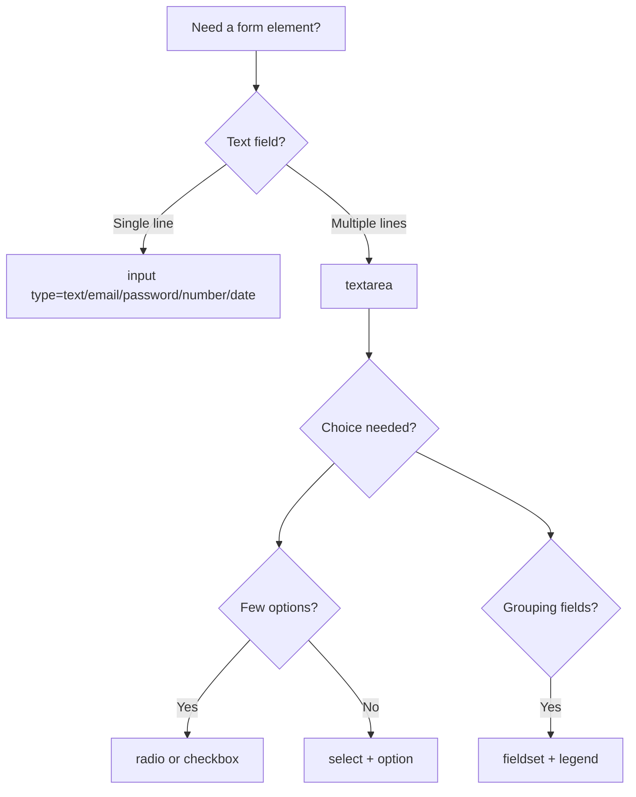

## Forms part 2

> **Connection to the previous lesson:** in the previous lesson we covered basic form fields (text, email, password, number, date, checkbox, radio) and the `label`/`for`/`id` connection. Today we finish the remaining form elements and learn to group fields and validate input without JavaScript.



---

## What you will learn by the end of the lesson

- Create dropdown lists using `select`/`option`, group options with `optgroup`.
- Use `textarea` for multi-line text.
- Group related form fields using `fieldset`/`legend`.
- Understand the difference between `button` and `input type="submit"`.
- Configure built-in validation: `min`, `max`, `pattern`, `maxlength`.

---

## Lesson timeline

| Block                                    | Content                          |
| --------------------------------------- | --------------------------------- |
| 1. select, option, optgroup             | Dropdown lists                    |
| 2. textarea                             | Multi-line text                   |
| 3. fieldset and legend                  | Grouping form fields              |
| 4. Mini-task                            | Build a select on your own        |
| 5. button vs input type="submit"        | Form submission, approach differences |
| 6. Validation: min/max/pattern/maxlength | Built-in data checking           |
| 7. Summary and practical task           | Build a full registration form    |

---

## Block 1. `select`, `option`, `optgroup`

**In simple terms:** if the `radio` buttons from the previous lesson work well for 2-4 options, when there are many options (e.g., a list of countries or cities), radio buttons take up too much screen space. For this case, there's the dropdown list - a compact list that only expands on click.

```html
<label for="city">City:</label>
<select id="city" name="city">
    <option value="tashkent">Tashkent</option>
    <option value="almalyk">Almalyk</option>
    <option value="samarkand">Samarkand</option>
    <option value="bukhara">Bukhara</option>
</select>
```

Let's break down the tags:

- **`<select>`** - wrapper for the entire dropdown list, with a required `name` (for sending to the server) and `id` (for connecting to `label`).
- **`<option>`** - each individual option inside the list. The `value` attribute is what gets sent to the server; the visible text between the tags is what the user sees.

### Default value via `selected`

```html
<select id="city" name="city">
    <option value="tashkent">Tashkent</option>
    <option value="almalyk" selected>Almalyk</option>
    <option value="samarkand">Samarkand</option>
</select>
```

The `selected` attribute (without a value, like `required` from the previous lesson) marks the option that will be shown by default when the page loads - without the user clicking.

### Multiple selection via `multiple`

```html
<label for="subjects">Choose subjects (multiple possible):</label>
<select id="subjects" name="subjects" multiple>
    <option value="html">HTML</option>
    <option value="css">CSS</option>
    <option value="js">JavaScript</option>
</select>
```

The `multiple` attribute allows the user to select several options at once (usually by holding Ctrl/Cmd while clicking). This is a rare but useful case - essentially a visual alternative to a group of checkboxes.

### `<optgroup>` - grouping options

When there are very many options, they can be split into labeled groups:

```html
<label for="course">Choose a course:</label>
<select id="course" name="course">
    <optgroup label="Frontend">
        <option value="html">HTML</option>
        <option value="css">CSS</option>
        <option value="js">JavaScript</option>
    </optgroup>
    <optgroup label="Backend">
        <option value="php">PHP</option>
        <option value="mysql">MySQL</option>
    </optgroup>
</select>
```

`<optgroup>` is not a selectable option on its own - it's just a visual heading-separator (bold, not clickable itself) inside the dropdown list. The `label` attribute sets the text of this heading.

**Analogy:** `<select>` with multiple `<optgroup>` is like a restaurant menu divided into "Soups", "Hot Dishes", "Desserts" - you can't select the sections themselves, they just help you navigate among a large number of dishes.

---

### Common beginner mistakes

| Mistake                                                                                   | How to fix                                                                                                                            |
| ----------------------------------------------------------------------------------------- | -------------------------------------------------------------------------------------------------------------------------------------- |
| Forgetting `value` on `<option>`                                                          | Without `value`, the visible option text gets sent to the server - sometimes inconvenient (e.g., for long text); set `value` intentionally |
| Using multiple `selected` in one `<select>` without `multiple`                           | Without `multiple`, you can only mark `selected` on one `<option>`                                                                     |
| Confusing `<optgroup>` with a regular `<option>`, trying to make it a clickable option    | `<optgroup>` is only a visual grouping, it cannot be selected on its own                                                               |

---

## Block 2. `<textarea>` - multi-line text

A regular `<input type="text">` from the previous lesson is a single-line field. When you need to enter long text (a comment, message, review), you use `<textarea>`.

```html
<label for="message">Message:</label>
<textarea id="message" name="message" rows="5" cols="40"></textarea>
```

Important difference from `<input>`: **`<textarea>` is a paired tag**, not self-closing. Initial text (if needed) goes between the opening and closing tags, not in a `value` attribute (`textarea` doesn't have a `value` attribute at all):

```html
<textarea id="bio" name="bio" rows="4" cols="40">Tell us a little about yourself...</textarea>
```

**Note:** if you want a placeholder hint (which disappears on input, as we covered in the previous lesson), use the `placeholder` attribute, not text inside the tag:

```html
<textarea id="bio" name="bio" rows="4" cols="40" placeholder="Tell us a little about yourself..."></textarea>
```

- **`rows`** - approximate height of the field in text lines.
- **`cols`** - approximate width of the field in characters.

Both attributes set the **initial** size - in many browsers the user can additionally resize `textarea` manually by dragging the corner in the bottom-right of the field.

---

### Common beginner mistakes

| Mistake                                                                    | How to fix                                                                                                                      |
| -------------------------------------------------------------------------- | -------------------------------------------------------------------------------------------------------------------------------- |
| Trying to set initial text via `value="..."`                               | `<textarea>` has no `value` attribute - text is written between the opening and closing tags                                     |
| Confusing text content (stays on submit) and `placeholder` (disappears)    | If you need a format hint - use `placeholder`; if you need a real pre-filled value - write it between the tags                   |
| Forgetting the closing `</textarea>` tag                                   | `textarea` is a paired tag, don't forget the closing tag even if the field is initially empty                                     |

---

## Block 3. `<fieldset>` and `<legend>` - grouping form fields

When a form becomes large (e.g., a registration with several logical sections: "Personal Data", "Contacts", "Password"), it's useful to visually and semantically group related fields.

```html
<fieldset>
    <legend>Personal Data</legend>

    <label for="firstname">First name:</label>
    <input type="text" id="firstname" name="firstname"><br>

    <label for="lastname">Last name:</label>
    <input type="text" id="lastname" name="lastname">
</fieldset>

<fieldset>
    <legend>Contacts</legend>

    <label for="email">Email:</label>
    <input type="email" id="email" name="email"><br>

    <label for="phone">Phone:</label>
    <input type="text" id="phone" name="phone">
</fieldset>
```

- **`<fieldset>`** - wrapper for a group of related fields; the browser displays it with a border around the group by default.
- **`<legend>`** - label/heading for this group, displayed right "on the border" of the `fieldset` (visually cuts into the top edge of the border).

**Especially useful for radio groups:** since several radio buttons are semantically one "question", it makes sense to wrap them in a `fieldset` with a `legend` that states the question itself:

```html
<fieldset>
    <legend>Your skill level</legend>

    <input type="radio" id="beginner" name="level" value="beginner">
    <label for="beginner">Beginner</label><br>

    <input type="radio" id="intermediate" name="level" value="intermediate">
    <label for="intermediate">Intermediate</label><br>

    <input type="radio" id="advanced" name="level" value="advanced">
    <label for="advanced">Advanced</label>
</fieldset>
```

**Why this matters more than just a visual border:** a screen reader reading a radio button inside a `fieldset` with `legend` reads both the `legend` text and the specific option label - for example, "Your skill level, Beginner" - this gives the user full context, not an isolated word "Beginner" without understanding which question it answers.

---

### Common beginner mistakes

| Mistake                                                                          | How to fix                                                                                            |
| -------------------------------------------------------------------------------- | ------------------------------------------------------------------------------------------------------ |
| Using `fieldset` without `legend`                                               | `legend` is a required semantic part of the group, don't skip it                                       |
| Not placing `legend` as the first element inside `fieldset`                     | `legend` must come right after the opening `<fieldset>` tag                                             |
| Wrapping the entire form in `fieldset` without identifying semantic groups       | Use `fieldset` specifically for logical field blocks, not as a wrapper "for aesthetics" around everything |

---

## Mini-task

Build a "Choose a country" dropdown on your own with three options (Uzbekistan, Kazakhstan, Kyrgyzstan), with Uzbekistan selected by default.

**Solution:**

```html
<label for="country">Country:</label>
<select id="country" name="country">
    <option value="uz" selected>Uzbekistan</option>
    <option value="kz">Kazakhstan</option>
    <option value="kg">Kyrgyzstan</option>
</select>
```

---

## Block 5. `button` vs `input type="submit"`

Both elements can submit a form, but there are important differences between them.

### `<input type="submit">`

```html
<input type="submit" value="Submit form">
```

The button text is set via the `value` attribute (as we've seen with regular fields). It's a self-closing tag - you can't place an icon or other HTML markup inside, only plain text via `value`.

### `<button>`

```html
<button type="submit">Submit form</button>
```

`<button>` is a **paired** tag; text (or even more complex content - icons, nested tags) goes between the opening and closing tags:

```html
<button type="submit">
    <strong>Submit</strong> form
</button>
```

### The `type` attribute on `<button>` - an important detail

`<button>` has three possible `type` values, and this is a common source of errors:

```html
<button type="submit">Submit</button>
<button type="reset">Clear form</button>
<button type="button">Regular button (does nothing on its own)</button>
```

- **`type="submit"`** - submits the form (the default value if `type` is not specified explicitly).
- **`type="reset"`** - resets all form fields back to their initial values.
- **`type="button"`** - a regular button with no built-in behavior; used when button behavior will be added later via JavaScript (in this course we won't actively use these buttons since JavaScript isn't part of the curriculum, but it's important to know this value exists).

```mermaid
flowchart LR
    A["<button>"] --> B{"type attribute?"}
    B -->|"type=submit"| C["Sends form data"]
    B -->|"type=reset"| D["Clears all fields"]
    B -->|"type=button"| E["No default behavior - JS only"]
    F["<input>"] --> G{"type attribute?"}
    G -->|"type=submit"| H["Sends form data"]
    G -->|"type=reset"| I["Clears all fields"]
    G -->|"type=button"| J["No default behavior"]
```

**Important warning:** if `<button>` is inside `<form>` and you **didn't specify** `type` explicitly, the browser treats it as `type="submit"` by default. This can lead to unexpected form submission when you just wanted "a button for something else." **Rule: always specify `type` on `<button>` explicitly.**



---
### Common beginner mistakes

| Mistake                                                                                                                     | How to fix                                                                |
| --------------------------------------------------------------------------------------------------------------------------- | -------------------------------------------------------------------------- |
| Not specifying `type` on `<button>`, expecting it to be "just a button"                                                     | Always explicitly set `type="submit"`, `type="reset"`, or `type="button"`  |
| Trying to nest HTML inside `input type="submit"`                                                                            | If you need a button with complex content - use `<button>`                 |
| Using `type="reset"` without clear necessity - users often accidentally click it and lose all entered text                   | Use `reset` carefully, only when truly needed in your form                  |

---

## Block 6. Built-in validation: `min`, `max`, `pattern`, `maxlength`

We partially covered validation in the previous lesson (`required`, `min`/`max` for `type="number"`). Today we expand the toolkit.

### `min` and `max` - for numbers and dates

```html
<label for="age">Age:</label>
<input type="number" id="age" name="age" min="16" max="99">

<label for="event-date">Event date:</label>
<input type="date" id="event-date" name="event-date" min="2026-01-01" max="2026-12-31">
```

The browser won't allow submitting the form if the value falls outside the specified bounds, and will show the user a popup warning.

### `maxlength` - text length limit

```html
<label for="username">Username (max 20 characters):</label>
<input type="text" id="username" name="username" maxlength="20">

<label for="comment">Comment (max 500 characters):</label>
<textarea id="comment" name="comment" maxlength="500"></textarea>
```

`maxlength` physically prevents entering more than the specified number of characters - unlike `min`/`max`, here exceeding the limit is simply impossible to type, not "rejected on submit."

### `pattern` - template validation (regular expression)

`pattern` is the most powerful but also the most complex validation tool. It uses **regular expressions** - a special language for describing text templates. We won't dive deep into regular expression syntax in this course (that's a separate big topic), but we'll go through several practical examples.

**Example: only digits, exactly 7 characters (a sample student ID format):**

```html
<label for="student-id">Student ID number (7 digits):</label>
<input type="text" id="student-id" name="student-id" pattern="[0-9]{7}" title="Enter exactly 7 digits">
```

Breaking down the `[0-9]{7}` pattern: `[0-9]` means "any digit from 0 to 9", `{7}` means "exactly 7 times in a row."

**Example: only Cyrillic letters for a name (no digits or Latin):**

```html
<label for="name">Name (Cyrillic only):</label>
<input type="text" id="name" name="name" pattern="[А-Яа-яЁё\s]+" title="Enter name using Cyrillic only">
```

**Important note about the `title` attribute next to `pattern`:** it's not technically required, but strongly recommended - the browser will show the `title` text in a popup hint when a validation error occurs, explaining what exactly needs to be entered. Without `title`, the user will only see a generic "Pattern not matched," which is of little help.

**Important caveat for beginners:** writing advanced regular expressions is an advanced skill that in practice often requires separate study or finding ready-made templates (e.g., for validating a phone number for a specific country). In this lesson, it's important to understand the **principle** of how `pattern` works, not to memorize all possible patterns by heart.

---

### Common beginner mistakes

| Mistake|How to fix|
|---|---|
|Using `pattern` without `title`|Add `title` with a clear explanation of what should be entered|
|Expecting `min`/`max`/`pattern`/`required` to protect data 100% (e.g., from malicious input)|Built-in HTML validation is about user convenience, not security; real data protection must always be duplicated on the server side (that's a topic for future courses, not part of pure HTML curriculum)|
|Setting `maxlength` too small for real data (e.g., `maxlength="5"` for a name)|Think through realistic limits by testing with different data examples|

---

## Lesson summary

Today you learned:

- `<select>`/`<option>` create a dropdown list, `<optgroup>` groups options, `selected` sets the default value, `multiple` allows selecting several options.
- `<textarea>` is a paired tag for multi-line text; initial text goes between tags, not via `value`.
- `<fieldset>`/`<legend>` semantically group related form fields - especially useful for radio button groups.
- `<button>` is more flexible than `<input type="submit">` - supports nested content, but requires explicit `type` specification.
- `min`/`max` limit number and date ranges, `maxlength` limits text length, `pattern` validates input against a template (with required `title` for a clear hint).

➡ **Next lesson:** [Accessibility (a11y)](../../Lesson-8/en/Accessibility%20(a11y).md)
