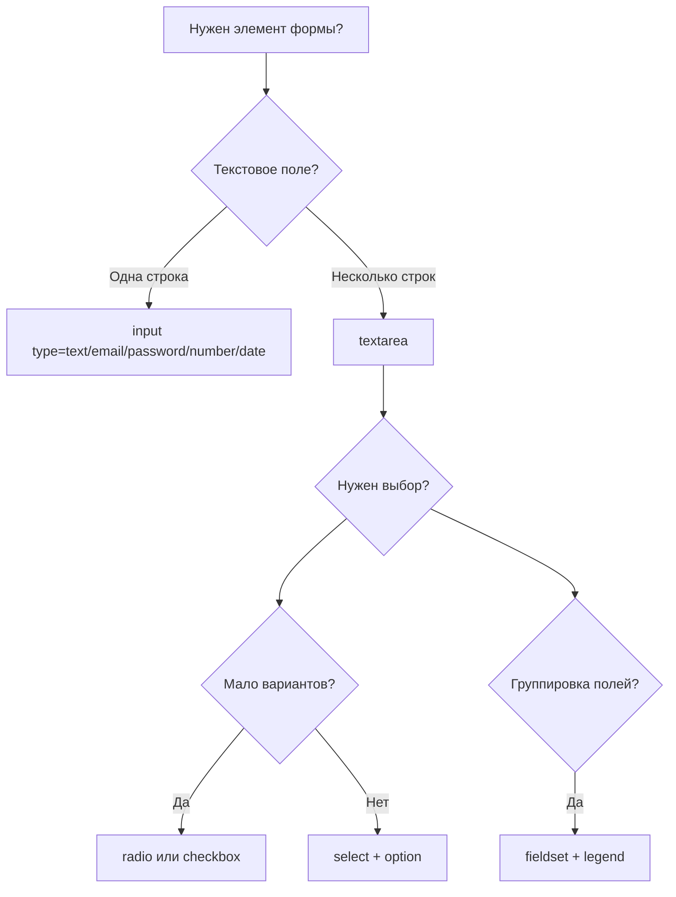

## Формы ч-2

> **Связь с предыдущим уроком:** на прошлом уроке мы освоили базовые поля форм (text, email, password, number, date, checkbox, radio) и связку `label`/`for`/`id`. Сегодня добираем оставшиеся элементы форм и учимся группировать поля и валидировать ввод без JavaScript.



---

## Чему вы научитесь к концу урока

- Создавать выпадающие списки через `select`/`option`, группировать варианты через `optgroup`.
- Использовать `textarea` для многострочного текста.
- Группировать связанные поля формы через `fieldset`/`legend`.
- Понимать разницу между `button` и `input type="submit"`.
- Настраивать встроенную валидацию: `min`, `max`, `pattern`, `maxlength`.

---

## Хронометраж урока

| Блок                                    | Содержание                        |
| --------------------------------------- | --------------------------------- |
| 1. select, option, optgroup             | Выпадающие списки                 |
| 2. textarea                             | Многострочный текст               |
| 3. fieldset и legend                    | Группировка полей формы           |
| 4. Мини-задание                         | Собрать select самостоятельно     |
| 5. button vs input type="submit"        | Отправка формы, разница подходов  |
| 6. Валидация: min/max/pattern/maxlength | Встроенная проверка данных        |
| 7. Итоги и практическое задание         | Собираем полную форму регистрации |

---

## Блок 1. `select`, `option`, `optgroup`

**Простыми словами:** если `radio`-кнопки из прошлого урока хороши для 2-4 вариантов, то когда вариантов много (например, список стран или городов), radio-кнопки займут слишком много места на экране. Для этого случая существует выпадающий список - компактный список, который разворачивается только по клику.

```html
<label for="city">Город:</label>
<select id="city" name="city">
    <option value="tashkent">Ташкент</option>
    <option value="almalyk">Алмалык</option>
    <option value="samarkand">Самарканд</option>
    <option value="bukhara">Бухара</option>
</select>
```

Разберём теги:

- **`<select>`** - обёртка всего выпадающего списка, с обязательным `name` (для отправки на сервер) и `id` (для связи с `label`).
- **`<option>`** - каждый отдельный вариант внутри списка. Атрибут `value` - то, что уйдёт на сервер, видимый текст между тегами — то, что увидит пользователь.

### Значение по умолчанию через `selected`

```html
<select id="city" name="city">
    <option value="tashkent">Ташкент</option>
    <option value="almalyk" selected>Алмалык</option>
    <option value="samarkand">Самарканд</option>
</select>
```

Атрибут `selected` (без значения, как `required` из прошлого урока) отмечает вариант, который будет показан по умолчанию при загрузке страницы - без клика пользователя.

### Множественный выбор через `multiple`

```html
<label for="subjects">Выберите предметы (можно несколько):</label>
<select id="subjects" name="subjects" multiple>
    <option value="html">HTML</option>
    <option value="css">CSS</option>
    <option value="js">JavaScript</option>
</select>
```

Атрибут `multiple` позволяет пользователю выбрать сразу несколько вариантов (обычно зажимая Ctrl/Cmd при клике). Это редкий, но полезный случай - по сути, визуальная альтернатива группе чекбоксов.

### `<optgroup>` - группировка вариантов

Когда вариантов очень много, их можно разбить на подписанные группы:

```html
<label for="course">Выберите курс:</label>
<select id="course" name="course">
    <optgroup label="Frontend">
        <option value="html">HTML</option>
        <option value="css">CSS</option>
        <option value="js">JavaScript</option>
    </optgroup>
    <optgroup label="Backend">
        <option value="php">PHP</option>
        <option value="mysql">MySQL</option>
    </optgroup>
</select>
```

`<optgroup>` не является самостоятельно выбираемым вариантом - это просто визуальный заголовок-разделитель (жирным, без возможности клика по нему самому) внутри выпадающего списка, атрибут `label` задаёт текст этого заголовка.

**Аналогия:** `<select>` со множеством `<optgroup>` - это как меню ресторана, разбитое на разделы "Супы", "Горячее", "Десерты" - сами разделы выбрать нельзя, они просто помогают ориентироваться среди большого количества блюд.

---

### Частые ошибки новичков

| Ошибка                                                                                | Как исправить                                                                                                                          |
| ------------------------------------------------------------------------------------- | -------------------------------------------------------------------------------------------------------------------------------------- |
| Забывают `value` у `<option>`                                                         | Без `value` на сервер уйдёт видимый текст варианта - иногда это неудобно (например, для длинного текста); указывайте `value` осознанно |
| Используют несколько `selected` в одном `<select>` без `multiple`                     | Без `multiple` можно отметить `selected` только у одного `<option>`                                                                    |
| Путают `<optgroup>` с обычным `<option>`, пытаются сделать его кликабельным вариантом | `<optgroup>` - только визуальная группировка, сам по себе не выбирается                                                                |

---

## Блок 2. `<textarea>` - многострочный текст

Обычный `<input type="text">` из прошлого урока - однострочное поле. Когда нужно ввести длинный текст (комментарий, сообщение, отзыв) - используется `<textarea>`.

```html
<label for="message">Сообщение:</label>
<textarea id="message" name="message" rows="5" cols="40"></textarea>
```

Важное отличие от `<input>`: **`<textarea>` - парный тег**, а не непарный. Начальный текст (если нужен) помещается между открывающим и закрывающим тегом, а не в атрибут `value` (у `textarea` вообще нет атрибута `value`):

```html
<textarea id="bio" name="bio" rows="4" cols="40">Расскажите немного о себе...</textarea>
```

**Внимание:** если вы хотите именно подсказку-плейсхолдер (которая исчезнет при вводе, как мы разобрали в прошлом уроке), используйте атрибут `placeholder`, а не текст внутри тега:

```html
<textarea id="bio" name="bio" rows="4" cols="40" placeholder="Расскажите немного о себе..."></textarea>
```

- **`rows`** — примерная высота поля в строках текста.
- **`cols`** — примерная ширина поля в символах.

Оба атрибута задают **начальный** размер — пользователь во многих браузерах может дополнительно растягивать `textarea` вручную за уголок в правом нижнем углу поля.

---

### Частые ошибки новичков

| Ошибка                                                                     | Как исправить                                                                                                                    |
| -------------------------------------------------------------------------- | -------------------------------------------------------------------------------------------------------------------------------- |
| Пытаются задать начальный текст через `value="..."`                        | У `<textarea>` нет атрибута `value` - текст пишется между открывающим и закрывающим тегом                                        |
| Путают текст-содержимое (остаётся при отправке) и `placeholder` (исчезает) | Если нужна подсказка формата - используйте `placeholder`; если нужно реальное предзаполненное значение - пишите его между тегами |
| Забывают закрывающий тег `</textarea>`                                     | `textarea` - парный тег, не забывайте про закрывающий тег, даже если поле изначально пустое                                      |

---

## Блок 3. `<fieldset>` и `<legend>` - группировка полей формы

Когда форма становится большой (например, регистрация с несколькими логическими разделами: "Личные данные", "Контакты", "Пароль"), полезно визуально и семантически объединить связанные поля.

```html
<fieldset>
    <legend>Личные данные</legend>

    <label for="firstname">Имя:</label>
    <input type="text" id="firstname" name="firstname"><br>

    <label for="lastname">Фамилия:</label>
    <input type="text" id="lastname" name="lastname">
</fieldset>

<fieldset>
    <legend>Контакты</legend>

    <label for="email">Email:</label>
    <input type="email" id="email" name="email"><br>

    <label for="phone">Телефон:</label>
    <input type="text" id="phone" name="phone">
</fieldset>
```

- **`<fieldset>`** - обёртка группы связанных полей, браузер по умолчанию отображает её с рамкой вокруг группы.
- **`<legend>`** - подпись/заголовок для этой группы, отображается прямо "на рамке" `fieldset` (визуально врезается в верхнюю границу рамки).

**Особенно полезно для радио-групп:** так как несколько radio-кнопок семантически являются одним "вопросом", логично обернуть их в `fieldset` с `legend`, задающим сам вопрос:

```html
<fieldset>
    <legend>Ваш уровень подготовки</legend>

    <input type="radio" id="beginner" name="level" value="beginner">
    <label for="beginner">Начинающий</label><br>

    <input type="radio" id="intermediate" name="level" value="intermediate">
    <label for="intermediate">Средний</label><br>

    <input type="radio" id="advanced" name="level" value="advanced">
    <label for="advanced">Продвинутый</label>
</fieldset>
```

**Почему это важнее, чем просто визуальная рамка:** скринридер, читая radio-кнопку внутри `fieldset` с `legend`, произносит и текст `legend`, и подпись конкретного варианта - например, "Ваш уровень подготовки, Начинающий" - это даёт пользователю полный контекст, а не изолированное слово "Начинающий" без понимания, на какой вопрос это ответ.

---

### Частые ошибки новичков

| Ошибка                                                                          | Как исправить                                                                                          |
| ------------------------------------------------------------------------------- | ------------------------------------------------------------------------------------------------------ |
| Используют `fieldset` без `legend`                                              | `legend` - обязательная смысловая часть группы, не пропускайте её                                      |
| Помещают `legend` не первым элементом внутри `fieldset`                         | `legend` должен идти сразу после открывающего тега `<fieldset>`                                        |
| Оборачивают в `fieldset` вообще всю форму целиком без выделения смысловых групп | Используйте `fieldset` именно для логических блоков полей, а не как обёртку "для красоты" вокруг всего |

---

## Мини-задание

Соберите самостоятельно выпадающий список "Выберите страну" с тремя вариантами (Узбекистан, Казахстан, Кыргызстан), где Узбекистан выбран по умолчанию.

**Решение:**

```html
<label for="country">Страна:</label>
<select id="country" name="country">
    <option value="uz" selected>Узбекистан</option>
    <option value="kz">Казахстан</option>
    <option value="kg">Кыргызстан</option>
</select>
```

---

## Блок 5. `button` vs `input type="submit"`

Оба элемента могут отправлять форму, но между ними есть важные различия.

### `<input type="submit">`

```html
<input type="submit" value="Отправить форму">
```

Текст на кнопке задаётся через атрибут `value` (как мы уже видели у обычных полей). Это непарный тег - внутрь нельзя поместить, например, иконку или другую HTML-разметку, только простой текст через `value`.

### `<button>`

```html
<button type="submit">Отправить форму</button>
```

`<button>` - **парный** тег, текст (или даже более сложное содержимое - иконки, вложенные теги) помещается между открывающим и закрывающим тегами:

```html
<button type="submit">
    <strong>Отправить</strong> форму
</button>
```

### Атрибут `type` у `<button>` - важная деталь

У `<button>` есть три возможных значения `type`, и это частый источник ошибок:

```html
<button type="submit">Отправить</button>
<button type="reset">Очистить форму</button>
<button type="button">Обычная кнопка (ничего не делает сама по себе)</button>
```

- **`type="submit"`** - отправляет форму (значение по умолчанию, если `type` не указан явно).
- **`type="reset"`** - очищает все поля формы обратно к исходным значениям.
- **`type="button"`** - обычная кнопка без встроенного поведения; используется, когда поведение кнопки будет добавлено позже через JavaScript (в этом курсе мы такие кнопки не будем активно использовать, так как JavaScript не входит в программу, но важно знать про существование этого значения).

```mermaid
flowchart LR
    A["<button>"] --> B{"Атрибут type?"}
    B -->|"type=submit"| C["Отправляет данные формы"]
    B -->|"type=reset"| D["Очищает все поля"]
    B -->|"type=button"| E["Нет поведения по умолчанию — только JS"]
    F["<input>"] --> G{"Атрибут type?"}
    G -->|"type=submit"| H["Отправляет данные формы"]
    G -->|"type=reset"| I["Очищает все поля"]
    G -->|"type=button"| J["Нет поведения по умолчанию"]
```

**Важное предупреждение:** если `<button>` находится внутри `<form>` и вы **не указали** `type` явно - браузер по умолчанию считает его `type="submit"`. Это может привести к неожиданной отправке формы, если вы хотели просто "кнопку для чего-то другого". **Правило: всегда указывайте `type` у `<button>` явно.**



---
### Частые ошибки новичков

| Ошибка                                                                                                                    | Как исправить                                                              |
| ------------------------------------------------------------------------------------------------------------------------- | -------------------------------------------------------------------------- |
| Не указывают `type` у `<button>`, ожидая, что это "просто кнопка"                                                         | Всегда указывайте `type="submit"`, `type="reset"` или `type="button"` явно |
| Пытаются вложить HTML внутрь `input type="submit"`                                                                        | Если нужна кнопка со сложным содержимым — используйте `<button>`           |
| Используют `type="reset"` без явной необходимости — пользователи часто случайно нажимают её и теряют весь введённый текст | Используйте `reset` осторожно, только если это реально нужно в вашей форме |

---

## Блок 6. Встроенная валидация: `min`, `max`, `pattern`, `maxlength`

Мы уже частично затронули валидацию в прошлом уроке (`required`, `min`/`max` для `type="number"`). Сегодня расширяем набор инструментов.

### `min` и `max` - для чисел и дат

```html
<label for="age">Возраст:</label>
<input type="number" id="age" name="age" min="16" max="99">

<label for="event-date">Дата мероприятия:</label>
<input type="date" id="event-date" name="event-date" min="2026-01-01" max="2026-12-31">
```

Браузер не даст отправить форму, если значение выходит за указанные границы, и покажет пользователю всплывающее предупреждение.

### `maxlength` - ограничение длины текста

```html
<label for="username">Имя пользователя (макс. 20 символов):</label>
<input type="text" id="username" name="username" maxlength="20">

<label for="comment">Комментарий (макс. 500 символов):</label>
<textarea id="comment" name="comment" maxlength="500"></textarea>
```

`maxlength` физически не позволяет ввести больше указанного количества символов - в отличие от `min`/`max`, здесь превышение просто невозможно ввести, а не "отклоняется при отправке".

### `pattern` - проверка по шаблону (регулярное выражение)

`pattern` - самый мощный, но и самый сложный инструмент валидации. Он использует **регулярные выражения** - специальный язык описания текстовых шаблонов. Мы не будем глубоко погружаться в синтаксис регулярных выражений в этом курсе (это отдельная большая тема), но разберём несколько практических примеров.

**Пример: только цифры, ровно 7 символов (условный формат номера студенческого билета):**

```html
<label for="student-id">Номер студенческого билета (7 цифр):</label>
<input type="text" id="student-id" name="student-id" pattern="[0-9]{7}" title="Введите ровно 7 цифр">
```

Разбор шаблона `[0-9]{7}`: `[0-9]` означает "любая цифра от 0 до 9", `{7}` означает "ровно 7 раз подряд".

**Пример: только буквы кириллицы для имени (без цифр и латиницы):**

```html
<label for="name">Имя (только кириллица):</label>
<input type="text" id="name" name="name" pattern="[А-Яа-яЁё\s]+" title="Введите имя только кириллицей">
```

**Важно про атрибут `title` рядом с `pattern`:** он не обязателен технически, но крайне рекомендуется - именно текст из `title` браузер покажет пользователю во всплывающей подсказке при ошибке валидации, объясняя, что именно нужно ввести. Без `title` пользователь увидит только общее "Совпадение с шаблоном не найдено", что малополезно.

**Важная оговорка для новичков:** глубокое написание регулярных выражений — продвинутый навык, который на практике часто требует отдельного изучения или поиска готовых шаблонов (например, для проверки номера телефона определённой страны). На этом уроке важно понять сам **принцип** работы `pattern`, а не запомнить все возможные шаблоны наизусть.

---

### Частые ошибки новичков

|Ошибка|Как исправить|
|---|---|
|Используют `pattern` без `title`|Добавляйте `title` с понятным объяснением, что должно быть введено|
|Ожидают, что `min`/`max`/`pattern`/`required` защитят данные на 100% (например, от вредоносного ввода)|Встроенная HTML-валидация — это забота об удобстве пользователя, а не о безопасности; настоящая защита данных всегда должна дублироваться и на стороне сервера (это тема будущих курсов, не входит в программу чистого HTML)|
|Ставят `maxlength` слишком маленьким для реальных данных (например, `maxlength="5"` для имени)|Продумывайте реалистичные ограничения, тестируя на разных примерах данных|

---

## Итоги урока

Сегодня вы узнали:

- `<select>`/`<option>` создают выпадающий список, `<optgroup>` группирует варианты, `selected` задаёт значение по умолчанию, `multiple` разрешает выбрать несколько вариантов.
- `<textarea>` - парный тег для многострочного текста; начальный текст пишется между тегами, а не через `value`.
- `<fieldset>`/`<legend>` семантически группируют связанные поля формы — особенно полезно для групп radio-кнопок.
- `<button>` гибче, чем `<input type="submit">` - поддерживает вложенное содержимое, но требует явного указания `type`.
- `min`/`max` ограничивают диапазон чисел и дат, `maxlength` ограничивает длину текста, `pattern` проверяет ввод по шаблону (с обязательным `title` для понятной подсказки).

➡ **Следующий урок:** [Доступность (a11y)](../../Lesson-8/ru/Доступность%20(a11y).md)

