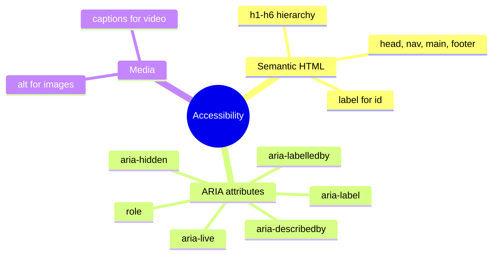
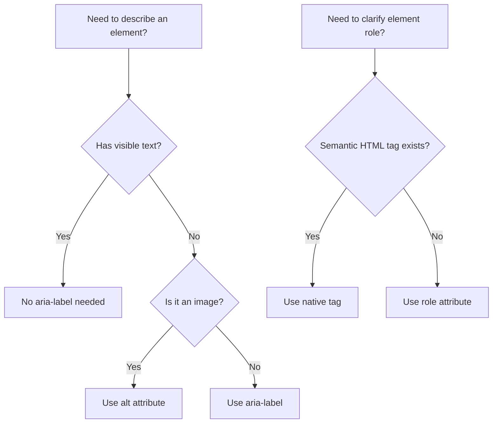

## Accessibility (a11y)

> **Connection to the previous lessons:** in past lessons we've often mentioned "the screen reader will hear this correctly" — when talking about `alt`, `label`, `scope`, `legend`. Today we gather all these scattered mentions into one unified topic — accessibility — and add new tools: ARIA, contrast, `tabindex`.



---

## What you will learn by the end of the lesson

- Understand why accessibility (a11y) is needed and who uses it.
- Use basic ARIA attributes: `aria-label`, `role`.
- Understand the importance of text and background contrast.
- Control keyboard focus order via `tabindex`.
- Understand how heading hierarchy works as the "skeleton" of a page for screen readers.

---

## Lesson timeline

| Block                                            | Content                                       |
| ------------------------------------------- | ---------------------------------------------- |
| 1. Why accessibility matters                | Who and how uses it, "invisible" users         |
| 2. Review: what we already did right        | alt, label, scope, legend — systematization    |
| 3. ARIA: aria-label and role                | When HTML semantics aren't enough              |
| 4. Contrast                                 | Text readability, checking tools               |
| 5. Mini-task                                 | Add aria-label on your own                     |
| 6. tabindex                                  | Keyboard focus order and control               |
| 7. Heading hierarchy as a skeleton          | Final summary of the principle                 |
| 8. Summary and practical task               | Audit your own site                            |

---

## Block 1. Why accessibility matters

**In simple terms:** imagine a building with stairs at the entrance but no ramp. A person in a wheelchair physically cannot get inside — not because the building is "bad" on its own, but because it didn't account for the fact that not all visitors move the same way.

Web accessibility (**accessibility**, abbreviated **a11y** — the number 11 represents the count of letters between "a" and "y") is the same principle, just for websites. A website must be equally usable by:

- **blind and visually impaired users** who use screen readers (programs that read screen content aloud) or greatly enlarge the page scale;
- **people who cannot use a mouse** (due to motor impairments) and navigate the page using only the keyboard;
- **hard-of-hearing users** who need subtitles for video;
- **people with cognitive differences** who benefit from simple, predictable structure;
- even **regular users in inconvenient conditions** — for example, someone with a temporarily broken arm using only a keyboard, or someone reading a site in bright sunlight on a low-contrast screen.

**Important fact to realize:** everything we did right in previous lessons (meaningful `alt`, `label`/`for` pairing, `scope` on tables, `legend` on field groups) was already work on accessibility — we just called it something else. Today's lesson systematizes this knowledge and adds several new tools.

**Why this isn't an "optional feature" but part of professional markup:** in many countries there are legal requirements for website accessibility (especially government and commercial sites). But even without the legal side — an accessible site simply works better for **more people**, and this is a sign of quality, well-thought-out markup.

---

## Block 2. What we already did right (systematization)

Before moving on, let's recall and compile everything related to accessibility from previous lessons:

|What|Lesson|How it helps accessibility|
|---|---|---|
|`alt` on ``|Lesson 4|Screen reader reads the image description instead of the image itself|
|`<h1>`–`<h6>` hierarchy without skipping levels|Lesson 2|Screen reader builds a page "map" from headings for quick navigation|
|Semantic tags (`header`, `nav`, `main`, `footer`, etc.)|Lesson 2|Screen reader understands the purpose of each major page block|
|`label` + `for`/`id`|Lesson 6|Screen reader announces the form field's purpose, not just "text field"|
|`scope` on `<th>` in tables|Lesson 5|Screen reader links a data cell to the correct row/column header|
|`fieldset` + `legend`|Lesson 7|Screen reader gives context to a group of fields (especially important for radio groups)|
|`<strong>`/`<em>` instead of `<b>`/`<i>`|Lesson 2|Screen reader can convey semantic importance/emphasis through intonation|

As you can see, accessibility is not a separate "add-on" on top of regular markup, but a consequence of **correct, semantic** HTML usage from the very start of the course.

---

## Block 3. ARIA: `aria-label` and `role`

Sometimes standard HTML semantics aren't enough to fully describe an element's purpose — especially for interactive elements that are visually clear (e.g., a close-window icon shown as an "×") but don't contain text inside that a screen reader could read.

For such cases there's **ARIA** (Accessible Rich Internet Applications) — a set of special attributes that supplement (but don't replace!) regular HTML semantics.

### `aria-label` — text description for screen readers

Used when an element has no visible text, but its purpose needs to be announced to screen readers.

**Example: a close button with no visible text, only an icon (shown as "×"):**

```html
<button type="button" aria-label="Close window">×</button>
```

Visually the user just sees an "×" symbol, but the screen reader will announce "Close window, button" — giving a full description, not a meaningless character.

**Example: an icon-link to a social network with no text:**

```html
<a href="https://t.me/example" aria-label="Our Telegram channel">
    
</a>
```

Note: here the image's `alt=""` is empty (a decorative icon, as we covered in lesson 4), and the entire link's description is given by `aria-label` on the `<a>` tag.

**Important rule:** `aria-label` is used **only when there's no other way** to give an element a text description. If an element already has visible text (e.g., a "Submit" button), `aria-label` is not needed — don't duplicate what's already available to the screen reader from regular content.

### `role` — clarifying the element's role

The `role` attribute explicitly tells the screen reader what functional role an element performs — especially useful if a non-ideal tag was used for some reason.

```html
<div role="alert">
    Attention: the file was not saved.
</div>
```

`role="alert"` tells the screen reader this is an important notification that should be announced immediately, not just read as part of the regular page text flow.

**The golden rule of ARIA to remember:** _"The first rule of ARIA is: don't use ARIA if there's a suitable native HTML tag."_ In other words, if you can use `<button>` instead of `<div role="button">` — use `<button>`, because the native tag already has all needed behavior out of the box (Tab focus, Enter/Space response, proper announcement), while imitating this behavior on `<div>` with ARIA requires extra work and is more error-prone.

```html
<!-- Bad: imitating a button via div -->
<div role="button" aria-label="Submit form">Submit</div>

<!-- Good: using the native button -->
<button type="submit">Submit</button>
```



---

### Common beginner mistakes

| Mistake|How to fix|
|---|---|
|Using ARIA instead of native HTML tags where the native tag already works|Always prefer a semantic HTML tag over ARIA imitation: `<button>`, not `<div role="button">`|
|Duplicating `aria-label` where the element already has visible text|Use `aria-label` only when there's no visible text content|
|Putting `aria-label` on images instead of `alt`|Always use `alt` for images — that's its direct purpose; `aria-label` is for other textless elements (buttons, icon-links)|

---

## Block 4. Contrast

**In simple terms:** contrast is the difference in brightness between text and the background behind it. Light gray text on a white background may look stylish to a designer, but will be practically unreadable for a person with impaired vision — and even for a person with normal vision in bright sunlight or on a cheap monitor.

Although actual color configuration belongs to CSS (a topic for future lessons), it's important to understand the principle now, because decisions about content (e.g., whether you'll rely only on color to convey information) are made at the content structure level.

### Practical rule: don't rely only on color

A common mistake is conveying important information **only** through color, without a text duplicate. For example:

```html
<!-- Bad: only color reports the error (invisible to colorblind users, unreadable by screen reader) -->
<p style="color: red;">Field filled incorrectly</p>

<!-- Good: the text itself conveys meaning, color is only an addition -->
<p style="color: red;"><strong>Error:</strong> field filled incorrectly</p>
```

Even without detailed CSS knowledge, it's important to remember the principle: **text content must be self-sufficient** and not lose meaning if all color styling is removed — because for some users (blind people, colorblind users, black-and-white screen users), color is simply unavailable.

### Recommended minimum contrast level

There's a WCAG (Web Content Accessibility Guidelines) standard that recommends a minimum contrast ratio of **4.5:1** for regular text (and slightly less — 3:1 — for large text like headings). You can check the contrast of a color pair using free online tools (e.g., WebAIM Contrast Checker) — this will be especially relevant when choosing a site's color palette as you study CSS further.

---

## Mini-task

Add `aria-label` to a textless GitHub icon-link so the screen reader announces its purpose.

**Solution:**

```html
<a href="https://github.com/Saydullayev017" aria-label="My GitHub profile" target="_blank" rel="noopener noreferrer">
    
</a>
```

---

## Block 6. `tabindex` — keyboard focus control

**In simple terms:** try right now, without touching the mouse, pressing the **Tab** key on any web page — you'll see the focus frame "jump" from one link/button/form field to another in a specific order. This is keyboard navigation — critically important for people who can't (or find it inconvenient) use a mouse.

By default, the Tab traversal order follows **the order of elements in HTML code** — interactive elements (links, buttons, form fields) are automatically "focusable" without any additional code. This is yet another reason why writing HTML in a logical order matters — visual order can be changed via CSS, but Tab navigation by default follows the code order.

### `tabindex="0"` — make an element focusable

Sometimes you need to make focusable an element that isn't by default (e.g., a `<div>` with interactive behavior via JavaScript — although, as we covered in block 3, it's better to use native interactive tags when possible).

```html
<div tabindex="0" role="button" aria-label="Expand details">
    Details ▼
</div>
```

`tabindex="0"` embeds the element into the **natural** navigation order (wherever it is in the code) without disrupting the page's overall logic.

### `tabindex="-1"` — remove an element from Tab navigation

```html
<div tabindex="-1" id="modal-title">
    Modal window title
</div>
```

Used for elements that need to receive focus programmatically (e.g., via JavaScript when opening a popup) but should not be part of the regular Tab sequence.

### Positive `tabindex` values — why they should be avoided

Technically you can write `tabindex="1"`, `tabindex="2"`, etc., to explicitly set a traversal order different from the code order:

```html
<!-- Not recommended -->
<input type="text" tabindex="2">
<input type="text" tabindex="1">
```

**Why this is bad practice:** this approach is extremely easy to "break" with any page structure change — a new element added without tabindex will end up in an unexpected place in the sequence, and the user will "jump" around the page unpredictably. **The right approach** is to arrange elements in a logical order right in the HTML code, then special `tabindex` won't be needed in 95% of cases.

**Practical rule for this course:** use `tabindex="0"` and `tabindex="-1"` only when truly needed (non-standard interactive elements), avoid positive numbers, and prioritize the logical order of the HTML code itself.

---

### Common beginner mistakes

| Mistake|How to fix|
|---|---|
|Using positive `tabindex` values to "fix" navigation order|Instead, change the actual order of elements in the HTML code|
|Putting `tabindex` on elements that are already focusable (links, buttons, form fields)|Native interactive elements are focusable by default — `tabindex` isn't needed for them|
|Forgetting that visual order (set by future CSS) can differ from HTML code order, confusing Tab navigation|Try to make the logical order in HTML match the visual order on the page|

---

## Block 7. Heading hierarchy as the page "skeleton"

Let's return once more to the topic started in lesson 2 and look at it specifically through the lens of accessibility — because this may be the most underappreciated a11y tool by beginners.

**Imagine you are a blind user** who just opened a long page (e.g., a recipe article of 2000 words). You can't "scan with your eyes" the way a sighted user does in a couple of seconds, visually picking out the structure. What do you do? Most screen readers allow you to **jump from heading to heading** with a single key, without listening to all the text in sequence.

If the page is built correctly:

```html
<h1>Plov recipe</h1>
<h2>Ingredients</h2>
<h2>Step-by-step preparation</h2>
<h3>Preparing the rice</h3>
<h3>Frying the meat and vegetables</h3>
<h3>Final cooking</h3>
<h2>Serving tips</h2>
```

- a blind user can in a few seconds "scan" the structure through headings (hearing only h1, h2, h2, h3, h3, h3, h2), realize they're interested in "Preparing the rice," and jump straight there, completely skipping everything else — just like a sighted user visually scans the page looking for the desired section.

**If instead of headings there are `<p>` tags with visually bold text everywhere** (or heading levels `h2`→`h4` are skipped), this ability is completely lost: the user has to listen to all the text sequentially from beginning to end to understand the structure.

**This is the final summary of the principle we've been applying throughout the course:** every tag in HTML should reflect the **real meaning** of the content, not just "how it should look visually." That's why from the first lesson we avoid `<b>`/`<i>` in favor of `<strong>`/`<em>`, use `<nav>` instead of a bare `<div>`, `<th>` instead of a bold `<td>` — all these decisions make the page understandable not only visually but by any other method of perception.

---

## Lesson summary

Today you learned:

- Accessibility (a11y) is about ensuring the site can be used by people with different perception and interaction abilities: blind, hard-of-hearing, keyboard-only users.
- Everything we did right before (`alt`, `label`/`for`, `scope`, `legend`, semantics) was already work on accessibility.
- `aria-label` describes elements without visible text, `role` clarifies the functional role — but always prefer native HTML tags over ARIA imitations.
- Text and background contrast is critical for readability — and it's important not to rely only on color to convey meaning.
- `tabindex="0"`/`"-1"` control whether an element participates in Tab navigation — but positive numbers should be avoided in favor of logical code order.
- The `h1`–`h6` heading hierarchy works as the page's "skeleton," allowing the screen reader (and any user) to quickly navigate the content.
