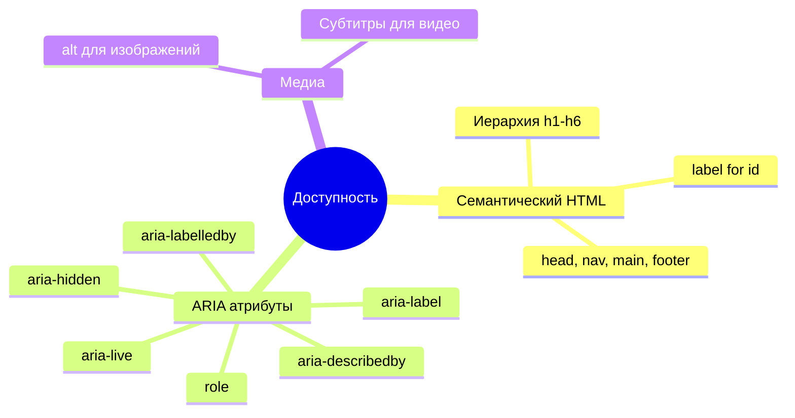
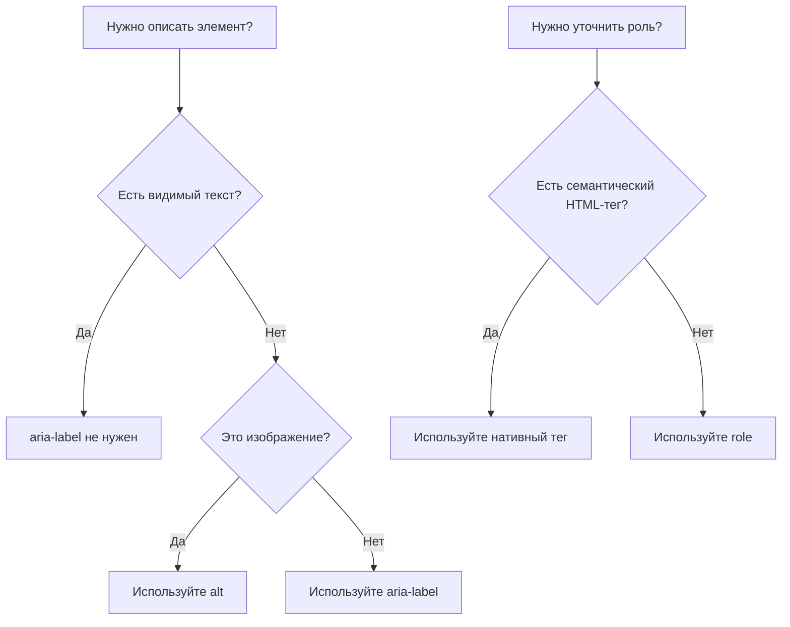

## Доступность (a11y)

> **Связь с предыдущим уроком:** на прошлых уроках мы уже много раз упоминали "скринридер услышит это правильно" — говоря про `alt`, `label`, `scope`, `legend`. Сегодня собираем все эти разрозненные упоминания в единую тему — доступность — и добавляем новые инструменты: ARIA, контраст, `tabindex`.



---

## Чему вы научитесь к концу урока

- Понимать, зачем нужна доступность (a11y) и кто ей пользуется.
- Использовать базовые атрибуты ARIA: `aria-label`, `role`.
- Понимать важность контраста текста и фона.
- Управлять порядком фокуса клавиатурой через `tabindex`.
- Понимать, как иерархия заголовков работает как "скелет" страницы для скринридера.

---

## Хронометраж урока

| Блок                                        | Содержание                                     |
| ------------------------------------------- | ---------------------------------------------- |
| 1. Зачем нужна доступность                  | Кто и как пользуется, "невидимые" пользователи |
| 2. Повторение: что мы уже сделали правильно | alt, label, scope, legend — систематизация     |
| 3. ARIA: aria-label и role                  | Когда семантики HTML недостаточно              |
| 4. Контраст                                 | Читаемость текста, инструменты проверки        |
| 5. Мини-задание                             | Добавить aria-label самостоятельно             |
| 6. tabindex                                 | Порядок и управление фокусом клавиатурой       |
| 7. Иерархия заголовков как скелет           | Итоговое обобщение принципа                    |
| 8. Итоги и практическое задание             | Аудит собственного сайта                       |

---

## Блок 1. Зачем нужна доступность

**Простыми словами:** представьте здание с лестницей на входе, но без пандуса. Человек на инвалидной коляске физически не может попасть внутрь - не потому что здание "плохое" само по себе, а потому что оно не учло, что не все посетители одинаково передвигаются.

Веб-доступность (**accessibility**, сокращённо **a11y** - цифра 11 означает количество пропущенных букв между "a" и "y") - это тот же принцип, только для сайтов. Сайт должен быть одинаково пригоден для использования:

- **незрячими и слабовидящими пользователями**, которые пользуются скринридерами (программы, озвучивающие содержимое экрана вслух) или сильно увеличивают масштаб страницы;
- **людьми, которые не могут пользоваться мышью** (из-за моторных нарушений) и управляют страницей только клавиатурой;
- **слабослышащими пользователями**, которым нужны субтитры к видео;
- **людьми с когнитивными особенностями**, которым помогает простая, предсказуемая структура;
- даже **обычными пользователями в неудобных условиях** - например, человек с временно сломанной рукой, использующий только клавиатуру, или человек, читающий сайт на ярком солнце с плохим контрастом экрана.

**Важный факт, который стоит осознать:** всё, что мы делали правильно на предыдущих уроках (осмысленный `alt`, связка `label`/`for`, `scope` у таблиц, `legend` у групп полей) - это уже была работа над доступностью, только мы называли это иначе. Сегодняшний урок систематизирует эти знания и добавляет несколько новых инструментов.

**Почему это не "необязательная опция", а часть профессиональной вёрстки:** во многих странах существуют юридические требования к доступности сайтов (особенно государственных и коммерческих). Но даже без юридической стороны - доступный сайт просто работает лучше для **большего числа людей**, и это признак качественной, продуманной вёрстки.

---

## Блок 2. Что мы уже сделали правильно (систематизация)

Прежде чем двигаться дальше, вспомним и соберём воедино всё, что уже связано с доступностью в предыдущих уроках:

|Что|Урок|Как помогает доступности|
|---|---|---|
|`alt` у ``|Урок 4|Скринридер озвучивает описание картинки вместо неё самой|
|Иерархия `<h1>`–`<h6>` без пропусков уровней|Урок 2|Скринридер строит "карту" страницы по заголовкам для быстрой навигации|
|Семантические теги (`header`, `nav`, `main`, `footer` и т.д.)|Урок 2|Скринридер понимает назначение каждого крупного блока страницы|
|`label` + `for`/`id`|Урок 6|Скринридер озвучивает назначение поля формы, а не просто "текстовое поле"|
|`scope` у `<th>` в таблицах|Урок 5|Скринридер связывает ячейку с данными с нужным заголовком строки/столбца|
|`fieldset` + `legend`|Урок 7|Скринридер даёт контекст группе полей (особенно важно для radio-групп)|
|`<strong>`/`<em>` вместо `<b>`/`<i>`|Урок 2|Скринридер может передать смысловую важность/ударение интонацией|

Как видите, доступность - это не отдельная "надстройка" поверх обычной вёрстки, а следствие **правильного, семантичного** использования HTML с самого начала курса.

---

## Блок 3. ARIA: `aria-label` и `role`

Иногда семантики стандартного HTML недостаточно, чтобы полностью описать назначение элемента - особенно для интерактивных элементов, которые визуально понятны (например, иконка с крестиком для закрытия окна), но не имеют текста внутри, который мог бы прочитать скринридер.

Для таких случаев существует **ARIA** (Accessible Rich Internet Applications) - набор специальных атрибутов, которые дополняют (но не заменяют!) обычную HTML-семантику.

### `aria-label` - текстовое описание для скринридера

Используется, когда у элемента нет видимого текста, но его назначение нужно озвучить скринридеру.

**Пример: кнопка закрытия без видимого текста, только с иконкой (условно изображённой символом "×"):**

```html
<button type="button" aria-label="Закрыть окно">×</button>
```

Визуально пользователь видит просто крестик "×", но скринридер озвучит "Закрыть окно, кнопка" — то есть даст полноценное описание, а не бессмысленный символ.

**Пример: иконка-ссылка на соцсеть без текста:**

```html
<a href="https://t.me/example" aria-label="Наш Telegram-канал">
    
</a>
```

Обратите внимание: здесь `alt=""` у картинки пустой (декоративная иконка, как мы разобрали в уроке 4), а описание всей ссылки целиком даёт `aria-label` на теге `<a>`.

**Важное правило:** `aria-label` используется **только тогда, когда нет другого способа** дать элементу текстовое описание. Если у элемента уже есть видимый текст (например, кнопка "Отправить"), `aria-label` не нужен - не дублируйте то, что уже доступно скринридеру из обычного содержимого.

### `role` - уточнение роли элемента

Атрибут `role` явно сообщает скринридеру, какую функциональную роль выполняет элемент - особенно полезно, если по какой-то причине использован не самый подходящий по смыслу тег.

```html
<div role="alert">
    Внимание: файл не был сохранён.
</div>
```

`role="alert"` сообщает скринридеру, что это важное уведомление, которое стоит озвучить немедленно, а не просто прочитать в общем порядке текста на странице.

**Золотое правило ARIA, которое важно запомнить:** _"Первое правило ARIA - не используй ARIA, если есть подходящий нативный HTML-тег."_ Иными словами, если можно использовать `<button>` вместо `<div role="button">` - используйте `<button>`, потому что нативный тег уже "из коробки" обладает всем нужным поведением (фокус по Tab, реакция на Enter/Space, правильная озвучка), а имитация этого поведения на `<div>` с ARIA требует дополнительной работы и легче содержит ошибки.

```html
<!-- Плохо: имитация кнопки через div -->
<div role="button" aria-label="Отправить форму">Отправить</div>

<!-- Хорошо: используем нативный button -->
<button type="submit">Отправить</button>
```



---

### Частые ошибки новичков

|Ошибка|Как исправить|
|---|---|
|Используют ARIA вместо нативных HTML-тегов там, где нативный тег уже подходит|Всегда предпочитайте семантический HTML-тег ARIA-имитации: `<button>`, а не `<div role="button">`|
|Дублируют `aria-label` там, где уже есть видимый текст элемента|Используйте `aria-label` только когда видимого текстового содержимого нет|
|Ставят `aria-label` вместо `alt` у изображений|Для изображений всегда используйте `alt` — это его прямое назначение; `aria-label` — для других элементов без текста (кнопки, ссылки-иконки)|

---

## Блок 4. Контраст

**Простыми словами:** контраст - это разница в яркости между текстом и фоном под ним. Светло-серый текст на белом фоне может выглядеть стильно дизайнеру, но будет практически нечитаем для человека с ослабленным зрением - и даже для человека с обычным зрением на ярком солнце или дешёвом мониторе.

Хотя реальная настройка цветов относится к CSS (тема будущих уроков курса), важно понимать сам принцип уже сейчас, потому что решения о контенте (например, будете ли вы полагаться только на цвет для передачи информации) принимаются на уровне структуры контента.

### Практическое правило: не полагайтесь только на цвет

Частая ошибка - передавать важную информацию **только** цветом, без текстового дублирования. Например:

```html
<!-- Плохо: только цвет сообщает об ошибке (не виден дальтоникам, не читается скринридером) -->
<p style="color: red;">Поле заполнено неверно</p>

<!-- Хорошо: текст сам по себе передаёт смысл, цвет — только дополнение -->
<p style="color: red;"><strong>Ошибка:</strong> поле заполнено неверно</p>
```

Даже без знания CSS в деталях, важно запомнить принцип: **текстовое содержимое должно быть самодостаточным** и не терять смысл, если убрать всё цветовое оформление - потому что для части пользователей (незрячих, дальтоников, пользователей чёрно-белых экранов) цвет попросту недоступен.

### Рекомендуемый минимальный уровень контраста

Существует стандарт WCAG (Web Content Accessibility Guidelines), который рекомендует минимальное соотношение контрастности **4.5:1** для обычного текста (и чуть меньше - 3:1 - для крупного текста вроде заголовков). Проверить контраст пары цветов можно с помощью бесплатных онлайн-инструментов (например, WebAIM Contrast Checker) - при изучении CSS в дальнейшем это будет особенно актуально при выборе цветовой палитры сайта.

---

## Мини-задание

Добавьте `aria-label` к ссылке-иконке на GitHub без видимого текста, чтобы скринридер озвучил её назначение.

**Решение:**

```html
<a href="https://github.com/Saydullayev017" aria-label="Мой профиль на GitHub" target="_blank" rel="noopener noreferrer">
    
</a>
```

---

## Блок 6. `tabindex` - управление фокусом с клавиатуры

**Простыми словами:** попробуйте прямо сейчас, не трогая мышь, нажимать клавишу **Tab** на любой веб-странице - вы увидите, как рамка фокуса "прыгает" от одной ссылки/кнопки/поля формы к другой в определённом порядке. Это и есть навигация с клавиатуры - критически важная для людей, которые не могут (или им неудобно) пользоваться мышью.

По умолчанию порядок перехода Tab следует **порядку элементов в HTML-коде** - интерактивные элементы (ссылки, кнопки, поля форм) автоматически "фокусируемы" безо всякого дополнительного кода. Это ещё одна причина, почему важно писать HTML в логичном порядке - визуальный порядок через CSS можно поменять, а Tab-навигация по умолчанию следует именно порядку в коде.

### `tabindex="0"` - сделать элемент фокусируемым

Иногда нужно сделать фокусируемым элемент, который по умолчанию таким не является (например, `<div>` с интерактивным поведением через JavaScript - хотя, как мы уже разобрали в блоке 3, лучше по возможности использовать нативные интерактивные теги).

```html
<div tabindex="0" role="button" aria-label="Развернуть подробности">
    Подробнее ▼
</div>
```

`tabindex="0"` встраивает элемент в **естественный** порядок навигации (там, где он находится в коде), не нарушая общей логики страницы.

### `tabindex="-1"` - убрать элемент из Tab-навигации

```html
<div tabindex="-1" id="modal-title">
    Заголовок модального окна
</div>
```

Используется для элементов, которые должны получать фокус программно (например, через JavaScript при открытии всплывающего окна), но не должны попадать в обычную последовательность Tab.

### Положительные значения `tabindex` - почему их следует избегать

Технически можно написать `tabindex="1"`, `tabindex="2"` и так далее, чтобы явно задать свой порядок обхода, отличный от порядка в коде:

```html
<!-- НЕ рекомендуется -->
<input type="text" tabindex="2">
<input type="text" tabindex="1">
```

**Почему это плохая практика:** такой подход крайне легко "сломать" при любом изменении структуры страницы - новый элемент, добавленный без tabindex, окажется в неожиданном месте последовательности, и пользователь будет "прыгать" по странице непредсказуемо. **Правильный подход** - располагать элементы в логичном порядке прямо в HTML-коде, тогда специальный `tabindex` вообще не понадобится в 95% случаев.

**Практическое правило для этого курса:** используйте `tabindex="0"` и `tabindex="-1"` только когда это реально нужно (нестандартные интерактивные элементы), избегайте положительных чисел, и в первую очередь заботьтесь о логичном порядке самого HTML-кода.

---

### Частые ошибки новичков

|Ошибка|Как исправить|
|---|---|
|Используют положительные значения `tabindex` для "исправления" порядка навигации|Вместо этого меняйте сам порядок элементов в HTML-коде|
|Ставят `tabindex` на элементы, которые и так уже фокусируемы (ссылки, кнопки, поля форм)|Нативные интерактивные элементы уже фокусируемы по умолчанию — `tabindex` для них не нужен|
|Забывают, что визуальный порядок (заданный CSS в будущем) может отличаться от порядка в HTML-коде, что запутывает Tab-навигацию|Старайтесь, чтобы логический порядок в HTML совпадал с визуальным порядком на странице|

---

## Блок 7. Иерархия заголовков как "скелет" страницы

Вернёмся ещё раз к теме, начатой в уроке 2, и посмотрим на неё именно через призму доступности - потому что это, возможно, самый недооценённый новичками инструмент a11y.

**Представьте, что вы — незрячий пользователь**, который только что открыл длинную страницу (например, статью с рецептом на 2000 слов). У вас нет возможности "пробежать глазами" по странице, как это делает зрячий пользователь за пару секунд, визуально выхватывая структуру. Что вы делаете? Большинство скринридеров позволяют **пролистывать страницу от заголовка к заголовку** одной клавишей, не слушая весь текст подряд.

Если страница построена правильно:

```html
<h1>Рецепт плова</h1>
<h2>Ингредиенты</h2>
<h2>Пошаговое приготовление</h2>
<h3>Подготовка риса</h3>
<h3>Обжарка мяса и овощей</h3>
<h3>Финальная варка</h3>
<h2>Советы по подаче</h2>
```

- незрячий пользователь может за несколько секунд "просканировать" структуру через заголовки (услышав только h1, h2, h2, h3, h3, h3, h2), понять, что его интересует именно "Подготовка риса", и перепрыгнуть сразу туда, полностью пропустив остальное — точно так же, как зрячий пользователь визуально "пробегает" по странице глазами в поисках нужного раздела.

**Если же вместо заголовков всюду `<p>` со визуально жирным текстом** (или пропущены уровни `h2`→`h4`) - эта возможность полностью пропадает: пользователю придётся слушать весь текст последовательно от начала до конца, чтобы понять структуру.

**Это финальное обобщение принципа, который мы применяли весь курс:** каждый тег в HTML должен отражать **реальный смысл** содержимого, а не просто "как это должно визуально выглядеть". Именно поэтому мы с первого урока избегаем `<b>`/`<i>` в пользу `<strong>`/`<em>`, используем `<nav>` вместо голого `<div>`, `<th>` вместо жирного `<td>` - все эти решения делают страницу понятной не только глазами, но и любым другим способом восприятия.

---

## Итоги урока

Сегодня вы узнали:

- Доступность (a11y) - это забота о том, чтобы сайтом могли пользоваться люди с разными способностями восприятия и взаимодействия: незрячие, слабослышащие, пользователи только клавиатуры.
- Всё, что мы делали правильно ранее (`alt`, `label`/`for`, `scope`, `legend`, семантика) - уже была работа над доступностью.
- `aria-label` описывает элементы без видимого текста, `role` уточняет функциональную роль - но всегда предпочитайте нативный HTML-тег имитации через ARIA.
- Контраст текста и фона критичен для читаемости - и важно не полагаться только на цвет для передачи смысла.
- `tabindex="0"`/`"-1"` управляют попаданием элемента в Tab-навигацию - но положительных чисел стоит избегать, полагаясь на логичный порядок кода.
- Иерархия заголовков `h1`–`h6` работает как "скелет" страницы, по которому скринридер (и любой пользователь) быстро ориентируется в содержимом.
