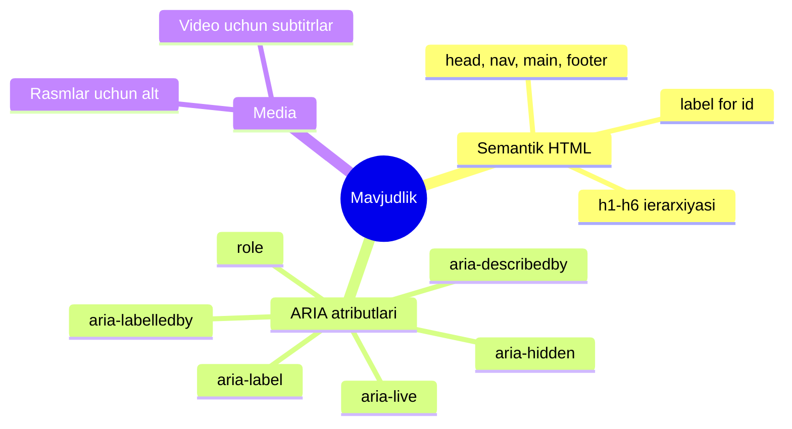
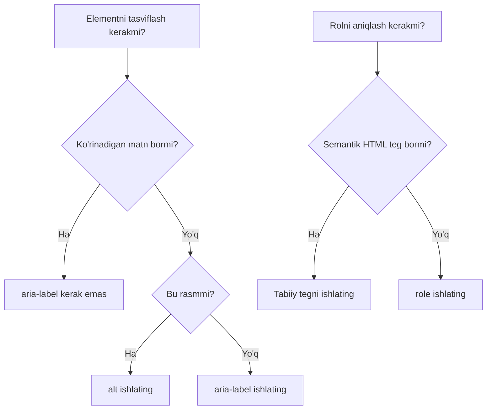

## Mavjudlik (a11y)

> **Oldingi dars bilan bog'lanish:** o'tgan durslarda biz ko'p marta "ekran o'quvchisi buni to'g'ri eshitadi" degan edik — `alt`, `label`, `scope`, `legend` haqida gaplashganda. Bugun barcha tarqalgan eslatmalarni bitta mavzuga — mavjudlikka — birlashtiramiz va yangi vositalar qo'shamiz: ARIA, kontrast, `tabindex`.



---

## Dars oxiriga qadar nimalarni o'rganasiz

- Nima uchun mavjudlik (a11y) kerakligini va kim foydalanishini tushunish.
- Asosiy ARIA atributlarini ishlatish: `aria-label`, `role`.
- Matn va fon kontrastining muhimligini tushunish.
- `tabindex` orqali klaviatura bilan fokus tartibini boshqarish.
- Sarlavhalar ierarxiyasi ekran o'quvchisi uchun sahifaning "skeleti" sifatida qanday ishlashini tushunish.

---

## Dars vaqti bloklari

| Blok                                            | Mazmuni                                          |
| ------------------------------------------- | ---------------------------------------------- |
| 1. Nima uchun mavjudlik kerak                  | Kim va qanday foydalanadi, "ko'rinmaydigan" foydalanuvchilar |
| 2. Takrorlash: biz nima to'g'ri qildik         | alt, label, scope, legend — tizimlashtirish     |
| 3. ARIA: aria-label va role                    | HTML semantikasi yetarli bo'lmaganda           |
| 4. Kontrast                                  | Matning o'qilishi, tekshiruv vositalari        |
| 5. Mini-vazifa                                | aria-label mustaqil qo'shish                   |
| 6. tabindex                                  | Klaviatura bilan fokus tartibi va boshqarish   |
| 7. Sarlavhalar ierarxiyasi sifatida skelet    | Printsi ning yakuniy umumlashtirishi           |
| 8. Xulosalar va amaliy vazifa                 | O'z saytini audit qilish                       |

---

## 1-blok. Nima uchun mavjudlik kerak

**Oddiy qilib aytganda:** kirishda zinapoya bor, lekin pandus yo'q bino ni tasavvur qiling. Nogironlik aravachasidagi odam fizik jihatdan ichkariga kira olmaydi — binoning o'zi "yomon" degani uchun emas, balki barcha mehmonlarning xarakatlanishi bir xil emasligini hisobga olmaganligi uchun.

Veb-mavjudlik (**accessibility**, qisqartirilgan **a11y** — 11 raqami "a" va "y" orasidagi o'tkazilgan harflar sonini bildiradi) — bu saytlar uchun xuddi shu printsip. Sayt quyidagilar uchun bir xil darajada mos bo'lishi kerak:

- **Ko'rmaydigan va zaif ko'ruvchi foydalanuvchilar**, ekran o'quvchilaridan (ekran mazmunini ovoz chiqarib o'qiydigan dasturlar) foydalanuvchi yoki sahifa masshtabini juda kattalashtiruvchi;
- **Sichqoncha bilan ishlay olmaydigan odamlar** (motor buzilishi tufayli) va sahifani faqat klaviatura bilan boshqaruvchi;
- **Zaif eshituvchi foydalanuvchilar**, video uchun subtitrlar kerak bo'lganlar;
- **Kognitiv xususiyatlarga ega odamlar**, oddiy, bashorat qilinadigan tuzilmadan foyda ko'radiganlar;
- hatto **noqulay sharoitlardagi oddiy foydalanuvchilar** — masalan, vaqtincha singan qo'li bilan faqat klaviaturadan foydalanayotgan odam, yoki yorqin quyosh ostida yomon kontrastli ekran bilan saytni o'qiyotgan odam.

**Tushunishga arziydigan muhim fakt:** biz o'tgan durslarda to'g'ri qilgan hamma narsa (ma'noli `alt`, `label`/`for` bog'lanishi, jadvallarda `scope`, maydon guruhlarida `legend`) — bu allaqachon mavjudlik ustida ishlash edi, biz uni faqat boshqacha chaqirardik. Bugungi dars bilimlarni tizimlashtiradi va bir nechta yangi vosita qo'shadi.

**Nima uchun bu "ixtiyoriy emas" va professional terurning bir qismi:** ko'p mamlakatlarda saytlarning mavjudligiga yuridik talablar mavjud (ayniqsa davlat va tijorat saytlari). Lekin yuridik tomonini hisobga olmasdan ham — mavjud sayt oddiygina **ko'proq odamlar** uchun yaxshiroq ishlaydi va bu sifatli, o'ylangan terurning belgisi.

---

## 2-blok. Biz nima to'g'ri qildik (tizimlashtirish)

Davom etishdan oldin, o'tgan durslarda mavjudlikka bog'liq bo'lgan hamma narsani eslab, bir joyga to'playmiz:

|Nima|Dars|Mavjudlikka qanday yordam beradi|
|---|---|---|
|`` da `alt`|4-dars|Ekran o'quvchisi rasm o'rniga tavsifni ovoz chiqaradi|
|Darajalarni o'tkazib yubormasdan `<h1>`–`<h6>` ierarxiyasi|2-dars|Ekran o'quvchisi tez yo'l topish uchun sarlavhalar bo'yicha sahifa "xaritasini" quradi|
|Semantik teglar (`header`, `nav`, `main`, `footer` va hokazo)|2-dars|Ekran o'quvchisi sahifaning har bir yirik blokining maqsadini tushunadi|
|`label` + `for`/`id`|6-dars|Ekran o'quvchisi forma maydonining maqsadini ovoz chiqaradi, "matn maydoni" emas|
|Jadvallarda `<th>` da `scope`|5-dars|Ekran o'quvchisi ma'lumot katakchasi kerakli qator/ustun sarlavhasiga bog'laydi|
|`fieldset` + `legend`|7-dars|Ekran o'quvchisi maydon guruhiga kontekst beradi (radio guruhlari uchun juda muhim)|
|`<b>`/`<i>` o'rniga `<strong>`/`<em>`|2-dars|Ekran o'quvchisi ma'noli muhimlikni/ajratishni intonatsiya bilan uzatishi mumkin|

Ko'rib turganingizdek, mavjudlik bu oddiy terurning ustidagi alohida "qo'shma" emas, balki kursning boshidan beri HTML ning **to'g'ri, semantik** ishlatilishining natijasi.

---

## 3-blok. ARIA: `aria-label` va `role`

Ba'zan standart HTML semantikasi elementning maqsadini to'liq tasvirlash uchun yetarli bo'lmaydi — ayniqsa vizual jihatdan tushunarli (masalan, oynani yopish uchun "×" belgisi bilan ko'rsatilgan ikonka), lekin ekran o'quvchisi o'qiy oladigan matni ichida bo'lmagan interaktiv elementlar uchun.

Bunday holatlar uchun **ARIA** (Accessible Rich Internet Applications) mavjud — oddiy HTML semantikasini to'ldiruvchi (lekin o'rnini bermaydigan!) maxsus atributlar to'plami.

### `aria-label` - ekran o'quvchisi uchun matnli tavsif

Elementda ko'rinadigan matn bo'lmaganida, lekin uning maqsadini ekran o'quvchisiga aytish kerak bo'lganda ishlatiladi.

**Misol: faqat ikonka bilan, ko'rinadigan matnsiz yopish tugmasi ("×" belgisi bilan shartli ko'rsatilgan):**

```html
<button type="button" aria-label="Oynani yopish">×</button>
```

Vizual foydalanuvchi oddiy "×" belgini ko'radi, lekin ekran o'quvchisi "Oynani yopish, tugma" deb ovoz chiqaradi — ya'ni mazmunli tavsif beradi, ma'nosiz belgi emas.

**Misol: matnsiz ijtimoiy tarmoqqa ikonka-havola:**

```html
<a href="https://t.me/example" aria-label="Bizning Telegram kanalimiz">
    
</a>
```

Diqqat qiling: bu yerda rasmdagi `alt=""` bo'sh (dekorativ ikonka, 4-darsda tushuntirgandek), va butun havolaning tavsifini to'liq `<a>` tegidagi `aria-label` beradi.

**Muhim qoida:** `aria-label` **faqat boshqa usul bo'lmaganda** ishlatiladi. Agar elementda allaqachon ko'rinadigan matn bo'lsa (masalan, "Yuborish" tugmasi), `aria-label` kerak emas — oddiy mazmundan ekran o'quvchisiga allaqachon mavjud narsani takrorlamang.

### `role` - element rolini aniqlash

`role` atributi ekran o'quvchisiga element qanday funksional rol o'ynashini aniq aytadi — ayniqsa ma'lum sabablarga ko'ra eng mos teg ishlatilmagan bo'lsa foydali.

```html
<div role="alert">
    Diqqat: fayl saqlanmadi.
</div>
```

`role="alert"` ekran o'quvchisiga bu muhim xabar ekanini, uni darhol ovoz chiqarish kerakligini, sahifadagi umumiy matn tartibida o'qish kerak emasligini aytadi.

**Eslab qolish kerak bo'lgan ARIA ning oltin qoidasi:** _"ARIA ning birinchi qoidasi — agar mos tabiiy HTML teg bo'lsa, ARIA ishlatma."_ Boshqa qilib aytganda, agar `<button>` o'rniga `<div role="button">` ishlatish mumkin bo'lsa — `<button>` ishlating, chunki tabiiy teg "qutidan chiqqan holda" barcha kerakli xulqqa ega (Tab bo'yicha fokus, Enter/Space ga reaktsiya, to'g'ri ovoz chiqarish), va `<div>` da ARIA bilan bu xulqni taqlid qilish qo'shimcha ish talab qiladi va xatolarga ko'proq moyil.

```html
<!-- Yomon: div orqali tugmani taqlid qilish -->
<div role="button" aria-label="Formani yuborish">Yuborish</div>

<!-- Yaxshi: tabiiy button ishlatamiz -->
<button type="submit">Yuborish</button>
```



---

### Yangi boshlovchilarning ko'p uchraydigan xatolari

|Xato|Tuzatish|
|---|---|
|Tabiiy HTML teglar o'rniga ARIA ishlatish|Doimo semantik HTML tegni ARIA taqlidiga afzal ko'ring: `<button>`, `<div role="button">` emas|
|Elementda allaqachon ko'rinadigan matn bo'lganda `aria-label` ni takrorlash|`aria-label` ni faqat ko'rinadigan matn mazmuni bo'lmaganda ishlating|
|Rasmlarda `alt` o'rniga `aria-label` qo'yish|Rasmlar uchun doimo `alt` ishlating — bu uning to'g'ridan-to'g'ri maqsadi; `aria-label` — matnsiz boshqa elementlar uchun (tugmalar, ikonka-havolalar)|

---

## 4-blok. Kontrast

**Oddiy qilib aytganda:** kontrast — bu matn va uning orasidagi fon orasidagi yorqinlik farqi. Oq fon ustidagi och kulrang matn dizaynerga zamonaviy ko'rinishi mumkin, lekin zaif ko'ruvchi odam uchun deyarli o'qimsiz — hatto oddiy ko'ruvchi odam uchun yorqin quyosh ostida yoki arzon monitor'da.

Haqiqiy rang sozlash CSS ga bog'liq (kelajak durslar mavzusi) bo'lsa ham, hozir printsipni tushunish muhim, chunki kontent haqidagi qarorlar (masalan, axborotni uzatishda faqat rangga ishonib ishonmaslik) kontent tuzilishida qabul qilinadi.

### Amaliy qoida: faqat rangga ishonmang

Ko'p uchraydigan xato — muhim axborotni **faqat** rang orqali uzatish, matnli takrorlamasdan. Masalan:

```html
<!-- Yomon: faqat rang xato haqida xabar beradi (daltonga ko'rinmaydi, ekran o'quvchisi o'qimaydi) -->
<p style="color: red;">Maydon noto'g'ri to'ldirilgan</p>

<!-- Yaxshi: matn o'zi ma'noni uzatadi, rang — faqat qo'shimcha -->
<p style="color: red;"><strong>Xato:</strong> maydon noto'g'ri to'ldirilgan</p>
```

CSS ni batafsil bilmasdan ham, printsipni eslab qolish muhim: **matn mazmuni mustaqil bo'lishi kerak** va barcha rangli bezaklarni olib tashlasangiz ma'noni yo'qotmasligi kerak — chunki foydalanuvchilarning bir qismi uchun (ko'rmaydiganlar, daltonglar, qora-oq ekran foydalanuvchilari) rang umuman mavjud emas.

### Tavsiya etilgan minimal kontrast darajasi

WCAG (Web Content Accessibility Guidelines) standarti mavjud bo'lib, oddiy matn uchun minimal kontrast nisbatini **4.5:1** (va katta matn, masalan sarlavhalar uchun biroz kamroq — 3:1) tavsiya etadi. Rang juftligining kontrastini bepul onlayn vositalar (masalan, WebAIM Contrast Checker) yordamida tekshirish mumkin — CSS ni keyinchalik o'rganganda, sayt rang palitrasini tanlashda bu juda muhim bo'ladi.

---

## Mini-vazifa

Matnsiz GitHub ikonka-havolasiga `aria-label` qo'shing, shunda ekran o'quvchisi uning maqsadini ovoz chiqaradi.

**Yechim:**

```html
<a href="https://github.com/Saydullayev017" aria-label="Mening GitHub profilim" target="_blank" rel="noopener noreferrer">
    
</a>
```

---

## 6-blok. `tabindex` - klaviatura bilan fokusni boshqarish

**Oddiy qilib aytganda:** sichqonchaga tegmasdan, hozir har qanday veb-sahifada **Tab** tugmasini bosib ko'ring — fokus ramkasi boshqa havola/tugma/forma maydoniga ma'lum tartibda "sakrab o'tishini" ko'rasiz. Bu klaviatura bilan yo'l topish — sichqoncha bilan ishlay olmaydigan (yoki noqulay foydalanadigan) odamlar uchun juda muhim.

Boshqa tartibda Tab o'tish tartibi **HTML kodidagi elementlar tartibiga** amal qiladi — interaktiv elementlar (havolalar, tugmalar, forma maydonlari) qo'shimcha kodga muhtoj bo'lmasdan avtomatik "fokuslanadi". Bu HTML ni mantiqiy tartibda yozishning yana bir sababi — vizual tartibni CSS orqali o'zgartirish mumkin, lekin Tab navigatsiyasi odatda kod tartibiga amal qiladi.

### `tabindex="0"` - elementni fokuslanadigan qilish

Ba'zan defaultda fokuslanmaydigan elementni fokuslanadigan qilish kerak bo'ladi (masalan, JavaScript orqali interaktiv xulqga ega `<div>` — lekin, 3-blokda tushuntirgandek, imkon qadar tabiiy interaktiv teglarni ishlatgan yaxshi).

```html
<div tabindex="0" role="button" aria-label="Batafsilni ochish">
    Batafsil ▼
</div>
```

`tabindex="0"` elementni **tabiiy** navigatsiya tartibiga (kodda qayerda bo'lsa) qo'shadi, sahifaning umumiy mantiqini buzmasdan.

### `tabindex="-1"` - elementni Tab navigatsiyasidan olib tashlash

```html
<div tabindex="-1" id="modal-title">
    Modall oynaning sarlavhasi
</div>
```

Dastur tomonidan fokus olishi kerak bo'lgan (masalan, JavaScript orqali suzuvchi oyna ochilganda), lekin oddiy Tab ketma-ketligiga tushishi kerak bo'lmagan elementlar uchun ishlatiladi.

### Musbat `tabindex` qiymatlari — nima uchun ulardan qochish kerak

Texnik jihatdan `tabindex="1"`, `tabindex="2"` va hokazo yozish mumkin, kod tartibidan farqli o'ziga xos o'tish tartibini belgilash uchun:

```html
<!-- Tavsiya etilmaydi -->
<input type="text" tabindex="2">
<input type="text" tabindex="1">
```

**Nima uchun bu yomon amaliyot:** bunday yondashuvni sahifa tuzilmasidagi istalgan o'zgarish bilan "buzish" juda oson — `tabindex` qo'shilmagan yangi element ketma-ketlikda kutilmagan joyda bo'ladi va foydalanuvchi sahifada bashorat qilinmagan tarzda "sakrab yuradi". **To'g'ri yondashuv** — elementlarni mantiqiy tartibda to'g'ridan-to'g'ri HTML kodida joylashtirish, shunda 95% hollarda maxsus `tabindex` umuman kerak bo'lmaydi.

**Bu kurs uchun amaliy qoida:** `tabindex="0"` va `tabindex="-1"` ni faqat haqiqatdan kerak bo'lganda (nodavom interaktiv elementlar) ishlating, musbat sonlardan qoching va birinchi navbatda HTML kodining mantiqiy tartibiga e'tibor bering.

---

### Yangi boshlovchilarning ko'p uchraydigan xatolari

|Xato|Tuzatish|
|---|---|
|Navigatsiya tartibini "tuzatish" uchun musbat `tabindex` qiymatlarini ishlatish|Buning o'rniga HTML kodidagi elementlar tartibining o'zini o'zgartiring|
|Allaqachon fokuslanadigan elementlarga (havolalar, tugmalar, forma maydonlari) `tabindex` qo'yish|Tabiiy interaktiv elementlar defaultda allaqachon fokuslanadi — ularga `tabindex` kerak emas|
|Vizual tartib (kelajakda CSS orqali belgilanadi) HTML kodidagi tartibdan farqli bo'lishi va Tab navigatsiyasini chalkashtirishi mumkinligini unutish|HTML dagi mantiqiy tartib sahifadagi vizual tartib bilan mos kelishiga harakat qiling|

---

## 7-blok. Sarlavhalar ierarxiyasi sifatida sahifaning "skeleti"

2-darsda boshlangan mavzuga qaytaylik va uni aynan mavjudlik nuqtai nazaridan ko'raylik — chunki bu, balki, boshlovchilar tomonidan yetarli baholanmagan a11y vositasi.

**Tasavvur qiling, siz ko'rmaydigan foydalanuvchisiz**, va hozirgina uzoq sahifani (masalan, 2000 so'zlik retsept maqolasini) ochdingiz. Ko'ruvchi foydalanuvchi bir necha soniyada vizual ravishda tuzilmanini ko'rib chiqishi mumkin, sizda esa "ko'z bilan yugurish" imkoniyati yo'q. Nima qilasiz? Ko'pchilik ekran o'quvchilari butun matnni ketma-ket eshitmasdan, bitta tugma bilan **sarlavadan sarlavhaga o'tishga** imkon beradi.

Sahifa to'g'ri qurilgan bo'lsa:

```html
<h1>Palov retsepti</h1>
<h2>Kerakli masalliqlar</h2>
<h2>Qadam-baqadam tayyorlash</h2>
<h3>Guruchni tayyorlash</h3>
<h3>Go'sht va sabzavotlarni qovurish</h3>
<h3>Yakuniy qaynatish</h3>
<h2>Serviz bo'yicha maslahatlar</h2>
```

- ko'rmaydigan foydalanuvchi bir necha soniyada sarlavhalar orqali tuzilmanini "skanerlashi" mumkin (faqat h1, h2, h2, h3, h3, h3, h2 ni eshitib), "Guruchni tayyorlash" unga qiziqlisini tushunib, darhol u yerga o'tishi, qolganini to'liq o'tkazib yuborishi — xuddi ko'ruvchi foydalanuvchi kerakli bo'limni qidirib vizual yurgandek.

**Agar o'rniga hamma joyda vizual qalin matnli `<p>` bo'lsa** (yoki `h2`→`h4` darajalari o'tkazib yuborilgan) — bu imkoniyat to'liq yo'qoladi: foydalanuvchi tuzilmani tushunish uchun boshidan oxirigacha butun matnni tinglashga majbur bo'ladi.

**Bu butun kursda qo'llagan printsipning yakuniy umumlashtirishi:** HTML dagi har bir teg mazmunning **haqiqiy ma'nosini** aks ettirishi kerak, "vizual qanday ko'rinishi" kerakligini emas. Shuning uchun biz 1-darsdan beri `<b>`/`<i>` dan voz kechib `<strong>`/`<em>` ishlatamiz, yong'oq `<div>` o'rniga `<nav>`, qalin `<td>` o'rniga `<th>` — barcha bu qarorlar sahifani nafaqat ko'z bilan, balki boshqa istalgan qabul qilish usuli bilan tushunarli qiladi.

---

## Dars xulosalari

Bugun siz quyidagilarni bilib oldingiz:

- Mavjudlik (a11y) — turli qabul qilish va o'zaro munosabat qobiliyatiga ega odamlar saytdan foydalanishi mumkinligiga g'amxo'rlik: ko'rmaydiganlar, zaif eshituvchilar, faqat klaviatura foydalanuvchilari.
- Biz oldin to'g'ri qilgan hamma narsa (`alt`, `label`/`for`, `scope`, `legend`, semantika) — bu allaqachon mavjudlik ustida ishlash edi.
- `aria-label` ko'rinadigan matnsiz elementlarni tasviflaydi, `role` funksional rolni aniqlaydi — lekin doimo tabiiy HTML tegni ARIA taqlidiga afzal ko'ring.
- Matn va fon kontrasti o'qilishi uchun juda muhim — va axborotni uzatishda faqat rangga ishonmaslik kerak.
- `tabindex="0"`/`"-1"` elementning Tab navigatsiyasiga kirishini boshqaradi — lekin musbat sonlardan qochish kerak, kodning mantiqiy tartibiga ishonish lozim.
- `h1`–`h6` sarlavhalar ierarxiyasi sahifaning "skeleti" sifatida ishlaydi, ekran o'quvchisi (va har qanday foydalanuvchi) mazmun tezda yo'l topadi.
