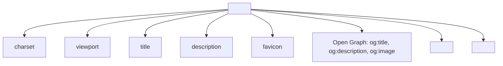
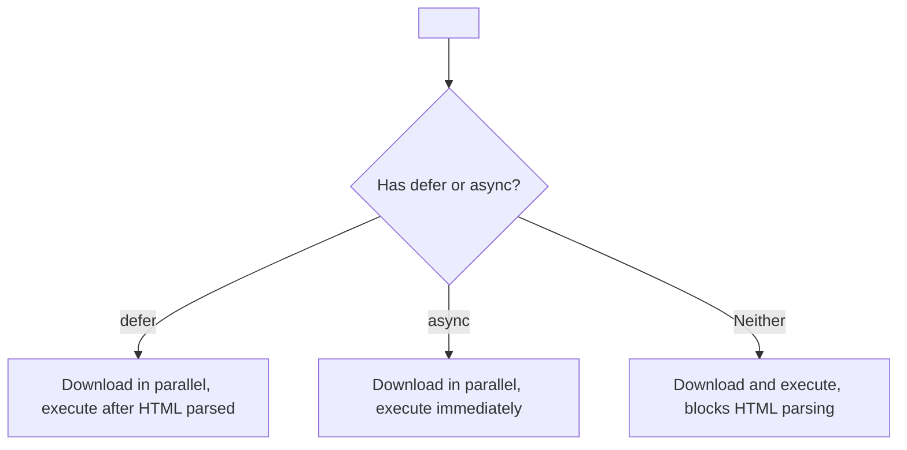

## Meta tags, SEO, linking CSS and JS

> **Connection to the previous lesson:** in the previous lesson we covered accessibility for people. Today we figure out how to make a page understandable for **search engines and other sites** — and also prepare the technical groundwork for connecting CSS and JavaScript, which will be the focus beyond the scope of this course.

---

## What you will learn by the end of the lesson

- Configure key meta tags: `charset`, `description`, `viewport`.
- Understand Open Graph basics — how a site looks when shared on social networks.
- Connect external CSS and JS files via `<link>` and `<script>`.
- Understand the difference between `defer` and `async` when connecting scripts.
- Check code validity through the W3C Validator.
- Organize a project folder structure following standard practices.

---

## Lesson timeline

| Block                                         | Content                         |
| -------------------------------------------- | -------------------------------- |
| 1. Meta tags: charset, description, viewport | Service information about the page |
| 2. Open Graph (overview)                     | How the page looks on social networks |
| 3. Connecting CSS via link                   | Syntax, where to place it       |
| 4. Connecting JS via script                  | Syntax, defer/async overview     |
| 5. Mini-task                                  | Build head on your own          |
| 6. W3C Validator                              | Checking code for errors        |
| 7. Project folder structure                   | Standard file organization      |
| 8. Summary and practical task                | Reinforcement                   |

---

## Block 1. Meta tags: charset, description, viewport

We already encountered one meta tag in the very first lesson — `<meta charset="UTF-8">`. Today we'll cover this topic completely and add several more important tags that live inside `<head>`.

**In simple terms:** meta tags are like a label on product packaging: the product itself (the visible content of the page) is what you hold in your hands, and on the label there's additional information — ingredients, expiration date, barcode. This information is not part of the product itself, but is critically important for the store, warehouse, and customer to handle it correctly.

### `<meta charset="UTF-8">` — encoding (review)

```html
<meta charset="UTF-8">
```

As we covered in lesson 1, this line tells the browser what encoding the document's text is stored in — UTF-8 supports virtually all languages in the world, including Cyrillic.

### `<meta name="description" content="...">` — page description

```html
<meta name="description" content="The 'HTML: from A to Z' course — 10 lessons for those who want to learn web development from scratch and publish their first website.">
```

This is a short description of the page (150–160 characters recommended) that **is not displayed on the page itself**, but:

- appears in Google/Yandex search results below the link title — this is what people actually read when deciding whether to click on your site in search results;
- is sometimes used by social networks when a link is shared (more in block 2).

**Analogy:** if `<title>` is the book title on the cover, then `description` is the blurb on the back of the cover that helps someone in a bookstore decide whether to pick up the book to read.

### `<meta name="viewport" content="width=device-width, initial-scale=1.0">` — mobile responsiveness

```html
<meta name="viewport" content="width=device-width, initial-scale=1.0">
```

This is arguably the most technically important meta tag of the modern web. Without it, mobile browsers display the page as if it were designed for a wide desktop screen (usually around 980px), then **scale everything down** to fit on the small phone screen — as a result, everything looks tiny, and the user has to stretch the text with their fingers.

- `width=device-width` tells the browser "use the device's actual screen width," not an imaginary wide desktop width.
- `initial-scale=1.0` sets the initial zoom level to 100% (without automatic shrinking).

**Important to understand now, before studying CSS:** this tag alone doesn't make a site "responsive" in the full sense (responsiveness is primarily CSS work that you'll study later), but without it **no** responsive layout done later via CSS will work correctly on mobile devices. This is a fundamental setting, without which everything else is meaningless.

---

### Common beginner mistakes

| Mistake|How to fix|
|---|---|
|Forgetting `viewport` — site looks tiny and unreadable on phones|Add `<meta name="viewport" content="width=device-width, initial-scale=1.0">` to the `<head>` of every project|
|Writing `description` longer than 160 characters|Write concisely and to the point — search engines will truncate overly long text in results anyway|
|Confusing `description` with visible text on the page|`description` is not displayed anywhere on the page itself — it's purely service information for search engines and social networks|

---

## Block 2. Open Graph (overview)

When you send a site link to a friend on Telegram, WhatsApp, or share it on Facebook, a nice card with an image, title, and description often appears. This works thanks to **Open Graph** — a set of meta tags originally created by Facebook but now supported by most platforms.

```html
<meta property="og:title" content="HTML: from A to Z — a course for beginners">
<meta property="og:description" content="10 lessons from scratch to publishing your first website independently.">
<meta property="og:image" content="https://saydullayev.fun/images/course-preview.jpg">
<meta property="og:url" content="https://saydullayev.fun/html-course">
```

Let's break down the main tags:

- **`og:title`** — the title shown on the card (can differ from the browser tab's `<title>` — often made more "sales-oriented").
- **`og:description`** — the description on the card (similar to `meta description`, but specifically for social networks).
- **`og:image`** — the image shown on the card (important: must specify an **absolute** path including `https://`, since social networks "download" this image from their own servers, not through the user's browser).
- **`og:url`** — the canonical (primary) page URL.

**Important syntax feature:** notice — here the `property` attribute is used instead of `name` as in regular meta tags from block 1. This is because Open Graph is technically based on a different standard (RDFa), but for practical use you just need to remember: Open Graph uses `property`, regular meta tags use `name`.

**This is a topic we're only covering at an overview level** — in this course we won't dive deep into all possible Open Graph tag variations (there are quite many — content type, locale, author, etc.), but it's important that you now know where those nice preview cards come from when sharing links, and know how to add a basic set for your project.



---

## Block 3. Connecting CSS via `<link>`

We already used the `<link>` tag in lesson 4 — for the favicon. The same tag is used to connect an external CSS stylesheet file.

```html
<head>
    <meta charset="UTF-8">
    <title>My website</title>
    <link rel="stylesheet" href="css/style.css">
</head>
```

- `rel="stylesheet"` tells the browser that the connected file is a stylesheet.
- `href` is the path to the CSS file (following the same relative/absolute path rules we covered in lesson 3).

**Important note on placement:** the `<link>` tag for styles is always placed inside `<head>`, and it's recommended to place it **toward the end** of `<head>` (after meta tags), so the browser starts loading and applying styles as early as possible during document reading, minimizing visual "jumps" during page load.

**Important caveat for this course:** the CSS syntax itself (what to write inside the `style.css` file) is beyond the scope of the "HTML: from A to Z" course — we only cover how to properly connect an external file to an HTML document, the technical foundation for future CSS study.

---

## Block 4. Connecting JS via `<script>`

The `<script>` tag connects JavaScript code — either an external file or code directly inside the HTML document.

### External file

```html
<script src="js/main.js"></script>
```

Note: `<script>` is a **paired** tag (unlike `<link>`, which is self-closing), even when using the `src` attribute and nothing is written inside manually.

### Code directly inside the tag (inline script)

```html
<script>
    console.log("Hello from the HTML document!");
</script>
```

This is used less often than external files — in real projects, JS code is usually placed in separate `.js` files (for the same reasons as CSS — easier maintenance, reuse across pages).

### Where to place `<script>`

There's an important practical consideration here. Previously it was common to place `<script>` at the very end of `<body>`, before the closing `</body>` tag:

```html
<body>
    <!-- all page content -->

    <script src="js/main.js"></script>
</body>
```

**Why this was done:** the browser reads the HTML document sequentially from top to bottom. If `<script>` is in `<head>` without additional attributes, the browser **stops reading** the rest of the page until it fully loads and executes the script — this can noticeably slow down the display of visible content to the user. Placing at the end of `<body>` guarantees that all visible parts of the page have been read by the browser before the script loads.

### Modern solution: `defer` and `async`

Today a more flexible approach is more commonly used — the `<script>` tag stays in `<head>`, but with one of the special attributes:

```html
<script src="js/main.js" defer></script>
```

```html
<script src="js/main.js" async></script>
```

**`defer`** — the browser loads the script **in parallel** with reading the rest of the HTML (without stopping it), but **executes** the script only after the entire HTML document has been fully read. The execution order of multiple `defer` scripts is preserved as they appear in the code.

**`async`** — the browser also loads the script in parallel, but **executes** it as soon as loading completes — even if the rest of the HTML hasn't finished reading. This can happen at any unpredictable moment, and the execution order of multiple `async` scripts is **not guaranteed**.

### When to use which (briefly, for general understanding)

|Attribute|When to use|
|---|---|
|`defer`|For most scripts, especially when the script interacts with the page content (it needs the entire HTML to already be read)|
|`async`|For independent scripts where order doesn't matter and interaction with the rest of the page isn't needed (e.g., analytics counters)|
|Without attributes, at the end of `<body>`|An older but still working and easy-to-understand option|

**This is also an overview-level topic in this course** — a deep understanding of how JavaScript works and the correct choice between `defer`/`async` in complex cases comes with studying JavaScript itself, which is beyond the scope of this HTML course.



---

### Common beginner mistakes

| Mistake|How to fix|
|---|---|
|Placing `<script>` at the start of `<head>` without `defer`/`async`|This slows page rendering — use `defer` or place the script at the end of `<body>`|
|Confusing `<link>` (self-closing, for CSS) and `<script>` (paired, for JS)|`<link>` has no closing tag; `<script>` always does, even if empty inside|
|Forgetting that both `defer` and `async` only work with external scripts (`src="..."`) — not with code inside the tag|For inline `<script>` without `src`, these attributes have no meaning|

---

## Mini-task

Build the `<head>` of a document on your own, without peeking: with UTF-8 encoding, title "Mini-task," viewport for responsiveness, a connected stylesheet `styles/main.css`, and a connected script `scripts/app.js` with the `defer` attribute.

**Solution:**

```html
<head>
    <meta charset="UTF-8">
    <meta name="viewport" content="width=device-width, initial-scale=1.0">
    <title>Mini-task</title>
    <link rel="stylesheet" href="styles/main.css">
    <script src="scripts/app.js" defer></script>
</head>
```

---

## Block 6. W3C Validator — checking code

**W3C** (World Wide Web Consortium) is an organization that develops and maintains official standards for HTML, CSS, and other web technologies. They have a free tool — **W3C Markup Validator** — that checks your HTML code for compliance with these standards.

**How to use it:**

1. Open the site **validator.w3.org**.
2. Choose one of three verification methods: by published page URL (Validate by URI), uploading a file from your computer (Validate by File Upload), or pasting code directly (Validate by Direct Input).
3. Start the check — the validator will show a list of errors and warnings with the specific line of code indicated.

**Typical errors the validator finds:**

- unclosed tags;
- duplicate `id` attributes on the page;
- incorrectly nested tags (e.g., `<p>` inside another `<p>`, which is forbidden by the spec);
- missing required attributes (e.g., `alt` on ``);
- usage of deprecated/nonexistent tags and attributes.

**Why this matters, not just a formality:** invalid code can display "seemingly fine" in one browser simply because that browser is good at "forgiving" errors and guessing what you meant — but another browser (or screen reader, or search robot) may interpret the same invalid code completely differently, leading to unexpected visual and structural problems for a portion of your users.

**Practical recommendation:** run every major project through the validator (e.g., the final project of lesson 10) — this is an excellent habit that catches small but real errors invisible to the eye during normal browsing.

---

## Block 7. Project folder structure

The final practical block of the lesson — how to organize files of a real multi-page site so it's easy to navigate (for you and for anyone who opens your project later).

The standard, widely adopted structure looks like this:

```
my-website/
├── index.html
├── about.html
├── contact.html
├── css/
│   └── style.css
├── js/
│   └── main.js
├── images/
│   ├── logo.png
│   ├── hero-photo.jpg
│   └── icons/
│       └── github.svg
└── favicon.ico
```

Principles of this organization:

- **HTML files** for pages — directly in the project root folder (this simplifies paths in links like `<a href="about.html">`, as we covered in lesson 3).
- **`css/`** — a separate folder for all stylesheet files.
- **`js/`** — a separate folder for all scripts.
- **`images/`** — a separate folder for all images; with many icons you can nest an `icons/` subfolder.
- **`favicon.ico`** — often left in the project root (some browsers search for it there automatically, as we covered in lesson 4).

Given this structure, the paths in your `index.html`'s `<head>` (sitting in the root) would look like:

```html
<link rel="stylesheet" href="css/style.css">
<script src="js/main.js" defer></script>
<link rel="icon" href="favicon.ico">
```

And within pages:

```html

```

**Why this structure matters now, before studying CSS/JS:** when you start actively writing real styles and scripts, files scattered randomly across different places will quickly turn into chaos, making anything hard to find. Building the habit of tidy structure from your first learning projects will greatly ease the transition to more complex topics in the future.

---

### Common beginner mistakes

| Mistake                                                                                   | How to fix                                                                                              |
| --------------------------------------------------------------------------------------- | ---------------------------------------------------------------------------------------------------------- |
| Dumping all files (HTML, CSS, images) mixed into one folder                             | Separate by file type: `css/`, `js/`, `images/`                                                          |
| Using spaces or Cyrillic in file and folder names (e.g., `моя картинка.jpg`)            | Use Latin characters without spaces, usually lowercase with hyphens: `my-photo.jpg`                       |
| Changing the folder structure mid-project without updating all paths in HTML files       | Plan the structure in advance, and if you change it — check and update all related paths in `src`/`href`  |

---

## Lesson summary

Today you learned:

- The `charset`, `description`, `viewport` meta tags — service information about the page: encoding, description for search engines, mobile responsiveness.
- Open Graph tags (`og:title`, `og:description`, `og:image`, `og:url`) form a nice card when sharing a link on social networks.
- CSS connects via `<link rel="stylesheet">`, JS via `<script src="...">`, with optional `defer`/`async` attributes for loading optimization.
- The W3C Validator checks code against official HTML standards and finds hidden errors.
- The standard project structure — HTML in the root, separate `css/`, `js/`, `images/` folders — makes site maintenance easier.
