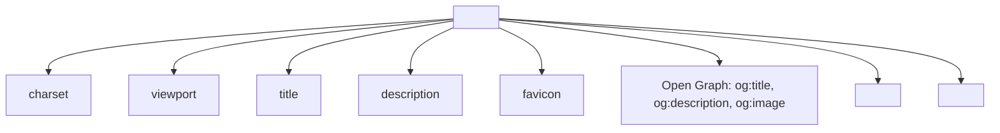
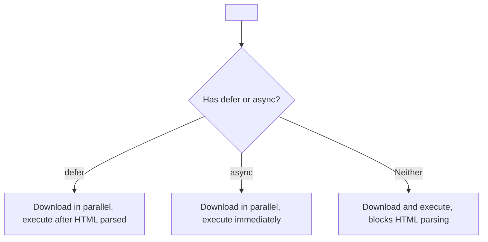

## Мета-теги, SEO, связь с CSS, JS

> **Связь с предыдущим уроком:** на прошлом уроке мы разобрали доступность для людей. Сегодня разбираемся, как сделать страницу понятной для **поисковых систем и других сайтов** - а также готовим техническую почву для подключения CSS и JavaScript, которые будут в фокусе уже за пределами этого курса.

---

## Чему вы научитесь к концу урока

- Настраивать ключевые мета-теги: `charset`, `description`, `viewport`.
- Понимать основы Open Graph — как сайт выглядит при расшаривании в соцсетях.
- Подключать внешние файлы CSS и JS через `<link>` и `<script>`.
- Понимать разницу между `defer` и `async` при подключении скриптов.
- Проверять код на валидность через W3C Validator.
- Организовывать структуру папок проекта по стандартной практике.

---

## Хронометраж урока

| Блок                                         | Содержание                       |
| -------------------------------------------- | -------------------------------- |
| 1. Мета-теги: charset, description, viewport | Служебная информация о странице  |
| 2. Open Graph (обзорно)                      | Как страница выглядит в соцсетях |
| 3. Подключение CSS через link                | Синтаксис, где размещать         |
| 4. Подключение JS через script               | Синтаксис, defer/async обзорно   |
| 5. Мини-задание                              | Собрать head самостоятельно      |
| 6. W3C Validator                             | Проверка кода на ошибки          |
| 7. Структура папок проекта                   | Стандартная организация файлов   |
| 8. Итоги и практическое задание              | Закрепление                      |

---

## Блок 1. Мета-теги: charset, description, viewport

Мы уже встречали один мета-тег в самом первом уроке - `<meta charset="UTF-8">`. Сегодня разберём эту тему полностью и добавим ещё несколько важных тегов, которые живут внутри `<head>`.

**Простыми словами:** мета-теги - это как этикетка на упаковке товара: сам товар (видимое содержимое страницы) вы держите в руках, а на этикетке написана дополнительная информация - состав, срок годности, штрихкод. Эта информация не является частью самого товара, но критически важна для того, чтобы магазин, склад и покупатель правильно с ним обращались.

### `<meta charset="UTF-8">` - кодировка (повторение)

```html
<meta charset="UTF-8">
```

Как мы разобрали в уроке 1, эта строка сообщает браузеру, в какой кодировке хранится текст документа - UTF-8 поддерживает практически все языки мира, включая кириллицу.

### `<meta name="description" content="...">` — описание страницы

```html
<meta name="description" content="Курс «HTML: от А до Я» — 10 уроков для тех, кто хочает с нуля научиться вёрстке и опубликовать свой первый сайт.">
```

Это краткое описание страницы (рекомендуется 150–160 символов), которое **не отображается на самой странице**, но:

- показывается в результатах поиска Google/Яндекс под заголовком ссылки — это то, что реально читает человек, решая, кликнуть ли по вашему сайту в поисковой выдаче;
- иногда используется соцсетями при расшаривании ссылки (подробнее в блоке 2).

**Аналогия:** если `<title>` - это название книги на обложке, то `description` - это аннотация на задней стороне обложки, которая помогает человеку в магазине решить, брать ли книгу почитать.

### `<meta name="viewport" content="width=device-width, initial-scale=1.0">` - адаптивность под мобильные

```html
<meta name="viewport" content="width=device-width, initial-scale=1.0">
```

Это, пожалуй, самый технически важный мета-тег современного веба. Без него мобильные браузеры по умолчанию отображают страницу так, будто она рассчитана на широкий десктопный экран (обычно около 980px), а затем **уменьшают весь масштаб**, чтобы это уместилось на маленьком экране телефона - в результате всё выглядит крошечным, и пользователю приходится растягивать текст пальцами.

- `width=device-width` - говорит браузеру "используй реальную ширину экрана устройства", а не воображаемую широкую десктопную ширину.
- `initial-scale=1.0` - задаёт начальный уровень масштабирования 100% (без автоматического уменьшения).

**Важно понимать уже сейчас, до изучения CSS:** сам по себе этот тег не делает сайт "адаптивным" в полном смысле (адаптивность - это в первую очередь работа CSS, которую вы будете изучать дальше), но без него **никакая** адаптивная вёрстка, сделанная позже через CSS, не будет работать корректно на мобильных устройствах. Это фундаментальная настройка, без которой всё остальное бессмысленно.

---

### Частые ошибки новичков

|Ошибка|Как исправить|
|---|---|
|Забывают `viewport` — сайт выглядит нечитаемо крошечным на телефоне|Добавляйте `<meta name="viewport" content="width=device-width, initial-scale=1.0">` в `<head>` каждого проекта|
|Пишут `description` длиннее 160 символов|Пишите кратко и по существу — поисковик всё равно обрежет слишком длинный текст в выдаче|
|Путают `description` с видимым текстом на странице|`description` нигде не отображается на самой странице — это чисто служебная информация для поисковиков и соцсетей|

---

## Блок 2. Open Graph (обзорно)

Когда вы отправляете ссылку на сайт другу в Telegram, WhatsApp или публикуете её в Facebook - часто появляется красивая карточка с картинкой, заголовком и описанием. Это работает благодаря **Open Graph** - набору мета-тегов, изначально созданному Facebook, но сегодня поддерживаемому большинством платформ.

```html
<meta property="og:title" content="HTML: от А до Я — курс для начинающих">
<meta property="og:description" content="10 уроков с нуля до самостоятельной публикации своего первого сайта.">
<meta property="og:image" content="https://saydullayev.fun/images/course-preview.jpg">
<meta property="og:url" content="https://saydullayev.fun/html-course">
```

Разберём основные теги:

- **`og:title`** - заголовок, который увидят в карточке (может отличаться от `<title>` вкладки - часто делают более "продающим").
- **`og:description`** - описание в карточке (аналогично `meta description`, но специально для соцсетей).
- **`og:image`** - картинка, которая покажется в карточке (важно: указывать **абсолютный** путь, включая `https://`, так как соцсети "скачивают" эту картинку со своих серверов, а не через браузер пользователя).
- **`og:url`** - канонический (основной) адрес страницы.

**Важная особенность синтаксиса:** обратите внимание - здесь используется атрибут `property`, а не `name`, как у обычных мета-тегов из блока 1. Это связано с тем, что Open Graph технически основан на другом стандарте (RDFa), но для практического использования вам достаточно просто запомнить: для Open Graph — `property`, для обычных мета-тегов - `name`.

**Это тема, которую мы разбираем только обзорно** - в этом курсе мы не будем глубоко погружаться во все возможные варианты Open Graph-тегов (их довольно много - тип контента, локаль, автор и т.д.), но важно, что вы теперь знаете, откуда берутся красивые превью-карточки при расшаривании ссылок, и умеете добавить базовый набор для своего проекта.



---

## Блок 3. Подключение CSS через `<link>`

Мы уже использовали тег `<link>` в уроке 4 - для favicon. Тот же тег используется для подключения внешнего файла стилей CSS.

```html
<head>
    <meta charset="UTF-8">
    <title>Мой сайт</title>
    <link rel="stylesheet" href="css/style.css">
</head>
```

- `rel="stylesheet"` - сообщает браузеру, что подключаемый файл - это таблица стилей.
- `href` - путь к CSS-файлу (по тем же правилам относительных/абсолютных путей, что мы разобрали в уроке 3).

**Важно про расположение:** тег `<link>` для стилей всегда размещается внутри `<head>`, и рекомендуется - **ближе к концу** `<head>` (после мета-тегов), чтобы браузер начал загружать и применять стили как можно раньше в процессе чтения документа, минимизируя визуальные "скачки" при загрузке страницы.

**Важная оговорка для этого курса:** сам синтаксис CSS (что писать внутри файла `style.css`) выходит за рамки курса «HTML: от А до Я» - мы разбираем только то, **как правильно подключить** внешний файл к HTML-документу, техническую основу для будущего изучения CSS.

---

## Блок 4. Подключение JS через `<script>`

Тег `<script>` подключает JavaScript-код - либо внешний файл, либо код прямо внутри HTML-документа.

### Внешний файл

```html
<script src="js/main.js"></script>
```

Обратите внимание: `<script>` - **парный** тег (в отличие от `<link>`, который непарный), даже когда используется атрибут `src` и внутри ничего не написано вручную.

### Код прямо внутри тега (встроенный скрипт)

```html
<script>
    console.log("Привет из HTML-документа!");
</script>
```

Это используется реже, чем внешние файлы - в реальных проектах JS-код обычно выносят в отдельные `.js`-файлы (по тем же причинам, что и CSS - удобство поддержки, переиспользование между страницами).

### Где размещать `<script>`

Здесь есть важный практический момент. Раньше было принято помещать `<script>` в самый конец `<body>`, перед закрывающим тегом `</body>`:

```html
<body>
    <!-- весь контент страницы -->

    <script src="js/main.js"></script>
</body>
```

**Почему так делали:** браузер читает HTML-документ последовательно сверху вниз. Если `<script>` находится в `<head>` без дополнительных атрибутов, браузер **останавливает** чтение остальной страницы, пока полностью не загрузит и не выполнит скрипт - это может заметно замедлить отображение видимого контента пользователю. Размещение в конце `<body>` гарантирует, что вся видимая часть страницы уже прочитана браузером до момента загрузки скрипта.

### Современное решение: `defer` и `async`

Сегодня чаще используется более гибкий подход - тег `<script>` остаётся в `<head>`, но с одним из специальных атрибутов:

```html
<script src="js/main.js" defer></script>
```

```html
<script src="js/main.js" async></script>
```

**`defer`** - браузер загружает скрипт **параллельно** с чтением остального HTML (не останавливая его), но **выполняет** скрипт только после того, как весь HTML-документ полностью прочитан. Порядок выполнения нескольких `defer`-скриптов сохраняется таким, в каком они указаны в коде.

**`async`** - браузер тоже загружает скрипт параллельно, но **выполняет** его сразу, как только загрузка завершится - даже если чтение остального HTML ещё не закончено. Это может произойти в любой непредсказуемый момент, и порядок выполнения нескольких `async`-скриптов **не гарантирован**.

### Когда что использовать (кратко, для общего понимания)

|Атрибут|Когда использовать|
|---|---|
|`defer`|Для большинства скриптов, особенно если скрипт взаимодействует с содержимым страницы (ему нужно, чтобы весь HTML уже был прочитан)|
|`async`|Для независимых скриптов, которым не важен порядок и не важно взаимодействие с остальной страницей (например, счётчики аналитики)|
|Без атрибутов, в конце `<body>`|Более старый, но всё ещё рабочий и простой для понимания вариант|

**Это тоже обзорная тема этого курса** - глубокое понимание работы JavaScript и правильного выбора между `defer`/`async` в сложных случаях приходит вместе с изучением самого JavaScript, что выходит за рамки этого курса про HTML.



---

### Частые ошибки новичков

|Ошибка|Как исправить|
|---|---|
|Помещают `<script>` в начало `<head>` без `defer`/`async`|Это замедляет отображение страницы — используйте `defer` или размещайте скрипт в конце `<body>`|
|Путают `<link>` (непарный, для CSS) и `<script>` (парный, для JS)|`<link>` не имеет закрывающего тега, `<script>` — всегда имеет, даже если пустой внутри|
|Забывают, что и `defer`, и `async` работают только с внешними скриптами (`src="..."`) — не с встроенным кодом внутри тега|Для встроенного `<script>` без `src` эти атрибуты не имеют смысла|

---

## Мини-задание

Соберите `<head>` документа самостоятельно, без подглядывания: с кодировкой UTF-8, заголовком "Мини-задание", viewport для адаптивности, подключённым файлом стилей `styles/main.css` и подключённым скриптом `scripts/app.js` с атрибутом `defer`.

**Решение:**

```html
<head>
    <meta charset="UTF-8">
    <meta name="viewport" content="width=device-width, initial-scale=1.0">
    <title>Мини-задание</title>
    <link rel="stylesheet" href="styles/main.css">
    <script src="scripts/app.js" defer></script>
</head>
```

---

## Блок 6. W3C Validator  проверка кода

**W3C** (World Wide Web Consortium) - организация, которая разрабатывает и поддерживает официальные стандарты HTML, CSS и других веб-технологий. У них есть бесплатный инструмент - **W3C Markup Validator**, который проверяет ваш HTML-код на соответствие этим стандартам.

**Как пользоваться:**

1. Откройте сайт **validator.w3.org**.
2. Выберите один из трёх способов проверки: по адресу опубликованной страницы (Validate by URI), загрузив файл с компьютера (Validate by File Upload), или вставив код напрямую (Validate by Direct Input).
3. Запустите проверку - валидатор покажет список ошибок и предупреждений с указанием конкретной строки кода.

**Типичные ошибки, которые находит валидатор:**

- незакрытые теги;
- дублирующиеся `id` на странице;
- неправильно вложенные теги (например, `<p>` внутри другого `<p>`, что запрещено спецификацией);
- отсутствующие обязательные атрибуты (например, `alt` у ``);
- использование устаревших/несуществующих тегов и атрибутов.

**Почему это важно, а не просто формальность:** невалидный код может отображаться "вроде бы нормально" в одном браузере просто потому, что этот браузер умеет "прощать" ошибки и угадывать, что вы имели в виду - но другой браузер (или скринридер, или поисковый робот) может интерпретировать тот же невалидный код совершенно иначе, что приведёт к неожиданным визуальным и структурным проблемам именно у части ваших пользователей.

**Практическая рекомендация:** прогоняйте через валидатор каждый крупный проект (например, финальный проект урока 10) - это отличная привычка, которая ловит мелкие, но реальные ошибки, незаметные глазу при обычном просмотре в браузере.

---

## Блок 7. Структура папок проекта

Финальный практический блок урока - как организовать файлы реального многостраничного сайта, чтобы в нём было легко ориентироваться (и вам, и любому, кто откроет ваш проект позже).

Стандартная, широко распространённая структура выглядит так:

```
my-website/
├── index.html
├── about.html
├── contact.html
├── css/
│   └── style.css
├── js/
│   └── main.js
├── images/
│   ├── logo.png
│   ├── hero-photo.jpg
│   └── icons/
│       └── github.svg
└── favicon.ico
```

Принципы такой организации:

- **HTML-файлы** страниц - прямо в корневой папке проекта (это упрощает пути в ссылках `<a href="about.html">`, как мы разобрали в уроке 3).
- **`css/`** - отдельная папка для всех файлов стилей.
- **`js/`** - отдельная папка для всех скриптов.
- **`images/`** - отдельная папка для всех изображений, при большом количестве иконок можно вложить ещё подпапку `icons/`.
- **`favicon.ico`** - часто оставляют в корне проекта (некоторые браузеры ищут его именно там автоматически, как мы разобрали в уроке 4).

С учётом такой структуры, пути в `<head>` вашего `index.html` (лежащего в корне) будут выглядеть так:

```html
<link rel="stylesheet" href="css/style.css">
<script src="js/main.js" defer></script>
<link rel="icon" href="favicon.ico">
```

А внутри страницы:

```html

```

**Почему такая структура важна уже сейчас, до изучения CSS/JS:** когда вы начнёте активно писать реальные стили и скрипты, беспорядочно раскиданные по разным местам файлы быстро превратятся в хаос, в котором сложно что-либо найти. Формирование привычки к аккуратной структуре с первых учебных проектов сильно облегчит переход к более сложным темам в будущем.

---

### Частые ошибки новичков

| Ошибка                                                                                  | Как исправить                                                                                              |
| --------------------------------------------------------------------------------------- | ---------------------------------------------------------------------------------------------------------- |
| Складывают все файлы (HTML, CSS, картинки) вперемешку в одну папку                      | Разделяйте по типу файлов: `css/`, `js/`, `images/`                                                        |
| Используют пробелы или кириллицу в именах файлов и папок (например, `моя картинка.jpg`) | Используйте латиницу без пробелов, обычно в нижнем регистре с дефисами: `my-photo.jpg`                     |
| Меняют структуру папок посреди проекта, не обновляя все пути в HTML-файлах              | Продумывайте структуру заранее, а если меняете — проверяйте и обновляйте все связанные пути в `src`/`href` |

---

## Итоги урока

Сегодня вы узнали:

- Мета-теги `charset`, `description`, `viewport` - служебная информация о странице: кодировка, описание для поисковиков, адаптивность под мобильные устройства.
- Open Graph-теги (`og:title`, `og:description`, `og:image`, `og:url`) формируют красивую карточку при расшаривании ссылки в соцсетях.
- CSS подключается через `<link rel="stylesheet">`, JS — через `<script src="...">`, с возможными атрибутами `defer`/`async` для оптимизации загрузки.
- W3C Validator проверяет код на соответствие официальным стандартам HTML и находит скрытые ошибки.
- Стандартная структура проекта - HTML в корне, отдельные папки `css/`, `js/`, `images/` - облегчает поддержку сайта.