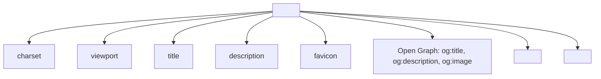
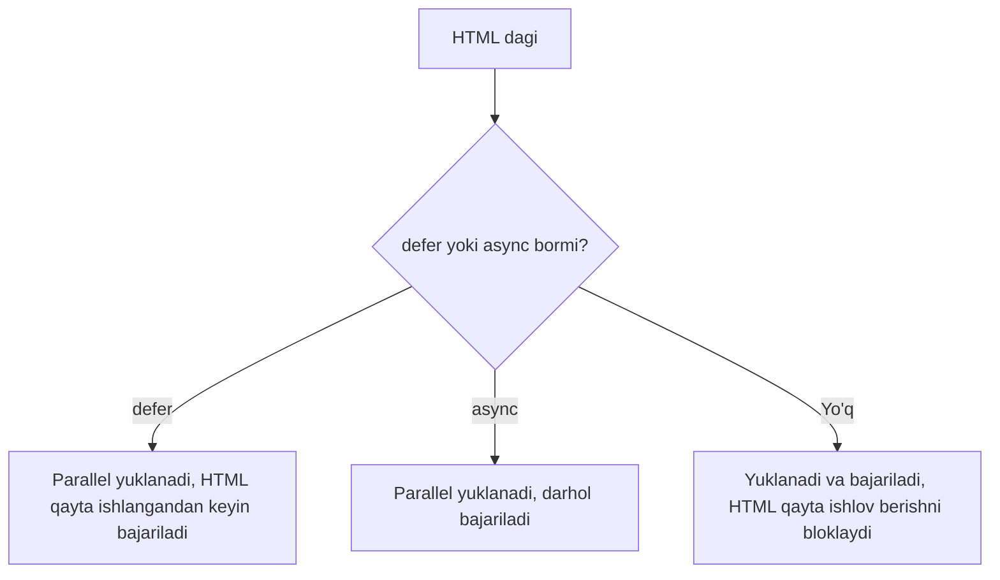

## Meta-teglar, SEO, CSS va JS bilan bog'lanish

> **Oldingi dars bilan bog'lanish:** o'tgan darsda biz odamlar uchun mavjudlikni ko'rib chiqdik. Bugun sahifani **qidiruv tizimlari va boshqa saytlar** uchun tushunarli qilishni tushunamiz — shuningdek, CSS va JavaScript ni ulash uchun texnik zamin tayyorlaymiz, ular ushbu kurs doirasidan tashqarida markazda bo'ladi.

---

## Dars oxiriga qadar nimalarni o'rganasiz

- Asosiy meta-teglarni sozlash: `charset`, `description`, `viewport`.
- Open Graph asoslarini tushunish — ijtimoiy tarmoqlarda ulanish qanday ko'rinishini.
- `<link>` va `<script>` orqali tashqi CSS va JS fayllarini ulash.
- Skriptlarni ulashda `defer` va `async` orasidagi farqni tushunish.
- W3C Validator orqali kodni tekshirish.
- Loyiha papkalar tuzilmasını standart amaliyotga muvofiq tashkil etish.

---

## Dars vaqti bloklari

| Blok                                         | Mazmuni                         |
| -------------------------------------------- | -------------------------------- |
| 1. Meta-teglar: charset, description, viewport | Sahifa haqida xizmat ma'lumoti  |
| 2. Open Graph (ko'rib chiqish darajasida)     | Ijtimoiy tarmoqlarda sahifa qanday ko'rinadi |
| 3. CSS ni link orqali ulash                  | Sintaksis, qayerda joylashtirish |
| 4. JS ni script orqali ulash                 | Sintaksis, defer/async ko'rib chiqish |
| 5. Mini-vazifa                                | Head ni mustaqil yig'ish        |
| 6. W3C Validator                              | Kodni xatolarga tekshirish      |
| 7. Loyiha papkalar tuzilmasi                  | Standart fayllarni tashkil etish |
| 8. Xulosalar va amaliy vazifa                 | Mustahkamlash                   |

---

## 1-blok. Meta-teglar: charset, description, viewport

Biz birinchi darsning o'zida bitta meta-teg bilan uchrashdik — `<meta charset="UTF-8">`. Bugun bu mavzuni to'liq ko'rib chiqamiz va `<head>` ichida yashovchi bir nechta muhim teg qo'shamiz.

**Oddiy qilib aytganda:** meta-teglar bu mahsulot qadoqidagi yorliqqa o'xshaydi: mahsulotning o'zi (sahifaning ko'rinadigan mazmuni) qo'lingizda, yorliqda esa qo'shimcha ma'lumot yozilgan — tarkibi, yaroqlilik muddati, shtrix-kod. Ushbu ma'lumot mahsulotning o'zining qismi emas, lekin do'kon, ombor va xaridorning uni to'g'ri ishlatishi uchun juda muhim.

### `<meta charset="UTF-8">` - kodlash (takrorlash)

```html
<meta charset="UTF-8">
```

1-darsda tushuntirganimdek, ushbu qator brauzerga hujjat matnining qaysi kodlashda saqlanishini aytadi — UTF-8 deyarli barcha jahon tillarini, jumladan kirillni qo'llab-quvvatlaydi.

### `<meta name="description" content="...">` — sahifa tavsifi

```html
<meta name="description" content="«HTML: A dan Ya gacha» kursi — noldan terishni o'rganmoqchi va birinchi saytini nashr etmoqchi odamlar uchun 10 ta dars.">
```

Bu sahifaning qisqa tavsifi (150–160 belgi tavsiya etiladi), u **sahifaning o'zida ko'rsatilmaydi**, lekin:

- Google/Yandex qidiruv natijalarida havola sarlavhasi ostida ko'rsatiladi — odam haqiqatan saytingizga bosish kerakmi yoki yo'q qaror qilayotganda o'qigan narsa;
- ba'zan ijtimoiy tarmoqlar havolani ulashda ishlatadi (2-blokda batafsil).

**O'xshatish:** agar `<title>` — bu kitob muqovasidagi nom bo'lsa, `description` — muqovaning orqa tomonidagi annotatsiya, do'kondagi odamga kitobni o'qish uchun olish kerakmi yoki yo'q qaror qilishga yordam beradi.

### `<meta name="viewport" content="width=device-width, initial-scale=1.0">` - mobil qurilmalarga moslashuvchanlik

```html
<meta name="viewport" content="width=device-width, initial-scale=1.0">
```

Bu, ehtimol, zamonaviy vebning eng texnik jihatdan muhim meta-tegi. Undan mob brauzerlar sahifani odatda keng desktopy ekran uchun mo'ljallangan (taxminan 980px) deb ko'rsatadi, keyin esa telefonning kichik ekraniga sig'ishi uchun **butun masshtabni kichraytiradi** — natijada hamma narsa juda kichik ko'rinadi va foydalanuvchi matnni barmoqlari bilan cho'zishga majbur bo'ladi.

- `width=device-width` - brauzerga "qurilmaning haqiqiy ekran kengligini ishlating" deydi, tasavvur qilingan keng desktop kengligini emas.
- `initial-scale=1.0` - dastlabki masshtab darajasini 100% belgilaydi (avtomatik kichraytirishsiz).

**CSS ni o'rganishdan oldin hozir tushunish muhim:** ushbu teg o'zi saytni to'liq ma'noda "moslashuvchan" qilmaydi (moslashuvchanlik avvalambor CSS ishi, uni keyinchalik o'rganasiz), lekin undan keyin CSS orqali qilingan **hech qanday** moslashuvchan terim mobil qurilmalarda to'g'ri ishlamaydi. Bu asosiy sozlash, undan qolgan hamma narsa ma'nosiz.

---

### Yangi boshlovchilarning ko'p uchraydigan xatolari

|Xato|Tuzatish|
|---|---|
|`viewport` ni unutish — sayt telefonda kichik va o'qimsiz ko'rinadi|Har bir loyiha `<head>`iga `<meta name="viewport" content="width=device-width, initial-scale=1.0">` qo'shing|
|`description` ni 160 belgidan uzun yozish|Qisqa va mazmunli yozing — qidiruv tizimi baribir haddan tashqari uzun matnni kesib tashlaydi|
|`description` ni sahifadagi ko'rinadigan matn bilan adashtirish|`description` sahifaning o'zida hech qayerda ko'rsatilmaydi — bu faqat qidiruv tizimlari va ijtimoiy tarmoqlar uchun xizmat ma'lumoti|

---

## 2-blok. Open Graph (ko'rib chiqish darajasida)

Siz Telegram, WhatsApp'da do'stingizga sayt havolasini yuborganingizda yoki Facebook'da nashr etganingizda, ko'pincha rasm, sarlavha va tavsif bilan chiroyli karta paydo bo'ladi. Bu **Open Graph** orqali ishlaydi — aslida Facebook yaratgan, lekin hozir ko'p platformalar qo'llab-quvvatlaydigan meta-teglar to'plami.

```html
<meta property="og:title" content="HTML: A dan Ya gacha — boshlang'ichlar uchun kurs">
<meta property="og:description" content="Noldan mustaqil sayt nashr qilishgacha 10 ta dars.">
<meta property="og:image" content="https://saydullayev.fun/images/course-preview.jpg">
<meta property="og:url" content="https://saydullayev.fun/html-course">
```

Asosiy teglarni ko'rib chiqamiz:

- **`og:title`** - kartada ko'rinadigan sarlavha (brauzer yorlig'idagi `<title>` dan farqli bo'lishi mumkin — ko'pincha "sotuvchanroq" qilinadi).
- **`og:description`** - kartadagi tavsif (`meta description` ga o'xshash, lekin aynan ijtimoiy tarmoqlar uchun).
- **`og:image`** - kartada ko'rsatiladigan rasm (muhim: **mutlaq** yo'lni ko'rsatish kerak, `https://` ni qo'shib, chunki ijtimoiy tarmoqlar bu rasmni foydalanuvchining brauzeri orqali emas, o'z serverlaridan "yuklab oladi").
- **`og:url`** - kanonik (asosiy) sahifa manzili.

**Sintaksisning muhim xususiyati:** diqqat qiling — bu yerda odatdagi 1-blok meta-teglaridagi `name` o'rniga `property` atributi ishlatiladi. Bu shuning uchunki, Open Graph texnik jihatdan boshqa standartga (RDFa) asoslangan, lekin amaliy foydalanish uchun shunchaki eslab qolish yetarli: Open Graph uchun — `property`, oddiy meta-teglar uchun — `name`.

**Bu kursda faqat ko'rib chiqish darajasida ko'rib chiqayotgan mavzu** — bu kursda biz barcha mumkin bo'lgan Open Graph teglari variantlariga chuqur kirmaymiz (ular juda ko'p — kontent turi, locale, muallif va hokazo), lekin muhimki, siz endi havolalarni ulashdagi chiroyli oldindan ko'rish kartalari qayerdan kelishini bilasiz va o'z loyihangiz uchun asosiy to'plamni qo'shishni o'rgandingiz.



---

## 3-blok. CSS ni `<link>` orqali ulash

Biz `<link>` tegini 4-darsda ishlatgan edik — favicon uchun. Xuddi shu teg tashqi CSS stil faylini ulash uchun ishlatiladi.

```html
<head>
    <meta charset="UTF-8">
    <title>Mening saytim</title>
    <link rel="stylesheet" href="css/style.css">
</head>
```

- `rel="stylesheet"` - brauzerga ulanayotgan faylning stil jadvali ekanini aytadi.
- `href` - CSS faylga yo'l (3-darsda ko'rib chiqqan nisbiy/mutlaq yo'llar qoidalari bo'yicha).

**Joylashish haqida muhim:** `<link>` tegi doimo `<head>` ichida joylashtiriladi va tavsiya etiladi — `<head>` ning **oxiriga yaqinroq** (meta-tegldan keyin), shunda brauzer hujjatni o'qish jarayonida stillarni imkon qadar erta yuklab va qo'llaydi, sahifa yuklanishida vizual "sakrashlarni" kamaytiradi.

**Bu kurs uchun muhim eslatma:** CSS ning o'zi sintaksisi (`style.css` faylining ichida nima yozish kerak) «HTML: A dan Ya gacha» kursi doirasidan tashqarida — biz faqat tashqi faylni HTML hujjatiga **qanday to'g'ri ulashni**, kelajakda CSS o'rganish uchun texnik asosni ko'rib chiqamiz.

---

## 4-blok. JS ni `<script>` orqali ulash

`<script>` tegi JavaScript kodini ulaydi — tashqi fayl yoki to'g'ridan-to'g'ri HTML hujjati ichidagi kod.

### Tashqi fayl

```html
<script src="js/main.js"></script>
```

Diqqat qiling: `<script>` - **juft** teg (`<link>` dan farqli, u juft emas), `src` atributi ishlatilganida va ichida hech narsa qo'lda yozilmagan bo'lsa ham.

### To'g'ridan-to'g'ri teg ichidagi kod (ichki skript)

```html
<script>
    console.log("HTML hujjatidan salom!");
</script>
```

Bu tashqi fayllarga qaraganda kamroq ishlatiladi — haqiqiy loyihalarda JS kodi odatda alohida `.js` fayllarga chiqariladi (CSS bilan xuddi sabablarga — qo'llab-quvvatlash qulayligi, sahifalar o'rtasida qayta ishlatish).

### `<script>` ni qayerda joylashtirish

Bu yerda muhim amaliy moment bor. Oldin `<script>` ni `<body>` ning eng oxiriga, yopuvchi `</body>` tegidan oldin qo'yish odat bo'lgan:

```html
<body>
    <!-- sahifaning butun kontenti -->

    <script src="js/main.js"></script>
</body>
```

**Nima uchun bunday qilgan:** brauzer HTML hujjatini tepadan pastga ketma-ket o'qiydi. Agar `<script>` qo'shimcha atributlarsiz `<head>` da bo'lsa, brauzer skriptni to'liq yuklab va bajarib bo'lguncha qolgan sahifani o'qishni **to'xtatadi** — bu foydalanuvchiga ko'rinadigan kontentni ko'rsatishni sezilarli darajada sekinlashtirishi mumkin. `<body>` oxirida joylashtirish skript yuklanishiga qadar sahifaning butun ko'rinadigan qismi brauzer tomonidan o'qilganligini kafolatlaydi.

### Zamonaviy yechim: `defer` va `async`

Bugun ko'pincha moslashuvchanroq yondashuv ishlatiladi — `<script>` tegi `<head>` da qoladi, lekin maxsus atributlardan biri bilan:

```html
<script src="js/main.js" defer></script>
```

```html
<script src="js/main.js" async></script>
```

**`defer`** - brauzer skriptni qolgan HTML o'qish bilan **bir vaqtda** yuklaydi (uni to'xtatmasdan), lekin butun HTML hujjat to'liq o'qilganidan keyin **bajaradi**. Bir nechta `defer` skriptlarining bajarilish tartibi kodda ko'rsatilgan tartibda saqlanadi.

**`async`** - brauzer skriptni ham bir vaqtda yuklaydi, lekin yuklash tugashi bilanoq **bajaradi** — hatto qolgan HTML hujjat hali o'qilmagan bo'lsa ham. Bu istalgan bashorat qilinmagan paytda sodir bo'lishi mumkin va bir nechta `async` skriptlarining bajarilish tartibi **kafolatlanmagan**.

### Qachon nimani ishlatish (qisqacha, umumiy tushunish uchun)

|Atribut|Qachon ishlatish|
|---|---|
|`defer`|Ko'pchilik skriptlar uchun, ayniqsa skript sahifa mazmuni bilan o'zaro ta'sir qilsa (unga butun HTML allaqachon o'qilgan bo'lishi kerak)|
|`async`|Mustaqil skriptlar uchun, ularning tartibi muhim bo'lmagan va qolgan sahifa bilan o'zaro ta'sir muhim bo'lmagan (masalan, analitika hisoblagichlari)|
|Atributlarsiz, `<body>` oxirida|Eskiroq, lekin hali ham ishlaydigan va tushunarli variant|

**Bu ham ushbu kursning ko'rib chiqish mavzusi** — JavaScript ning ishlashini chuqur tushunish va murakkab holatlarda `defer`/`async` orasidagi to'g'ri tanlov JavaScript ning o'zini o'rganish bilan birga keladi, bu HTML haqidagi ushbu kurs doirasidan tashqarida.



---

### Yangi boshlovchilarning ko'p uchraydigan xatolari

|Xato|Tuzatish|
|---|---|
|`<script>` ni `defer`/`async` siz `<head>` boshiga qo'yish|Bu sahifani ko'rsatishni sekinlashtiradi — `defer` ishlating yoki skriptni `<body>` oxiriga qo'ying|
|Nopar `<link>` (CSS uchun) va juft `<script>` (JS uchun) ni adashtirish|`<link>` yopuvchi tegi yo'q, `<script>` - doimo bor, ichi bo'sh bo'lsa ham|
|`defer` va `async` faqat tashqi skriptlar (`src="..."`) bilan ishlashini, teg ichidagi kod bilan emasligini unutish|Ichki `<script>` (src'siz) uchun bu atributlar ma'nosiz|

---

## Mini-vazifa

`<head>` ni ko'chirib ko'rmay, mustaqil yig'ing: UTF-8 kodlash, "Mini-vazifa" sarlavhasi, moslashuvchanlik uchun viewport, `styles/main.css` stil fayli va `defer` atributli `scripts/app.js` skripti bilan.

**Yechim:**

```html
<head>
    <meta charset="UTF-8">
    <meta name="viewport" content="width=device-width, initial-scale=1.0">
    <title>Mini-vazifa</title>
    <link rel="stylesheet" href="styles/main.css">
    <script src="scripts/app.js" defer></script>
</head>
```

---

## 6-blok. W3C Validator - kodni tekshirish

**W3C** (World Wide Web Consortium) — HTML, CSS va boshqa veb-tehnologiyalarning rasmiy standartlarini ishlab chiqadigan va qo'llab-quvvatlaydigan tashkilot. Ularning bepul vositasi bor — **W3C Markup Validator**, u sizning HTML kodingizni ushbu standartlarga mosligini tekshiradi.

**Qanday foydalanish:**

1. **validator.w3.org** saytini oching.
2. Uchta tekshirish usulidan birini tanlang: nashr etilgan sahifa manzili bo'yicha (Validate by URI), kompyuterdan fayl yuklash (Validate by File Upload), yoki kodni to'g'ridan-to'g'ri kiritish (Validate by Direct Input).
3. Tekshiruvni ishga tushiring — validatsiya qiluvchi xatolar va ogohlantirishlar ro'yxatini aniq kod qatori ko'rsatib ko'rsatadi.

**Validatsiya qiluvchi topadigan tipik xatolar:**

- yopilmagan teglar;
- sahifada takrorlanuvchi `id`;
- noto'g'ri ichki teglar (masalan, boshqa `<p>` ichidagi `<p>`, bu spetsifikatsiya tomonidan taqiqlangan);
- mavjud bo'lmagan majburiy atributlar (masalan, `` da `alt`);
- eskirgan/mavjud bo'lmagan teglar va atributlarni ishlatish.

**Nima uchun bu muhim, rasmiyatchilik emas:** yaroqsiz kod bitta brauzerda "g'alati normal" ko'rinishi mumkin, chunki u brauzer xatolarni "kechirish" va nimani nazarda tutilganini bashorat qilishni biladi — lekin boshqa brauzer (yoki ekran o'quvchisi, yoki qidiruv roboti) xuddi shu yaroqsiz kodni butunlay boshqacha talqin qilishi mumkin, bu aynan sizning foydalanuvchilaringizning bir qismida kutilmagan vizual va tuzilmaviy muammolarga olib keladi.

**Amaliy tavsiya:** har bir yirik loyihani (masalan, 10-darsning yakuniy loyihasini) validatsiya qiluvchidan o'tkazing — bu kichik, lekin haqiqiy xatolarni tutadigan ajoyib odat, oddiy brauzerda ko'rishda ko'zga ko'rinmaydigan.

---

## 7-blok. Loyiha papkalar tuzilmasi

Darsning yakuniy amaliy bloki — haqiqiy ko'p sahifali sayt fayllarini qanday tashkil etish kerak, shunda uning ichida oson yo'l topish mumkin bo'lsin (sizga ham, loyihangizni keyinroq ochadigan har qanday odamga ham).

Standart, keng tarqalgan tuzilma quyidagicha ko'rinadi:

```
my-website/
├── index.html
├── about.html
├── contact.html
├── css/
│   └── style.css
├── js/
│   └── main.js
├── images/
│   ├── logo.png
│   ├── hero-photo.jpg
│   └── icons/
│       └── github.svg
└── favicon.ico
```

Bunday tashkil etish printsiplari:

- **HTML fayllar** sahifalari - to'g'ridan-to'g'ri loyiha ildiz papkasida (bu `<a href="about.html">` havolalardagi yo'llarni soddalashtiradi, 3-darsda ko'rib chiqqan).
- **`css/`** - barcha stil fayllari uchun alohida papka.
- **`js/`** - barcha skriptlar uchun alohida papka.
- **`images/`** - barcha rasmlar uchun alohida papka, ko'p ikonka bo'lsa ichiga `icons/` papkasini qo'shish mumkin.
- **`favicon.ico`** - ko'pincha loyiha ildizida qoldiriladi (ba'zi brauzerlar uni avtomatik aynan shu yerda qidiradi, 4-darsda ko'rib chiqqan).

Bunday tuzilma bilan `index.html` ning `<head>` dagi yo'llar (ildizda yotgan) quyidagicha ko'rinadi:

```html
<link rel="stylesheet" href="css/style.css">
<script src="js/main.js" defer></script>
<link rel="icon" href="favicon.ico">
```

Sahifa ichida:

```html

```

**Nima uchun CSS/JS o'rganishdan oldin bunday tuzilma muhim:** haqiqiy stillar va skriptlarni faol yozishni boshlaganingizda, turli joylarga bejiz tarqatilgan fayllar tezda xaosga aylanadi, unda biror narsani topish qiyin. Dastlabki o'quv loyihalaridan boshlab tartibli tuzilmaga odatlanish kelajakda murakkab mavzularga o'tishni sezilarli darajada osonlashtiradi.

---

### Yangi boshlovchilarning ko'p uchraydigan xatolari

| Xato                                                                                  | Tuzatish                                                                                              |
| --------------------------------------------------------------------------------------- | ---------------------------------------------------------------------------------------------------------- |
| Barcha fayllarni (HTML, CSS, rasmlarni) aralashtirib bitta papkaga solish                      | Fayl turlari bo'yicha ajrating: `css/`, `js/`, `images/`                                                    |
| Papka va fayl nomlarida пробел yoki kirill ishlatish (masalan, `мой рисунок.jpg`) | Lotin harflaridan foydalaning, probelsiz, odatda kichik harflar bilan defislar: `my-photo.jpg`              |
| Loyiha o'rtasida papka tuzilmasini o'zgartirish, HTML fayllardagi barcha yo'llarni yangilamasdan | Tuzilmani oldindan o'ylab chiqing, o'zgartirsangiz — barcha bog'liq yo'llarni `src`/`href` da tekshiring va yangilang |

---

## Dars xulosalari

Bugun siz quyidagilarni bilib oldingiz:

- `charset`, `description`, `viewport` meta-teglar - sahifa haqida xizmat ma'lumoti: kodlash, qidiruv tizimlari uchun tavsif, mobil qurilmalarga moslashuvchanlik.
- Open Graph teglari (`og:title`, `og:description`, `og:image`, `og:url`) ijtimoiy tarmoqlarda havolani ulashda chiroyli karta shakllantiradi.
- CSS `<link rel="stylesheet">` orqali ulanadi, JS — `<script src="...">` orqali, yuklashni optimallashtirish uchun `defer`/`async` atributlari bilan.
- W3C Validator kodni HTML rasmiy standartlariga mosligini tekshiradi va yashirin xatolarni topadi.
- Standart loyiha tuzilmasi - ildizda HTML, alohida `css/`, `js/`, `images/` papkalar — saytni qo'llab-quvvatlashni osonlashtiradi.

➡ **Keyingi dars:** [Yakuniy loyiha](../../Lesson-10/uz/Yakuniy%20loyiha%20rejalashtirishdan%20nashr%20etishgacha.md)
